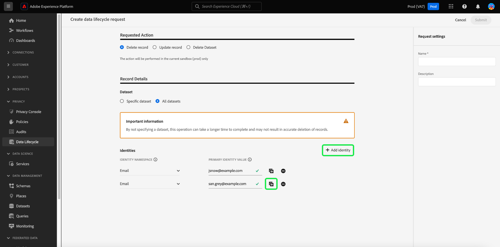

# Elimina record {#record-delete}

Utilizza il [[!UICONTROL Ciclo di vita dei dati] workspace](./overview.md) per eliminare i record in Adobe Experience Platform in base alle identità principali. Questi record possono essere associati a singoli consumatori o a qualsiasi altra entità inclusa nel grafico delle identità.

>[!IMPORTANT]
> 
>La funzione Record Delete (Elimina record) è attualmente in versione beta e disponibile solo in una **versione limitata**. Non è disponibile per tutti i clienti. Le richieste di cancellazione dei record sono disponibili solo per le organizzazioni nella versione limitata.
> 
> 
>Le eliminazioni di record devono essere utilizzate per la pulizia dei dati, la rimozione di dati anonimi o la minimizzazione dei dati. Sono **non** da utilizzare per le richieste di diritti degli interessati (conformità) relative a normative sulla privacy come il Regolamento generale sulla protezione dei dati (RGPD). Per tutti i casi di utilizzo di conformità, utilizza [Adobe Experience Platform Privacy Service](../../privacy-service/home.md) invece.

## Prerequisiti {#prerequisites}

L’eliminazione dei record richiede una buona conoscenza del funzionamento dei campi di identità in Experienci Platform. In particolare, devi conoscere i valori dello spazio dei nomi delle identità delle entità di cui desideri eliminare i record, a seconda del set di dati (o dei set di dati) da cui li stai eliminando.

Per ulteriori informazioni sulle identità in Platform, consulta la seguente documentazione:

* [Servizio Adobe Experience Platform Identity](../../identity-service/home.md): collega le identità tra dispositivi e sistemi, collegando i set di dati in base ai campi di identità definiti dagli schemi XDM a cui si conformano.
* [Spazi dei nomi delle identità](../../identity-service/features/namespaces.md): gli spazi dei nomi di identità definiscono i diversi tipi di informazioni di identità che possono riferirsi a una singola persona e sono un componente obbligatorio per ogni campo di identità.
* [Profilo cliente in tempo reale](../../profile/home.md): utilizza grafici di identità per fornire profili di consumatori unificati basati su dati aggregati provenienti da più origini, aggiornati in tempo quasi reale.
* [Experience Data Model (XDM)](../../xdm/home.md): fornisce definizioni e strutture standard per i dati di Platform tramite l’utilizzo di schemi. Tutti i set di dati di Platform sono conformi a uno schema XDM specifico e lo schema definisce quali campi sono identità.
* [Campi di identità](../../xdm/ui/fields/identity.md): scopri come viene definito un campo di identità in uno schema XDM.

## Creare una richiesta {#create-request}

Per avviare il processo, seleziona **[!UICONTROL Ciclo di vita dei dati]** nell’area di navigazione a sinistra dell’interfaccia utente di Platform. Il [!UICONTROL Richieste del ciclo di vita dei dati] viene visualizzato workspace. Quindi, seleziona **[!UICONTROL Crea richiesta]** dalla pagina principale nell’area di lavoro.

![Il [!UICONTROL Richieste del ciclo di vita dei dati] workspace con [!UICONTROL Crea richiesta] selezionato.](../images/ui/record-delete/create-request-button.png)

Viene visualizzato il flusso di lavoro per la creazione delle richieste. Per impostazione predefinita, il **[!UICONTROL Elimina record]** è selezionata sotto il **[!UICONTROL Azione richiesta]** sezione. Lascia selezionata questa opzione.

>[!IMPORTANT]
> 
>Per migliorare l’efficienza e ridurre i costi delle operazioni relative ai set di dati, le organizzazioni che sono state spostate nel formato Delta possono eliminare i dati dal servizio Identity, dal profilo cliente in tempo reale e dal data lake. Questo tipo di utente viene definito delta-migrato. Gli utenti delle organizzazioni con migrazione differita possono scegliere di eliminare i record da un singolo set di dati o da tutti. Gli utenti di organizzazioni che non sono stati sottoposti a migrazione delta non possono eliminare selettivamente i record da un singolo set di dati o da tutti i set di dati, come illustrato nell’immagine seguente. In questo caso, continua con [Fornisci identità](#provide-identities) sezione della guida.

![Il flusso di lavoro di creazione delle richieste con [!UICONTROL Elimina record] opzione selezionata ed evidenziata.](../images/ui/record-delete/delete-record.png)

## Seleziona set di dati {#select-dataset}

Il passaggio successivo consiste nel determinare se eliminare record da un singolo set di dati o da tutti i set di dati. Se questa opzione non è disponibile, passare alla [Fornisci identità](#provide-identities) sezione della guida.

Sotto **[!UICONTROL Dettagli record]** , utilizza il pulsante di opzione per selezionare tra un set di dati specifico e tutti i set di dati. Se si sceglie **[!UICONTROL Seleziona set di dati]**, procedere alla selezione dell&#39;icona del database () per aprire una finestra di dialogo che fornisce un elenco dei set di dati disponibili. Seleziona il set di dati desiderato dall’elenco seguito da **[!UICONTROL Fine]**.

![Il [!UICONTROL Seleziona set di dati] finestra di dialogo con un set di dati selezionato [!UICONTROL Fine] evidenziato.](../images/ui/record-delete/select-dataset.png)

Se desideri eliminare record da tutti i set di dati, seleziona **[!UICONTROL Tutti i set di dati]**.

![Il [!UICONTROL Seleziona set di dati] dialogo con [!UICONTROL Tutti i set di dati] opzione selezionata.](../images/ui/record-delete/all-datasets.png)

>[!NOTE]
>
>Selezione del **[!UICONTROL Tutti i set di dati]** potrebbe richiedere più tempo e non consentire l&#39;eliminazione accurata dei record.

## Fornire identità {#provide-identities}

>[!CONTEXTUALHELP]
>id="platform_hygiene_primaryidentity"
>title="Spazio dei nomi identità"
>abstract="Uno spazio dei nomi identità è un attributo che collega un record al profilo di un consumatore in Experience Platform. Il campo spazio dei nomi identità per un set di dati è definito dallo schema su cui si basa il set di dati. In questa colonna è necessario specificare il tipo (o spazio dei nomi) per lo spazio dei nomi identità del record, ad esempio `email` per gli indirizzi e-mail e `ecid` per gli Experience Cloud ID. Per ulteriori informazioni, consulta la guida all’interfaccia utente del ciclo di vita dei dati."

>[!CONTEXTUALHELP]
>id="platform_hygiene_identityvalue"
>title="Valore dell’identità primaria"
>abstract="In questa colonna è necessario specificare il valore per lo spazio dei nomi identità del record, che deve corrispondere al tipo di identità specificato nella colonna a sinistra. Se il tipo di spazio dei nomi identità è `email`, il valore deve corrispondere all’indirizzo e-mail del record. Per ulteriori informazioni, consulta la guida all’interfaccia utente del ciclo di vita dei dati."

Quando si eliminano i record, è necessario fornire informazioni sull&#39;identità in modo che il sistema possa determinare quali record devono essere eliminati. Per qualsiasi set di dati in Platform, i record vengono eliminati in base al **spazio dei nomi delle identità** campo definito dallo schema del set di dati.

Come tutti i campi di identità in Platform, uno spazio dei nomi dell’identità è composto da due elementi: **tipo** (talvolta denominati spazi dei nomi delle identità) e **valore**. Il tipo di identità fornisce contesto su come il campo identifica un record (ad esempio un indirizzo e-mail). Il valore rappresenta l’identità specifica di un record per quel tipo (ad esempio, `jdoe@example.com` per `email` tipo di identità). I campi più comuni utilizzati come identità includono informazioni sull’account, ID dispositivo e ID cookie.

>[!TIP]
>
>Se non conosci lo spazio dei nomi delle identità per un particolare set di dati, puoi trovarlo nell’interfaccia utente di Platform. In **[!UICONTROL Set di dati]** Workspace, seleziona il set di dati in questione dall’elenco. Nella pagina dei dettagli del set di dati, passa il cursore sul nome dello schema del set di dati nella barra a destra. Lo spazio dei nomi dell’identità viene visualizzato insieme al nome e alla descrizione dello schema.
>
>

Se elimini record da un singolo set di dati, tutte le identità fornite devono avere lo stesso tipo, in quanto un set di dati può avere un solo spazio dei nomi delle identità. Se elimini da tutti i set di dati, puoi includere più tipi di identità in quanto set di dati diversi possono avere identità primarie diverse.

Esistono due opzioni per fornire le identità quando si eliminano i record:

* [Caricare un file JSON](#upload-json)
* [Immetti manualmente i valori di identità primaria](#manual-identity)

### Caricare un file JSON {#upload-json}

Per caricare un file JSON, puoi trascinarlo e rilasciarlo nell’area fornita, oppure seleziona **[!UICONTROL Scegli i file]** per sfogliare e selezionare dalla directory locale.


Il file JSON deve essere formattato come un array di oggetti, ogni oggetto che rappresenta un’identità.

```json
[
  {
    "namespaceCode": "email",
    "value": "jdoe@example.com"
  },
  {
    "namespaceCode": "email",
    "value": "san.gray@example.com"
  }
]
```

| Proprietà | Descrizione |
| --- | --- |
| `namespaceCode` | Il tipo di identità. |
| `value` | Il valore dell’identità primaria come indicato dal tipo. |

Una volta caricato il file, puoi continuare con [invia la richiesta](#submit).

### Immetti manualmente le identità {#manual-identity}

Per immettere manualmente le identità, seleziona **[!UICONTROL Aggiungi identità]**.

![Il flusso di lavoro di creazione delle richieste con [!UICONTROL Aggiungi identità] opzione evidenziata.](../images/ui/record-delete/add-identity.png)

Vengono visualizzati i controlli che consentono di immettere le identità una alla volta. Sotto **[!UICONTROL spazio dei nomi delle identità]**, utilizza il menu a discesa per selezionare il tipo di identità. Sotto **[!UICONTROL Valore identità primaria]**, fornisci il valore dello spazio dei nomi dell’identità per il record.


Per aggiungere altre identità, seleziona l’icona più () accanto a una delle righe, oppure seleziona **[!UICONTROL Aggiungi identità]**.



## Inviare la richiesta {#submit}

Dopo aver aggiunto le identità alla richiesta, in **[!UICONTROL Impostazioni richiesta]**, fornisci un nome e una descrizione facoltativa per la richiesta prima di selezionare **[!UICONTROL Invia]**.

>[!IMPORTANT]
> 
>Esistono limiti diversi per il numero totale di eliminazioni di record di identità univoci che possono essere inviate ogni mese. Questi limiti sono basati sul contratto di licenza. Le organizzazioni che hanno acquistato tutte le edizioni di Adobe Real-time Customer Data Platform o Adobe Journey Optimizer possono inviare fino a 100.000 record di identità eliminati ogni mese. Organizzazioni che hanno acquistato **Schermo sanitario Adobe** o **Adobe Privacy &amp; Security Shield** può inviare fino a 600.000 eliminazioni di record di identità al mese.<br>Una singola richiesta di eliminazione del record tramite l’interfaccia utente consente di inviare 10.000 ID alla volta. Il [Metodo API per eliminare i record](../api/workorder.md#create) consente di inviare contemporaneamente 100.000 ID.<br>È consigliabile inviare il maggior numero possibile di ID per richiesta, fino al limite dell’ID. Quando intendi eliminare un volume elevato di ID, devi evitare di inviare un volume basso o un singolo ID per richiesta di cancellazione del record.

![L&#39;impostazione della richiesta [!UICONTROL Nome] e [!UICONTROL Descrizione] campi con [!UICONTROL Invia] evidenziato.](../images/ui/record-delete/submit.png)

A [!UICONTROL Conferma richiesta] Viene visualizzata una finestra di dialogo per indicare che le identità non possono essere recuperate una volta eliminate. Seleziona **[!UICONTROL Invia]** per confermare l’elenco delle identità di cui desideri eliminare i dati.

![Il [!UICONTROL Conferma richiesta] .](../images/ui/record-delete/confirm-request.png)

Dopo l&#39;invio della richiesta, viene creato un ordine di lavoro che viene visualizzato nel [!UICONTROL Registra] scheda di [!UICONTROL Ciclo di vita dei dati] Workspace. Da qui è possibile monitorare lo stato dell&#39;ordine di lavoro durante l&#39;elaborazione della richiesta.

>[!NOTE]
>
>Consulta la sezione panoramica su [tempistiche e trasparenza](../home.md#record-delete-transparency) per informazioni dettagliate sulla modalità di elaborazione delle eliminazioni dei record dopo l&#39;esecuzione.

![Il [!UICONTROL Registra] scheda di [!UICONTROL Ciclo di vita dei dati] con la nuova richiesta evidenziata.](../images/ui/record-delete/request-log.png)

## Passaggi successivi

Questo documento illustra come eliminare i record nell’interfaccia utente di Experienci Platform. Per informazioni su come eseguire altre attività di gestione del ciclo di vita dei dati nell&#39;interfaccia utente, consultare [Panoramica dell’interfaccia utente del ciclo di vita dei dati](./overview.md).

Per informazioni su come eliminare i record utilizzando l’API di igiene dei dati, consulta [guida dell’endpoint dell’ordine di lavoro](../api/workorder.md).
