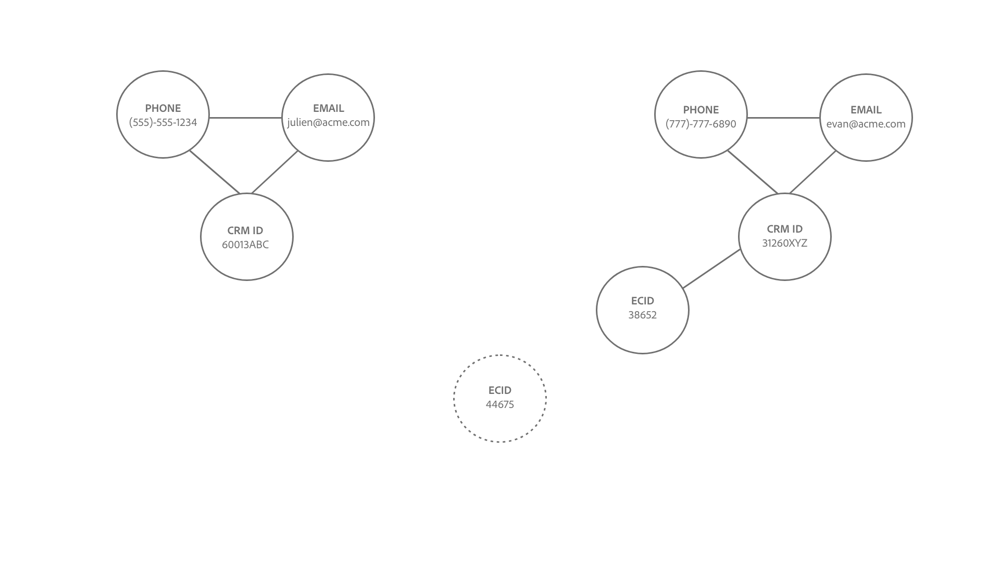

# Logica di collegamento del servizio Identity

Quando lo spazio dei nomi dell’identità e i valori dell’identità corrispondono, viene stabilito un collegamento tra due identità.

Esistono due tipi di identità collegate:

* **Record profilo**: queste identità provengono in genere da sistemi CRM.
* **Eventi esperienza**: queste identità provengono in genere dall&#39;implementazione WebSDK o dall&#39;origine Adobe Analytics.

## Significato semantico della creazione di collegamenti

Un’identità rappresenta un’entità del mondo reale. Se esiste un collegamento stabilito tra due identità, ciò significa che le due identità sono associate l’una all’altra. Di seguito sono riportati alcuni esempi che illustrano questo concetto:

| Azione | Collegamenti stabiliti | Significato |
| --- | --- | --- |
| Un utente finale accede utilizzando un computer. | CRMID ed ECID sono collegati tra loro. | Una persona (CRMID) possiede un dispositivo con un browser (ECID). |
| Un utente finale naviga in modo anonimo utilizzando un iPhone. | IDFA è collegato a ECID. | Il dispositivo hardware Apple (IDFA), ad esempio un iPhone, è associato al browser (ECID). |
| Un utente finale accede utilizzando Google Chrome e quindi Firefox. | Il CRMID è collegato a due diversi ECID. | Una persona (CRMID) è associata a 2 browser Web (**Nota**: ogni browser avrà il proprio ECID). |
| Un ingegnere dati acquisisce un record CRM che include due campi contrassegnati come identità: CRMID e E-mail. | CRMID ed E-mail sono collegati. | All’indirizzo e-mail è associata una persona (CRMID). |

## Informazioni sulla logica di collegamento del servizio Identity

Un’identità è costituita da uno spazio dei nomi dell’identità e da un valore di identità.

* Uno spazio dei nomi di identità è il contesto di un dato valore di identità a. Esempi comuni di spazi dei nomi di identità includono CRMID, E-mail e Telefono.
* Un valore di identità è la stringa che rappresenta un’entità del mondo reale. Ad esempio: &quot;julien@acme.com&quot; può essere un valore di identità per uno spazio dei nomi E-mail e 555-555-1234 può essere un valore di identità corrispondente per uno spazio dei nomi Telefono.

>[!TIP]
>
>Lo spazio dei nomi dell’identità è importante perché senza di esso, il valore dell’identità perde il contesto e non avrà informazioni sufficienti per corrispondere correttamente alle identità.

Per una rappresentazione visiva del funzionamento della logica di collegamento del servizio Identity, consulta i seguenti diagrammi:

>[!BEGINTABS]

>[!TAB Grafico esistente]

Supponiamo di avere un grafo di identità esistente con tre identità collegate:

* TEL. (555)-555-1234
* E-MAIL:julien@acme.com
* CRMID:60013ABC

>[!TAB Dati in arrivo]

Una coppia di identità viene acquisita nel grafico e questa coppia contiene:

* CRMID:60013ABC
* ECID:100066526

>[!TAB Grafico aggiornato]

Il servizio Identity riconosce che CRMID:60013ABC esiste già nel grafico, pertanto collega solo il nuovo ECID

>[!ENDTABS]

## Scenario cliente

In qualità di ingegnere dati, acquisisci il seguente set di dati CRM (record profilo) in Experience Platform.

| CRMID** | Telefono* | E-mail* | Nome | Cognome |
| --- | --- | --- | --- | --- |
| 60013ABC | 555-555-1234 | julien@acme.com | Julien | Smith |
| 31260XYZ | 777-777-6890 | evan@acme.com | Evan | Smith |

>[!NOTE]
>
>* `**` - Indica il campo contrassegnato come identità primaria.
>* `*` - Indica il campo contrassegnato come identità secondaria.
>
>Identity Service non distingue tra identità primaria e secondaria. Se un campo è contrassegnato come identità, verrà acquisito in Identity Service.

Hai anche implementato Web SDK e acquisito un set di dati Web SDK (Experience Event) con le seguenti tabelle di dati:

| Timestamp | Identità nell’evento* | Evento |
| --- | --- | --- |
| `t=1` | ECID:38652 | Visualizza home page |
| `t=2` | ECID:38652, CRMID:31260XYZ | Cerca scarpe |
| `t=3` | ECID:44675 | Visualizza home page |
| `t=4` | ECID:44675, CRMID: 31260XYZ | Visualizza cronologia acquisti |

L&#39;identità primaria di ogni evento verrà determinata in base a [modalità di configurazione dei tipi di elementi dati](../../tags/extensions/client/web-sdk/data-element-types.md).

>[!NOTE]
>
>* Se selezioni il CRMID come principale, gli eventi autenticati (eventi con mappa di identità contenente il CRMID e l’ECID) avranno un’identità primaria di CRMID. Per gli eventi non autenticati (gli eventi con la mappa di identità contenente solo ECID) avranno un’identità primaria di ECID. L’Adobe consiglia questa opzione.
>
>* Se selezioni l’ECID come principale, indipendentemente dallo stato di autenticazione, l’ECID diventa l’identità principale.

In questo esempio:

* `t=1`, ha utilizzato un computer desktop (ECID:38652) e per visualizzare la home page in modo anonimo.
* `t=2`, ha utilizzato lo stesso computer desktop, ha effettuato l&#39;accesso (CRMID:31260XYZ) e ha quindi cercato le scarpe.
   * Una volta effettuato l’accesso, l’evento invia sia ECID che CRMID al servizio Identity.
* `t=3`, ha utilizzato un computer portatile (ECID:44675) e ha navigato in modo anonimo.
* `t=4`, ha utilizzato lo stesso computer portatile, ha effettuato l&#39;accesso (CRMID: 31260XYZ) e ha quindi visualizzato la cronologia degli acquisti.

>[!BEGINTABS]

>[!TAB timestamp=0]

In `timestamp=0`, si dispone di due grafici delle identità per due clienti diversi. Entrambi sono rappresentati da tre identità collegate.

| | CRMID | E-mail | Telefono |
| --- | --- | --- | --- |
| Cliente uno | 60013ABC | julien@acme.com | 555-555-1234 |
| Cliente due | 31260XYZ | evan@acme.com | 777-777-6890 |

>[!TAB timestamp=1]

In `timestamp=1`, un cliente utilizza un laptop per visitare il sito Web di e-commerce, visualizzare la home page e navigare in modo anonimo. Questo evento di navigazione anonimo è identificato come ECID:38652. Poiché il servizio Identity memorizza solo gli eventi con almeno due identità, queste informazioni non vengono memorizzate.

>[!TAB timestamp=2]

In `timestamp=2`, un cliente utilizza lo stesso laptop per visitare il sito Web di e-commerce. Accedono con la combinazione di nome utente e password e cercano le scarpe. Identity Service identifica l’account del cliente quando effettua l’accesso perché corrisponde al suo identificatore CRMID: 31260XYZ. Inoltre, Identity Service mette in relazione ECID:38562 con CRMID:31260XYZ, poiché entrambi utilizzano lo stesso browser sullo stesso dispositivo.

>[!TAB timestamp=3]

In `timestamp=3` un cliente utilizza un tablet per visitare il sito Web di e-commerce e navigare in modo anonimo. Questo evento di navigazione anonimo è identificato come ECID:44675. Poiché il servizio Identity memorizza solo gli eventi con almeno due identità, queste informazioni non vengono memorizzate.

>[!TAB timestamp=4]

In `timestamp=4`, un cliente utilizza lo stesso tablet, accede al proprio account (CRMID:31260XYZ) e visualizza la cronologia degli acquisti. Questo evento collega il relativo CRMID:31260XYZ all’identificatore del cookie assegnato all’attività di navigazione anonima, ECID:44675, e collega ECID:44675 al grafico delle identità del cliente 2.

>[!ENDTABS]
