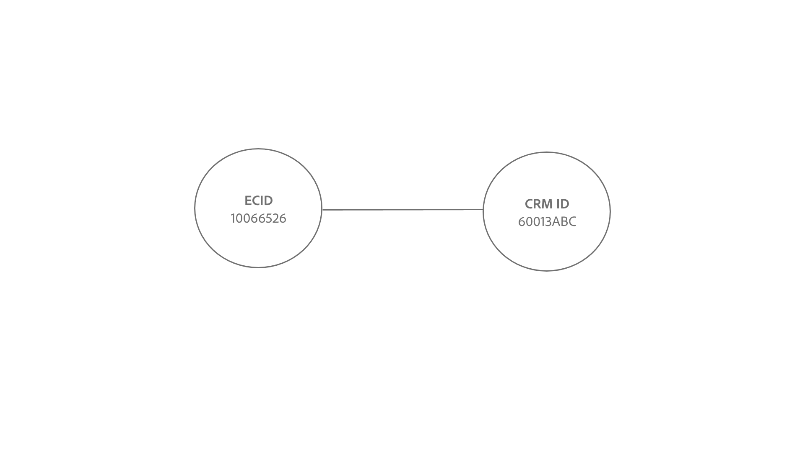

# Logica di collegamento del servizio Identity {#identity-service-linking-logic}

>[!CONTEXTUALHELP]
>id="platform_identities_simulatedgraph"
>title="Grafico simulato"
>abstract="Le identità sono collegate quando lo spazio dei nomi identità e il valore dell’identità corrispondono."

Un collegare tra due identità viene stabilito quando lo spazio dei nomi identità e i valori identità corrispondono.

Esistono due tipi di identità che vengono collegate:

* **Record** del profilo: queste identità provengono solitamente da sistemi CRM.
* **Eventi** esperienza: queste identità provengono solitamente dall&#39;implementazione WebSDK o dall&#39;origine Adobe Analytics.

## Significato semantico di stabilire collegamenti

Un&#39;identità rappresenta un&#39;entità del mondo reale. Se c&#39;è un collegare stabilito tra due identità, ciò significa che le due identità sono associate l&#39;una all&#39;altra. Di seguito sono riportati alcuni esempi che illustrano questo concetto:

| Azione | Collegamenti stabiliti | Significato |
| --- | --- | --- |
| Un fine utente accede utilizzando un computer. | CRMID ed ECID sono collegati. | Una persona (CRMID) possiede un dispositivo con un browser (ECID). |
| Un fine utente naviga in modo anonimo utilizzando un iPhone . | IDFA è collegato a ECID. | L&#39;dispositivo hardware Apple (IDFA), ad esempio un iPhone, è associato all&#39;browser (ECID). |
| Un utente finale accede utilizzando Google Effetto cromatura e quindi Firefox. | CRMID è collegato a due ECID diversi. | Una persona (CRMID) è associata a 2 browser Web (**Nota**: ogni browser avrà il proprio ECID). |
| Un ingegnere dei dati acquisisce un record CRM che include due campi contrassegnati come identità: CRMID ed E-mail. | CRMID ed E-mail sono collegati. | Una persona (CRMID) è associata all&#39;indirizzo e-mail. |

## Informazioni sulla logica di collegamento del servizio Identity

Un&#39;identità è costituita da uno spazio dei nomi identità e da un valore identità.

* Un namespace identità è il contesto di un dato valore di identità. Esempi comuni di spazi dei nomi identità includono CRMID, Email e Phone.
* Un valore di identità è la stringa che rappresenta un&#39;entità del mondo reale. Ad esempio: &quot;julien@acme.com&quot; può essere un valore di identità per uno spazio dei nomi di posta elettronica e 555-555-1234 può essere un valore di identità corrispondente per uno spazio dei nomi Telefono.

>[!TIP]
>
>The identity namespace is important because without it, then the identity value loses its context and will not have enough information to successfully match identities.

See the following diagrams for a visual representation of how the Identity Service linking logic works:

>[!BEGINTABS]

>[!TAB Grafico esistente]

Supponiamo di avere un grafico delle identità esistente con tre identità collegate:

* TELEFONO:(555)-555-1234
* POSTA ELETTRONICAJULIEN@acme.com
* CRMID:60013ABC

>[!TAB Incoming data]

A pair of identities are ingested into your graph and this pair contains:

* CRMID:60013ABC
* ECID:100066526

>[!TAB Grafico aggiornato]

Identity Service riconosce che CRMID:60013ABC esiste già all&#39;interno del grafico e quindi collega solo il nuovo ECID

>[!ENDTABS]

## Scenario cliente

You are a data engineer and you ingest the following CRM dataset (Profile record) to Experience Platform.

| CRMID** | Telefono* | E-mail* | Nome | Cognome |
| --- | --- | --- | --- | --- |
| 60013ABC | 555-555-1234 | julien@acme.com | Julien | Smith |
| 31260XYZ | 777-777-6890 | evan@acme.com | Evan | Fabbro |

>[!NOTE]
>
>* `**` - Indica il campo contrassegnato come identità primaria.
>* `*` - Indica il campo contrassegnato come identità secondaria.
>
>Il servizio identità non distingue tra identità primaria e secondaria. Se un campo è contrassegnato come identità, viene assimilato al servizio Identity.

Hai anche implementato WebSDK e inserito un dataset WebSDK (Experience Event) con le seguenti tabelle di dati:

| Timestamp | Identità nell&#39;evento* | Evento |
| --- | --- | --- |
| `t=1` | ECID:38652 | Visualizza home page |
| `t=2` | ECID:38652, CRMID:31260XYZ | Search per scarpe |
| `t=3` | ECID:44675 | Visualizza home page |
| `t=4` | ECID:44675, CRMID: 31260XYZ | Visualizza cronologia acquisti |

L&#39;identità principale per ogni evento sarà determinata in base alla [configurazione dei tipi di](../../tags/extensions/client/web-sdk/data-element-types.md) elementi dati.

>[!NOTE]
>
>* Se si seleziona CRMID come primario, gli eventi autenticati (eventi con mappa identità contenente CRMID ed ECID) avranno un&#39;identità primaria di CRMID. Per gli eventi non autenticati (eventi con la mappa di identità contenente solo ECID) avrà un&#39;identità primaria di ECID. Adobe Systems consiglia questa opzione.
>
>* Se si seleziona ECID come primario, indipendentemente dallo stato di autenticazione, l&#39;ECID diventa l&#39;identità primaria.

In questo esempio:

* `t=1`, utilizzato un computer desktop (ECID:38652) e per visualizzare la home page navigare in modo anonimo.
* `t=2`, ha usato lo stesso computer desktop, ha effettuato l&#39;accesso (CRMID:31260XYZ) e poi ha cercato le scarpe.
   * Una volta effettuato l&#39;accesso di un utente, l&#39;evento invia sia ECID che CRMID a Identity Service.
* `t=3`, utilizzava un computer portatile (ECID:44675) e navigava in modo anonimo.
* `t=4`, ha utilizzato lo stesso computer portatile, ha effettuato l&#39;accesso (CRMID: 31260XYZ) e quindi ha visualizzato la cronologia degli acquisti.

>[!BEGINTABS]

>[!TAB timestamp=0]

In , `timestamp=0`sono disponibili due grafici di identità per due clienti diversi. Entrambi sono rappresentati da tre identità collegate.

| | CRMID | E-mail | Telefono |
| --- | --- | --- | --- |
| Cliente uno | 60013ABC | julien@acme.com | 555-555-1234 |
| Cliente due | 31260XYZ | evan@acme.com | 777-777-6890 |

>[!TAB timestamp=1]

In `timestamp=1`, un cliente utilizza un laptop per visita il e-commerce sito Web, visualizzare la home page e navigare in modo anonimo. Questo evento di esplorazione anonima è identificato come ECID:38652. Poiché il servizio Identity archivia solo gli eventi con almeno due identità, queste informazioni non vengono archiviate.

>[!TAB timestamp=2]

At `timestamp=2`, a customer uses the same laptop to visit your e-commerce website. They log in with their username and password combination and they browse for shoes. Identity Service identifica il account del cliente quando effettua l&#39;accesso perché corrisponde al CRMID: 31260XYZ. Inoltre, Identity Service correla ECID:38562 a CRMID:31260XYZ poiché entrambi utilizzano lo stesso browser sullo stesso dispositivo.

>[!TAB timestamp=3]

At `timestamp=3` a customer uses a tablet to visit your e-commerce website and browse anonymously. Questo evento di esplorazione anonimo è identificato come ECID:44675. Since Identity Service only stores events with at least two identities, this information is not stored.

>[!TAB timestamp=4]

At `timestamp=4`, a customer uses the same tablet, logs in to their account (CRMID:31260XYZ) and views their purchase history. This event links their CRMID:31260XYZ to the cookie identifier assigned to anonymous browsing activity, ECID:44675, and links ECID:44675 to customer two&#39;s identity graph.

>[!ENDTABS]
