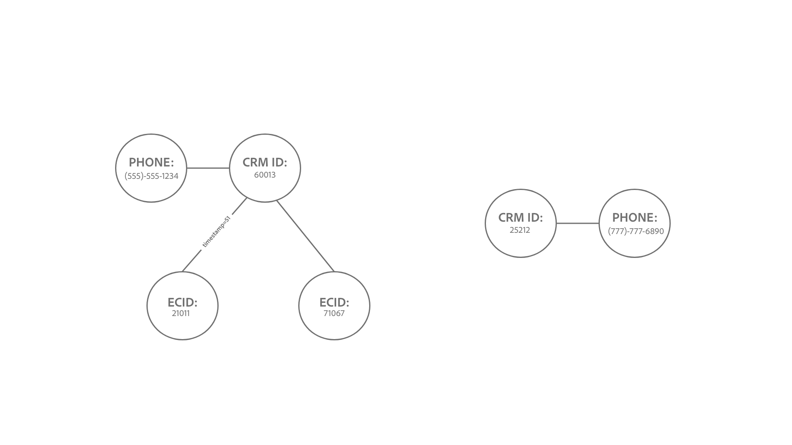

# Guardrail per [!DNL Identity Service] dati

Questo documento fornisce informazioni sui limiti di utilizzo e di tariffa per [!DNL Identity Service] dati per ottimizzare l’utilizzo del grafo delle identità. Durante l’esame dei seguenti guardrail, si presume che i dati siano stati modellati correttamente. In caso di domande su come modellare i dati, contatta il rappresentante del servizio clienti.

## Introduzione

I seguenti servizi di Experience Platform sono coinvolti nella modellazione dei dati di identità:

* [Identità](home.md): collega le identità da diverse origini dati durante l’acquisizione in Platform.
* [[!DNL Real-Time Customer Profile]](../profile/home.md): crea profili di consumatori unificati utilizzando dati provenienti da più origini.

## Limiti del modello dati

Le tabelle seguenti forniscono indicazioni sui guardrail per i limiti statici e sulle regole di convalida da considerare per gli spazi dei nomi di identità.

### Limiti statici

La tabella seguente illustra i limiti statici applicati ai dati di identità.

| Guardrail | Limite | Note |
| --- | --- | --- |
| Numero di identità in un grafico | 50 | Quando un grafico con 50 identità collegate viene aggiornato, Identity Service applica un meccanismo &quot;first in first out&quot; ed elimina l’identità più vecchia per fare spazio all’identità più recente. L’eliminazione si basa sul tipo di identità e sulla marca temporale. Il limite viene applicato a livello di sandbox. Per ulteriori informazioni, consulta la sezione su [informazioni sulla logica di eliminazione](#deletion-logic). |
| Numero di collegamenti a un’identità per un’acquisizione batch singola | 50 | Un singolo batch può contenere identità anomale che causano unioni di grafici indesiderate. Per evitare questo problema, il servizio Identity non acquisisce le identità già collegate a 50 o più identità. |
| Numero di identità in un record XDM | 20 | Il numero minimo di record XDM richiesti è due. |
| Numero di spazi dei nomi personalizzati | Nessuna | Non esistono limiti al numero di spazi dei nomi personalizzati che è possibile creare. |
| Numero di caratteri per un nome visualizzato dello spazio dei nomi o un simbolo di identità | Nessuna | Non vi sono limiti al numero di caratteri di un nome visualizzato dello spazio dei nomi o di un simbolo di identità. |

{style="table-layout:auto"}

### Convalida del valore identità

La tabella seguente illustra le regole esistenti da seguire per garantire la corretta convalida del valore di identità.

| Namespace | Regola di convalida | Comportamento del sistema quando la regola viene violata |
| --- | --- | --- |
| ECID | <ul><li>Il valore identità di un ECID deve essere esattamente di 38 caratteri.</li><li>Il valore identità di un ECID deve essere costituito solo da numeri.</li></ul> | <ul><li>Se il valore identità di ECID non è esattamente di 38 caratteri, il record viene ignorato.</li><li>Se il valore di identità dell’ECID contiene caratteri non numerici, il record viene ignorato.</li></ul> |
| Non ECID | <ul><li>Il valore identità non può superare i 1024 caratteri.</li><li>I valori di identità non possono essere &quot;null&quot;, &quot;anonymous&quot;, &quot;invalid&quot; o essere una stringa vuota (ad esempio: &quot;, &quot;&quot;, &quot; &quot;).</li></ul> | <ul><li>Se il valore di identità supera i 1024 caratteri, il record viene ignorato.</li><li>L’acquisizione dell’identità verrà bloccata.</li></ul> |

{style="table-layout:auto"}

### Acquisizione dello spazio dei nomi dell’identità

A partire dal 31 marzo 2023, il servizio Identity bloccherà l’acquisizione di Adobe Analytics ID (AAID) per i nuovi clienti. Questa identità viene generalmente acquisita tramite [Origine Adobe Analytics](../sources/connectors/adobe-applications/analytics.md) e [Origine Adobe Audience Manager](../sources//connectors/adobe-applications/audience-manager.md) ed è ridondante perché l’ECID rappresenta lo stesso browser web. Se desideri modificare questa configurazione predefinita, contatta il team del tuo account di Adobe.

## Informazioni sulla logica di eliminazione quando viene aggiornato un grafico delle identità alla capacità {#deletion-logic}

Quando un grafo di identità completo viene aggiornato, Identity Service elimina l’identità meno recente nel grafo prima di aggiungere l’identità più recente. Ciò al fine di mantenere l’accuratezza e la pertinenza dei dati di identità. Questo processo di eliminazione segue due regole principali:

### La regola #1 l’eliminazione ha priorità in base al tipo di identità di uno spazio dei nomi

La priorità di eliminazione è la seguente:

1. ID cookie
2. ID dispositivo
3. ID multi-dispositivo, e-mail e telefono

### Regola #2 l’eliminazione si basa sulla marca temporale memorizzata sull’identità

Ogni identità collegata in un grafo ha la propria marca temporale corrispondente. Quando si aggiorna un grafico completo, Identity Service elimina l’identità con la marca temporale meno recente.

Quando un grafico completo viene aggiornato con una nuova identità, queste due regole funzionano insieme per designare quale identità precedente verrà eliminata. Identity Service elimina prima l’ID cookie meno recente, quindi l’ID dispositivo meno recente e infine l’ID/e-mail/telefono multidispositivo meno recente.

>[!NOTE]
>
>Se l’identità designata per essere eliminata è collegata a più altre identità nel grafico, verranno eliminati anche i collegamenti che collegano tale identità.

### Implicazioni sull&#39;implementazione

Le sezioni seguenti descrivono le implicazioni della logica di eliminazione per Identity Service, Real-Time Customer Profile e Web SDK.

#### Identity Service: modifiche al tipo di identità dello spazio dei nomi personalizzato

Contatta il team del tuo account di Adobe per richiedere una modifica nel tipo di identità se la sandbox di produzione contiene:

* Uno spazio dei nomi personalizzato in cui gli identificatori della persona (come gli ID del sistema di gestione delle relazioni con i clienti) sono configurati come tipo di identità cookie/dispositivo.
* Uno spazio dei nomi personalizzato in cui gli identificatori cookie/dispositivo sono configurati come tipo di identità per più dispositivi.

Quando questa funzione sarà disponibile, i grafici che superano il limite di 50 identità verranno ridotti a un massimo di 50 identità. Per Real-Time CDP B2C Edition, ciò poteva comportare un aumento minimo del numero di profili idonei per un pubblico, in quanto questi profili venivano precedentemente ignorati da Segmentation and Activation.

#### Real-Time Customer Profile: impatto su tipi di pubblico indirizzabili

L’eliminazione avviene solo per i dati presenti nel servizio Identity e non per il profilo cliente in tempo reale.

* Questo comportamento potrebbe di conseguenza creare più profili con un singolo ECID, perché l’ECID non fa più parte del grafo delle identità.
* Per rimanere all’interno dei numeri di iscrizione al pubblico indirizzabile, si consiglia di abilitare [scadenza dati profilo pseudonimo](../profile/pseudonymous-profiles.md) per eliminare i vecchi profili.

#### Real-Time Customer Profile e Web SDK: eliminazione dell’identità primaria

Se desideri mantenere gli eventi autenticati rispetto all’ID del sistema di gestione delle relazioni con i clienti, ti consigliamo di modificare gli ID primari da ECID a CRM. Leggi i seguenti documenti per i passaggi su come implementare questa modifica:

* [Configurare la mappa di identità per i tag di Experience Platform](../tags/extensions/client/web-sdk/data-element-types.md#identity-map).
* [Dati di identità in Experienci Platform Web SDK](../edge/identity/overview.md#using-identitymap)

### Scenari di esempio

#### Esempio 1: grafico grande tipico

*Note diagramma:*

* `t` = marca temporale.
* Il valore di una marca temporale corrisponde all’attualità di una determinata identità. Ad esempio: `t1` rappresenta la prima identità collegata (più vecchia) e `t51` rappresenterebbe l’identità collegata più recente.

In questo esempio, prima che il grafico a sinistra possa essere aggiornato con una nuova identità, Identity Service elimina prima l’identità esistente con la marca temporale più vecchia. Tuttavia, poiché l’identità meno recente è un ID dispositivo, Identity Service ignora tale identità fino a quando non arriva allo spazio dei nomi con un tipo più alto nell’elenco di priorità di eliminazione, che in questo caso è `ecid-3`. Una volta rimossa l’identità meno recente con un tipo di priorità di eliminazione più elevato, il grafico viene quindi aggiornato con un nuovo collegamento, `ecid-51`.

* Nel raro caso in cui vi siano due identità con la stessa marca temporale e lo stesso tipo di identità, Identity Service ordinerà gli ID in base a [XID](./api/list-native-id.md) ed eseguirne la cancellazione.

#### Esempio 2: &quot;suddivisione del grafico&quot;

>[!BEGINTABS]

>[!TAB Evento in ingresso]

*Note diagramma:*

* Il diagramma seguente presuppone che `timestamp=50`, 50 identità esistono nel grafico delle identità.
* `(...)` indica le altre identità già collegate all’interno del grafico.

In questo esempio, ECID:32110 viene acquisito e collegato a un grafico di grandi dimensioni in `timestamp=51`, superando quindi il limite di 50 identità.

>[!TAB Processo di eliminazione]

Di conseguenza, Identity Service elimina l’identità meno recente in base alla marca temporale e al tipo di identità. In questo caso, ECID:35577 viene eliminato.

>[!TAB Output grafico]

In seguito all’eliminazione di ECID:35577, vengono eliminati anche i bordi che hanno collegato ID CRM:60013 e ID CRM:25212 con l’ECID:35577 ora eliminato. Questo processo di eliminazione fa sì che il grafico venga diviso in due grafici più piccoli.

>[!ENDTABS]

#### Esempio tre: &quot;hub and spoke&quot;

>[!BEGINTABS]

>[!TAB Evento in ingresso]

*Note diagramma:*

* Il diagramma seguente presuppone che `timestamp=50`, 50 identità esistono nel grafico delle identità.
* `(...)` indica le altre identità già collegate all’interno del grafico.

In virtù della logica di eliminazione, alcune identità &quot;hub&quot; possono anche essere eliminate. Queste identità hub si riferiscono a nodi collegati a diverse identità singole che altrimenti verrebbero scollegate.

Nell’esempio seguente, ECID:21011 viene acquisito e collegato al grafico in `timestamp=51`, superando quindi il limite di 50 identità.

>[!TAB Processo di eliminazione]

Di conseguenza, Identity Service elimina l’identità meno recente, che in questo caso è ECID:35577. L’eliminazione di ECID:35577 comporta anche l’eliminazione dei seguenti elementi:

* Il collegamento tra ID CRM: 60013 e l’ECID:35577 ora eliminato, risultante in uno scenario di suddivisione del grafico.
* IDFA: 32110, IDFA: 02383, e le altre identità rappresentate da `(...)`. Queste identità vengono eliminate perché singolarmente non sono collegate ad altre identità e pertanto non possono essere rappresentate in un grafico.

>[!TAB Output grafico]

Infine, il processo di eliminazione produce due grafici più piccoli.

>[!ENDTABS]

## Passaggi successivi

Per ulteriori informazioni su, consulta la seguente documentazione [!DNL Identity Service]:

* [Panoramica di [!DNL Identity Service]](home.md)
* [Visualizzatore del grafico delle identità](features/identity-graph-viewer.md)

Consulta la seguente documentazione per ulteriori informazioni su altri guardrail dei servizi Experienci Platform, informazioni sulla latenza end-to-end e informazioni sulle licenze dai documenti di descrizione del prodotto Real-Time CDP:

* [Guardrail Real-Time CDP](/help/rtcdp/guardrails/overview.md)
* [Diagrammi di latenza end-to-end](https://experienceleague.adobe.com/docs/blueprints-learn/architecture/architecture-overview/deployment/guardrails.html?lang=en#end-to-end-latency-diagrams) per vari servizi di Experience Platform.
* [Real-time Customer Data Platform (versione B2C - Pacchetti Prime e Ultimate)](https://helpx.adobe.com/legal/product-descriptions/real-time-customer-data-platform-b2c-edition-prime-and-ultimate-packages.html)
* [Real-time Customer Data Platform (B2P - Pacchetti Prime e Ultimate)](https://helpx.adobe.com/legal/product-descriptions/real-time-customer-data-platform-b2p-edition-prime-and-ultimate-packages.html)
* [Real-time Customer Data Platform (B2B - Pacchetti Prime e Ultimate)](https://helpx.adobe.com/legal/product-descriptions/real-time-customer-data-platform-b2b-edition-prime-and-ultimate-packages.html)
