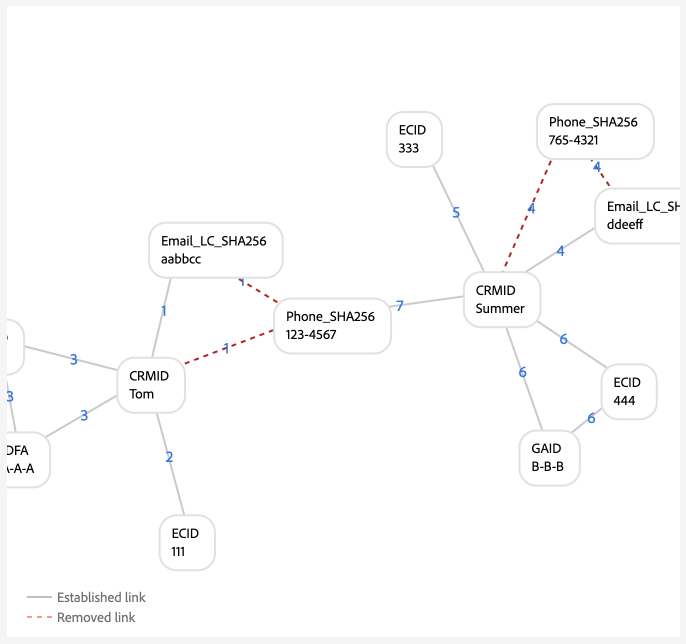
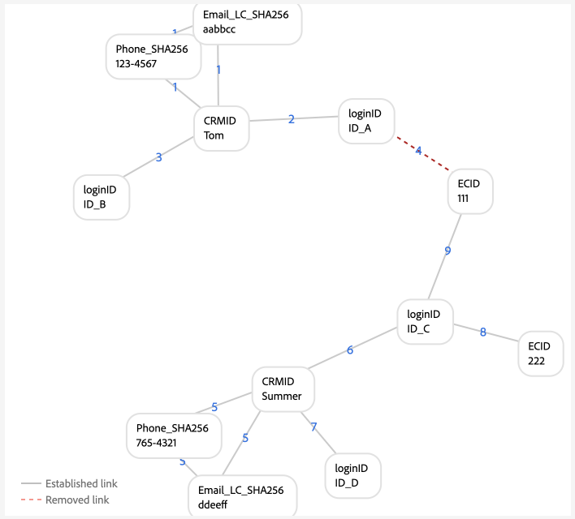
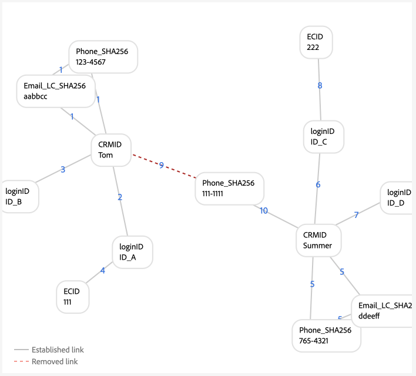

# Esempi di configurazioni del grafico {#examples-of-graph-configurations}

>[!CONTEXTUALHELP]
>id="platform_identities_algorithmconfiguration"
>title="Configurazione algoritmo"
>abstract="Configura uno spazio dei nomi univoco e una priorità dello spazio dei nomi personalizzata in base alle identità acquisite."

>[!AVAILABILITY]
>
>Le regole di collegamento del grafo delle identità sono attualmente a disponibilità limitata. Contatta il team del tuo account Adobe per informazioni su come accedere alla funzione nelle sandbox di sviluppo.

>[!NOTE]
>
>* &quot;CRMID&quot; e &quot;loginID&quot; sono spazi dei nomi personalizzati. In questo documento, &quot;CRMID&quot; è un identificatore di persona e &quot;loginID&quot; è un identificatore di accesso associato a una determinata persona.
>* Per simulare gli scenari del grafico di esempio descritti in questo documento, devi innanzitutto creare due spazi dei nomi personalizzati, uno con il simbolo di identità &quot;CRMID&quot; e un altro con il simbolo di identità &quot;loginID&quot;. I simboli di identità fanno distinzione tra maiuscole e minuscole.

Questo documento illustra alcuni esempi di configurazione del grafico di scenari comuni che potresti incontrare quando lavori con regole di collegamento del grafico delle identità e dati di identità.

## Solo CRMID

Questo è un esempio di uno scenario di implementazione semplice in cui gli eventi online (CRMID ed ECID) vengono acquisiti e gli eventi offline (record di profilo) vengono archiviati solo nel CRMID.

**Implementazione:**

| Namespace utilizzati | Metodo di raccolta del comportamento Web |
| --- | --- |
| CRMID, ECID | Web SDK |

**Avvenimenti:**

È possibile creare questo scenario nella simulazione grafico copiando i seguenti eventi in modalità testo:

```shell
CRMID: Tom, ECID: 111
```

**Configurazione dell&#39;algoritmo:**

È possibile creare questo scenario nella simulazione grafica configurando la seguente configurazione per la configurazione dell&#39;algoritmo:

| Priorità | Nome visualizzato | Tipo di identità | Univoco per grafico |
| ---| --- | --- | --- |
| 1 | CRMID | CROSS_DEVICE | Sì |
| 2 | ECID | BISCOTTO | No |

**Selezione dell&#39;identità primaria per il profilo cliente in tempo reale:**

Nel contesto di questa configurazione, l’identità primaria sarà definita come segue:

| Stato di autenticazione | Spazio dei nomi negli eventi | Identità primaria |
| --- | --- | --- |
| autenticato | CRMID, ECID | CRMID |
| Non autenticato | ECID | ECID |

**Esempi di grafici**

>[!BEGINTABS]

>[!TAB Grafico a persona singola ideale]

Quello che segue è un esempio di grafico ideale per una singola persona, in cui CRMID è unico e ha la massima priorità.


>[!TAB Grafico multi-persona]

Di seguito è riportato un esempio di grafico a più persone. In questo esempio viene visualizzato lo scenario &quot;dispositivo condiviso&quot;, in cui sono presenti due CRMID e viene rimosso quello con il collegamento stabilito precedente.


**Input eventi simulazione grafico**

```shell
CRMID: Tom, ECID: 111
CRMID: Summer, ECID: 111
```

>[!ENDTABS]

## CRMID con e-mail con hash

In questo scenario, un CRMID viene inserito e rappresenta sia i dati online (evento esperienza) che offline (record di profilo). Questo scenario comporta anche l&#39;inserimento di un messaggio e-mail con hash, che rappresenta un altro spazio dei nomi inviato nel set di dati del record CRM insieme al CRMID.

>[!IMPORTANT]
>
>**È fondamentale che il CRMID venga sempre inviato per ogni utente**. In caso contrario, potrebbe verificarsi uno scenario di ID login &quot;penzolante&quot;, in cui si presume che una singola entità condivida un dispositivo con un&#39;altra persona.

**Implementazione:**

| Namespace utilizzati | Metodo di raccolta del comportamento Web |
| --- | --- |
| CRMID, Email_LC_SHA256, ECID | Web SDK |

**Avvenimenti:**

È possibile creare questo scenario nella simulazione grafico copiando i seguenti eventi in modalità testo:

```shell
CRMID: Tom, Email_LC_SHA256: tom<span>@acme.com
CRMID: Tom, ECID: 111
CRMID: Summer, Email_LC_SHA256: summer<span>@acme.com
CRMID: Summer, ECID: 222
```

**Configurazione dell&#39;algoritmo:**

Puoi creare questo scenario nella simulazione del grafico configurando la seguente configurazione per la configurazione dell’algoritmo:

| Priorità | Nome visualizzato | Tipo di identità | Univoco per grafico |
| ---| --- | --- | --- |
| 1 | CRMID | CROSS_DEVICE | Sì |
| 2 | E-mail (SHA256, in minuscolo) | E-mail | No |
| 3 | ECID | BISCOTTO | No |

**Selezione identità primaria per il profilo:**

Nel contesto di questa configurazione, l’identità primaria sarà definita come segue:

| Stato di autenticazione | Spazio dei nomi negli eventi | Identità primaria |
| --- | --- | --- |
| autenticato | CRMID, ECID | CRMID |
| Non autenticato | ECID | ECID |

**Esempi di grafici**

>[!BEGINTABS]

>[!TAB Grafico a persona singola ideale]

Di seguito sono riportati esempi di una coppia di grafici ideali per una singola persona, in cui ogni CRMID è associato al rispettivo spazio dei nomi e-mail con hash ed ECID.


>[!TAB Grafico a più persone: dispositivo condiviso]

Di seguito è riportato un esempio di uno scenario con grafico a più persone in cui un dispositivo è condiviso da due persone.


**Input di eventi di simulazione del grafico**

```shell
CRMID: Tom, Email_LC_SHA256: aabbcc
CRMID: Tom, ECID: 111
CRMID: Summer, Email_LC_SHA256: ddeeff
CRMID: Summer, ECID: 222
CRMID: Summer, ECID: 111
```

>[!TAB Grafico multi-persona: e-mail non univoca]

Di seguito è riportato un esempio di uno scenario grafico multi-persona in cui l&#39;e-mail non è univoca e viene associata a due CRMID diversi.


**Input eventi simulazione grafico**

```shell
CRMID: Tom, Email_LC_SHA256: aabbcc
CRMID: Tom, ECID: 111
CRMID: Summer, Email_LC_SHA256: ddeeff
CRMID: Summer, ECID: 222
CRMID: Summer, Email_LC_SHA256: aabbcc
```

>[!ENDTABS]

## CRMID con e-mail con hash, telefono con hash, GAID e IDFA

Questo scenario è simile al precedente. Tuttavia, in questo scenario, e-mail e telefono con hash vengono contrassegnati come identità da utilizzare in [[!DNL Segment Match]](../../segmentation/ui/segment-match/overview.md).

>[!IMPORTANT]
>
>**È fondamentale che il CRMID venga sempre inviato per ogni utente**. In caso contrario, potrebbe verificarsi uno scenario con ID di accesso &quot;tralasciato&quot;, in cui si presume che una singola persona condivida un dispositivo con un’altra persona.

**Implementazione:**

| Namespace utilizzati | Metodo di raccolta del comportamento Web |
| --- | --- |
| CRMID, Email_LC_SHA256, Phone_SHA256, GAID, IDFA, ECID | Web SDK |

**Avvenimenti:**

È possibile creare questo scenario nella simulazione grafico copiando i seguenti eventi in modalità testo:

```shell
CRMID: Tom, Email_LC_SHA256: aabbcc, Phone_SHA256: 123-4567
CRMID: Tom, ECID: 111
CRMID: Tom, ECID: 222, IDFA: A-A-A
CRMID: Summer, Email_LC_SHA256: ddeeff, Phone_SHA256: 765-4321
CRMID: Summer, ECID: 333
CRMID: Summer, ECID: 444, GAID:B-B-B
```

**Configurazione dell&#39;algoritmo:**

Puoi creare questo scenario nella simulazione del grafico configurando la seguente configurazione per la configurazione dell’algoritmo:

| Priorità | Nome visualizzato | Tipo di identità | Univoco per grafico |
| ---| --- | --- | --- |
| 1 | CRMID | CROSS_DEVICE | Sì |
| 2 | E-mail (SHA256, in minuscolo) | E-mail | No |
| 3 | Telefono (SHA256) | Telefono | No |
| 4 | ID annunci Google (GAID) | DISPOSITIVO | No |
| 5 | Apple IDFA (ID per Apple) | DISPOSITIVO | No |
| 6 | ECID | BISCOTTO | No |

**Selezione identità primaria per il profilo:**

Nel contesto di questa configurazione, l’identità primaria sarà definita come segue:

| Stato Authentication | Namespace negli eventi | Identità primaria |
| --- | --- | --- |
| autenticato | CRMID, IDFA, ECID | CRMID |
| autenticato | CRMID, GAID, ECID | CRMID |
| autenticato | CRMID, ECID | CRMID |
| Non autenticato | GAID, ECID | GAID |
| Non autenticato | IDFA, ECID | IDFA |
| Non autenticato | ECID | ECID |

**Esempi di grafici**

>[!BEGINTABS]

>[!TAB Grafico a persona singola ideale]

Di seguito è riportato uno scenario di grafico a persona singola ideale in cui e-mail con hash e telefono con hash sono contrassegnati come identità da utilizzare in [!DNL Segment Match]. In questo scenario, i grafici sono suddivisi in due, per rappresentare entità persona diverse.


>[!TAB Grafico a più persone: dispositivo condiviso, computer condiviso]

Di seguito è riportato uno scenario grafico di più persone in cui un dispositivo (computer) è condiviso da due persone. In questo scenario, il computer condiviso è rappresentato da `{ECID: 111}` ed è collegato a `{CRMID: Summer}` perché tale collegare è il collegare stabilito più di recente. `{CRMID: Tom}` viene rimosso perché il collegare tra `{CRMID: Tom}` e `{ECID: 111}` è più vecchio e perché CRMID è lo spazio dei nomi univoco designato in questa configurazione.


**Input eventi simulazione grafico**

```shell
CRMID: Tom, Email_LC_SHA256: aabbcc, Phone_SHA256: 123-4567
CRMID: Tom, ECID: 111
CRMID: Tom, ECID: 222, IDFA: A-A-A
CRMID: Summer, Email_LC_SHA256: ddeeff, Phone_SHA256: 765-4321
CRMID: Summer, ECID: 333
CRMID: Summer, ECID: 444, GAID:B-B-B
CRMID: Summer, ECID: 111
```

>[!TAB Grafico a più persone: dispositivo condiviso, dispositivo mobile Android]

Di seguito è riportato uno scenario con un grafico a più persone in cui un dispositivo android è condiviso da due persone. In questo scenario, CRMID è configurato come spazio dei nomi univoco e pertanto il collegamento più recente di `{CRMID: Tom, GAID: B-B-B, ECID:444}` sostituisce il precedente `{CRMID: Summer, GAID: B-B-B, ECID:444}`.


**Input di eventi di simulazione del grafico**

```shell
CRMID: Tom, Email_LC_SHA256: aabbcc, Phone_SHA256: 123-4567
CRMID: Tom, ECID: 111
CRMID: Tom, ECID: 222, IDFA: A-A-A
CRMID: Summer, Email_LC_SHA256: ddeeff, Phone_SHA256: 765-4321
CRMID: Summer, ECID: 333
CRMID: Summer, ECID: 444, GAID: B-B-B
CRMID: Tom, ECID: 444, GAID: B-B-B
```

>[!TAB Grafico per più persone: dispositivo condiviso, dispositivo Apple Mobile, nessuna reimpostazione ECID]

Di seguito è riportato uno scenario grafico con più persone in cui un dispositivo Apple viene condiviso da due persone. In questo scenario l&#39;IDFA è condiviso, ma l&#39;ECID non viene reimpostato.


**Input eventi simulazione grafico**

```shell
CRMID: Tom, Email_LC_SHA256: aabbcc, Phone_SHA256: 123-4567
CRMID: Tom, ECID: 111
CRMID: Tom, ECID: 222, IDFA: A-A-A
CRMID: Summer, Email_LC_SHA256: ddeeff, Phone_SHA256: 765-4321
CRMID: Summer, ECID: 333
CRMID: Summer, ECID: 444, GAID: B-B-B
CRMID: Summer, ECID: 222, IDFA: A-A-A
```

>[!TAB Grafico a più persone: dispositivo condiviso, apple, ripristini ECID]

Di seguito è riportato uno scenario di grafico a più persone in cui un dispositivo Apple è condiviso da due persone. In questo scenario, l’ECID viene ripristinato, ma l’IDFA rimane lo stesso.


**Input di eventi di simulazione del grafico**

```shell
CRMID: Tom, Email_LC_SHA256: aabbcc, Phone_SHA256: 123-4567
CRMID: Tom, ECID: 111
CRMID: Tom, ECID: 222, IDFA: A-A-A
CRMID: Summer, Email_LC_SHA256: ddeeff, Phone_SHA256: 765-4321
CRMID: Summer, ECID: 333
CRMID: Summer, ECID: 444, GAID: B-B-B
CRMID: Summer, ECID: 555, IDFA: A-A-A
```

>[!TAB Grafico multi-persona: telefono non univoco]

Di seguito è riportato uno scenario con grafico a più persone in cui lo stesso numero di telefono viene condiviso da due persone.


**Input eventi simulazione grafico**

```shell
CRMID: Tom, Email_LC_SHA256: aabbcc, Phone_SHA256: 123-4567
CRMID: Tom, ECID: 111
CRMID: Tom, ECID: 222, IDFA: A-A-A
CRMID: Summer, Email_LC_SHA256: ddeeff, Phone_SHA256: 765-4321
CRMID: Summer, ECID: 333
CRMID: Summer, ECID: 444, GAID: B-B-B
CRMID: Summer, Phone_SHA256: 123-4567
```

In questo esempio, `{Phone_SHA256}` è anche contrassegnato come uno spazio dei nomi univoco. Pertanto, un grafico non può avere più di un&#39;identità con lo `{Phone_SHA256}` spazio dei nomi. In questo scenario, `{Phone_SHA256: 765-4321}` è scollegato da `{CRMID: Summer}` e `{Email_LC_SHA256: ddeeff}` poiché è il collegare precedente,



>[!TAB Grafico multi-persona: e-mail non univoca]

Di seguito è riportato uno scenario grafico per più persone in cui la posta elettronica viene condivisa da due persone.


**Input eventi simulazione grafico**

```shell
CRMID: Tom, Email_LC_SHA256: aabbcc, Phone_SHA256: 123-4567
CRMID: Tom, ECID: 111
CRMID: Tom, ECID: 222, IDFA: A-A-A
CRMID: Summer, Email_LC_SHA256: ddeeff, Phone_SHA256: 765-4321
CRMID: Summer, ECID: 333
CRMID: Summer, ECID: 444, GAID: B-B-B
CRMID: Summer, Email_LC_SHA256: aabbcc
```

>[!ENDTABS]

## CRMID singolo con più ID login (versione semplice)

In questo scenario, esiste un singolo CRMID che rappresenta un&#39;entità persona. Tuttavia, un&#39;entità personale può avere più identificatori login:

* Una determinata entità personale può avere diversi tipi di account account (personale vs. aziendale, account per stato, account per marchio, ecc.)
* Una determinata entità può utilizzare indirizzi e-mail diversi per qualsiasi numero di account.

>[!IMPORTANT]
>
>**È fondamentale che il CRMID venga sempre inviato per ogni utente**. In caso contrario, potrebbe verificarsi uno scenario di ID login &quot;penzolante&quot;, in cui si presume che una singola entità condivida un dispositivo con un&#39;altra persona.

**Implementazione:**

| Namespace utilizzati | Metodo raccolta comportamento Web |
| --- | --- |
| CRMID, loginID, ECID | Web SDK |

**Eventi:**

Puoi creare questo scenario nella simulazione del grafico copiando i seguenti eventi in modalità testo:

```shell
CRMID: Tom, loginID: ID_A
CRMID: Tom, loginID: ID_B
loginID: ID_A, ECID: 111
CRMID: Summer, loginID: ID_C
CRMID: Summer, loginID: ID_D
loginID: ID_C, ECID: 222
```

**Configurazione algoritmo:**

Puoi creare questo scenario nella simulazione del grafico configurando la seguente configurazione per la configurazione dell’algoritmo:

| Priorità | Nome visualizzato | Tipo di identità | Univoco per grafico |
| ---| --- | --- | --- |
| 1 | CRMID | CROSS_DEVICE | Sì |
| 2 | ID accesso | CROSS_DEVICE | No |
| 3 | ECID | BISCOTTO | No |

**Selezione identità primaria per il profilo:**

Nel contesto di questa configurazione, l&#39;identità principale verrà definita like segue:

| Stato Authentication | Namespace negli eventi | Identità primaria |
| --- | --- | --- |
| autenticato | loginID, ECID | ID accesso |
| autenticato | loginID, ECID | ID accesso |
| autenticato | CRMID, loginID, ECID | CRMID |
| autenticato | CRMID, ECID | CRMID |
| Non autenticato | ECID | ECID |

**Esempi di grafici**

>[!BEGINTABS]

>[!TAB Scenario a persona singola ideale]

Di seguito è riportato uno scenario grafico per una singola persona con un singolo CRMID e più loginID.


>[!TAB Scenario di grafici per più persone: dispositivo condivisi]

Di seguito è riportato uno scenario grafico con più persone in cui un dispositivo viene condiviso da due persone. In questo scenario, `{ECID:111}` è collegato con entrambi `{loginID:ID_A}` e e `{loginID:ID_C}` il collegare stabilito precedente di `{ECID:111, loginID:ID_A}` viene rimosso.


**Input eventi simulazione grafico**

```shell
CRMID: Tom, loginID: ID_A
CRMID: Tom, loginID: ID_B
loginID: ID_A, ECID: 111
CRMID: Summer, loginID: ID_C
CRMID: Summer, loginID: ID_D
loginID: ID_C, ECID: 222
loginID: ID_C, ECID: 111
```

>[!TAB Scenario di grafici multi-persona: dati non validi]

Di seguito è riportato uno scenario grafico con più persone che coinvolge dati non validi. In questo scenario, `{loginID:ID_D}` è erroneamente collegato a due utenti disparati e il collegare con il timestamp più vecchio viene eliminato, a favore del collegare più recente stabilito.


**Input di eventi di simulazione del grafico**

```shell
CRMID: Tom, loginID: ID_A
CRMID: Tom, loginID: ID_B
loginID: ID_A, ECID: 111
CRMID: Summer, loginID: ID_C
CRMID: Summer, loginID: ID_D
loginID: ID_C, ECID: 222
CRMID: Tom, loginID: ID_D
```

>[!TAB ID login &#39;penzolante&#39;]

Il grafico seguente simula uno scenario di loginID &quot;penzolante&quot;. In questo esempio, due diversi loginID sono associati allo stesso ECID. Tuttavia, `{loginID:ID_C}` non è collegato al CRMID. Pertanto, non è possibile che Identity Service rilevi che questi due ID di accesso rappresentano due entità diverse.


**Input di eventi di simulazione del grafico**

```shell
CRMID: Tom, loginID: ID_A
CRMID: Tom, loginID: ID_B
loginID: ID_A, ECID: 111
loginID: ID_C, ECID: 111
```

>[!ENDTABS]

## CRMID singolo con più ID login (versione complessa)

In questo scenario, esiste un singolo CRMID che rappresenta un’entità persona. Tuttavia, un’entità persona può avere più identificatori di accesso:

* Una determinata entità persona può avere diversi tipi di conto (personale o aziendale, conto per stato, conto per marchio, ecc.)
* Una determinata entità persona può utilizzare indirizzi e-mail diversi per qualsiasi numero di account.

>[!IMPORTANT]
>
>**È fondamentale che il CRMID venga sempre inviato per ogni utente**. In caso contrario, potrebbe verificarsi uno scenario di ID login &quot;penzolante&quot;, in cui si presume che una singola entità condivida un dispositivo con un&#39;altra persona.

**Implementazione:**

| Namespace utilizzati | Metodo raccolta comportamento Web |
| --- | --- |
| CRMID, Email_LC_SHA256, Phone_SHA256, loginID, ECID | Adobe Analytics connettore di origine. <br> **Nota:** per impostazione predefinita, gli AAID sono bloccati in Identity Service, pertanto quando si utilizza l&#39;origine Analytics è necessario assegnare una priorità più elevata agli ECID rispetto agli AAID. Per ulteriori informazioni, leggere la [guida all&#39;implementazione](./implementation-guide.md#ingest-your-data).</br> |

**Eventi:**

È possibile creare questo scenario nella simulazione grafico copiando i seguenti eventi in modalità testo:

```shell
CRMID: Tom, Email_LC_SHA256: aabbcc, Phone_SHA256: 123-4567
CRMID: Tom, loginID: ID_A
CRMID: Tom, loginID: ID_B
loginID: ID_A, ECID: 111
CRMID: Summer, Email_LC_SHA256: ddeeff, Phone_SHA256: 765-4321
CRMID: Summer, loginID: ID_C
CRMID: Summer, loginID: ID_D
loginID: ID_C, ECID: 222
```

**Configurazione dell&#39;algoritmo:**

È possibile creare questo scenario nella simulazione grafica configurando la seguente configurazione per la configurazione dell&#39;algoritmo:

| Priorità | Nome visualizzato | Tipo di identità | Univoco per grafico |
| ---| --- | --- | --- | 
| 1 | CRMID | CROSS_DEVICE | Sì |
| 2 | Email_LC_SHA256 | E-mail | No |
| 3 | Telefono_SHA256 | Telefono | No |
| 4 | ID accesso | CROSS_DEVICE | No |
| 5 | ECID | BISCOTTO | No |
| 6 | AAID · | BISCOTTO | No |

**Selezione identità primaria per il profilo:**

Nel contesto di questa configurazione, l&#39;identità principale verrà definita like segue:

| Stato Authentication | Namespace negli eventi | Identità primaria |
| --- | --- | --- |
| autenticato | loginID, ECID | ID accesso |
| autenticato | loginID, ECID | ID accesso |
| autenticato | CRMID, loginID, ECID | CRMID |
| autenticato | CRMID, ECID | CRMID |
| Non autenticato | ECID | ECID |

**Esempi di grafici**

>[!BEGINTABS]

>[!TAB Grafico ideale per una singola persona]

Di seguito è riportato un esempio di due grafici per una sola persona, ciascuno con un CRMID e più loginID.


>[!TAB Grafico multi-persona: condiviso dispositivo 1]

Di seguito è riportato uno scenario di dispositivo condiviso con più persone in cui `{ECID:111}` è collegato a entrambi `{loginID:ID_A}` e `{loginID:ID_C}`. In questo caso, i collegamenti stabiliti più vecchi vengono rimossi a favore dei collegamenti stabiliti più di recente.



**Input eventi simulazione grafico**

```shell
CRMID: Tom, Email_LC_SHA256: aabbcc, Phone_SHA256: 123-4567
CRMID: Tom, loginID: ID_A
CRMID: Tom, loginID: ID_B
loginID: ID_A, ECID: 111
CRMID: Summer, Email_LC_SHA256: ddeeff, Phone_SHA256: 765-4321
CRMID: Summer, loginID: ID_C
CRMID: Summer, loginID: ID_D
loginID: ID_C, ECID: 222
loginID: ID_C, ECID: 111
```

>[!TAB Grafico a più persone: dispositivo condiviso 2]

In questo scenario, invece di inviare solo loginID, sia loginID che CRMID vengono inviati come eventi esperienza.


**Input eventi simulazione grafico**

```shell
CRMID: Tom, Email_LC_SHA256: aabbcc, Phone_SHA256: 123-4567
CRMID: Tom, loginID: ID_A
CRMID: Tom, loginID: ID_B
loginID: ID_A, ECID: 111
CRMID: Summer, Email_LC_SHA256: ddeeff, Phone_SHA256: 765-4321
CRMID: Summer, loginID: ID_C
CRMID: Summer, loginID: ID_D
loginID: ID_C, ECID: 222
CRMID: Summer, loginID: ID_C, ECID: 111
loginID: ID_A, ECID: 111
```

>[!TAB Grafico a più persone: dati loginID non validi]

In questo scenario, `{loginID:ID_C}` è collegato sia a `{CRMID:Tom}` che a `{CRMID:Summer}` e pertanto è considerato un dato non valido perché gli scenari di grafo ideali non devono collegare gli stessi loginID a due utenti diversi. In questo caso, i vecchi collegamenti stabiliti vengono rimossi a favore di quelli stabiliti più di recente.


**Input di eventi di simulazione del grafico**

```shell
CRMID: Tom, Email_LC_SHA256: aabbcc, Phone_SHA256: 123-4567
CRMID: Tom, loginID: ID_A
CRMID: Tom, loginID: ID_B
loginID: ID_A, ECID: 111
CRMID: Summer, Email_LC_SHA256: ddeeff, Phone_SHA256: 765-4321
CRMID: Summer, loginID: ID_C
CRMID: Summer, loginID: ID_D
loginID: ID_C, ECID: 222
CRMID: Tom, loginID: ID_C
```

>[!TAB Grafico multi-persona: e-mail non univoca]

In questo scenario, un&#39;e-mail non univoca viene collegata a due diversi CRMID, pertanto i collegamenti stabiliti più vecchi vengono rimossi a favore dei collegamenti stabiliti più di recente.


**Input di eventi di simulazione del grafico**

```shell
CRMID: Tom, Email_LC_SHA256: aabbcc, Phone_SHA256: 123-4567
CRMID: Tom, loginID: ID_A
CRMID: Tom, loginID: ID_B
loginID: ID_A, ECID: 111
CRMID: Summer, Email_LC_SHA256: ddeeff, Phone_SHA256: 765-4321
CRMID: Summer, loginID: ID_C
CRMID: Summer, loginID: ID_D
loginID: ID_C, ECID: 222
CRMID: Summer, Email_LC_SHA256: aabbcc
```

>[!TAB Grafico a più persone: telefono non univoco]

In questo scenario, un numero di telefono non univoco viene collegato a due diversi CRMID, i collegamenti meno recenti vengono rimossi a favore di quelli più recenti.



**Input eventi simulazione grafico**

```shell
CRMID: Tom, Email_LC_SHA256: aabbcc, Phone_SHA256: 123-4567
CRMID: Tom, loginID: ID_A
CRMID: Tom, loginID: ID_B
loginID: ID_A, ECID: 111
CRMID: Summer, Email_LC_SHA256: ddeeff, Phone_SHA256: 765-4321
CRMID: Summer, loginID: ID_C
CRMID: Summer, loginID: ID_D
loginID: ID_C, ECID: 222
CRMID: Tom, Phone_SHA256: 111-1111
CRMID: Summer, Phone_SHA256: 111-1111
```

>[!ENDTABS]

## Utilizzo in altre Adobe Commerce

Gli esempi di configurazione del grafico riportati in questa sezione descrivono i casi di utilizzo di Adobe Commerce. Gli esempi seguenti si concentrano sui clienti al dettaglio con due tipi di utenti:

* Utente registrato (utenti che hanno creato un account)
* Utenti ospiti (utenti che hanno solo un indirizzo e-mail)

>[!IMPORTANT]
>
>**È fondamentale che il CRMID venga sempre inviato per ogni utente**. In caso contrario, potrebbe verificarsi uno scenario con ID di accesso &quot;tralasciato&quot;, in cui si presume che una singola persona condivida un dispositivo con un’altra persona.

**Implementazione:**

| Namespace utilizzati | Metodo di raccolta del comportamento Web |
| --- | --- |
| CRMID, E-mail, ECID | Web SDK |

**Eventi:**

Puoi creare questo scenario nella simulazione del grafico copiando i seguenti eventi in modalità testo:

```shell
CRMID: Tom, Email: tom@acme.com
CRMID: Tom, ECID: 111
```

**Configurazione algoritmo:**

Puoi creare questo scenario nella simulazione del grafico configurando la seguente configurazione per la configurazione dell’algoritmo:

| Priorità | Nome visualizzato | Tipo di identità | Univoco per grafico |
| ---| --- | --- | --- | 
| 1 | CRMID | CROSS_DEVICE | Sì |
| 2 | E-mail | E-mail | Sì |
| 5 | ECID | BISCOTTO | No |

**Selezione dell&#39;identità principale per il profilo:**

Nel contesto di questa configurazione, l’identità primaria sarà definita come segue:

| Attività dell&#39;utente | Spazio dei nomi negli eventi | Identità primaria |
| --- | --- | --- |
| Navigazione autenticata | CRMID, ECID | CRMID |
| Checkout ospite | E-mail, ECID | E-mail |
| Esplorazione non autenticata | ECID | ECID |

>[!WARNING]
>
>Gli utenti registrati devono usare sia CRMID che e-mail nei loro profili, affinché i seguenti scenari di grafico funzionino.

**Esempi di grafici**

>[!BEGINTABS]

>[!TAB Grafico a persona singola ideale]

Di seguito è riportato un esempio di grafico ideale a persona singola.


>[!TAB Grafici a più persone]

Di seguito è riportato un esempio di grafico multi-persona in cui due utenti registrati navigano utilizzando lo stesso dispositivo.


**Input di eventi di simulazione del grafico**

```shell
CRMID: Tom, Email: tom@acme.com
CRMID: Summer, Email: summer@acme.com
CRMID: Tom, ECID: 111
CRMID: Summer, ECID: 111
```

In questo scenario, un utente registrato e un ospite utente condividono la stessa dispositivo.


**Input eventi simulazione grafico**

```shell
CRMID: Tom, Email: tom@acme.com
CRMID: Tom, ECID: 111
Email: summer@acme.com, ECID: 111
```

In questo scenario, un utente registrato e un utente guest condividono un dispositivo. Tuttavia, si verifica un errore di implementazione poiché il CRMID non contiene uno spazio dei nomi e-mail corrispondente. In questo scenario, Tom è l&#39;utente registrato e Summer è l&#39;utente ospite. A differenza dello scenario precedente, le due entità vengono unite poiché non esistono spazi dei nomi e-mail comuni tra le due entità persona.


**Input eventi simulazione grafico**

```shell
CRMID: Tom, ECID: 111
Email: summer@acme.com, ECID: 111
```

In questo scenario, due utenti guest condividono lo stesso dispositivo.


**Input eventi simulazione grafico**

```shell
Email: tom@acme.com, ECID: 111
Email: summer@acme.com, ECID: 111
```

In questo caso, un utente guest estrae un elemento e quindi si registra utilizzando lo stesso dispositivo.


**Input eventi simulazione grafico**

```shell
Email: tom@acme.com, ECID: 111
Email: tom@acme.com, CRMID: Tom
CRMID: Tom, ECID: 111
```

>[!ENDTABS]

## Passaggi successivi

Per ulteriori informazioni sulle regole di collegamento del grafico delle identità, consulta la documentazione seguente:

* [Panoramica delle regole di collegamento del grafico delle identità](./overview.md)
* [Algoritmo di ottimizzazione delle identità](./identity-optimization-algorithm.md)
* [Guida all’implementazione](./implementation-guide.md)
* [Risoluzione dei problemi e domande frequenti](./troubleshooting.md)
* [Priorità dello spazio dei nomi](./namespace-priority.md)
* [Interfaccia utente simulazione grafico](./graph-simulation.md)
* [Interfaccia utente per le impostazioni delle identità](./identity-settings-ui.md)