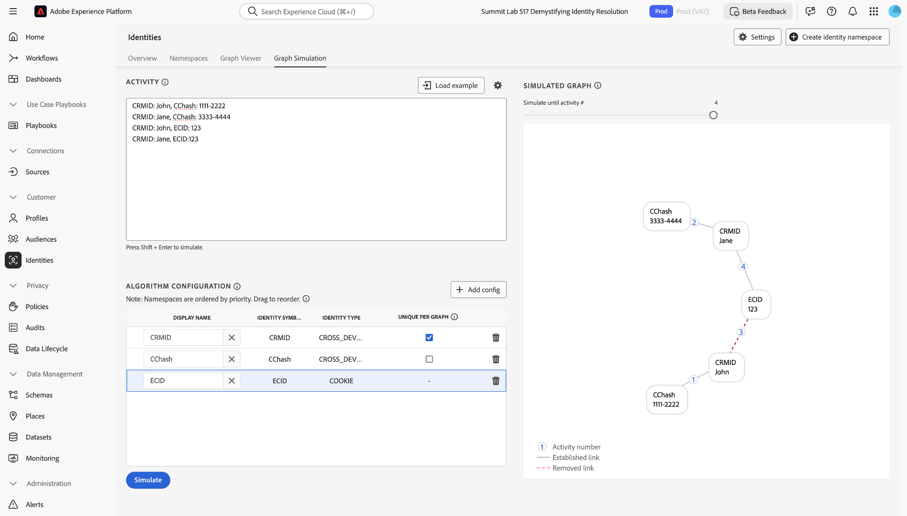
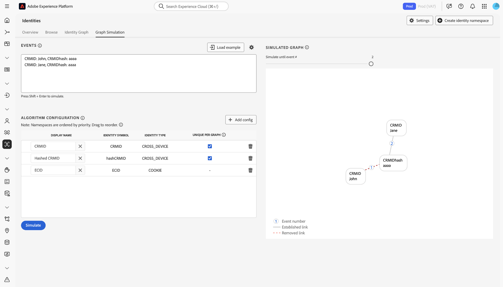
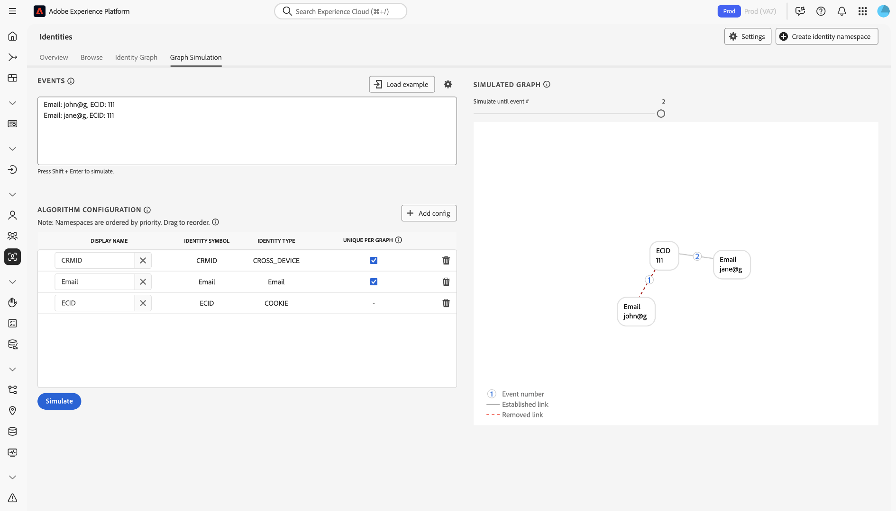
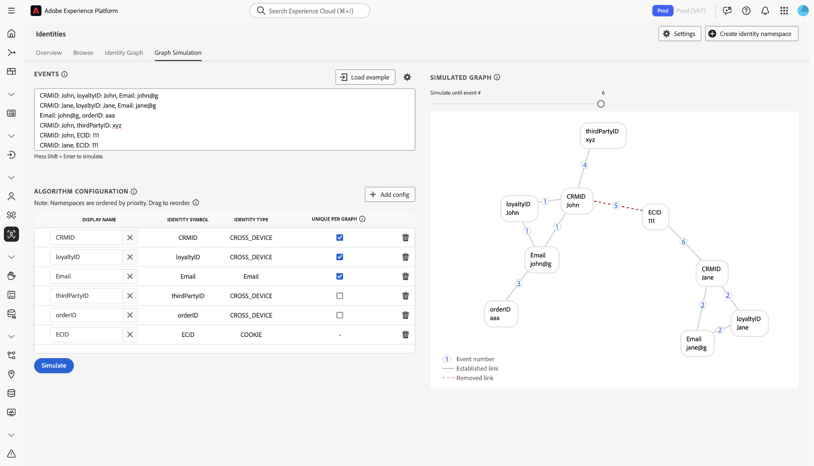

# Guida alle configurazioni delle [!DNL Identity Graph Linking Rules] {#configurations-guide}

>[!CONTEXTUALHELP]
>id="platform_identities_algorithmconfiguration"
>title="Configurazione algoritmo"
>abstract="Configura uno spazio dei nomi univoco e una priorità dello spazio dei nomi personalizzata in base alle identità acquisite."

Per informazioni sui diversi tipi di implementazione che è possibile configurare utilizzando [!DNL Identity Graph Linking Rules], leggere questo documento.

Gli scenari del grafico dei clienti possono essere raggruppati in tre diverse categorie.

* **Base**: [Le implementazioni di base](#basic-implementations) includono grafici che spesso includono implementazioni semplici. Queste implementazioni tendono a ruotare intorno a un singolo spazio dei nomi multi-dispositivo (ad esempio, CRMID). Anche se le implementazioni di base sono abbastanza semplici, la compressione del grafico può comunque verificarsi, spesso a causa di **scenari di dispositivi condivisi**.
* **Intermedio**: [Le implementazioni intermedie](#intermediate-implementations) includono diverse variabili come **più spazi dei nomi tra dispositivi**, **identità non univoche** e **più spazi dei nomi univoci**.
* **Avanzate**: [Le implementazioni avanzate](#advanced-implementations) comportano scenari di grafico complessi e a più livelli. Per le implementazioni avanzate, è essenziale stabilire l’ordine di priorità corretto dello spazio dei nomi per garantire che i collegamenti appropriati vengano rimossi, evitando in tal modo il collasso del grafico.

## Introduzione

Prima di passare al seguente documento, assicurati di acquisire familiarità con diversi concetti importanti di Identity Service e [!DNL Identity Graph Linking Rules].

* [Panoramica di Identity Service](../home.md)
* [Panoramica di [!DNL Identity Graph Linking Rules]](../identity-graph-linking-rules/namespace-priority.md)
* [Priorità dello spazio dei nomi](namespace-priority.md)
* [Spazio dei nomi univoco](overview.md#unique-namespace)
* [Simulazione del grafico](graph-simulation.md)

## Implementazioni di base {#basic-implementations}

>[!NOTE]
>
>Per completare le implementazioni seguenti, devi creare uno spazio dei nomi personalizzato con il simbolo di identità (distinzione maiuscole/minuscole) di: `CRMID`.

Leggere questa sezione per le implementazioni di base di [!DNL Identity Graph Linking Rules].

### Caso d’uso: implementazione semplice che utilizza uno spazio dei nomi cross-device

In genere, i clienti di Adobe dispongono di un unico spazio dei nomi per più dispositivi, utilizzato in tutte le loro proprietà, inclusi web, dispositivi mobili e applicazioni. Questo sistema è indipendente dal settore e dalla geografia, in quanto i clienti dei servizi al dettaglio, di telecomunicazione e finanziari utilizzano questo tipo di implementazione.

In genere, un utente finale è rappresentato da uno spazio dei nomi multi-dispositivo (spesso un CRMID), pertanto il CRMID deve essere classificato come uno spazio dei nomi univoco. Un utente finale proprietario di un computer e di un [!DNL iPhone] e che non condivide il proprio dispositivo potrebbe avere un grafico delle identità simile al seguente.

Immagina di essere un architetto di dati presso un&#39;azienda di e-commerce denominata **ACME**. John e Jane sono i tuoi clienti. Sono utenti finali che vivono insieme a San Jose, California. Condividono un computer desktop e utilizzano questo computer per navigare nel sito Web. Analogamente, anche John e Jane condividono [!DNL iPad] e occasionalmente utilizzano [!DNL iPad] per navigare in Internet, incluso il tuo sito Web.

**Modalità testo**

```json
CRMID: John, ECID: 123
CRMID: John, ECID: 999, IDFA: a-b-c
```

**Configurazione algoritmo (impostazioni identità)**

Configurate le seguenti impostazioni nell&#39;interfaccia Simulazione grafico (Graph Simulation) prima di simulare il grafico.

| Nome visualizzato | Simbolo di identità | Tipo di identità | Univoco per grafico | Priorità dello spazio dei nomi |
| --- | --- | --- | --- | --- |
| CRMID | CRMID | CROSS_DEVICE | ✔️ | 1 |
| ECID | ECID | COOKIE | | 2 |
| IDFA | IDFA | DISPOSITIVO | | 3 |

**Grafico simulato**

In questo grafico, John (l’utente finale) è rappresentato dal CRMID. `{ECID: 123}` rappresenta il browser Web utilizzato da John nel suo computer personale per visitare la piattaforma di e-commerce. `{ECID: 999}` rappresenta il browser che ha utilizzato sul suo [!DNL iPhone] e `{IDFA: a-b-c}` rappresenta il suo [!DNL iPhone].


**Esercizio**

Simula la seguente configurazione in Simulazione grafico. Puoi creare eventi personalizzati oppure copiare e incollare utilizzando la modalità testo.

>[!BEGINTABS]

>[!TAB Dispositivo condiviso (PC)]

**Dispositivo condiviso (PC)**

**Modalità testo**

```json
CRMID: John, ECID: 111
CRMID: Jane, ECID: 111
```

**Grafico simulato**

In questo grafico, John e Jane sono rappresentati dai rispettivi CRMID:

* `{CRMID: John}`
* `{CRMID: Jane}`

Il browser del computer desktop utilizzato da entrambi per visitare la piattaforma di e-commerce è rappresentato da `{ECID: 111}`. In questo scenario grafico, Jane è l&#39;ultimo utente finale autenticato e pertanto il collegamento tra `{ECID: 111}` e `{CRMID: John}` viene rimosso.


>[!TAB Dispositivo condiviso (dispositivo mobile)]

**Dispositivo condiviso (dispositivo mobile)**

**Modalità testo**

```json
CRMID: John, ECID: 111, IDFA: a-b-c
CRMID: Jane, ECID: 111, IDFA: a-b-c
```

**Grafico simulato**

In questo grafico, John e Jane sono entrambi rappresentati dai rispettivi CRMID. Il browser utilizzato è rappresentato da `{ECID: 111}` e il [!DNL iPad] condiviso da `{IDFA: a-b-c}`. In questo scenario grafico, Jane è l&#39;ultimo utente finale autenticato e pertanto i collegamenti da `{ECID: 111}` e da `{IDFA: a-b-c}` a `{CRMID: John}` vengono rimossi.


>[!ENDTABS]

## Implementazioni intermedie {#intermediate-implementations}

>[!TIP]
>
>Un&#39;identità **non univoca** è un&#39;identità associata a uno spazio dei nomi non univoco.

Leggere questa sezione per le implementazioni intermedie di [!DNL Identity Graph Linking Rules].

### Caso d’uso: i dati includono identità non univoche

>[!NOTE]
>
>Per completare le implementazioni di seguito, devi creare i seguenti spazi dei nomi personalizzati con i simboli di identità (distinzione maiuscole/minuscole) di:
>* `CRMID`
>* `CChash` (spazio dei nomi personalizzato che rappresenta un numero di carta di credito con hash).

Immagina di essere un architetto di dati che lavora per una banca commerciale che emette carte di credito. Il team marketing ha indicato di voler includere in un profilo la cronologia delle transazioni con carta di credito passate. Questo grafico delle identità potrebbe essere simile al seguente.

**Modalità testo**

```json
CRMID: John, CChash: 1111-2222 
CRMID: John, CChash: 3333-4444 
CRMID: John, ECID: 123 
CRMID: John, ECID: 999, IDFA: a-b-c
```

**Configurazione algoritmo (impostazioni identità)**

Configurate le seguenti impostazioni nell&#39;interfaccia Simulazione grafico (Graph Simulation) prima di simulare il grafico.

| Nome visualizzato | Simbolo di identità | Tipo di identità | Univoco per grafico | Priorità dello spazio dei nomi |
| --- | --- | --- | --- | --- |
| CRMID | CRMID | CROSS_DEVICE | ✔️ | 1 |
| Hash | Hash | CROSS_DEVICE | | 2 |
| ECID | ECID | COOKIE | | 3 |
| IDFA | IDFA | DISPOSITIVO | | 4 |

**Grafico simulato**


Non vi è alcuna garanzia che questi numeri di carta di credito, o qualsiasi altro spazio dei nomi non univoco, saranno sempre associati a un singolo utente finale. Due utenti finali possono registrarsi con la stessa carta di credito; è possibile che siano presenti valori segnaposto non univoci erroneamente acquisiti. In parole povere, non c’è garanzia che spazi dei nomi non univoci non causino la compressione del grafico.

Per risolvere questo problema, il servizio Identity rimuove i collegamenti meno recenti e mantiene quelli più recenti. In questo modo si ottiene un solo CRMID in un grafico, evitando in tal modo la compressione del grafico.

**Esercizio**

Simulare le seguenti configurazioni in Simulazione grafico. Puoi creare eventi personalizzati oppure copiare e incollare utilizzando la modalità testo.

>[!BEGINTABS]

>[!TAB Dispositivo condiviso]

**Modalità testo**

```json
CRMID: John, CChash: 1111-2222
CRMID: Jane, CChash: 3333-4444
CRMID: John, ECID: 123
CRMID: Jane, ECID:123
```

**Grafico simulato**



>[!TAB Due utenti finali con la stessa carta di credito]

Due utenti finali diversi si iscrivono al tuo sito web di e-commerce con la stessa carta di credito. Il team marketing vuole evitare il collasso del grafico assicurandosi che la carta di credito sia associata a un solo profilo.

**Modalità testo**

```json
CRMID: John, CChash: 1111-2222
CRMID: Jane, CChash: 1111-2222
CRMID: John, ECID: 123
CRMID: Jane, ECID:456
```

**Grafico simulato**


>[!TAB Numero carta di credito non valido]

A causa di dati non puliti, in Experience Platform viene acquisito un numero di carta di credito non valido.

**Modalità testo**

```json
CRMID: John, CChash: undefined
CRMID: Jane, CChash: undefined
CRMID: Jack, CChash: undefined
CRMID: Jill, CChash: undefined
```

**Grafico simulato**


>[!ENDTABS]

### Caso d’uso: i dati includono CRMID con e senza hash

>[!NOTE]
>
>Per completare le implementazioni di seguito, devi creare spazi dei nomi personalizzati con i simboli di identità (con distinzione tra maiuscole e minuscole) di:
>* `CRMID`
>* `CRMIDhash`

Stai acquisendo sia un CRMID senza hash (offline) che un CRMID con hash (online). L&#39;aspettativa è che esista una relazione diretta tra CRMID non hash e hash. Quando un utente finale esplora con un account autenticato, l’identificatore CRMID con hash viene inviato insieme all’ID dispositivo (rappresentato in Identity Service come ECID).

**Configurazione algoritmo (impostazioni identità)**

Configurate le seguenti impostazioni nell&#39;interfaccia Simulazione grafico (Graph Simulation) prima di simulare il grafico.

| Nome visualizzato | Simbolo di identità | Tipo di identità | Univoco per grafico | Priorità dello spazio dei nomi |
| --- | --- | --- | --- | --- | 
| CRMID | CRMID | CROSS_DEVICE | ✔️ | 1 |
| CRMIDhash | CRMIDhash | CROSS_DEVICE | ✔️ | 2 |
| ECID | ECID | COOKIE | | 3 |


**Esercizio**

Simulare le seguenti configurazioni in Simulazione grafico. Puoi creare eventi personalizzati oppure copiare e incollare utilizzando la modalità testo.

>[!BEGINTABS]

>[!TAB Dispositivo condiviso]

John e Jane condividono un dispositivo.

**Modalità testo**

```json
CRMID: John, CRMIDhash: John
CRMID: Jane, CRMIDhash: Jane
CRMIDhash: John, ECID: 111 
CRMIDhash: Jane, ECID: 111
```


>[!TAB Dati non validi]

A causa di errori nel processo di hashing, viene generato un CRMID con hashing non univoco che viene inviato al servizio Identity.

**Modalità testo**

```json
CRMID: John, CRMIDhash: aaaa
CRMID: Jane, CRMIDhash: aaaa
```



>[!ENDTABS]
<!-- 
### Use case: You are using Real-Time CDP and Adobe Commerce

You have two types of end-users:

* **Members**: An end-user who is assigned a CRMID and has an email account registered to your system.
* **Guests**: An end-user who is not a member. They do not have an assigned CRMID and their email accounts are not registered to your system.

In this scenario, your customers are sending data from Adobe Commerce to Real-Time CDP.

**Exercise**

Simulate the following configurations in the graph simulation tool. You can either create your own events, or copy and paste using text mode.

>[!BEGINTABS]

>[!TAB Shared device between two members]

In this scenario, two members share the same device to browse an e-commerce website.

**Text mode**

```json
CRMID: John, Email: john@g
CRMID: Jane, Email: jane@g
CRMID: John, ECID: 111
CRMID: Jane, ECID: 111
```


>[!TAB Shared device between two guests]

In this scenario, two guests share the same device to browse an e-commerce website.

**Text mode**

```json
Email: john@g, ECID: 111
Email: jane@g, ECID: 111
```



>[!TAB Shared device between a member and a guest]

In this scenario, a member and a guest share the same device to browse an e-commerce website.

**Text mode**

```json
CRMID: John, Email: john@g
CRMID: John, ECID: 111
Email: jane@g, ECID: 111
```


>[!ENDTABS] -->

### Caso d’uso: i dati includono tre spazi dei nomi univoci

>[!NOTE]
>
>Per completare le implementazioni seguenti, devi creare uno spazio dei nomi personalizzato con il simbolo di identità (distinzione maiuscole/minuscole) di: `CRMID`.

Il cliente definisce un&#39;entità a persona singola come segue:

* Un utente finale a cui è assegnato un CRMID.
* Utente finale associato a un indirizzo e-mail con hash, in modo che i profili possano essere attivati nelle destinazioni che supportano tale indirizzo (ad esempio, [!DNL Facebook]).
* Un utente finale associato a un indirizzo e-mail, in modo che il personale di supporto possa cercare il proprio profilo su Real-Time CDP utilizzando tale indirizzo e-mail.

| Nome visualizzato | Simbolo di identità | Tipo di identità | Univoco per grafico | Priorità dello spazio dei nomi |
| --- | --- | --- | --- | --- |
| CRMID | CRMID | CROSS_DEVICE | ✔️ | 1 |
| E-mail | E-mail | E-mail | ✔️ | 2 |
| Email_LC_SHA256 | Email_LC_SHA256 | E-mail | ✔️ | 3 |
| ECID | ECID | COOKIE | | 4 |

Simulare le seguenti configurazioni nello strumento di simulazione del grafico. Puoi creare eventi personalizzati oppure copiare e incollare utilizzando la modalità testo.

>[!BEGINTABS]

>[!TAB Dispositivo condiviso]

In questo scenario, sia John che Jane accedono a un sito web di e-commerce.

**Modalità testo**

```json
CRMID: John, Email: john@g, Email_LC_SHA256: john_hash 
CRMID: Jane, Email: jane@g, Email_LC_SHA256: jane_hash 
CRMID: John, ECID: 111 
CRMID: Jane, ECID: 111
```


>[!TAB Un utente finale modifica il proprio indirizzo e-mail]

**Modalità testo**

```json
CRMID: John, Email: john@g, Email_LC_SHA256: john_hash
CRMID: John, Email: john@y, Email_LC_SHA256: john_y_hash
```


>[!ENDTABS]

## Implementazioni avanzate {#advanced-implementations}

Le implementazioni avanzate coinvolgono scenari di grafico complessi e a più livelli. Questi tipi di implementazioni includono l&#39;utilizzo di **priorità dello spazio dei nomi** per identificare i collegamenti corretti da rimuovere per evitare la compressione del grafico.

**La priorità dello spazio dei nomi** è costituita da metadati che classificano gli spazi dei nomi in base alla loro importanza. Se un grafico contiene due identità, ciascuna con uno spazio dei nomi univoco diverso, Identity Service utilizza la priorità dello spazio dei nomi per decidere quali collegamenti rimuovere. Per ulteriori informazioni, consulta la [documentazione sulla priorità dello spazio dei nomi](../identity-graph-linking-rules/namespace-priority.md).

La priorità dello spazio dei nomi svolge un ruolo fondamentale in scenari di grafico complessi. I grafici possono avere più livelli: un utente finale può essere associato a più ID di accesso e questi ID di accesso possono essere con hash. Inoltre, diversi ECID potrebbero essere collegati a diversi ID di accesso. Al fine di garantire che il collegamento corretto, nel livello destro venga rimosso, le configurazioni di priorità dello spazio dei nomi devono essere corrette.

Leggere questa sezione per le implementazioni avanzate di [!DNL Identity Graph Linking Rules].

### Caso d’uso: è necessario il supporto per più linee di business

>[!NOTE]
>
>Per completare le implementazioni di seguito, devi creare spazi dei nomi personalizzati con i simboli di identità (con distinzione tra maiuscole e minuscole) di:
>* `CRMID`
>* `loginID`

Gli utenti finali hanno due account diversi, un account personale e un account aziendale. Ogni account è identificato da un ID diverso. In questo scenario, un grafico tipico si presenta come segue:

**Modalità testo**

```json
CRMID: John, loginID: JohnPersonal
CRMID: John, loginID: JohnBusiness
loginID: JohnPersonal, ECID: 111
loginID: JohnPersonal, ECID: 222
loginID: JohnBusiness, ECID: 222
```

**Configurazione algoritmo (impostazioni identità)**

Configurate le seguenti impostazioni nell&#39;interfaccia Simulazione grafico (Graph Simulation) prima di simulare il grafico.

| Nome visualizzato | Simbolo di identità | Tipo di identità | Univoco per grafico | Priorità dello spazio dei nomi |
| --- | --- | --- | --- | --- |
| CRMID | CRMID | CROSS_DEVICE | ✔️ | 1 |
| loginID | loginID | CROSS_DEVICE | | 2 |
| ECID | ECID | COOKIE | | 3 |

**Grafico simulato**


**Esercizio**

Simula la seguente configurazione in Simulazione grafico. Puoi creare eventi personalizzati oppure copiare e incollare utilizzando la modalità testo.

>[!BEGINTABS]

>[!TAB Dispositivo condiviso]

**Modalità testo**

```json
CRMID: John, loginID: JohnPersonal
CRMID: John, loginID: JohnBusiness
CRMID: Jane, loginID: JanePersonal
CRMID: Jane, loginID: JaneBusiness
loginID: JohnPersonal, ECID: 111
loginID: JanePersonal, ECID: 111
```


>[!TAB Dati non validi inviati a Real-Time CDP]

**Modalità testo**

```json
CRMID: John, loginID: JohnPersonal
CRMID: John, loginID: error
CRMID: Jane, loginID: JanePersonal
CRMID: Jane, loginID: error
loginID: JohnPersonal, ECID: 111
loginID: JanePersonal, ECID: 222
```


>[!ENDTABS]

### Caso d’uso: implementazioni complesse che richiedono più spazi dei nomi

>[!NOTE]
>
>Per completare le implementazioni di seguito, devi creare spazi dei nomi personalizzati con i simboli di identità (con distinzione tra maiuscole e minuscole) di:
>* `CRMID`
>* `loyaltyID`
>* `thirdPartyID`
>* `orderID`

Sei una società di media e intrattenimento e i tuoi utenti finali hanno i seguenti elementi:

* UN CRMID
* Un ID fedeltà

Inoltre, gli utenti finali possono effettuare un acquisto sul sito web di e-commerce e questi dati sono legati al loro indirizzo e-mail. I dati utente vengono inoltre arricchiti da un provider di database di terze parti e inviati ad Experience Platform in batch.

**Modalità testo**

```json
CRMID: John, loyaltyID: John, Email: john@g
Email: john@g, orderID: aaa
CRMID: John, thirdPartyID: xyz
CRMID: John, ECID: 111
```

**Configurazione algoritmo (impostazioni identità)**

Configurate le seguenti impostazioni nell&#39;interfaccia Simulazione grafico (Graph Simulation) prima di simulare il grafico.

| Nome visualizzato | Simbolo di identità | Tipo di identità | Univoco per grafico | Priorità dello spazio dei nomi |
| --- | --- | --- | --- | --- |
| CRMID | CRMID | CROSS_DEVICE | ✔️ | 1 |
| loyaltyID | loyaltyID | CROSS_DEVICE | ✔️ | 2 |
| E-mail | E-mail | E-mail | ✔️ | 3 |
| thirdPartyID | thirdPartyID | CROSS_DEVICE | | 4 |
| orderID | orderID | CROSS_DEVICE | | 5 |
| ECID | ECID | COOKIE | | 6 |

**Esercizio**

Simula la seguente configurazione in Simulazione grafico. Puoi creare eventi personalizzati oppure copiare e incollare utilizzando la modalità testo.

>[!BEGINTABS]

>[!TAB Dispositivo condiviso]

**Modalità testo**

```json
CRMID: John, loyaltyID: John, Email: john@g
CRMID: Jane, loyaltyID: Jane, Email: jane@g
Email: john@g, orderID: aaa 
CRMID: John, thirdPartyID: xyz 
CRMID: John, ECID: 111
CRMID: Jane, ECID: 111
```



>[!TAB L&#39;utente finale modifica il proprio indirizzo e-mail]

**Modalità testo**

```json
CRMID: John, loyaltyID: John, Email: john@g
CRMID: John, loyaltyID: John, Email: john@y
```


>[!TAB Modifiche all&#39;associazione thirdPartyID]

**Modalità testo**

```json
CRMID: John, loyaltyID: John, Email: john@g
CRMID: Jane, loyaltyID: Jane, Email: jane@g
CRMID: John, thirdPartyID: xyz
CRMID: Jane, thirdPartyID: xyz
```


>[!TAB OrderID non univoco]

**Modalità testo**

```json
CRMID: John, loyaltyID: John, Email: john@g
CRMID: Jane, loyaltyID: Jane, Email: jane@g
Email: john@g, orderID: aaa
Email: jane@g, orderID: aaa
```


>[!TAB ID fedeltà errato]

**Modalità testo**

```json
CRMID: John, loyaltyID: aaa, Email: john@g
CRMID: Jane, loyaltyID: aaa, Email: jane@g
```


>[!ENDTABS]

## Passaggi successivi

Per ulteriori informazioni su [!DNL Identity Graph Linking Rules], leggere la seguente documentazione:

* [Panoramica di [!DNL Identity Graph Linking Rules]](./overview.md)
* [Algoritmo di ottimizzazione delle identità](./identity-optimization-algorithm.md)
* [Guida all’implementazione](./implementation-guide.md)
* [Risoluzione dei problemi e domande frequenti](./troubleshooting.md)
* [Priorità dello spazio dei nomi](./namespace-priority.md)
* [Interfaccia utente simulazione grafico](./graph-simulation.md)
* [Interfaccia utente per le impostazioni delle identità](./identity-settings-ui.md)