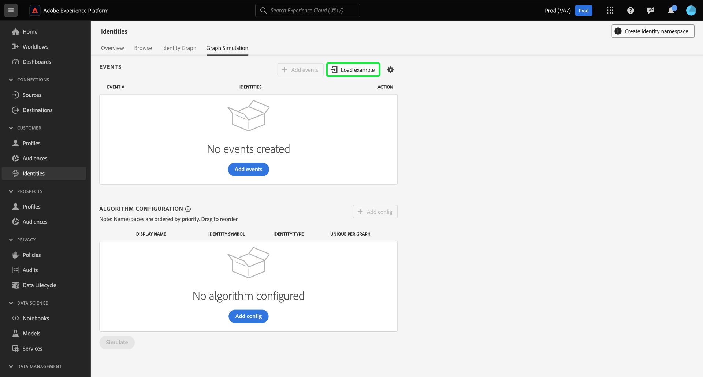
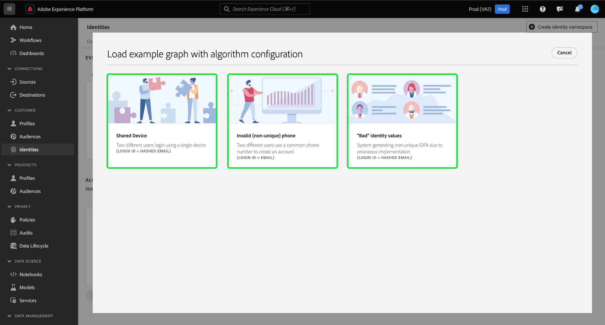

# [!DNL Graph Simulation] Guida all’interfaccia utente

[!DNL Graph Simulation] è uno strumento nell’interfaccia utente di Identity Service che può essere utilizzato per simulare il comportamento di un grafo di identità in base a una particolare combinazione di identità e a come si configura [algoritmo di ottimizzazione identità](./identity-optimization-algorithm.md).

Leggi questo documento per scoprire come utilizzare [!DNL Graph Simulation] per comprendere meglio il comportamento del grafo delle identità e come funziona l’algoritmo del grafo.

## Scopri le [!DNL Graph Simulation] Interfaccia {#interface}

Puoi accedere a [!DNL Graph Simulation] nell’interfaccia utente di Adobe Experience Platform. Seleziona **[!UICONTROL Identità]** dal menu di navigazione a sinistra, quindi seleziona **[!UICONTROL Simulazione del grafico]** dall’intestazione in alto.

Il [!DNL Graph Simulation] L’interfaccia di può essere divisa in tre sezioni:

>[!BEGINTABS]

>[!TAB Eventi]

Eventi: utilizza **[!UICONTROL Eventi]** per aggiungere identità per simulare un grafico. Un’identità completa deve avere uno spazio dei nomi dell’identità e il valore di identità corrispondente. Per simulare un grafico è necessario aggiungere almeno due identità. Puoi anche selezionare **[!UICONTROL Esempio di caricamento]** per inserire un evento preconfigurato e una configurazione dell&#39;algoritmo.

>[!TAB Configurazione dell’algoritmo]

Configurazione dell’algoritmo: utilizza **[!UICONTROL Configurazione dell’algoritmo]** per aggiungere e configurare l’algoritmo di ottimizzazione per i namespace. Puoi trascinare uno spazio dei nomi per modificarne la classificazione di priorità. Puoi anche selezionare **[!UICONTROL Univoco per grafico]** per determinare se uno spazio dei nomi è univoco.

>[!TAB Visualizzatore grafico simulato]

Visualizzatore grafico simulato: il visualizzatore grafico simulato visualizza il grafico risultante in base agli eventi aggiunti e all’algoritmo configurato. Una linea retta tra due identità significa che è stabilito un collegamento. Una riga punteggiata indica che un collegamento è stato rimosso.

>[!ENDTABS]

## Aggiungi eventi {#add-events}

Per iniziare, seleziona **[!UICONTROL Aggiungi eventi]**.

Viene visualizzata una finestra popup per [!UICONTROL #1 evento]. Da qui, inserisci la combinazione di spazio dei nomi e valore di identità. Puoi utilizzare il menu a discesa per selezionare uno spazio dei nomi delle identità. In alternativa, puoi digitare le prime lettere di uno spazio dei nomi e quindi selezionare le opzioni fornite nel menu a discesa. Dopo aver selezionato lo spazio dei nomi, fornisci un valore di identità che corrisponda allo spazio dei nomi.

>[!TIP]
>
>Il valore di identità immesso durante [!DNL Graph Simulation] Gli esercizi non devono necessariamente essere valori di identità reali e possono essere segnaposto semplici.

Una volta completata la prima identità, seleziona l’icona Aggiungi (**`+`**) per aggiungere una seconda identità.

Quindi, ripeti gli stessi passaggi e aggiungi una seconda identità. Per generare un grafo di identità sono necessarie due identità complete. Nell’esempio seguente, un ECID viene aggiunto come namespace e gli viene fornito il valore `111`. Al termine, seleziona **[!UICONTROL Salva]**.

Il [!UICONTROL Eventi] l’interfaccia viene aggiornata per visualizzare il primo evento, che in questo caso è: `{Email: tom@acme.com, ECID: 111}`.

Quindi, ripeti gli stessi passaggi per aggiungere un secondo evento. Per #2 evento, aggiungi `{Email: summer@acme.com}` come prima identità, quindi aggiungi lo stesso `{ECID: 111}` come seconda identità, creando così un secondo evento di: `{Email: summer@acme.com}, {ECID: 111}`. Al termine, dovresti disporre di due eventi, uno per `{Email: tom@acme.com, ECID: 111}` e uno per `{Email: summer@acme.com}, {ECID: 111}`.

### Carica esempio {#load-example}

Seleziona **[!UICONTROL Esempio di caricamento]** per impostare un grafico di esempio con un algoritmo predefinito e una configurazione dell’evento.

Viene visualizzata una finestra popup che fornisce gli scenari grafici disponibili tra cui è possibile scegliere:

| Grafico di esempio | Descrizione | Esempio |
| --- | --- | --- |
| Dispositivo condiviso | Per dispositivo condiviso si intendono gli scenari in cui due utenti diversi accedono allo stesso singolo dispositivo. | Un marito e una moglie condividono un iPad per la navigazione internet e l&#39;e-commerce. |
| Telefono non valido (non univoco) | Un numero di telefono non valido o non univoco si riferisce a scenari in cui due utenti diversi utilizzano lo stesso numero di telefono per creare un account. | Una madre e sua figlia utilizzano il numero di telefono della loro casa condivisa per iscriversi a qualsiasi account di e-commerce. |
| Valori di identità “non validi” | I valori di identità &quot;errati&quot; si riferiscono a scenari in cui il servizio Identity genera identificatori IDFA non univoci a causa di un’implementazione errata. | WebSDK invia erroneamente un `user_null` valore per ogni evento a causa di problemi di implementazione del codice. |

Seleziona una delle opzioni da caricare [!DNL Graph Simulation] con eventi e algoritmi preconfigurati. Puoi comunque effettuare ulteriori configurazioni per qualsiasi esempio di scenario grafico precaricato.

Al termine, seleziona **[!UICONTROL Simula]**.

### Usa versione testo {#use-text-version}

Puoi anche utilizzare la modalità testo per configurare gli eventi. Per utilizzare la modalità testo, seleziona l’icona delle impostazioni, quindi fai clic su **[!UICONTROL Testo (utenti avanzati)]**.

Puoi inserire manualmente le identità con la modalità testo. Usa due punti (`:`) per distinguere il valore di identità che corrisponde allo spazio dei nomi immesso, quindi utilizza una virgola (`,`) per separare le tue identità. Per distinguere eventi diversi tra loro, utilizza una nuova riga per ogni evento.

### Modifica evento {#edit-event}

Per modificare un evento, seleziona i puntini di sospensione (`...`) accanto a un dato evento, quindi selezionare **[!UICONTROL Modifica]**.

### Elimina evento {#delete-event}

Per eliminare un evento, seleziona i puntini di sospensione (`...`) accanto a un dato evento, quindi selezionare **[!UICONTROL Elimina]**.

## Configurare l’algoritmo {#configure-algorithm}

>[!IMPORTANT]
>
>L’algoritmo configurato determina il modo in cui Identity Service tratta gli spazi dei nomi inseriti negli eventi. Qualsiasi configurazione creata in [!DNL Graph Simulation UI] non vengono salvate nelle impostazioni di identità.

Dopo aver aggiunto gli eventi, puoi ora configurare l’algoritmo che verrà utilizzato per simulare il grafico. Per iniziare, seleziona **[!UICONTROL Aggiungi configurazione]**.

Viene visualizzata una riga di configurazione vuota. Innanzitutto, inserisci lo stesso spazio dei nomi utilizzato per gli eventi. In questo caso, inizia immettendo E-mail. Una volta inserito lo spazio dei nomi, le colonne per [!UICONTROL Simbolo di identità] e [!UICONTROL Tipo di identità] si compila automaticamente.

Quindi, ripeti gli stessi passaggi e aggiungi il secondo spazio dei nomi, che in questo caso è l’ECID. Una volta inseriti tutti i namespace, puoi iniziare a configurarne le priorità e l’univocità.

* **Priorità dello spazio dei nomi**: la priorità di uno spazio dei nomi determina la sua importanza relativa rispetto agli altri spazi dei nomi in un dato grafico delle identità. Ad esempio, se il grafo delle identità dispone di quattro spazi dei nomi diversi: ID CRM, ECID, E-mail e Apple IDFA, puoi configurare le priorità per determinare un ordine di importanza per i quattro spazi dei nomi.
* **Spazio dei nomi univoco**: se uno spazio dei nomi è designato come univoco, Identity Service genererà dei grafici avvertendo che può esistere una sola identità con uno spazio dei nomi univoco specifico. Ad esempio, se lo spazio dei nomi E-mail è designato come spazio dei nomi univoco, un grafico può avere una sola identità con E-mail. Se sono presenti più identità con lo spazio dei nomi E-mail, il collegamento meno recente verrà rimosso.

Per configurare la priorità dello spazio dei nomi, seleziona e trascina le righe dello spazio dei nomi nell’ordine di priorità desiderato, con la riga superiore che rappresenta la priorità più alta e la riga inferiore che rappresenta la priorità più bassa. Per designare uno spazio dei nomi come univoco, selezionare **[!UICONTROL Univoco per grafico]** casella di controllo.

Al termine, seleziona **[!UICONTROL Simula]**.

## Visualizza grafico simulato

Il [!UICONTROL Grafico simulato] mostra i grafici delle identità generati in base agli eventi aggiunti e all’algoritmo configurato.

| Icone del grafico | Descrizione |
| --- | --- |
| Linea continua | Una linea continua rappresenta un collegamento stabilito tra due identità. |
| Linea punteggiata | Una linea tratteggiata rappresenta un collegamento rimosso tra due identità. |
| Numero in linea | Un numero su una riga rappresenta la marca temporale di quando è stato generato quel determinato collegamento. Il numero più basso (1) rappresenta il primo collegamento stabilito. |

Nel grafico di esempio seguente, esiste una linea tratteggiata tra `{Email: tom@acme.com}` e `{ECID: 111}` per i seguenti motivi:

* L’e-mail è stata designata come univoca durante il passaggio di configurazione dell’algoritmo. Pertanto, in un grafico può esistere una sola identità con uno spazio dei nomi e-mail.
* Il collegamento tra `{Email: tom@acme.com}` e `{ECID: 111}` è stata la prima identità stabilita (#1 evento). È il collegamento più vecchio e viene quindi rimosso.

## Passaggi successivi

Una volta letto questo documento, saprai come utilizzare [!DNL Graph Simulation] strumento per comprendere meglio come vengono trattati i dati di identità in base a un particolare insieme di regole e configurazioni. Per ulteriori informazioni, leggere i seguenti documenti:

* [Regole di collegamento del grafo delle identità](overview.md)
* [Algoritmo di ottimizzazione identità](identity-optimization-algorithm.md)
* [Priorità dello spazio dei nomi](namespace-priority.md)