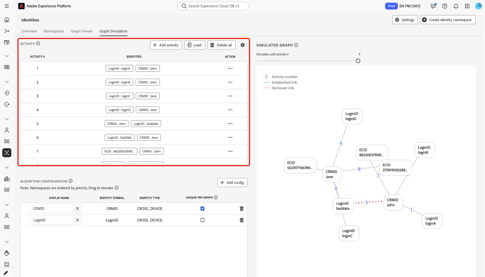
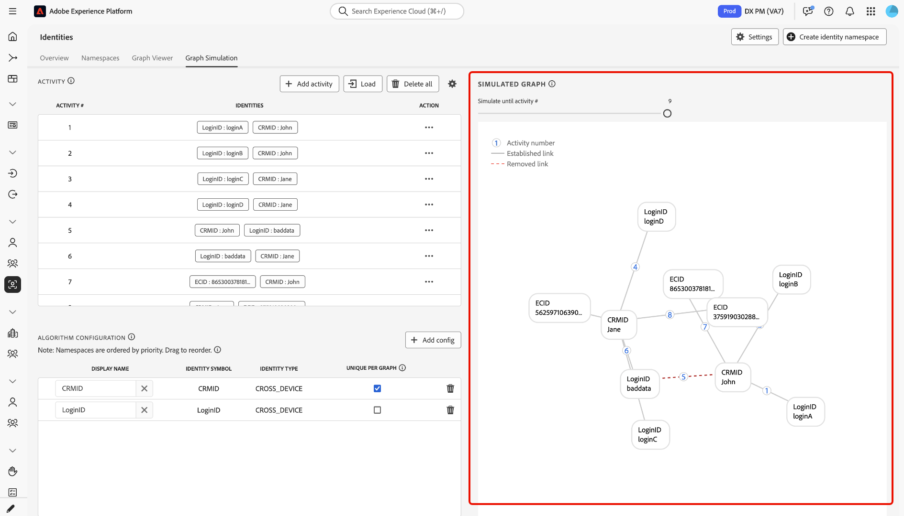
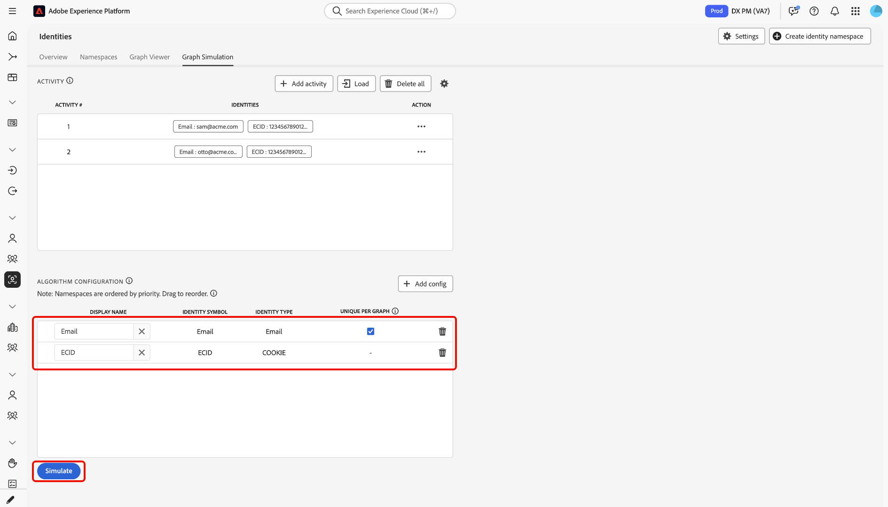
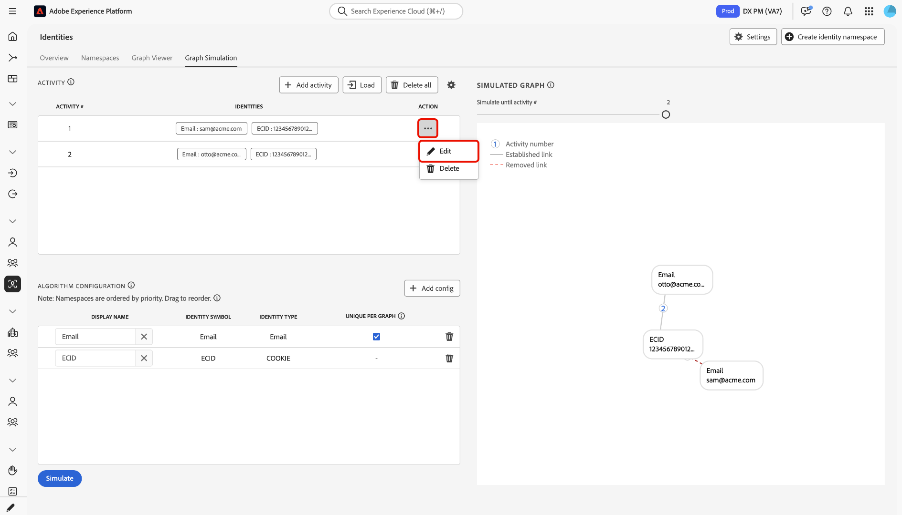
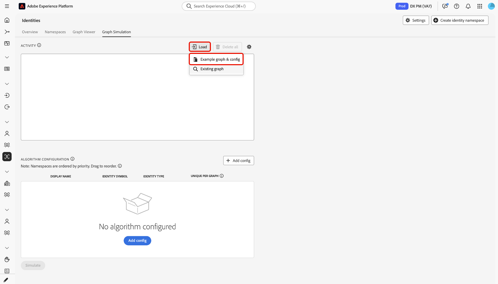
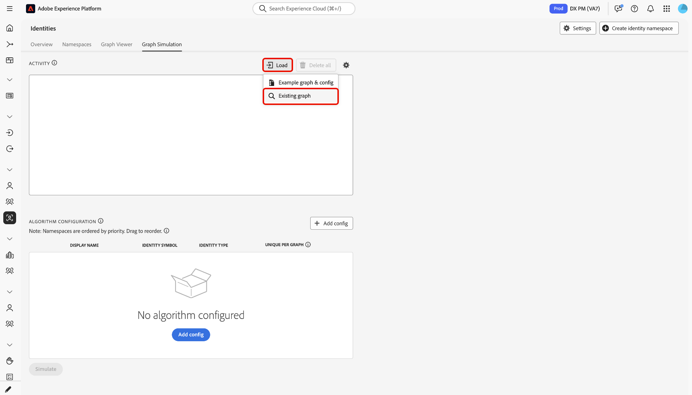

# Guida dell&#39;interfaccia utente della [!DNL Graph Simulation] {#graph-simulation}

>[!CONTEXTUALHELP]
>id="platform_identities_graphsimulation"
>title="Simulazione del grafico"
>abstract="Simula grafici per comprendere come Identity Service collega le identità e come funziona l’algoritmo di ottimizzazione delle identità."

[!DNL Graph Simulation] è uno strumento nell&#39;interfaccia utente di Identity Service che consente di simulare il comportamento di un grafo di identità in base alle identità fornite e alla configurazione dell&#39;[algoritmo di ottimizzazione delle identità](./identity-optimization-algorithm.md).

Utilizzalo per testare in modo sicuro il comportamento del grafico prima di applicare [!DNL Identity Graph Linking Rules] ai dati di produzione. Definendo gli eventi di esempio e configurando l’algoritmo di ottimizzazione delle identità, comprese le priorità dello spazio dei nomi e le impostazioni &quot;univoche per grafico&quot;, puoi vedere se le identità si fondono in un unico grafico o rimangono separate, quindi regola la configurazione in base alle esigenze. Utilizza questa funzionalità per:

* Impedisci la compressione del grafico (ad esempio, quando più persone condividono un dispositivo o un numero di telefono)
* Regolare le priorità dello spazio dei nomi (ad esempio, se e-mail o CRM_ID deve essere dominante)
* Valuta in che modo gli identificatori di bassa qualità o riutilizzati possono influenzare l’unione nell’ambiente.

Puoi anche provare le modifiche alla configurazione ed eseguire il debug dei problemi di identità che vengono visualizzati nelle applicazioni a valle. Ad esempio, se le dimensioni del pubblico o i profili uniti non sono corretti, è possibile ricreare gli eventi rilevanti in [!DNL Graph Simulation] per vedere come le regole correnti modellano il grafico e provare alternative più sicure.

Gli scenari di esempio incorporati consentono di spiegare alle parti interessate il comportamento dell’identità e i rischi di collasso del grafico e supportano l’adesione per la qualità dei dati e la governance dell’identità.

## Informazioni sull&#39;interfaccia [!DNL Graph Simulation]

Per accedere a [!DNL Graph Simulation], passa all&#39;area di lavoro del servizio Identity nell&#39;interfaccia utente di Adobe Experience Platform, quindi seleziona **[!UICONTROL Graph Simulation]**.

L’interfaccia è organizzata in tre sezioni principali:

>[!BEGINTABS]

>[!TAB Attività]

Utilizza il pannello **[!UICONTROL Activity]** per aggiungere identità per simulare un grafico. Ogni identità richiede uno spazio dei nomi e un valore. Per eseguire una simulazione, è necessario aggiungere almeno due identità. È inoltre possibile selezionare **[!UICONTROL Load]** per importare un evento e una configurazione dell&#39;algoritmo preconfigurati o per aprire un grafico esistente.

>[!TAB Configurazione algoritmo]

Utilizza il pannello **[!UICONTROL Algorithm configuration]** per aggiungere e configurare l&#39;algoritmo di ottimizzazione per gli spazi dei nomi. Trascina le righe dello spazio dei nomi per modificare l’ordine di priorità. È inoltre possibile selezionare **[!UICONTROL Unique Per Graph]** per contrassegnare se uno spazio dei nomi deve essere univoco all&#39;interno del grafico.

>[!TAB Grafico simulato]

Utilizza la visualizzazione **[!UICONTROL Simulated graph]** per rivedere il grafico prodotto dalle attività e dalle impostazioni dell&#39;algoritmo. Una linea continua tra due identità indica che il collegamento è mantenuto; una linea tratteggiata indica che l&#39;algoritmo ha rimosso il collegamento.

>[!ENDTABS]

## [!DNL Graph Simulation] flusso di lavoro

### Aggiungere attività

Per iniziare a simulare i grafici di identità, selezionare **[!UICONTROL Add Activity]**.

Quando viene visualizzata la finestra popup per [!UICONTROL Activity #1], scegliere uno spazio dei nomi identità e immettere il relativo valore. Puoi scegliere uno spazio dei nomi dal menu a discesa o digitare alcune lettere per filtrare l’elenco. Dopo aver selezionato uno spazio dei nomi, inserisci il valore di identità corrispondente.

>[!TIP]
>
>Non è necessario utilizzare valori di identità reali quando si utilizza [!DNL Graph Simulation].

L&#39;interfaccia di [!UICONTROL Activity] viene aggiornata per mostrare la prima attività.

Seleziona nuovamente **[!UICONTROL Add Activity]** e completa una seconda attività. Per generare un grafico sono necessarie almeno due identità complete (spazio dei nomi più valore).

### Configurare l’algoritmo

>[!IMPORTANT]
>
>L’algoritmo configurato controlla il modo in cui Identity Service tratta gli spazi dei nomi nelle attività. Nessun elemento configurato in [!DNL Graph Simulation UI] viene salvato nelle impostazioni di identità di Identity Service.

Dopo aver impostato le attività, configura l’algoritmo per la simulazione. Seleziona **[!UICONTROL Add config]**.

Aggiungi ogni spazio dei nomi che desideri che l’algoritmo consideri. Utilizza il menu a discesa per cercare o digita le prime lettere per restringere l’elenco.

* **Priorità dello spazio dei nomi**: è possibile controllare l&#39;ordine di importanza di ogni spazio dei nomi all&#39;interno del grafico delle identità. Ad esempio, se il grafico utilizza CRMID, ECID, E-mail e Apple IDFA, puoi impostare la loro priorità in modo che rifletta quale deve essere considerato prima quando si collegano le identità. Lo spazio dei nomi nella parte superiore dell’elenco avrà la priorità più alta.
* **Spazio dei nomi univoco**: quando uno spazio dei nomi è contrassegnato come univoco, Identity Service assicura che in un grafico venga visualizzata una sola identità con tale spazio dei nomi. Ad esempio, se E-mail è impostata come univoca, ogni grafico conterrà una sola identità e-mail. Se sono presenti più identità con la stessa e-mail, la connessione più vecchia verrà rimossa per mantenere l’univocità.

Trascina le righe dello spazio dei nomi nell’ordine di priorità: la riga superiore corrisponde alla priorità più alta e quella inferiore alla priorità più bassa. Per trattare uno spazio dei nomi come univoco all&#39;interno del grafico, selezionare la relativa casella di controllo **[!UICONTROL Unique Per Graph]**.

Quando sei pronto, seleziona **[!UICONTROL Simulate]**.

### Visualizza grafico simulato

La sezione [!UICONTROL Simulated Graph] mostra il grafico o i grafici prodotti dalle attività e dalla configurazione dell&#39;algoritmo.

| Icone del grafico | Descrizione |
| --- | --- |
| Linea continua | Una linea continua rappresenta un collegamento stabilito tra due identità. |
| Linea punteggiata | Una linea tratteggiata rappresenta un collegamento rimosso tra due identità. |
| Numero in linea | Un numero su una riga indica quando il collegamento è stato formato rispetto agli altri. Il numero più basso (1) è il collegamento meno recente. |

## Funzioni aggiuntive

Puoi anche modificare o eliminare attività, inserire attività in modalità testo, caricare uno scenario di esempio o inserire un grafico esistente da Identity Service.

### Modifica attività {#edit-activity}

Per modificare un&#39;attività, selezionare i puntini di sospensione (`...`) accanto a una determinata attività, quindi selezionare **[!UICONTROL Edit]**.

### Elimina attività {#delete-activity}

Per eliminare un&#39;attività, selezionare i puntini di sospensione (`...`) accanto a una determinata attività, quindi selezionare **[!UICONTROL Delete]**.

### Usa modalità testo {#use-text-mode}

Puoi utilizzare la modalità testo per configurare le attività. Per utilizzare la modalità testo, selezionare l&#39;icona delle impostazioni, quindi selezionare **[!UICONTROL Text (Advanced users)]**.

In modalità testo, digitare ogni identità come `namespace:value`. Separa più identità nello stesso evento con una virgola (`,`). Inizia una nuova riga per ogni evento.

### Carica esempio {#load-example}

Selezionare **[!UICONTROL Load example]** per caricare un grafico preconfigurato con attività preimpostate e impostazioni algoritmo.

Una finestra di dialogo elenca gli scenari che è possibile aprire:

| Grafico di esempio | Descrizione | Esempio |
| --- | --- | --- |
| Dispositivo condiviso | Due utenti diversi accedono allo stesso dispositivo. | Un marito e una moglie condividono un iPad per la navigazione e l&#39;e-commerce. |
| Telefono non valido (non univoco) | Due utenti diversi si registrano con lo stesso numero di telefono. | Una madre e una figlia utilizzano un numero di telefono di casa condiviso per iscriversi ad account di e-commerce. |
| Valori di identità “non validi” | Gli errori di implementazione inviano ID duplicati o segnaposto (ad esempio, lo stesso IDFA per molti utenti). | Web SDK invia un valore `user_null` a ogni attività a causa di un difetto di codice. |

Scegliere uno scenario per caricare [!DNL Graph Simulation] con attività e impostazioni dell&#39;algoritmo corrispondenti. Puoi modificare il risultato come qualsiasi altra simulazione.

### Carica grafico esistente {#load-existing-graph}

È possibile utilizzare [!DNL Graph Simulation] per caricare un grafico esistente e visualizzarne le attività, la configurazione dell&#39;algoritmo e il grafico.

Selezionare **[!UICONTROL Load]** e quindi **[!UICONTROL Existing graph]**.

Nella finestra di dialogo, immetti uno spazio dei nomi e un valore di identità che appartengono al grafico da esaminare.

Quando il caricamento ha esito positivo, [!DNL Graph Simulation] mostra il grafico che contiene tale identità.

>[!TIP]
>
>Dopo aver configurato le impostazioni nella prima schermata [Impostazioni identità](./identity-settings-ui.md), puoi utilizzare l&#39;opzione **carica grafici esistenti** per simulare il grafico in base a tali impostazioni. La simulazione utilizzerà la configurazione definita.

## Passaggi successivi

È possibile utilizzare [!DNL Graph Simulation] per vedere come Identity Service collega le identità in base a regole diverse prima di modificare le impostazioni di produzione. Per informazioni più approfondite, consulta la seguente documentazione:

* [Panoramica di [!DNL Identity Graph Linking Rules]](./overview.md)
* [Algoritmo di ottimizzazione delle identità](./identity-optimization-algorithm.md)
* [Guida all’implementazione](./implementation-guide.md)
* [Risoluzione dei problemi e domande frequenti](./troubleshooting.md)
* [Esempi di configurazioni del grafico](./example-configurations.md)
* [Priorità dello spazio dei nomi](./namespace-priority.md)
* [Interfaccia utente per le impostazioni delle identità](./identity-settings-ui.md)
