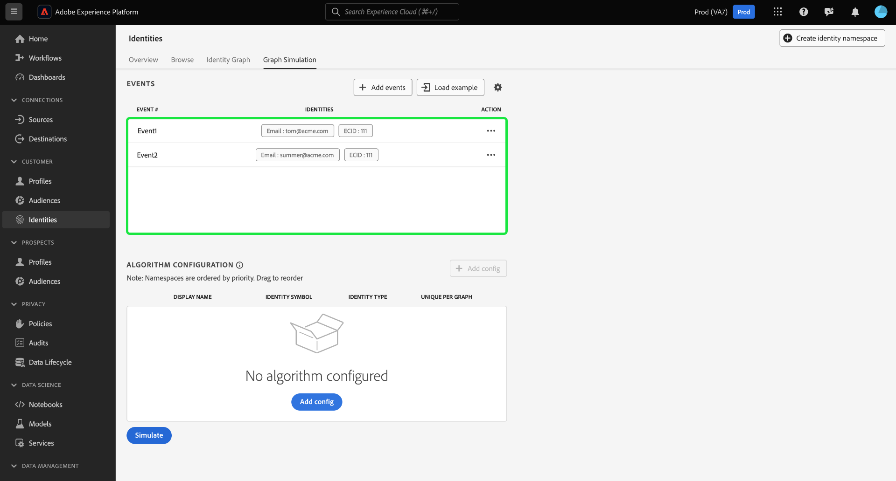

# Guida dell&#39;interfaccia utente di [!DNL Graph Simulation]

>[!AVAILABILITY]
>
>Le regole di collegamento del grafo delle identità sono attualmente in versione beta. Contatta il team del tuo account di Adobe per informazioni sui criteri di partecipazione. La funzione e la documentazione sono soggette a modifiche.

[!DNL Graph Simulation] è uno strumento nell&#39;interfaccia utente di Identity Service che consente di simulare il comportamento di un grafo delle identità in base a una combinazione specifica di identità e alla configurazione dell&#39;[algoritmo di ottimizzazione delle identità](./identity-optimization-algorithm.md).

Leggi questo documento per scoprire come utilizzare [!DNL Graph Simulation] per comprendere meglio il comportamento del grafo delle identità e il funzionamento dell&#39;algoritmo del grafo.

## Scopri l&#39;interfaccia [!DNL Graph Simulation] {#interface}

Puoi accedere a [!DNL Graph Simulation] nell&#39;interfaccia utente di Adobe Experience Platform. Seleziona **[!UICONTROL Identità]** dal menu di navigazione a sinistra, quindi seleziona **[!UICONTROL Simulazione grafico]** dall&#39;intestazione superiore.

L&#39;interfaccia [!DNL Graph Simulation] può essere divisa in tre sezioni:

>[!BEGINTABS]

>[!TAB Eventi]

Eventi: utilizza il pannello **[!UICONTROL Eventi]** per aggiungere identità per simulare un grafico. Un’identità completa deve avere uno spazio dei nomi dell’identità e il valore di identità corrispondente. Per simulare un grafico è necessario aggiungere almeno due identità. Puoi anche selezionare **[!UICONTROL Carica esempio]** per inserire un evento e una configurazione dell&#39;algoritmo preconfigurati.

>[!TAB Configurazione algoritmo]

Configurazione dell&#39;algoritmo: utilizza il pannello **[!UICONTROL Configurazione dell&#39;algoritmo]** per aggiungere e configurare l&#39;algoritmo di ottimizzazione per gli spazi dei nomi. Puoi trascinare uno spazio dei nomi per modificarne la classificazione di priorità. È inoltre possibile selezionare **[!UICONTROL Univoco per grafico]** per determinare se uno spazio dei nomi è univoco.

>[!TAB Visualizzatore grafico simulato]

Visualizzatore grafico simulato: il visualizzatore grafico simulato visualizza il grafico risultante in base agli eventi aggiunti e all’algoritmo configurato. Una linea retta tra due identità significa che è stabilito un collegamento. Una riga punteggiata indica che un collegamento è stato rimosso.

>[!ENDTABS]

## Aggiungi eventi {#add-events}

Per iniziare, selezionare **[!UICONTROL Aggiungi eventi]**.

Viene visualizzata una finestra popup per [!UICONTROL Evento #1]. Da qui, inserisci la combinazione di spazio dei nomi e valore di identità. Puoi utilizzare il menu a discesa per selezionare uno spazio dei nomi delle identità. In alternativa, puoi digitare le prime lettere di uno spazio dei nomi e quindi selezionare le opzioni fornite nel menu a discesa. Dopo aver selezionato lo spazio dei nomi, fornisci un valore di identità che corrisponda allo spazio dei nomi.

>[!TIP]
>
>Il valore di identità immesso durante gli esercizi [!DNL Graph Simulation] non deve necessariamente essere un valore di identità reale e può essere un semplice segnaposto.

Una volta completata la prima identità, selezionare l&#39;icona di aggiunta (**`+`**) per aggiungere una seconda identità.

Quindi, ripeti gli stessi passaggi e aggiungi una seconda identità. Per generare un grafo di identità sono necessarie due identità complete. Nell&#39;esempio seguente, un ECID viene aggiunto come spazio dei nomi e gli viene fornito un valore di `111`. Al termine, selezionare **[!UICONTROL Salva]**.

L&#39;interfaccia [!UICONTROL Events] viene aggiornata per visualizzare il primo evento, che in questo caso è: `{Email: tom@acme.com, ECID: 111}`.

Quindi, ripeti gli stessi passaggi per aggiungere un secondo evento. Per #2 evento, aggiungere `{Email: summer@acme.com}` come prima identità, quindi aggiungere lo stesso `{ECID: 111}` come seconda identità, creando un secondo evento di: `{Email: summer@acme.com}, {ECID: 111}`. Al termine, si dovrebbero avere due eventi, uno per `{Email: tom@acme.com, ECID: 111}` e uno per `{Email: summer@acme.com}, {ECID: 111}`.

### Carica esempio {#load-example}

Seleziona **[!UICONTROL Carica esempio]** per impostare un grafico di esempio con un algoritmo predefinito e una configurazione dell&#39;evento.

Viene visualizzata una finestra popup che fornisce gli scenari grafici disponibili tra cui è possibile scegliere:

| Grafico di esempio | Descrizione | Esempio |
| --- | --- | --- |
| Dispositivo condiviso | Per dispositivo condiviso si intendono gli scenari in cui due utenti diversi accedono allo stesso singolo dispositivo. | Un marito e una moglie condividono un iPad per la navigazione internet e l&#39;e-commerce. |
| Telefono non valido (non univoco) | Un numero di telefono non valido o non univoco si riferisce a scenari in cui due utenti diversi utilizzano lo stesso numero di telefono per creare un account. | Una madre e sua figlia utilizzano il numero di telefono della loro casa condivisa per iscriversi a qualsiasi account di e-commerce. |
| Valori di identità “non validi” | I valori di identità &quot;errati&quot; si riferiscono a scenari in cui il servizio Identity genera identificatori IDFA non univoci a causa di un’implementazione errata. | WebSDK invia erroneamente un valore `user_null` per ogni evento a causa di problemi di implementazione del codice. |

Selezionare una delle opzioni per caricare [!DNL Graph Simulation] con eventi e algoritmi preconfigurati. Puoi comunque effettuare ulteriori configurazioni per qualsiasi esempio di scenario grafico precaricato.

Al termine, selezionare **[!UICONTROL Simula]**.

### Usa versione testo {#use-text-version}

Puoi anche utilizzare la modalità testo per configurare gli eventi. Per utilizzare la modalità testo, selezionare l&#39;icona delle impostazioni, quindi selezionare **[!UICONTROL Testo (utenti avanzati)]**.

Puoi inserire manualmente le identità con la modalità testo. Utilizzare i due punti (`:`) per distinguere il valore di identità corrispondente allo spazio dei nomi immesso, quindi utilizzare una virgola (`,`) per separare le identità. Per distinguere eventi diversi tra loro, utilizza una nuova riga per ogni evento.

### Modifica evento {#edit-event}

Per modificare un evento, selezionare i puntini di sospensione (`...`) accanto a un determinato evento, quindi selezionare **[!UICONTROL Modifica]**.

### Elimina evento {#delete-event}

Per eliminare un evento, selezionare i puntini di sospensione (`...`) accanto a un determinato evento, quindi selezionare **[!UICONTROL Elimina]**.

## Configurare l’algoritmo {#configure-algorithm}

>[!IMPORTANT]
>
>L’algoritmo configurato determina il modo in cui Identity Service tratta gli spazi dei nomi inseriti negli eventi. Qualsiasi configurazione creata in [!DNL Graph Simulation UI] non viene salvata nelle impostazioni di identità.

Dopo aver aggiunto gli eventi, puoi ora configurare l’algoritmo che verrà utilizzato per simulare il grafico. Per iniziare, selezionare **[!UICONTROL Aggiungi configurazione]**.

Viene visualizzata una riga di configurazione vuota. Innanzitutto, inserisci lo stesso spazio dei nomi utilizzato per gli eventi. In questo caso, inizia immettendo E-mail. Dopo aver immesso lo spazio dei nomi, le colonne per [!UICONTROL Identity Symbol] e [!UICONTROL Identity Type] vengono compilate automaticamente.

Quindi, ripeti gli stessi passaggi e aggiungi il secondo spazio dei nomi, che in questo caso è l’ECID. Una volta inseriti tutti i namespace, puoi iniziare a configurarne le priorità e l’univocità.

* **Priorità dello spazio dei nomi**: la priorità di uno spazio dei nomi ne determina l&#39;importanza relativa rispetto agli altri spazi dei nomi in un dato grafico delle identità. Ad esempio, se il grafo delle identità dispone di quattro spazi dei nomi diversi: CRMID, ECID, E-mail e Apple IDFA, puoi configurare le priorità per determinare un ordine di importanza per i quattro spazi dei nomi.
* **Spazio dei nomi univoco**: se uno spazio dei nomi è designato come univoco, Identity Service genererà dei grafici avvertendo che può esistere una sola identità con uno spazio dei nomi univoco specifico. Ad esempio, se lo spazio dei nomi E-mail è designato come spazio dei nomi univoco, un grafico può avere una sola identità con E-mail. Se sono presenti più identità con lo spazio dei nomi E-mail, il collegamento meno recente verrà rimosso.

Per configurare la priorità dello spazio dei nomi, seleziona e trascina le righe dello spazio dei nomi nell’ordine di priorità desiderato, con la riga superiore che rappresenta la priorità più alta e la riga inferiore che rappresenta la priorità più bassa. Per designare uno spazio dei nomi come univoco, selezionare la casella di controllo **[!UICONTROL Univoco per grafico]**.

Al termine, selezionare **[!UICONTROL Simula]**.

## Visualizza grafico simulato

La sezione [!UICONTROL Grafico simulato] visualizza i grafici delle identità generati in base agli eventi aggiunti e all&#39;algoritmo configurato.

| Icone del grafico | Descrizione |
| --- | --- |
| Linea continua | Una linea continua rappresenta un collegamento stabilito tra due identità. |
| Linea punteggiata | Una linea tratteggiata rappresenta un collegamento rimosso tra due identità. |
| Numero in linea | Un numero su una riga rappresenta la marca temporale di quando è stato generato quel determinato collegamento. Il numero più basso (1) rappresenta il primo collegamento stabilito. |

Nel grafico di esempio seguente, esiste una linea tratteggiata tra `{Email: tom@acme.com}` e `{ECID: 111}` per i motivi seguenti:

* L’e-mail è stata designata come univoca durante il passaggio di configurazione dell’algoritmo. Pertanto, in un grafico può esistere una sola identità con uno spazio dei nomi e-mail.
* Il collegamento tra `{Email: tom@acme.com}` e `{ECID: 111}` è stata la prima identità stabilita (#1 evento). È il collegamento più vecchio e viene quindi rimosso.

## Passaggi successivi

Dopo aver letto questo documento, saprai come utilizzare lo strumento [!DNL Graph Simulation] per comprendere meglio come vengono trattati i dati di identità in base a un particolare set di regole e configurazioni. Per ulteriori informazioni, leggere i seguenti documenti:

* [Regole di collegamento del grafo delle identità](./overview.md)
* [Guida alla configurazione](./configuration.md)
* [Algoritmo di ottimizzazione identità](./identity-optimization-algorithm.md)
* [Priorità dello spazio dei nomi](./namespace-priority.md)
* [Esempio di configurazioni del grafico](./example-configurations.md)
