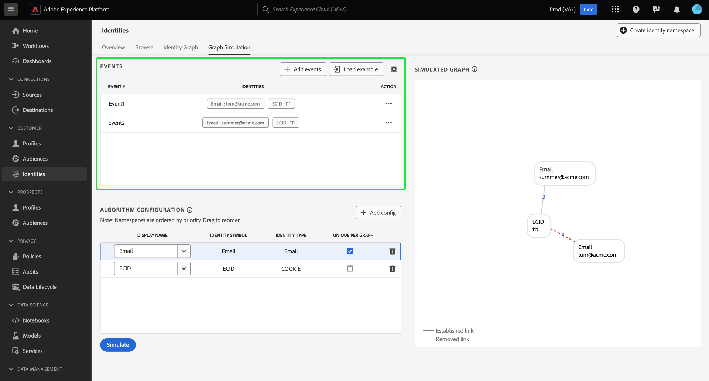

# Simulazione grafico

La simulazione dei grafici è uno strumento dell’interfaccia utente di Identity Service che consente di simulare il comportamento di un grafico delle identità in base a una particolare combinazione di identità e alla configurazione [algoritmo di ottimizzazione identità](./identity-optimization-algorithm.md).

Leggi questo documento per scoprire come utilizzare Simulazione grafico per comprendere meglio il comportamento del grafo delle identità e il funzionamento dell’algoritmo del grafo.

## Scopri l’interfaccia di Graph Simulation

Puoi accedere a Simulazione grafico nell’interfaccia utente di Adobe Experience Platform. Seleziona **[!UICONTROL Identità]** dal menu di navigazione a sinistra, quindi seleziona **[!UICONTROL Simulazione del grafico]** dall’intestazione in alto.

L’interfaccia di Simulazione grafico può essere divisa in tre sezioni:

* Eventi: utilizza **[!UICONTROL Eventi]** per aggiungere identità per simulare un grafico. Un’identità completa deve avere uno spazio dei nomi dell’identità e il valore di identità corrispondente. Per simulare un grafico è necessario aggiungere almeno due identità. Puoi anche selezionare **[!UICONTROL Esempio di caricamento]** per inserire un evento preconfigurato e una configurazione dell&#39;algoritmo.

* Configurazione algoritmo: utilizza **[!UICONTROL Configurazione algoritmo]** per aggiungere e configurare l’algoritmo di ottimizzazione per i namespace. Puoi trascinare uno spazio dei nomi per modificarne la classificazione di priorità. Puoi anche selezionare **[!UICONTROL Univoco per grafico]** per determinare se uno spazio dei nomi è univoco.

* Visualizzatore grafico simulato: il visualizzatore grafico simulato visualizza il grafico risultante in base agli eventi aggiunti e all’algoritmo configurato. Una linea retta tra due nodi indica che viene stabilito un collegamento. Una riga punteggiata indica che un collegamento è stato rimosso.

## Aggiungi eventi

Per iniziare, seleziona **[!UICONTROL Aggiungi eventi]**.

Viene visualizzata una finestra popup per [!UICONTROL #1 evento]. Da qui, inserisci la combinazione di spazio dei nomi e valore di identità. Puoi utilizzare il menu a discesa per selezionare uno spazio dei nomi delle identità. In alternativa, puoi digitare le prime lettere di uno spazio dei nomi e quindi selezionare le opzioni fornite nel menu a discesa. Dopo aver selezionato lo spazio dei nomi, fornisci un valore di identità che corrisponda allo spazio dei nomi.

>[!TIP]
>
>Il valore di identità immesso durante gli esercizi di simulazione del grafico non deve necessariamente essere un valore di identità reale e può essere un semplice segnaposto.

Una volta completata la prima identità, seleziona l’icona Aggiungi (**`+`**) per aggiungere una seconda identità.

Quindi, ripeti gli stessi passaggi e aggiungi una seconda identità. Per generare un grafo di identità sono necessarie due identità complete. Nell’esempio seguente, un ECID viene aggiunto come namespace e gli viene fornito il valore `111`. Al termine, seleziona **[!UICONTROL Salva]**.

Il [!UICONTROL Eventi] l’interfaccia viene aggiornata per visualizzare il primo evento, che in questo caso è: `{Email: tom@acme.com, ECID: 111}`.

Quindi, ripeti gli stessi passaggi per aggiungere un secondo evento. Per #2 evento, aggiungi `{Email: summer@acme.com}` come prima identità, quindi aggiungi lo stesso `{ECID: 111}` come seconda identità, creando così un secondo evento di: `{Email: summer@acme.com}, {ECID: 111}`. Al termine, dovresti disporre di due eventi, uno per `{Email: tom@acme.com, ECID: 111}` e uno per `{Email: summer@acme.com}, {ECID: 111}`.

### Carica esempio

+++Seleziona per visualizzare i passaggi su come utilizzare gli esempi di grafico precaricati

Per impostare un grafico di esempio con un algoritmo preconfigurato, seleziona **[!UICONTROL Esempio di caricamento]**. Viene visualizzata una finestra popup che fornisce gli scenari grafici disponibili tra cui è possibile scegliere:

| Grafico di esempio | Descrizione | Esempio |
| --- | --- | --- |
| Dispositivo condiviso | Per dispositivo condiviso si intendono gli scenari in cui due utenti diversi accedono allo stesso singolo dispositivo. | Un marito e una moglie condividono un iPad per la navigazione internet e l&#39;e-commerce. |
| Telefono non valido (non univoco) | Un numero di telefono non valido o non univoco si riferisce a scenari in cui due utenti diversi utilizzano lo stesso numero di telefono per creare un account. | Una madre e sua figlia utilizzano il numero di telefono della loro casa condivisa per iscriversi a qualsiasi account di e-commerce. |
| Valori di identità “non validi” | I valori di identità &quot;errati&quot; si riferiscono a scenari in cui il servizio Identity genera identificatori IDFA non univoci a causa di un’implementazione errata. | WebSDK invia erroneamente un `user_null` valore per ogni evento a causa di problemi di implementazione del codice. |

Selezionate una delle opzioni per caricare Simulazione grafico con eventi e algoritmi preconfigurati. Puoi comunque effettuare ulteriori configurazioni per qualsiasi esempio di scenario grafico precaricato.

Al termine, seleziona **[!UICONTROL Simula]**.

+++

### Usa versione testo

+++Seleziona per visualizzare i passaggi su come utilizzare la versione del testo

Puoi anche utilizzare la modalità testo per configurare gli eventi. Per utilizzare la modalità testo, seleziona l’ingranaggio (?) , quindi selezionare **[!UICONTROL Testo (utenti avanzati)]**.

Puoi inserire manualmente le identità con la modalità testo. Usa due punti (`:`) per distinguere il valore di identità che corrisponde allo spazio dei nomi immesso, quindi utilizza una virgola (`,`) per separare le tue identità. Per distinguere eventi diversi tra loro, utilizza una nuova riga per ogni evento.

+++

### Modifica evento

Per modificare un evento, seleziona i puntini di sospensione (`...`) accanto a un dato evento, quindi selezionare **[!UICONTROL Modifica]**.

### Elimina evento

Per eliminare un evento, seleziona i puntini di sospensione (`...`) accanto a un dato evento, quindi selezionare **[!UICONTROL Elimina]**.

## Configurare l’algoritmo

L’algoritmo configurato determinerà il modo in cui Identity Service tratta gli spazi dei nomi inseriti negli eventi. Le configurazioni create nell’interfaccia utente di Simulazione grafico non vengono salvate nelle impostazioni di identità.

Per iniziare, seleziona Aggiungi (`+`) nell’angolo inferiore del pannello di configurazione dell’algoritmo.

Viene visualizzata una riga di configurazione vuota. Innanzitutto, inserisci lo stesso spazio dei nomi utilizzato per gli eventi. In questo caso, inizia immettendo l’ID del sistema di gestione delle relazioni con i clienti. Una volta inserito lo spazio dei nomi, le colonne per [!UICONTROL Simbolo di identità] e [!UICONTROL Tipo di identità] si compila automaticamente.

Quindi, ripeti gli stessi passaggi e aggiungi il secondo spazio dei nomi, che in questo caso è l’ECID. Una volta inseriti tutti i namespace, puoi iniziare a configurarne le priorità e l’univocità.

* **Priorità dello spazio dei nomi**: la priorità di uno spazio dei nomi determina la sua importanza relativa rispetto agli altri spazi dei nomi in un dato grafico delle identità. Ad esempio, se il grafo delle identità dispone di quattro spazi dei nomi diversi: ID CRM, ECID, E-mail e Apple IDFA, puoi configurare le priorità per determinare un ordine di importanza per i quattro spazi dei nomi. (AGGIUNGI PERCHÉ)
* **Spazio dei nomi univoco**: se uno spazio dei nomi è designato come univoco, Identity Service genererà dei grafici avvertendo che può esistere una sola identità con uno spazio dei nomi univoco specifico. Ad esempio, se l’ID del sistema di gestione delle relazioni con i clienti è designato come spazio dei nomi univoco, un grafico può avere una sola identità con l’ID del sistema di gestione delle relazioni con i clienti. Se esistono più identità con lo spazio dei nomi ID del sistema di gestione delle relazioni con i clienti, il collegamento meno recente verrà rimosso.

Per configurare la priorità dello spazio dei nomi, seleziona e trascina le righe dello spazio dei nomi nell’ordine di priorità desiderato, con la riga superiore che rappresenta la priorità più alta e la riga inferiore che rappresenta la priorità più bassa. Per designare uno spazio dei nomi come univoco, selezionare **[!UICONTROL Univoco per grafico]** casella di controllo.

Al termine, seleziona **[!UICONTROL Simula]**.

## Visualizza grafico simulato

Il [!UICONTROL Grafico simulato] mostra i grafici delle identità generati in base agli eventi aggiunti e all’algoritmo configurato.

| Icone del grafico | Descrizione |
| --- | --- |
| Linea continua | Una linea continua rappresenta un collegamento stabilito tra due identità. |
| Linea punteggiata | Una linea tratteggiata rappresenta un collegamento rimosso tra due identità. |
| Numero in linea | Un numero su una riga rappresenta la marca temporale di quando è stato generato quel determinato collegamento. Il numero più basso (1) rappresenta il primo collegamento stabilito. |

Nel grafico di esempio seguente, esiste una linea tratteggiata tra `{CRM ID: Tom}` e `{ECID: 111}` per i seguenti motivi:

* L’ID del sistema di gestione delle relazioni con i clienti è stato designato come univoco durante il passaggio di configurazione dell’algoritmo. Pertanto, in un grafico può esistere una sola identità con un ID CRM spazio dei nomi.
* Il collegamento tra `{CRM ID: Tom}` e `{ECID: 111}` è stata la prima identità stabilita (#1 evento). È il collegamento più vecchio e viene quindi rimosso.

## Esempi di scenari di grafico

>[!NOTE]
>
>&quot;ID CRM&quot; è uno spazio dei nomi personalizzato. Pertanto, gli esempi seguenti richiedono di creare uno spazio dei nomi personalizzato con un nome visualizzato e un simbolo di identità di &quot;CRM ID&quot;.

Nella sezione seguente sono riportati alcuni esempi di scenari grafici che è possibile incontrare con Simulazione grafico.

### Solo ID CRM

Eventi:

* ID CRM: Tom, ECID: 111

Configurazione algoritmo:

| Priorità | Nome visualizzato | Simbolo di identità | Tipo di identità | Univoco per grafico |
| ---| --- | --- | --- | --- |
| 1 | ID CRM | ID CRM | CROSS_DEVICE | Sì |
| 2 | ECID | ECID | COOKIE | NO |

+++Seleziona per visualizzare il grafico simulato

+++

### ID CRM con e-mail con hash

In questo scenario, viene acquisito un ID del sistema di gestione delle relazioni con i clienti che rappresenta sia i dati online (evento esperienza) sia quelli offline (record profilo). Questo scenario comporta anche l’acquisizione di un’e-mail con hash, che rappresenta un altro spazio dei nomi inviato nel set di dati del record di gestione delle relazioni con i clienti insieme all’ID del sistema di gestione delle relazioni con i clienti.

Eventi:

* ID CRM: Tom, Email_LC_SHA256: tom@acme.com
* ID CRM: Tom, ECID: 111
* CRM ID: Summer, Email_LC_SHA256: summer@acme.com
* CRM ID: Summer, ECID: 222

Configurazione algoritmo:

| Priorità | Nome visualizzato | Simbolo di identità | Tipo di identità | Univoco per grafico |
| ---| --- | --- | --- | --- |
| 1 | ID CRM | ID CRM | CROSS_DEVICE | Sì |
| 2 | E-mail (SHA256, in minuscolo) | Email_LC_SHA256 | E-mail | NO |
| 3 | ECID | ECID | COOKIE | NO |

+++Seleziona per visualizzare il grafico simulato

+++

### ID CRM con e-mail con hash, telefono con hash, GAID e IDFA

Eventi:

* ID CRM: Tom, Email_LC_SHA256: aabbcc, Phone_SHA256: 123-4567
* ID CRM: Tom, ECID: 111
* ID CRM: Tom, ECID: 222, IDFA: A-A-A
* ID CRM: Summer, Email_LC_SHA256: ddeeff, Phone_SHA256: 765-4321
* CRM ID: Summer, ECID: 333
* ID CRM: Summer, ECID: 444, GAID:B-B-B

Configurazione algoritmo:

| Priorità | Nome visualizzato | Simbolo di identità | Tipo di identità | Univoco per grafico |
| ---| --- | --- | --- | --- |
| 1 | ID CRM | ID CRM | CROSS_DEVICE | Sì |
| 2 | E-mail (SHA256, in minuscolo) | Email_LC_SHA256 | E-mail | NO |
| 3 | Telefono (SHA256) | Telefono_SHA256 | Telefono | NO |
| 4 | Google Ad ID (GAID) | GAID | DISPOSITIVO | NO |
| 5 | Apple IDFA (ID per Apple) | IDFA | DISPOSITIVO | NO |
| 6 | ECID | ECID | COOKIE | NO |

+++Seleziona per visualizzare il grafico simulato

+++