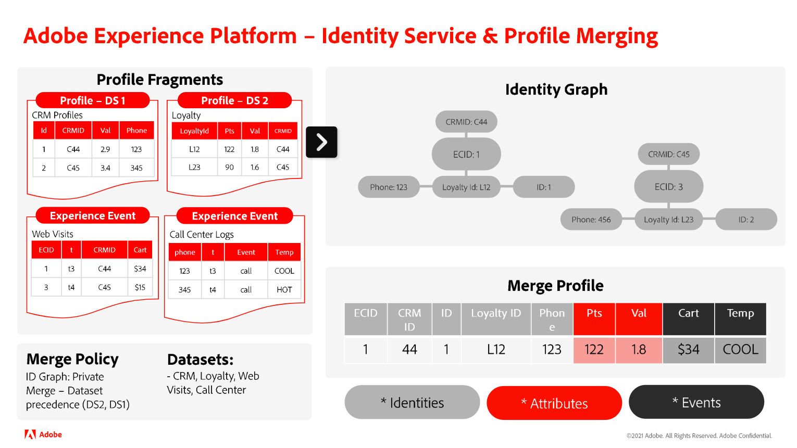

# Informazioni sulla relazione tra il servizio Identity e Real-Time Customer Profile

>[!IMPORTANT]
>
>Questa pagina presuppone che il criterio di unione utilizzi il grafo delle identità. Per ulteriori informazioni sui criteri di unione in Real-Time Customer Profile, consulta la documentazione su [criteri di unione e unione di identità].

Anche se è possibile utilizzare in tandem Identity Service e Real-Time Customer Profile, le due funzioni di Adobe Experience Platform non sono intrinsecamente le stesse.

* Puoi utilizzare il servizio Identity per generare e gestire il grafico delle identità che riunisce le diverse identità di un singolo cliente.
* Puoi utilizzare Real-Time Customer Profile per unire diversi frammenti di profilo e creare un profilo unito. Questo processo richiede l’utilizzo del grafo delle identità.

Questo documento illustra le somiglianze, le differenze e la relazione tra il servizio Identity e Real-Time Customer Profile.

## Servizio Identity e Profilo cliente in tempo reale

Le differenze principali tra Identity Service e Real-Time Customer Profile sono le seguenti:

| | Identity Service | Profilo cliente in tempo reale |
| --- | --- |--- |
| **Finalità** | <ul><li>Puoi utilizzare il servizio Identity per creare e gestire i grafici delle identità.</li></ul> | Puoi utilizzare Real-Time Customer Profile per: <ul><li>Creare una visualizzazione a 360 gradi di un profilo cliente.</li><li>Visualizzare e gestire i profili</li><li>Profili di segmento per creare tipi di pubblico.</li></ul> |
| **Input** | <ul><li>Per utilizzare il servizio Identity, è necessario acquisire i dati dei record o gli eventi di serie temporali contenenti almeno due campi contrassegnati come identità. I campi contrassegnati come identità vengono quindi acquisiti in Identity Service.</li></ul> | **Per unire i profili, devi fornire**: <ul><li>Frammenti di profilo: rappresentano un’identità primaria univoca e il record o i dati evento corrispondenti per tale ID all’interno di un determinato set di dati.</li><li>Grafici di identità: il profilo fa riferimento al grafico delle identità per un determinato profilo cliente, per identificare tutti i frammenti di profilo con le stesse identità primarie.</li></ul> **Per la qualificazione dei segmenti, devi fornire**: <ul><li>Profili uniti: un profilo unito è una singola vista di un cliente in cui frammenti di profilo e identità diversi vengono raccolti in un’unica vista completa.</li></ul> |
| **Processo** | <ul><li>Una volta acquisite almeno due identità, Identity Service le collega tra loro.</li></ul> | <ul><li>Real-Time Customer Profile unisce i frammenti di profilo facendo riferimento ai relativi grafici delle identità.</li><li>Qualificare i profili ai segmenti in base ai criteri di segmentazione</li></ul> |
| **Output** | <ul><li>Il risultato è un grafo di identità, un insieme di identità relative a un individuo.</li></ul> | <ul><li>Il risultato è un profilo unito, che è una visualizzazione unica e completa di un determinato cliente.</li><li>Profili con appartenenze a segmenti definite</li></ul> |

{style="table-layout:auto"}

>[!BEGINSHADEBOX]

## Come viene creato un profilo unito?

Leggi i passaggi seguenti per comprendere meglio il processo di creazione di un profilo unito:

* Innanzitutto, il profilo cliente in tempo reale fa riferimento a un grafico delle identità e recupera tutte le identità.
* Successivamente, il profilo recupera tutti i frammenti di profilo correlati a ogni identità.
* In caso di esito positivo, Profile than unisce tutti gli eventi e gli attributi esistenti.
   * Se necessario, applica regole di precedenza per determinare quale attributo o evento utilizzare

>[!ENDSHADEBOX]

### Cosa significa contrassegnare un campo come identità?

Contrassegnare o designare un campo come identità è un’istruzione per Experience Platform per acquisire quel particolare campo in Identity Service. Questa designazione consente quindi di unire i frammenti di profilo in Real-Time Customer Profile. Se non sono presenti frammenti di profilo associati all’identità, non designarla come identità.

#### Informazioni sulle identità primarie e secondarie

Dopo aver contrassegnato i campi come identità, è possibile definirli come identità principale o secondaria. Le identità primarie e secondarie fanno parte dei concetti di Real-Time Customer Profile.

* L’identità primaria (a volte denominata &quot;chiave primaria&quot;) è l’identità in cui sono memorizzati i frammenti di profilo di.
* Se in una determinata riga di dati è presente una sola identità, tale singola identità è designata come principale.
* Se ci sono due o più identità, una sarà designata come primaria e la rimanente come secondaria.

Identity Service acquisisce solo i campi designati come identità. Identity Service non memorizza informazioni sul fatto che un’identità sia primaria o secondaria.

## Passaggi successivi

Per ulteriori informazioni sulle regole di collegamento del grafico delle identità, consulta la documentazione seguente:

* [Panoramica delle regole di collegamento del grafico delle identità](./overview.md)
* [Scenari di esempio per la configurazione delle regole di collegamento del grafico delle identità](./example-scenarios.md)
* [Logica di collegamento dell’identità](./identity-linking-logic.md)