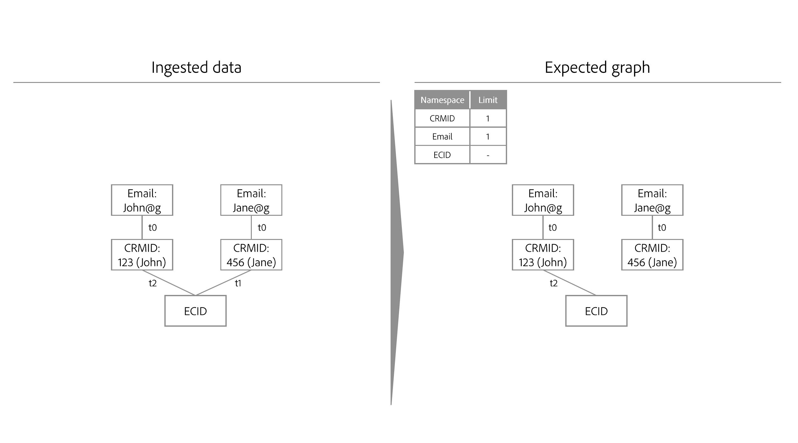

# Algoritmo di ottimizzazione identità

>[!AVAILABILITY]
>
>Le regole di collegamento del grafo delle identità sono attualmente in versione beta. Contatta il team del tuo account di Adobe per informazioni sui criteri di partecipazione. La funzione e la documentazione sono soggette a modifiche.

L’algoritmo di ottimizzazione delle identità è un algoritmo grafico sul servizio Identity che garantisce che un grafico delle identità sia rappresentativo di una singola persona e, pertanto, impedisce l’unione indesiderata di identità sul profilo cliente in tempo reale.

## Parametri di input {#input-parameters}

Leggi questa sezione per informazioni sugli spazi dei nomi univoci e sulla priorità dello spazio dei nomi. Questi due concetti fungono da parametri di input richiesti dall’algoritmo di ottimizzazione delle identità.

### Spazio dei nomi univoco {#unique-namespace}

Uno spazio dei nomi univoco determina i collegamenti che vengono rimossi in caso di compressione del grafico.

Un singolo profilo unito e il grafico delle identità corrispondente devono rappresentare un singolo individuo (entità persona). Un singolo individuo è solitamente rappresentato da CRMID e/o ID di accesso. L’aspettativa è che non ci siano due individui (CRMID) uniti in un singolo profilo o grafico.

È necessario specificare quali spazi dei nomi rappresentano un’entità persona in Identity Service utilizzando l’algoritmo di ottimizzazione delle identità. Ad esempio, se un database di gestione delle relazioni con i clienti definisce un account utente da associare a un singolo identificatore CRMID e a un singolo indirizzo e-mail, le impostazioni di identità per questa sandbox saranno simili alle seguenti:

* Spazio dei nomi CRMID = univoco
* Spazio dei nomi e-mail = univoco

Uno spazio dei nomi che dichiari univoco verrà configurato automaticamente in modo da avere un limite massimo di uno all’interno di un dato grafico delle identità. Ad esempio, se dichiari univoco uno spazio dei nomi CRMID, un grafo di identità può avere una sola identità contenente uno spazio dei nomi CRMID. Se non dichiari uno spazio dei nomi univoco, il grafico può contenere più di un’identità con tale spazio dei nomi.

>[!NOTE]
>
>* Al momento non è supportata la rappresentazione di entità familiari (&quot;grafici delle famiglie&quot;).
>
>* Tutti gli spazi dei nomi che sono identificatori di persona e che vengono utilizzati nella sandbox per generare grafici di identità devono essere contrassegnati come spazi dei nomi univoci. In caso contrario, potrebbero verificarsi risultati di collegamento indesiderati.

### Priorità dello spazio dei nomi {#namespace-priority}

La priorità dello spazio dei nomi determina il modo in cui l’algoritmo di ottimizzazione delle identità rimuove i collegamenti.

Gli spazi dei nomi in Identity Service hanno un ordine di importanza relativo implicito. Consideriamo un grafico strutturato come una piramide. Vi sono un nodo sul livello superiore, due nodi sul livello intermedio e quattro nodi sul livello inferiore. La priorità dello spazio dei nomi deve riflettere questo ordine relativo per garantire che un’entità persona sia rappresentata correttamente.

Per informazioni approfondite sulla priorità dello spazio dei nomi e sulle relative funzionalità e utilizzi completi, leggere la [guida sulla priorità dello spazio dei nomi](./namespace-priority.md).

## Processo {#process}

Al momento dell’acquisizione di nuove identità, Identity Service controlla se le nuove identità e i corrispondenti spazi dei nomi aderiscono a configurazioni univoche dello spazio dei nomi. Se si seguono le configurazioni, l’acquisizione procede e le nuove identità sono collegate al grafico. Tuttavia, se non si seguono le configurazioni, l’algoritmo di ottimizzazione delle identità:

* Acquisisci l’evento più recente tenendo conto della priorità dello spazio dei nomi.
* Rimuove il collegamento che unirebbe due entità persona dal livello grafico appropriato.

## Dettagli dell’algoritmo di ottimizzazione delle identità

Quando il vincolo dello spazio dei nomi univoco viene violato, l’algoritmo di ottimizzazione dell’identità &quot;riprodurrà&quot; i collegamenti e ricostruirà il grafico da zero.

* I collegamenti sono ordinati in base al seguente ordine:
   * Ultimo evento.
   * Marca temporale per somma della priorità dello spazio dei nomi (somma inferiore = ordine più elevato).
* Il grafico verrà ristabilito in base all’ordine indicato sopra. Se l’aggiunta del collegamento viola il vincolo del limite (ad esempio, il grafico contiene due o più identità con uno spazio dei nomi univoco), i collegamenti vengono rimossi.
* Il grafico risultante sarà quindi conforme al vincolo dello spazio dei nomi univoco configurato.

## Scenari di esempio per l’algoritmo di ottimizzazione delle identità

La sezione seguente illustra il comportamento dell’algoritmo di ottimizzazione delle identità, in scenari come il dispositivo condiviso o l’acquisizione di dati con la stessa marca temporale.

### Dispositivo condiviso

Per dispositivo condiviso si intende un dispositivo utilizzato da più utenti. Ad esempio, un dispositivo condiviso può essere un laptop o un tablet condiviso con un partner o un membro della famiglia, un computer di libreria o un chiosco pubblico.

>[!BEGINTABS]

>[!TAB Esempio uno]

| Namespace | Spazio dei nomi univoco |
| --- | --- |
| CRMID | Sì |
| E-mail | Sì |
| ECID | No |

In questo esempio, sia CRMID che E-mail sono designati come spazi dei nomi univoci. In `timestamp=0`, viene acquisito un set di dati del record CRM e vengono creati due grafici diversi a causa della configurazione univoca dello spazio dei nomi. Ogni grafico contiene un CRMID e uno spazio dei nomi e-mail.

* `timestamp=1`: Jane accede al tuo sito Web di e-commerce utilizzando un laptop. Jane è rappresentata dal suo CRMID e dal suo Email, mentre il browser web sul suo laptop che usa è rappresentato da un ECID.
* `timestamp=2`: John accede al tuo sito Web di e-commerce utilizzando lo stesso laptop. John è rappresentato dal suo CRMID e dalla sua Email, mentre il browser web che ha usato è già rappresentato da un ECID. Poiché lo stesso ECID è collegato a due grafici diversi, Identity Service è in grado di sapere che questo dispositivo (laptop) è condiviso.
* Tuttavia, a causa della configurazione univoca dello spazio dei nomi che imposta un massimo di uno spazio dei nomi CRMID e di uno spazio dei nomi E-mail per grafico, l’algoritmo di ottimizzazione dell’identità divide il grafico in due.
   * Infine, poiché John è l&#39;ultimo utente autenticato, l&#39;ECID che rappresenta il laptop, rimane collegato al suo grafo invece di quello di Jane.

>[!TAB Esempio due]

| Namespace | Spazio dei nomi univoco |
| --- | --- |
| CRMID | Sì |
| ECID | No |

In questo esempio, lo spazio dei nomi CRMID è designato come spazio dei nomi univoco.

* `timestamp=1`: Jane accede al tuo sito Web di e-commerce utilizzando un laptop. È rappresentata dal suo CRMID, e il browser web sul laptop è rappresentato dall&#39;ECID.
* `timestamp=2`: John accede al tuo sito Web di e-commerce utilizzando lo stesso laptop. È rappresentato dal suo CRMID e il browser web che utilizza è rappresentato dallo stesso ECID.
   * Questo evento collega due CRMID indipendenti allo stesso ECID, superando il limite configurato di un CRMID.
   * Di conseguenza, l&#39;algoritmo di ottimizzazione delle identità rimuove il collegamento precedente, che in questo caso è il CRMID di Jane, collegato in `timestamp=1`.
   * Tuttavia, anche se il CRMID di Jane non esisterà più come grafico sul servizio Identity, persisterà ancora come profilo sul Profilo cliente in tempo reale. Questo perché un grafo di identità deve contenere almeno due identità collegate e, come risultato della rimozione dei collegamenti, il CRMID di Jane non ha più un&#39;altra identità a cui collegarsi.

>[!ENDTABS]

### E-mail non valida

In alcuni casi, un utente potrebbe immettere valori non validi per i propri numeri di telefono e/o e-mail.

| Namespace | Spazio dei nomi univoco |
| --- | --- |
| CRMID | Sì |
| E-mail | Sì |
| ECID | No |

In questo esempio, gli spazi dei nomi CRMID e E-mail sono designati come univoci. Considera lo scenario in cui Jane e John si sono iscritti al tuo sito Web di e-commerce utilizzando un valore di e-mail non valido (ad esempio, test@test.com).

* `timestamp=1`: Jane accede al tuo sito Web di e-commerce utilizzando Safari sul suo iPhone, stabilendo il suo CRMID (informazioni di accesso) e il suo ECID (browser).
* `timestamp=2`: John accede al tuo sito web di e-commerce utilizzando Google Chrome sul suo iPhone, stabilendo il suo CRMID (informazioni di accesso) e ECID (browser).
* `timestamp=3`: l&#39;ingegnere dati acquisisce il record CRM di Jane, il che fa sì che il suo CRMID venga collegato all&#39;e-mail errata.
* `timestamp=4`: l&#39;ingegnere dati acquisisce il record CRM di John, il che fa sì che il suo CRMID venga collegato all&#39;e-mail errata.
   * Questo diventa quindi una violazione della configurazione dello spazio dei nomi univoco, in quanto crea un singolo grafico con due spazi dei nomi CRMID.
   * Di conseguenza, l&#39;algoritmo di ottimizzazione delle identità elimina il collegamento precedente, che in questo caso è il collegamento tra l&#39;identità di Jane con lo spazio dei nomi CRMID e l&#39;identità con il test@test.

Con l’algoritmo di ottimizzazione dell’identità, i valori di identità errati, come e-mail o numeri di telefono falsi, non vengono propagati attraverso diversi grafici di identità.

### Associazione evento anonimo

Gli ECID memorizzano gli eventi non autenticati (anonimi), mentre CRMID archivia gli eventi autenticati. Nel caso di dispositivi condivisi, l&#39;ECID (portatore di eventi non autenticati) viene associato all&#39;**ultimo utente autenticato**.

Per comprendere meglio il funzionamento dell’associazione anonima degli eventi, consulta il diagramma seguente:

* Kevin e Nora condividono un tablet.
   * `timestamp=1`: Kevin accede a un sito Web di e-commerce utilizzando il suo account, stabilendo in tal modo il suo CRMID (informazioni di accesso) e un ECID (browser). Al momento dell&#39;accesso, Kevin è ora considerato l&#39;ultimo utente autenticato.
   * `timestamp=2`: Nora accede a un sito Web di e-commerce utilizzando il suo account, stabilendo in tal modo il suo CRMID (informazioni di accesso) e lo stesso ECID. Al momento dell’accesso, Nora è considerato l’ultimo utente autenticato.
   * `timestamp=3`: Kevin utilizza il tablet per sfogliare il sito Web di e-commerce, ma non accede con il proprio account. L&#39;attività di navigazione di Kevin viene quindi memorizzata nell&#39;ECID, che a sua volta è associata a Nora perché è l&#39;ultimo utente autenticato. A questo punto, Nora è la proprietaria degli eventi anonimi.
      * Fino a quando Kevin non effettua di nuovo l’accesso, il profilo unito di Nora verrà associato a tutti gli eventi non autenticati memorizzati nell’ECID (dove gli eventi sono dove ECID è l’identità primaria).
   * `timestamp=4`: Kevin accede per la seconda volta. A questo punto, diventa di nuovo l’ultimo utente autenticato e ora è anche il proprietario degli eventi non autenticati:
      * Prima dell&#39;accesso iniziale prima di `timestamp=1`; e
      * Tutte le attività che lui o Nora hanno svolto durante la navigazione anonima tra il primo e il secondo accesso di Kevin.

## Passaggi successivi

Per ulteriori informazioni sulle regole di collegamento del grafico delle identità, consulta la documentazione seguente:

* [Panoramica delle regole di collegamento del grafico delle identità](./overview.md)
* [Priorità dello spazio dei nomi](./namespace-priority.md)
* [Scenari di esempio per la configurazione delle regole di collegamento del grafico delle identità](./example-scenarios.md)
* [Logica di collegamento dell’identità](../features/identity-linking-logic.md)
* [Servizio Identity e Real-Time Customer Profile](../identity-and-profile.md)
