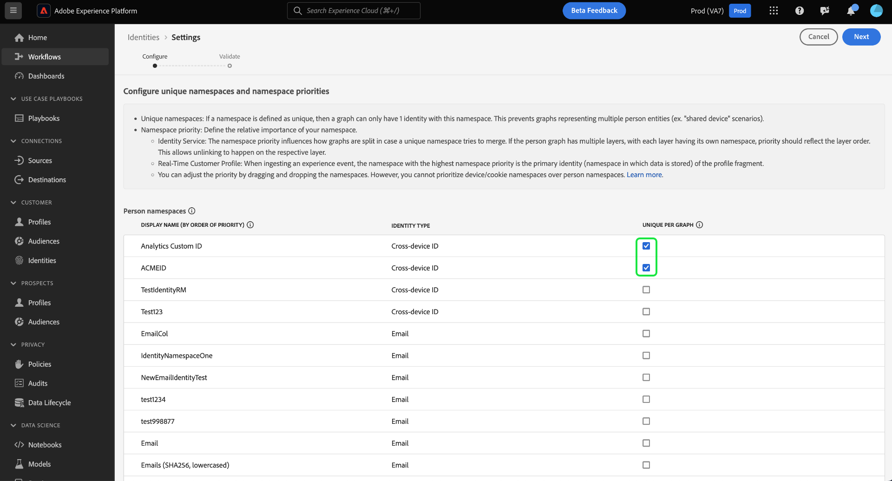

# Interfaccia utente per l’impostazione dell’identità

>[!AVAILABILITY]
>
>Questa funzione non è ancora disponibile; il programma beta per le regole di collegamento del grafo delle identità dovrebbe iniziare a luglio per le sandbox di sviluppo. Contatta il team del tuo account di Adobe per informazioni sui criteri di partecipazione.

Le impostazioni di identità sono una funzione dell’interfaccia utente di Adobe Experience Platform Identity Service che consente di designare spazi dei nomi univoci e configurare la priorità dello spazio dei nomi.

Leggi questa guida per scoprire come utilizzare lo strumento per le impostazioni di identità.

## Prerequisito

Prima di iniziare a utilizzare le impostazioni di identità, leggi i seguenti documenti:

* [Algoritmo di ottimizzazione identità](./identity-optimization-algorithm.md)
* [Priorità dello spazio dei nomi](./namespace-priority.md)
* [Simulazione del grafico](./graph-simulation.md)

## Configurare le impostazioni di identità

Per accedere alle impostazioni di identità, passa all’area di lavoro del servizio Identity nell’interfaccia utente di Adobe Experience Platform, quindi seleziona **[!UICONTROL Impostazioni]**.

Viene visualizzata la pagina delle impostazioni di identità e viene visualizzato un messaggio di conferma per ricordarti di testare e convalidare le impostazioni di identità in una sandbox di sviluppo prima di completare le configurazioni in una sandbox di produzione.

La pagina delle impostazioni di identità è suddivisa in due sezioni: [!UICONTROL Spazi dei nomi della persona] e [!UICONTROL Spazi dei nomi del dispositivo o del cookie]. Gli spazi dei nomi delle persone sono identificatori di singoli individui. Possono essere ID multi-dispositivo, indirizzi e-mail e numeri di telefono. Gli spazi dei nomi dei dispositivi o dei cookie sono identificatori per dispositivi e browser web e non possono avere una priorità maggiore degli spazi dei nomi delle persone. Inoltre, non è possibile designare un dispositivo o uno spazio dei nomi cookie come spazio dei nomi univoco.

### Designare uno spazio dei nomi univoco

Per designare uno spazio dei nomi univoco, seleziona la [!UICONTROL Univoco per grafico] che corrisponde a tale spazio dei nomi. Puoi selezionare più spazi dei nomi univoci per la configurazione delle impostazioni di identità.

Una volta stabiliti gli spazi dei nomi univoci, i grafici non saranno più in grado di avere più identità che contengono uno spazio dei nomi univoco. Ad esempio, se hai designato l’ID personalizzato di Analytics come spazio dei nomi univoco, un grafico può avere una sola identità con lo spazio dei nomi dell’ID personalizzato di Analytics. Per ulteriori informazioni, leggere [panoramica dell’algoritmo di ottimizzazione delle identità](./identity-optimization-algorithm.md#unique-namespace).

### Configurare la priorità dello spazio dei nomi

Per configurare la priorità dello spazio dei nomi, seleziona uno spazio dei nomi nel menu delle impostazioni dell’identità, quindi trascina e rilascia lo spazio dei nomi nell’ordine desiderato. Posiziona uno spazio dei nomi più in alto nell’elenco per assegnargli una priorità più elevata; viceversa, posiziona uno spazio dei nomi più in basso nell’elenco per assegnargli una priorità più bassa. Anche lo spazio dei nomi con la priorità più elevata deve essere designato come spazio dei nomi univoco.

Una volta completate le configurazioni, seleziona **[!UICONTROL Successivo]**. Viene visualizzato un messaggio di conferma; utilizza questa opportunità per verificare che le configurazioni siano corrette, quindi seleziona **[!UICONTROL Fine]**.

Viene visualizzato un avviso che indica che le nuove impostazioni non avranno implicazioni sui collegamenti esistenti in un grafo di identità e sui frammenti di profilo di evento esperienza già acquisiti. Per confermare, immetti il nome della sandbox, quindi seleziona **[!UICONTROL Conferma]**.

