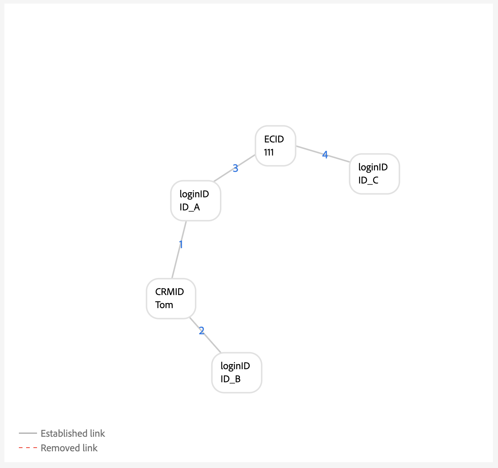

# Guida all’implementazione per le regole di collegamento del grafico delle identità

>[!AVAILABILITY]
>
>Le regole di collegamento del grafo delle identità sono attualmente in versione beta. Contatta il team del tuo account di Adobe per informazioni sui criteri di partecipazione. La funzione e la documentazione sono soggette a modifiche.

Leggi questo documento per una guida dettagliata che puoi seguire durante l’implementazione dei dati con il servizio Adobe Experience Platform Identity.

Descrizione dettagliata:


1. [Prerequisiti completi per l’implementazione](#prerequisites-for-implementation)
2. [Creare gli spazi dei nomi di identità necessari](#namespace)
3. [Utilizza lo strumento di simulazione del grafico per acquisire familiarità con l’algoritmo di ottimizzazione delle identità](#graph-simulation)
4. [Utilizza lo strumento Identity Settings (Impostazioni identità) per designare gli spazi dei nomi univoci e configurare le classificazioni di priorità per i tuoi spazi dei nomi](#identity-settings)
5. [Creare uno schema Experience Data Model (XDM)](#schema)
6. [Creare un set di dati](#dataset)
7. [Acquisire i dati in Experience Platform](#ingest)

## Prerequisiti per l’implementazione {#prerequisites-for-implementation}

Questa sezione descrive i passaggi prerequisiti da completare prima di implementare le regole di collegamento del grafico delle identità ai dati.

### Spazio dei nomi univoco

#### Requisito dello spazio dei nomi per singola persona {#single-person-namespace-requirement}

Assicurati che lo spazio dei nomi univoco con la priorità più elevata sia sempre presente in ogni profilo. In questo modo il servizio Identity è in grado di rilevare l’identificatore di persona appropriato in un dato grafico.

+++Seleziona questa opzione per visualizzare un esempio di grafico senza uno spazio dei nomi con un singolo identificatore di persona

Se non disponi di uno spazio dei nomi univoco per rappresentare gli identificatori delle persone, potresti ottenere un grafico che collega più identificatori delle persone allo stesso ECID. In questo esempio, sia B2BCRM che B2CCRM sono collegati allo stesso ECID allo stesso tempo. Questo grafico suggerisce che Tom, usando il suo account di accesso B2C, ha condiviso un dispositivo con Summer, usando il suo account di accesso B2B. Tuttavia, il sistema riconoscerà che si tratta di un profilo (compressione del grafico).


+++

+++Seleziona per visualizzare un esempio di grafico con uno spazio dei nomi con identificatore di persona singolo

Dato uno spazio dei nomi univoco, (in questo caso un CRMID invece di due spazi dei nomi diversi), Identity Service è in grado di distinguere l’identificatore della persona più recente associato all’ECID. In questo esempio, poiché esiste un CRMID univoco, Identity Service è in grado di riconoscere uno scenario di &quot;dispositivo condiviso&quot;, in cui due entità condividono lo stesso dispositivo.


+++

### Configurazione della priorità dello spazio dei nomi

Se utilizzi il [connettore di origine Adobe Analytics](../../sources/tutorials/ui/create/adobe-applications/analytics.md) per acquisire i dati, devi assegnare agli ECID una priorità maggiore rispetto ad Adobe Analytics ID (AAID) perché Identity Service blocca AAID. Dando priorità a ECID, puoi dare istruzioni a Real-Time Customer Profile di memorizzare gli eventi non autenticati in ECID invece che in AAID.

### Eventi esperienza XDM

* Durante il processo di pre-implementazione, devi assicurarti che gli eventi autenticati che il sistema invierà ad Experience Platform contengano sempre un identificatore di persona, come CRMID.
* Non inviare una stringa vuota come valore di identità quando invii eventi utilizzando eventi di esperienza XDM. In questo modo si verificheranno errori di sistema.

+++Seleziona per visualizzare un esempio di payload con una stringa vuota

Nell&#39;esempio seguente viene restituito un errore perché il valore di identità per `Phone` viene inviato come stringa vuota.

```json
    "identityMap": {
        "ECID": [
            {
                "id": "24165048599243194405404369473457348936",
                "primary": false
            }
        ],
        "Phone": [
            {
                "id": "",
                "primary": true
            }
        ]
    }
```

+++

Assicurati di disporre di un’identità completa quando invii eventi utilizzando gli eventi di esperienza XDM.

+++Seleziona per visualizzare un esempio di evento con un’identità completa

```json
    "identityMap": {
        "ECID": [
            {
                "id": "24165048599243194405404369473457348936",
                "primary": false
            }
        ]
    }
```

+++

## Impostare le autorizzazioni {#set-permissions}

Il primo passaggio nella procedura di implementazione per Identity Service consiste nell’assicurarsi che l’account di Experience Platform venga aggiunto a un ruolo provvisto delle autorizzazioni necessarie. L’amministratore può configurare le autorizzazioni per il tuo account passando all’interfaccia utente Autorizzazioni in Adobe Experience Cloud. A questo punto, è necessario aggiungere il tuo account a un ruolo con le seguenti autorizzazioni:

* [!UICONTROL Visualizza impostazioni identità]: applica questa autorizzazione per poter visualizzare spazi dei nomi e priorità dello spazio dei nomi univoci nella pagina di esplorazione dello spazio dei nomi delle identità.
* [!UICONTROL Modifica impostazioni identità]: applica questa autorizzazione per poter modificare e salvare le impostazioni di identità.

Per ulteriori informazioni sulle autorizzazioni, leggere la [guida alle autorizzazioni](../../access-control/abac/ui/permissions.md).

## Creare gli spazi dei nomi delle identità {#namespace}

Se i dati lo richiedono, devi innanzitutto creare gli spazi dei nomi appropriati per la tua organizzazione. Per i passaggi su come creare uno spazio dei nomi personalizzato, leggere la guida in [creazione di uno spazio dei nomi personalizzato nell&#39;interfaccia utente](../features/namespaces.md#create-custom-namespaces).

## Usa strumento di simulazione grafico {#graph-simulation}

Quindi, passa allo strumento di simulazione del grafico [](./graph-simulation.md) nell&#39;area di lavoro dell&#39;interfaccia utente di Identity Service. Puoi utilizzare lo strumento di simulazione del grafico per simulare grafici di identità, creati con diverse configurazioni di spazio dei nomi e priorità dello spazio dei nomi univoche.

Creando diverse configurazioni, puoi utilizzare lo strumento di simulazione del grafico per scoprire e comprendere meglio in che modo l’algoritmo di ottimizzazione delle identità e alcune configurazioni possono influenzare il comportamento del grafico.

## Configurare le impostazioni di identità {#identity-settings}

Per avere un&#39;idea migliore del comportamento del grafico, passa allo strumento [impostazioni identità](./identity-settings-ui.md) nell&#39;area di lavoro dell&#39;interfaccia utente di Identity Service.

Utilizza lo strumento Identity Settings (Impostazioni identità) per designare gli spazi dei nomi univoci e configurare gli spazi dei nomi in ordine di priorità. Una volta completata l’applicazione delle impostazioni, attendi almeno sei ore prima di poter procedere all’acquisizione dei dati, poiché sono necessarie almeno sei ore affinché le nuove impostazioni vengano applicate al servizio Identity.

## Creare uno schema XDM {#schema}

Una volta stabiliti gli spazi dei nomi univoci e le priorità dello spazio dei nomi, puoi procedere con la configurazione necessaria per acquisire i dati. Innanzitutto, devi creare uno schema XDM. A seconda dei dati, potrebbe essere necessario creare uno schema sia per XDM Individual Profile che per XDM ExperienceEvent.

Per acquisire dati in Real-Time Customer Profile, devi assicurarti che lo schema contenga almeno un campo designato come identità primaria. Impostando un’identità primaria, puoi abilitare uno schema specifico per l’acquisizione del profilo.

Per istruzioni su come creare uno schema, consulta la guida su [creazione di uno schema XDM nell&#39;interfaccia utente](../../xdm/tutorials/create-schema-ui.md).

## Creare un set di dati {#dataset}

Quindi, crea un set di dati per fornire una struttura per i dati che intendi acquisire. Un set di dati è un costrutto di archiviazione e gestione per una raccolta di dati, in genere una tabella, che contiene uno schema (colonne) e dei campi (righe). I set di dati funzionano in parallelo con gli schemi e per acquisire i dati in Real-Time Customer Profile, il set di dati deve essere abilitato per l’acquisizione del profilo. Affinché il set di dati possa essere abilitato per il profilo, deve fare riferimento a uno schema abilitato per l’acquisizione del profilo.

Per istruzioni su come creare un set di dati, leggere la [guida dell&#39;interfaccia utente del set di dati](../../catalog/datasets/user-guide.md).

## Inserire i dati {#ingest}

A questo punto, dovresti disporre dei seguenti elementi:

* Le autorizzazioni necessarie per accedere alle funzioni di Identity Service.
* Namespace per i dati.
* Namespace univoci designati e priorità configurate per i namespace.
* Almeno uno schema XDM. (A seconda dei dati e del caso d’uso specifico, potrebbe essere necessario creare schemi sia di profilo che di evento esperienza.)
* Un set di dati basato sullo schema.

Una volta che hai tutti gli elementi elencati sopra, puoi iniziare ad acquisire i dati da Experience Platform. Puoi eseguire l’acquisizione dei dati in diversi modi. Per Experience Platform i dati, puoi utilizzare i seguenti servizi:

* [Acquisizione in batch e in streaming](../../ingestion/home.md)
* [Raccolta dati in Experience Platform](../../collection/home.md)
* [Origini Experience Platform](../../sources/home.md)

>[!TIP]
>
>Una volta acquisiti i dati, il payload dei dati non elaborati XDM non cambia. Puoi comunque visualizzare le configurazioni dell’identità primaria nell’interfaccia utente. Tuttavia, queste configurazioni verranno sostituite dalle impostazioni di identità.

Per qualsiasi feedback, utilizza l&#39;opzione **[!UICONTROL Feedback su Beta]** nell&#39;area di lavoro dell&#39;interfaccia utente di Identity Service.

## Convalidare i grafici {#validate}

Utilizza il dashboard delle identità per ottenere informazioni sullo stato dei tuoi grafici delle identità, ad esempio il conteggio delle identità complessivo e le tendenze del conteggio dei grafici, il conteggio delle identità per spazio dei nomi e il conteggio dei grafici per dimensione. Puoi anche utilizzare il dashboard delle identità per visualizzare le tendenze su grafici con due o più identità, organizzati per spazio dei nomi.

Selezionare i puntini di sospensione (`...`), quindi selezionare **[!UICONTROL Visualizza altri]** per ulteriori informazioni e per verificare che non siano presenti grafici compressi.

## Appendice {#appendix}

Leggi questa sezione per ulteriori informazioni a cui puoi fare riferimento durante l’implementazione delle impostazioni di identità e degli spazi dei nomi univoci.

### Scenario loginID con interferenza {#dangling-loginid-scenario}

Il grafico seguente simula uno scenario di loginID &quot;penzolante&quot;. In questo esempio, due diversi loginID sono associati allo stesso ECID. Tuttavia, `{loginID: ID_C}` non è collegato al CRMID. Pertanto, il servizio Identity non è in grado di rilevare che questi due ID di accesso rappresentano due entità diverse.

>[!BEGINTABS]

>[!TAB ID accesso ambiguo]

In questo esempio, `{loginID: ID_C}` viene lasciato scollegato da un CRMID. Pertanto, l’entità persona a cui deve essere associato questo loginID rimane ambigua.



>[!TAB loginID collegato a un CRMID]

In questo esempio, `{loginID: ID_C}` è collegato a `{CRMID: Tom}`. Pertanto, il sistema è in grado di rilevare che questo loginID è associato a Tom.


>[!TAB loginID è collegato a un altro CRMID]

In questo esempio, `{loginID: ID_C}` è collegato a `{CRMID: Summer}`. Pertanto, il sistema è in grado di rilevare che questo loginID è associato a un’altra entità persona, in questo caso Summer.

In questo esempio viene inoltre mostrato che Tom e Summer devono separare le entità persona che condividono un dispositivo, rappresentato da `{ECID: 111}`.


>[!ENDTABS]

## Passaggi successivi

Per ulteriori informazioni sulle regole di collegamento del grafico delle identità, consulta la documentazione seguente:

* [Panoramica delle regole di collegamento del grafico delle identità](./overview.md)
* [Algoritmo di ottimizzazione identità](./identity-optimization-algorithm.md)
* [Esempi di configurazioni di grafo](./example-configurations.md)
* [Risoluzione dei problemi e domande frequenti](./troubleshooting.md)
* [Priorità dello spazio dei nomi](./namespace-priority.md)
* [Interfaccia utente simulazione grafico](./graph-simulation.md)
* [Interfaccia utente per le impostazioni delle identità](./identity-settings-ui.md)
