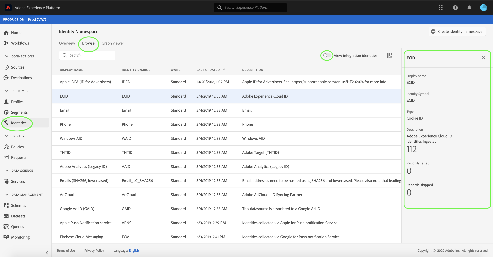

# Panoramica dello spazio nomi identità

Gli spazi dei nomi delle identità sono un componente di [[!DNL Identity Service]](./home.md) che funge da indicatori del contesto a cui si riferisce un&#39;identità. Ad esempio, distinguono un valore di &quot;name@email.com&quot; come indirizzo e-mail o &quot;443522&quot; come ID CRM numerico.

## Introduzione

Per utilizzare gli spazi dei nomi delle identità è necessario conoscere i diversi servizi Adobe Experience Platform interessati. Prima di iniziare a lavorare con gli spazi dei nomi, consulta la documentazione relativa ai seguenti servizi:

- [[!DNL Real-time Customer Profile]](../profile/home.md): Fornisce un profilo cliente unificato in tempo reale basato su dati aggregati provenienti da più origini.
- [[!DNL Identity Service]](./home.md): Ottenete una visione migliore dei singoli clienti e del loro comportamento, collegando le identità tra dispositivi e sistemi.
- [[!DNL Privacy Service]](../privacy-service/home.md): Gli spazi dei nomi delle identità vengono utilizzati per conformarsi al Regolamento generale sulla protezione dei dati (General Data Protection Regulation, GDPR), in cui è possibile effettuare richieste GDPR in relazione a uno spazio dei nomi.

## Informazioni sugli spazi dei nomi delle identità

Un&#39;identità completa include un valore ID e uno spazio dei nomi. Quando i dati del record corrispondono a diversi frammenti di profilo, come nel caso in cui [!DNL Real-time Customer Profile] unisca i dati del profilo, sia il valore dell&#39;identità che lo spazio dei nomi devono corrispondere.

Ad esempio, due frammenti di profilo possono contenere ID primari diversi, ma condividono lo stesso valore per lo spazio dei nomi &quot;E-mail&quot;. Pertanto, [!DNL Platform] è in grado di vedere che questi frammenti sono in realtà gli stessi singoli e di unire i dati nel grafico dell&#39;identità per l&#39;individuo.

### Tipi di identità

I dati possono essere identificati da diversi tipi di identità. Il tipo di identità viene specificato al momento della creazione dello spazio dei nomi dell&#39;identità e controlla se i dati sono persistenti o meno nel grafico dell&#39;identità, nonché eventuali istruzioni speciali per la gestione di tali dati.

I seguenti tipi di identità sono disponibili in [!DNL Platform]:

| Tipo di identità | Descrizione |
| --- | --- |
| ID cookie | Gli ID dei cookie identificano i browser Web. Queste identità sono fondamentali per l&#39;espansione e costituiscono la maggior parte del grafico di identità. Tuttavia, per natura decadono velocemente e perdono il loro valore nel tempo. |
| ID multi-dispositivo | Gli ID multi-dispositivo identificano un singolo ID e in genere collegano gli altri ID. Alcuni esempi includono un ID di login, un ID CRM e un ID fedeltà. Indica che [!DNL Identity Service] deve gestire il valore in modo sensibile. |
| ID dispositivo | Gli ID dispositivo identificano i dispositivi hardware, come IDFA (iPhone e iPad), GAID (Android) e RIDA (Roku), e possono essere condivisi da più persone nelle famiglie. |
| Indirizzo e-mail | Gli indirizzi e-mail sono spesso associati a una singola persona e possono quindi essere utilizzati per identificare tale persona tra canali diversi. Le identità di questo tipo includono informazioni personali (PII). Indica che [!DNL Identity Service] deve gestire il valore in modo sensibile. |
| Identificatore non di persone | Gli ID di non persone vengono utilizzati per memorizzare gli identificatori che richiedono spazi di nomi ma non sono connessi a un cluster di persone. Ad esempio, uno SKU di prodotto, i dati relativi a prodotti, organizzazioni o store. |
| Numero di telefono | I numeri di telefono sono spesso associati a una singola persona e possono quindi essere utilizzati per identificare tale persona attraverso canali diversi. Le identità di questo tipo includono PII. Questo è l&#39;indicazione di [!DNL Identity Service] per gestire il valore in modo sensibile. |

### Spazi dei nomi standard

 Experience Platform fornisce diversi spazi dei nomi di identità disponibili per tutte le organizzazioni. Questi sono noti come spazi di nomi standard e sono visibili tramite l&#39;API [!DNL Identity Service] o tramite l&#39;interfaccia utente della piattaforma.

I seguenti spazi dei nomi standard sono forniti per l&#39;uso da parte di tutte le organizzazioni all&#39;interno della piattaforma:

| Nome visualizzato | Descrizione |
| ------------ | ----------- |
| AdCloud | Spazio dei nomi che rappresenta  Adobe AdCloud. |
|  Adobe Analytics (ID legacy) | Spazio dei nomi che rappresenta  Adobe Analytics. Per ulteriori informazioni, vedere il seguente documento su [ spazi dei nomi Adobe Analytics](https://experienceleague.adobe.com/docs/analytics/admin/data-governance/gdpr-namespaces.html?lang=en#namespaces). |
| ID Apple (ID per inserzionisti) | Spazio dei nomi che rappresenta Apple ID per gli inserzionisti. Per ulteriori informazioni, consulta il seguente documento su [annunci basati su interessi](https://support.apple.com/en-us/HT202074). |
| Servizio Apple Push Notification | Spazio dei nomi che rappresenta le identità raccolte tramite il servizio Apple Push Notification. Per ulteriori informazioni, consultate il seguente documento su [Apple Push Notification Service](https://developer.apple.com/library/archive/documentation/NetworkingInternet/Conceptual/RemoteNotificationsPG/APNSOverview.html#//apple_ref/doc/uid/TP40008194-CH8-SW1). |
| CORE | Spazio dei nomi che rappresenta Adobe Audience Manager. Lo spazio nomi può essere indicato anche dal nome legacy: &quot; Adobe AudienceManager&quot;. Per ulteriori informazioni, consultare il seguente documento su [ ID Audience Manager](https://experienceleague.adobe.com/docs/audience-manager/user-guide/overview/data-privacy/data-privacy-reference/data-privacy-ids.html?lang=en#aam-ids). |
| ECID | Spazio dei nomi che rappresenta ECID. A questo spazio nomi possono fare riferimento anche i seguenti alias: &quot;Adobe Marketing Cloud ID&quot;, &quot;Adobe Experience Cloud ID&quot;, &quot;Adobe Experience Platform ID&quot;. Per ulteriori informazioni, consultare il seguente documento su [ECID](./ecid.md). |
| E-mail | Spazio dei nomi che rappresenta un indirizzo e-mail. Questo tipo di spazio nomi è spesso associato a una singola persona e può quindi essere utilizzato per identificare tale persona tra canali diversi. |
| E-mail (SHA256, minuscolo) | Spazio dei nomi per l&#39;indirizzo e-mail con hash precedente. I valori forniti in questo spazio nomi vengono convertiti in lettere minuscole prima di eseguire l&#39;hash con SHA256. Gli spazi iniziali e finali devono essere tagliati prima che un indirizzo e-mail venga normalizzato. Questa impostazione non può essere modificata retroattivamente. Per ulteriori informazioni, consultare il seguente documento sul [supporto per gli hashing SHA256](https://experienceleague.adobe.com/docs/id-service/using/reference/hashing-support.html?lang=en#hashing-support). |
| Firebase Cloud Messaging | Spazio dei nomi che rappresenta le identità raccolte tramite Google Firebase Cloud Messaging per le notifiche push. Per ulteriori informazioni, consulta il seguente documento su [Google Firebase Cloud Messaging](https://firebase.google.com/docs/cloud-messaging). |
| Google Ad ID (GAID) | Spazio dei nomi che rappresenta un Google Advertising ID. Per ulteriori informazioni, consulta il seguente documento su [Google Advertising ID](https://support.google.com/googleplay/android-developer/answer/6048248?hl=en). |
| Google Click ID | Spazio dei nomi che rappresenta un Google Click ID. Per ulteriori informazioni, consulta il seguente documento su [Monitoraggio dei clic in Google Ads](https://developers.google.com/adwords/api/docs/guides/click-tracking). |
| Telefono | Spazio dei nomi che rappresenta un numero di telefono. Questo tipo di spazio nomi è spesso associato a una singola persona e può quindi essere utilizzato per identificare tale persona tra canali diversi. |
| Telefono (E.164) | Spazio dei nomi che rappresenta i numeri di telefono non elaborati che devono essere crittografati in formato E.164. Il formato E.164 include un segno più (`+`), un codice internazionale di chiamata del paese, un prefisso locale e un numero di telefono. Ad esempio: `(+)(country code)(area code)(phone number)`. |
| Telefono (SHA256) | Spazio dei nomi che rappresenta i numeri di telefono che devono essere crittografati con SHA256. È necessario rimuovere simboli, lettere ed eventuali zero iniziali. È inoltre necessario aggiungere il codice di chiamata del paese come prefisso. |
| Telefono (SHA256_E.164) | Uno spazio dei nomi che rappresenta i numeri di telefono non elaborati che devono essere crittografati con il formato SHA256 e E.164. |
| TNTID | Spazio dei nomi che rappresenta  Adobe Target. Per ulteriori informazioni, consultare il seguente documento su [Target](https://experienceleague.adobe.com/docs/target/using/target-home.html?lang=en). |
| Windows AID | Spazio dei nomi che rappresenta un ID pubblicitario Windows. Per ulteriori informazioni, consultare il seguente documento su [Windows Advertising ID](https://docs.microsoft.com/en-us/uwp/api/windows.system.userprofile.advertisingmanager.advertisingid?view=winrt-19041). |

Per visualizzare gli spazi dei nomi standard nell&#39;interfaccia utente, selezionare **[!UICONTROL Identities]** nel menu di navigazione a sinistra, quindi selezionare la scheda **[!UICONTROL Browse]** per visualizzare un elenco di spazi dei nomi identità standard accessibili alla propria organizzazione. È possibile ordinare gli spazi dei nomi in ordine alfabetico in base ai valori **[!UICONTROL Display name]**, **[!UICONTROL Identity symbol]** o **[!UICONTROL Owner]**. In alternativa, potete ordinare gli spazi dei nomi in ordine cronologico in base alla data di aggiornamento più recente.

Selezionate uno spazio nomi per visualizzare informazioni più specifiche nella barra a destra.

>[!NOTE]
>
>La piattaforma fornisce anche spazi dei nomi a scopo di integrazione. Questi spazi dei nomi sono nascosti per impostazione predefinita, in quanto vengono utilizzati per connettersi ad altri sistemi e non per unire le identità. Per visualizzare i namespace di integrazione, selezionare **[!UICONTROL View integration identities]**.

## Gestione di spazi dei nomi personalizzati

A seconda dei dati organizzativi e dei casi di utilizzo, potrebbero essere necessari spazi dei nomi personalizzati. Gli spazi dei nomi personalizzati possono essere creati utilizzando l&#39;API [[!DNL Identity Service]](./api/create-custom-namespace.md) o tramite l&#39;interfaccia utente.

Per creare uno spazio nomi personalizzato utilizzando l&#39;interfaccia utente, passare all&#39;area di lavoro **[!UICONTROL Identities]**, selezionare **[!UICONTROL Browse]**, quindi selezionare **[!UICONTROL Create identity namespace]**.

Viene visualizzata la finestra di dialogo **[!UICONTROL Create identity namespace]**. Specificare un **[!UICONTROL Display name]** e **[!UICONTROL Identity symbol]** univoci, quindi selezionare il tipo di identità da creare. È inoltre possibile aggiungere una descrizione facoltativa per ulteriori informazioni sullo spazio nomi. Al termine, selezionare **[!UICONTROL Create]**.

>[!IMPORTANT]
>
>Gli spazi dei nomi definiti dall&#39;utente sono privati dell&#39;organizzazione e per essere creati correttamente richiedono un simbolo di identità univoco.

Analogamente agli spazi dei nomi standard, è possibile selezionare uno spazio dei nomi personalizzato dalla scheda **[!UICONTROL Browse]** per visualizzarne i dettagli. Tuttavia, con uno spazio dei nomi personalizzato è anche possibile modificarne il nome visualizzato e la descrizione dall&#39;area dei dettagli.

>[!NOTE]
>
>Una volta creato, lo spazio nomi non può essere eliminato e il relativo simbolo e tipo di identità non può essere modificato.

## Spazi dei nomi nei dati dell&#39;identità

La fornitura dello spazio dei nomi per un&#39;identità dipende dal metodo utilizzato per fornire i dati di identità. Per informazioni dettagliate sulla fornitura dei dati di identità, vedere la sezione relativa alla [fornitura di dati di identità](./home.md#supplying-identity-data-to-identity-service) nella [!DNL Identity Service] panoramica.

## Passaggi successivi

Ora che si conoscono i concetti chiave degli spazi dei nomi di identità, è possibile iniziare a imparare a utilizzare il grafico dell&#39;identità utilizzando il [visualizzatore del grafico dell&#39;identità](./ui/identity-graph-viewer.md).
