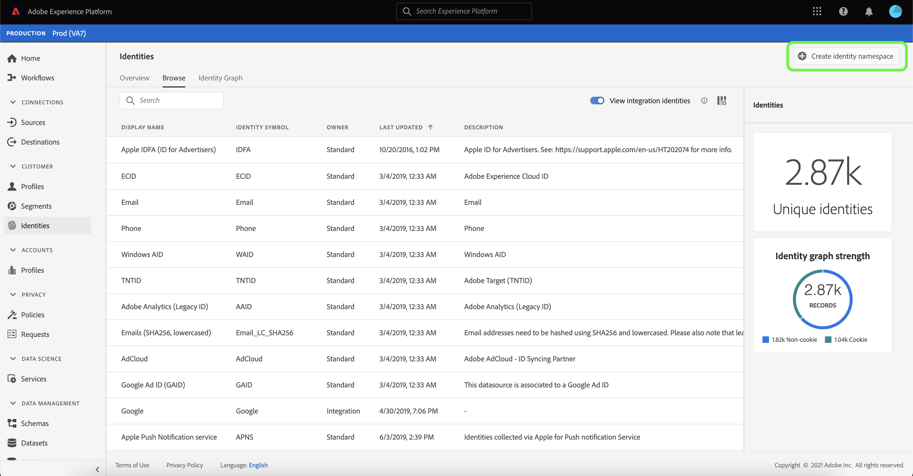

# Panoramica sullo spazio dei nomi delle identità

Gli spazi dei nomi delle identità sono un componente di [[!DNL Identity Service]](./home.md) che fungono da indicatori del contesto a cui si riferisce un’identità. Ad esempio, distinguono un valore di &quot;name@email.com&quot; come indirizzo e-mail o &quot;443522&quot; come ID CRM numerico.

## Introduzione

Per utilizzare gli spazi dei nomi delle identità è necessario comprendere i vari servizi Adobe Experience Platform interessati. Prima di iniziare a utilizzare gli spazi dei nomi, controlla la documentazione relativa ai seguenti servizi:

- [[!DNL Real-Time Customer Profile]](../profile/home.md): fornisce un profilo cliente unificato in tempo reale basato su dati aggregati provenienti da più origini.
- [[!DNL Identity Service]](./home.md): ottieni una visione migliore dei singoli clienti e del loro comportamento collegando le identità tra dispositivi e sistemi.
- [[!DNL Privacy Service]](../privacy-service/home.md): gli spazi dei nomi di identità vengono utilizzati nelle richieste di conformità per le normative legali sulla privacy come il Regolamento generale sulla protezione dei dati (RGPD). Ogni richiesta di accesso a dati personali viene effettuata in relazione a uno spazio dei nomi per identificare quali dati dei consumatori dovrebbero essere interessati.

## Informazioni sugli spazi dei nomi delle identità

Un’identità completa include un valore ID e uno spazio dei nomi. Quando si abbinano dati record tra frammenti di profilo, come quando [!DNL Real-Time Customer Profile] unisce i dati del profilo; il valore di identità e lo spazio dei nomi devono corrispondere.

Ad esempio, due frammenti di profilo possono contenere ID primari diversi ma condividono lo stesso valore per lo spazio dei nomi &quot;E-mail&quot;, pertanto [!DNL Platform] è in grado di vedere che questi frammenti sono in realtà lo stesso individuo e riunisce i dati nel grafico delle identità dell’individuo.

### Tipi di identità {#identity-types}

>[!CONTEXTUALHELP]
>id="platform_identity_create_namespace"
>title="Specificare il tipo di identità"
>abstract="Il tipo di identità controlla se i dati vengono memorizzati o meno nel grafo identità. Gli identificatori che non si riferiscono a persone non verranno memorizzati, mentre tutti gli altri tipi di identità sì."
>text="Learn more in documentation"

I dati possono essere identificati da diversi tipi di identità. Il tipo di identità viene specificato al momento della creazione dello spazio dei nomi dell’identità e controlla se i dati vengono salvati in modo permanente nel grafico delle identità ed eventuali istruzioni speciali per la gestione di tali dati. Tutti i tipi di identità eccetto **Identificatore non persone** segui lo stesso comportamento dell’unione di uno spazio dei nomi e del relativo valore ID corrispondente in un cluster del grafico delle identità. I dati non vengono uniti quando si utilizza **Identificatore non persone**.

I seguenti tipi di identità sono disponibili in [!DNL Platform]:

| Tipo di identità | Descrizione |
| --- | --- |
| ID cookie | Gli ID cookie identificano i browser web. Queste identità sono fondamentali per l&#39;espansione e costituiscono la maggior parte del grafo delle identità. Tuttavia, per natura, essi decadono rapidamente e perdono il loro valore nel tempo. |
| ID multi-dispositivo | Gli ID multi-dispositivo identificano un individuo e solitamente associano insieme altri ID. Alcuni esempi includono un ID di accesso, un ID CRM e un ID fedeltà. Questo è un’indicazione per [!DNL Identity Service] per gestire il valore in modo sensibile. |
| ID dispositivo | Gli ID dispositivo identificano i dispositivi hardware, come IDFA (iPhone e iPad), GAID (Android) e RIDA (Roku), e possono essere condivisi da più persone nelle famiglie. |
| Indirizzo e-mail | Gli indirizzi e-mail sono spesso associati a una singola persona e possono quindi essere utilizzati per identificarla tra canali diversi. Le identità di questo tipo includono informazioni personali (PII, personally identifiable information). Questo è un’indicazione per [!DNL Identity Service] per gestire il valore in modo sensibile. |
| Identificatore non personale | Gli ID non-people vengono utilizzati per memorizzare gli identificatori che richiedono spazi dei nomi ma non sono connessi a un cluster di persone. Ad esempio, uno SKU di prodotto, dati relativi a prodotti, organizzazioni o negozi. |
| Numero di telefono | I numeri di telefono sono spesso associati a una singola persona e possono quindi essere utilizzati per identificare tale persona su canali diversi. Le identità di questo tipo includono PII. Questa è un’indicazione per [!DNL Identity Service] per gestire il valore in modo sensibile. |

### Spazi dei nomi standard {#standard}

In Experience Platform sono disponibili diversi spazi dei nomi di identità per tutte le organizzazioni. Questi sono noti come spazi dei nomi standard e sono visibili utilizzando [!DNL Identity Service] tramite l’interfaccia utente di Platform.

I seguenti spazi dei nomi standard sono forniti per l’utilizzo da parte di tutte le organizzazioni all’interno di Platform:

| Nome visualizzato | Descrizione |
| ------------ | ----------- |
| AdCloud | Uno spazio dei nomi che rappresenta Adobe AdCloud. |
| Adobe Analytics (ID legacy) | Uno spazio dei nomi che rappresenta Adobe Analytics. Vedi il seguente documento su [Spazi dei nomi di Adobe Analytics](https://experienceleague.adobe.com/docs/analytics/admin/data-governance/gdpr-namespaces.html?lang=en#namespaces) per ulteriori informazioni. |
| Apple IDFA (ID per inserzionisti) | Spazio dei nomi che rappresenta l’ID di Apple per gli inserzionisti. Vedi il seguente documento su [annunci basati su interessi](https://support.apple.com/en-us/HT202074) per ulteriori informazioni. |
| Servizio di notifica push di Apple | Uno spazio dei nomi che rappresenta le identità raccolte tramite il servizio Apple Push Notification. Vedi il seguente documento su [Servizio di notifica push di Apple](https://developer.apple.com/library/archive/documentation/NetworkingInternet/Conceptual/RemoteNotificationsPG/APNSOverview.html#//apple_ref/doc/uid/TP40008194-CH8-SW1) per ulteriori informazioni. |
| CORE | Uno spazio dei nomi che rappresenta Adobe Audience Manager. A questo namespace può anche fare riferimento il suo nome legacy: &quot;Adobe AudienceManager&quot;. Vedi il seguente documento su [ID AUDIENCE MANAGER](https://experienceleague.adobe.com/docs/audience-manager/user-guide/overview/data-privacy/data-privacy-reference/data-privacy-ids.html?lang=en#aam-ids) per ulteriori informazioni. |
| ECID | Uno spazio dei nomi che rappresenta ECID. A questo spazio dei nomi possono fare riferimento anche i seguenti alias: &quot;Adobe Marketing Cloud ID&quot;, &quot;Adobe Experience Cloud ID&quot;, &quot;Adobe Experience Platform ID&quot;. Vedi il seguente documento su [ECID](./ecid.md) per ulteriori informazioni. |
| E-mail | Uno spazio dei nomi che rappresenta un indirizzo e-mail. Questo tipo di spazio dei nomi è spesso associato a una singola persona e può quindi essere utilizzato per identificarla tra canali diversi. |
| E-mail (SHA256, in minuscolo) | Uno spazio dei nomi per l’indirizzo e-mail con hash predefinito. I valori forniti in questo spazio dei nomi vengono convertiti in minuscolo prima dell’hashing con SHA256. Gli spazi iniziali e finali devono essere tagliati prima che un indirizzo e-mail venga normalizzato. Questa impostazione non può essere modificata retroattivamente. Vedi il seguente documento su [Supporto di hashing SHA-256](https://experienceleague.adobe.com/docs/id-service/using/reference/hashing-support.html?lang=en#hashing-support) per ulteriori informazioni. |
| Firebase Cloud Messaging | Spazio dei nomi che rappresenta le identità raccolte tramite Google Firebase Cloud Messaging per le notifiche push. Vedi il seguente documento su [Messaggistica cloud Google Firebase](https://firebase.google.com/docs/cloud-messaging) per ulteriori informazioni. |
| Google Ad ID (GAID) | Spazio dei nomi che rappresenta un ID Google Advertising. Vedi il seguente documento su [Google Advertising ID](https://support.google.com/googleplay/android-developer/answer/6048248?hl=en) per ulteriori informazioni. |
| ID clic Google | Spazio dei nomi che rappresenta un ID clic di Google. Vedi il seguente documento su [Tracciamento dei clic in Google Ads](https://developers.google.com/adwords/api/docs/guides/click-tracking) per ulteriori informazioni. |
| Telefono | Uno spazio dei nomi che rappresenta un numero di telefono. Questo tipo di spazio dei nomi è spesso associato a una singola persona e può quindi essere utilizzato per identificarla tra canali diversi. |
| Telefono (E.164) | Uno spazio dei nomi che rappresenta i numeri di telefono non elaborati con hash nel formato E.164. Il formato E.164 include un segno più (`+`), un codice internazionale di chiamata, un prefisso locale e un numero di telefono. Ad esempio: `(+)(country code)(area code)(phone number)`. |
| Telefono (SHA256) | Spazio dei nomi che rappresenta i numeri di telefono che devono essere sottoposti a hashing utilizzando SHA256. È necessario rimuovere simboli, lettere ed eventuali zeri iniziali. È inoltre necessario aggiungere come prefisso il codice di chiamata del paese. |
| Telefono (SHA256_E.164) | Uno spazio dei nomi che rappresenta i numeri di telefono non elaborati con hash che devono essere eseguiti utilizzando sia il formato SHA256 che il formato E.164. |
| TNTID | Uno spazio dei nomi che rappresenta Adobe Target. Vedi il seguente documento su [Target](https://experienceleague.adobe.com/docs/target/using/target-home.html?lang=it) per ulteriori informazioni. |
| AID di Windows | Spazio dei nomi che rappresenta un ID Windows Advertising. Vedi il seguente documento su [Windows Advertising ID](https://docs.microsoft.com/en-us/uwp/api/windows.system.userprofile.advertisingmanager.advertisingid?view=winrt-19041) per ulteriori informazioni. |

### Visualizzare gli spazi dei nomi delle identità {#view-identity-namespaces}

>[!CONTEXTUALHELP]
>id="platform_identity_view_integration_identities"
>title="Visualizzare le identità di integrazione"
>abstract="Le identità di integrazione sono spazi dei nomi utilizzati per collegarsi ad altri sistemi e non utilizzati nella risoluzione delle identità o per unire le identità.   Queste identità sono nascoste per impostazione predefinita. Utilizza l’interruttore per visualizzare gli spazi dei nomi dell’integrazione."

Per visualizzare gli spazi dei nomi delle identità nell’interfaccia utente, seleziona **[!UICONTROL Identità]** nel menu di navigazione a sinistra, quindi seleziona **[!UICONTROL Sfoglia]**.

Nell’interfaccia principale della pagina viene visualizzato un elenco di spazi dei nomi di identità con informazioni su nomi, simboli di identità, data dell’ultimo aggiornamento e sullo spazio dei nomi standard o personalizzato. La barra a destra contiene informazioni su [!UICONTROL Forza del grafo delle identità].

Platform fornisce anche namespace a scopo di integrazione. Questi spazi dei nomi sono nascosti per impostazione predefinita in quanto vengono utilizzati per connettersi con altri sistemi e non per unire le identità. Per visualizzare gli spazi dei nomi dell’integrazione, seleziona **[!UICONTROL Visualizzare le identità di integrazione]**.

Seleziona uno spazio dei nomi identità dall’elenco per visualizzare informazioni su uno spazio dei nomi specifico. Quando si seleziona uno spazio dei nomi di identità, la visualizzazione nella barra a destra viene aggiornata in modo da visualizzare i metadati relativi allo spazio dei nomi di identità selezionato, inclusi il numero di identità acquisite e il numero di record con errori e ignorati.

## Gestire gli spazi dei nomi personalizzati {#manage-namespaces}

A seconda dei dati organizzativi e dei casi di utilizzo, potrebbe essere necessario specificare spazi dei nomi personalizzati. Gli spazi dei nomi personalizzati possono essere creati utilizzando [[!DNL Identity Service]](./api/create-custom-namespace.md) tramite l’interfaccia utente.

Per creare uno spazio dei nomi personalizzato utilizzando l’interfaccia utente, passa a **[!UICONTROL Identità]** workspace, seleziona **[!UICONTROL Sfoglia]**, quindi selezionare **[!UICONTROL Creare lo spazio dei nomi delle identità]**.

Il **[!UICONTROL Creare lo spazio dei nomi delle identità]** viene visualizzata. Fornisci un **[!UICONTROL Nome visualizzato]** e **[!UICONTROL Simbolo di identità]** quindi seleziona il tipo di identità da creare. È inoltre possibile aggiungere una descrizione facoltativa per aggiungere ulteriori informazioni sullo spazio dei nomi. Tutti i tipi di identità tranne **Identificatore non persone** segue lo stesso comportamento dell’unione. Se si seleziona **Identificatore non persone** come tipo di identità durante la creazione di uno spazio dei nomi, l’unione non si verifica. Per informazioni specifiche su ciascun tipo di identità, consulta la tabella relativa a [tipi di identità](#identity-types).

Al termine, seleziona **[!UICONTROL Crea]**.

>[!IMPORTANT]
>
>Gli spazi dei nomi definiti dall’utente sono privati per l’organizzazione e, per essere creati correttamente, richiedono un simbolo di identità univoco.

Analogamente agli spazi dei nomi standard, puoi selezionare uno spazio dei nomi personalizzato dall’ **[!UICONTROL Sfoglia]** per visualizzarne i dettagli. Tuttavia, con uno spazio dei nomi personalizzato è anche possibile modificarne il nome visualizzato e la descrizione dall’area dei dettagli.

>[!NOTE]
>
>Una volta creato, lo spazio dei nomi non può essere eliminato né modificato in base al simbolo di identità e al tipo.

## Spazi dei nomi nei dati di identità

L’indicazione dello spazio dei nomi per un’identità dipende dal metodo utilizzato per fornire i dati di identità. Per informazioni dettagliate sulla fornitura dei dati di identità, consulta la sezione relativa a [fornitura di dati di identità](./home.md#supplying-identity-data-to-identity-service) nel [!DNL Identity Service] panoramica.

## Passaggi successivi

Ora che conosci i concetti chiave degli spazi dei nomi delle identità, puoi iniziare a utilizzare il grafo delle identità utilizzando [visualizzatore grafo identità](./ui/identity-graph-viewer.md).
