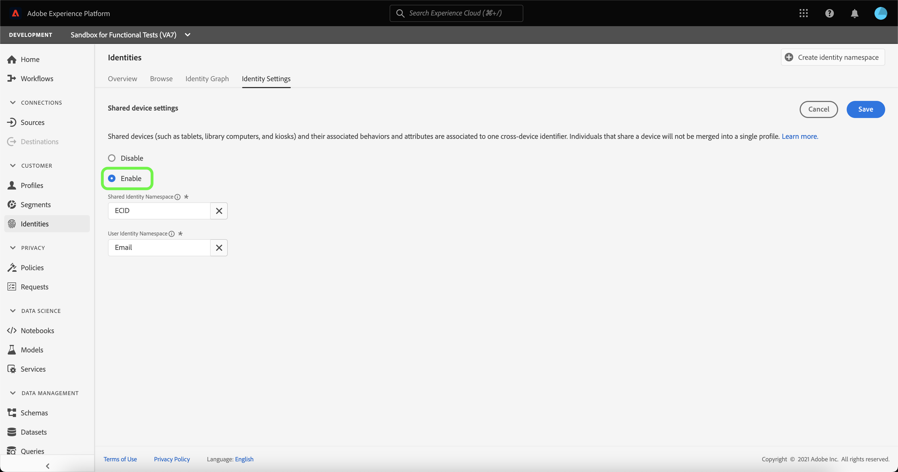

# Panoramica di Rilevamento dispositivi condivisi (Beta)

>[!IMPORTANT]
>
>La funzionalità [!DNL Shared Device Detection] è in versione beta. Le sue funzioni e la sua documentazione sono soggette a modifiche.

Adobe Experience Platform [!DNL Identity Service] consente di ottenere una migliore visualizzazione dei clienti e del loro comportamento collegando le identità tra dispositivi e sistemi, consentendo di fornire esperienze digitali personali e di impatto in tempo reale.

[!DNL Shared Device] fa riferimento a dispositivi utilizzati da più utenti. Alcuni esempi di dispositivi condivisi sono tablet, computer di libreria e chioschi. Grazie alla funzionalità [!DNL Shared Device Detection], è possibile impedire che utenti diversi dello stesso dispositivo vengano uniti in un&#39;unica identità, consentendo una rappresentazione più accurata di un singolo utente.

Con [!DNL Shared Device Detection] è possibile:

* Creare grafici di identità separati per utenti diversi dello stesso dispositivo;
* impedire che si mescolino dati provenienti da individui diversi che utilizzano lo stesso dispositivo;
* Genera una visualizzazione più pulita e precisa dei tuoi clienti.

>[!TIP]
>
>Le configurazioni per [!DNL Shared Device Detection] devono essere completate prima di abilitare il profilo per il set di dati perché non è più possibile rivedere le impostazioni una volta generati i grafici in [!DNL Identity Service].

## Guida introduttiva a [!DNL Shared Device Detection]

L&#39;utilizzo di [!DNL Shared Device Detection] richiede una conoscenza dei vari servizi di Platform coinvolti. Prima di iniziare a utilizzare [!DNL Shared Device Detection], consulta la documentazione dei seguenti servizi:

* [[!DNL Identity Service]](./home.md): Ottieni una migliore visualizzazione dei singoli clienti e del loro comportamento collegando le identità tra dispositivi e sistemi.
   * [Visualizzatore grafo identità](./features/identity-graph-viewer.md): visualizza e interagisce con il visualizzatore grafo identità per comprendere meglio come e in quali modi le identità dei clienti sono unite tra loro.
   * [Spazi dei nomi di identità](./features/namespaces.md): scopri i componenti di un&#39;identità completa e come gli spazi dei nomi di identità ti consentono di distinguere il contesto e il tipo di un&#39;identità.

## Comprensione di [!DNL Shared Device Detection]

È importante comprendere la seguente terminologia quando si lavora con
[!DNL Shared Device Detection]. Per un elenco dei termini essenziali per comprendere [!DNL Shared Device Detection], vedere la tabella seguente.

### Terminologia

| Termini | Definizione |
| --- | --- |
| Dispositivo condiviso | Per dispositivo condiviso si intende qualsiasi dispositivo utilizzato da più utenti. Alcuni esempi di dispositivi condivisi sono tablet, computer di libreria e chioschi. |
| [!DNL Shared Device Detection] | [!DNL Shared Device Detection] fa riferimento a un&#39;impostazione di configurazione che consente di separare i dati di utenti diversi dello stesso dispositivo. |
| Spazio dei nomi dell’identità condivisa | Lo spazio dei nomi dell’identità condivisa rappresenta il dispositivo che può essere utilizzato da più utenti. Lo spazio dei nomi dell’identità condivisa è in genere l’ECID, ma può essere impostato su altri ID dispositivo. |
| Spazio dei nomi identità utente | Lo spazio dei nomi User Identity rappresenta l&#39;utente autenticato (connesso) di un dispositivo condiviso. |
| Ultimo utente autenticato | L&#39;ultimo utente autenticato rappresenta l&#39;utente che ha eseguito l&#39;ultimo accesso a un dispositivo, se un dispositivo è connesso da più account. |

{style="table-layout:auto"}

[!DNL Shared Device Detection] funziona stabilendo due spazi dei nomi: **Spazio dei nomi dell&#39;identità condivisa** e **Spazio dei nomi dell&#39;identità utente**.

* Lo spazio dei nomi dell’identità condivisa rappresenta il dispositivo che può essere utilizzato da più utenti. L’Adobe consiglia ai clienti di utilizzare ECID come identificatore del dispositivo condiviso.
* Lo spazio dei nomi dell’identità utente è mappato allo spazio dei nomi dell’identità che corrisponde all’ID di accesso di un utente. Può trattarsi dell’ID del sistema di gestione delle relazioni con i clienti, dell’indirizzo e-mail, dell’e-mail con hash o del numero di telefono di un utente.

Un dispositivo condiviso, come un tablet, ha un singolo **Spazio dei nomi identità condiviso**. Ogni utente di un dispositivo condiviso ha invece uno spazio dei nomi **Identità utente** designato, che corrisponde ai rispettivi ID di accesso. Ad esempio, una tavoletta condivisa da Kevin e Nora per l&#39;utilizzo da parte dell&#39;e-commerce ha il proprio ECID di `1234`, mentre Kevin ha il proprio spazio dei nomi Identità utente mappato al proprio account `kevin@email.com` e Nora ha il proprio spazio dei nomi Identità utente mappato al proprio account `nora@email.com`.

[!DNL Shared Device Detection] è in grado di fare distinzioni tra più utenti dello stesso dispositivo collegando lo spazio dei nomi dell&#39;identità condivisa (ad esempio ECID) con lo spazio dei nomi User Identity (ID accesso) dell’ultimo utente autenticato.

### Invio dei dati di identità a un grafico delle identità

Considera l&#39;esempio seguente per comprendere il funzionamento di [!DNL Shared Device Detection]:

>[!NOTE]
>
>In questo diagramma, lo spazio dei nomi dell’identità condivisa è configurato in ECID e lo spazio dei nomi dell’identità utente in ID CRM.

* Kevin e Nora condividono un tablet per visitare un sito web di e-commerce. Tuttavia, entrambi dispongono di una propria contabilità indipendente che utilizzano ciascuno per navigare e fare acquisti online;
   * In quanto dispositivo condiviso, il tablet ha un ECID corrispondente che rappresenta l’ID cookie del browser web del tablet;
* Supponiamo che Kevin utilizzi il tablet e **acceda** al suo account di e-commerce per cercare le cuffie, ciò significa che l&#39;ID CRM di Kevin (**Spazio dei nomi identità utente**) è ora collegato all&#39;ECID del tablet (**Spazio dei nomi identità condivisa**). I dati di navigazione del tablet sono ora incorporati con il grafo delle identità di Kevin.
   * Se Kevin **si disconnette** e Nora utilizza il tablet e **accede** al proprio account e acquista una fotocamera, il suo ID CRM è ora collegato all&#39;ECID del tablet. Pertanto, i dati di navigazione del tablet sono ora incorporati con il grafo di identità di Nora.
   * Se Nora **non effettua la disconnessione** e Kevin utilizza il tablet, ma **non effettua l&#39;accesso**, i dati di esplorazione del tablet vengono comunque incorporati con Nora, perché rimane l&#39;utente autenticato e il suo ID CRM è ancora collegato all&#39;ECID del tablet.
   * Se Nora **si disconnette** e Kevin utilizza il tablet, ma **non effettua l&#39;accesso**, i dati di navigazione del tablet vengono comunque incorporati nel grafo delle identità di Nora, perché come **ultimo utente autenticato**, il suo ID CRM rimane collegato all&#39;ECID del tablet.
   * Se Kevin **effettua di nuovo l&#39;accesso**, il suo ID CRM viene ora collegato all&#39;ECID del tablet, perché è l&#39;ultimo utente autenticato e i dati di navigazione del tablet sono ora incorporati con il suo grafo delle identità.

### Come [!DNL Profile Service] unisce i frammenti di profilo con [!DNL Shared Device Detection] abilitato

[!DNL Profile Service] prende nota dei frammenti di profilo e dei profili uniti. Ogni singolo profilo cliente è composto da più frammenti di profilo che sono stati uniti per formare un’unica vista di quel cliente. Ad esempio, se un cliente interagisce con il tuo marchio su più canali, la tua organizzazione avrà più frammenti di profilo relativi a quel singolo cliente che appaiono in più set di dati. Quando questi frammenti vengono acquisiti in Platform, vengono uniti per creare un unico profilo per quel cliente.

Quando [!DNL Shared Device Detection] è abilitato, [!DNL Profile] definisce l&#39;identità primaria del frammento di profilo in base al fatto che l&#39;evento esperienza sia autenticato o meno

Un **evento esperienza autenticato** è un&#39;azione completata da un utente durante l&#39;accesso a un dispositivo. Per gli eventi di esperienza autenticati, l&#39;identità primaria è lo spazio dei nomi **Identità utente** (ID accesso). Un **evento esperienza non autenticato** è un&#39;azione completata da un utente che non ha effettuato l&#39;accesso a un dispositivo. Per gli eventi di esperienza non autenticati, l&#39;identità primaria è lo **spazio dei nomi dell&#39;identità condivisa** (ECID).

Per ulteriori informazioni, vedere la [[!DNL Real-Time Customer Profile] panoramica](../profile/home.md).

## Interfaccia utente per dispositivi condivisi

Nell&#39;interfaccia utente di Platform, seleziona **[!UICONTROL Identità]** dalla barra di navigazione a sinistra, quindi seleziona **[!UICONTROL Impostazioni identità]**.

Viene visualizzata la pagina [!UICONTROL Impostazioni dispositivo condiviso], che fornisce un&#39;interfaccia per configurare le impostazioni del dispositivo condiviso per i dati. Le impostazioni dei dispositivi condivisi sono disattivate per impostazione predefinita.

Quando questa opzione è attivata, le impostazioni per i dispositivi condivisi consentono di separare i dati di utenti diversi dello stesso dispositivo. Questa impostazione di configurazione consente una rappresentazione più pulita e precisa dei grafici di identità, in cui le identità utente dello stesso dispositivo non vengono combinate tra loro.

Seleziona **[!UICONTROL Abilita]** per iniziare a modificare le impostazioni del dispositivo condiviso.

Vengono visualizzate le opzioni di configurazione [!UICONTROL Spazio dei nomi identità condivisa] e [!UICONTROL Spazio dei nomi identità utente], che consentono di modificare gli spazi dei nomi delle identità che si desidera utilizzare.

[!UICONTROL Spazio dei nomi identità condivisa] rappresenta un singolo dispositivo utilizzato da più utenti diversi. Questo spazio dei nomi è sempre impostato su **[!UICONTROL ECID]** perché tutti gli utenti di Platform utilizzano **[!UICONTROL ECID]** come identificatore del browser Web.

Lo spazio dei nomi dell&#39;[!UICONTROL identità utente] consente di identificare utenti diversi dello stesso dispositivo e di impedire la combinazione dei dati nello stesso grafico delle identità.

Selezionare la barra di ricerca **[!UICONTROL Spazio dei nomi identità utente]** e immettere uno spazio dei nomi identità oppure selezionare uno spazio dei nomi identità dal menu a discesa.

>[!TIP]
>
>Lo spazio dei nomi dell&#39;[!UICONTROL identità utente] deve essere mappato allo spazio dei nomi dell&#39;identità che corrisponde all&#39;ID di accesso dell&#39;utente finale. Le opzioni includono ID cliente, e-mail e e-mail con hash.

Dopo aver configurato le [!UICONTROL impostazioni dispositivo condiviso], seleziona **[!UICONTROL Salva]**.

Viene visualizzata una finestra pop-up che richiede di confermare la selezione. Seleziona **[!UICONTROL Sì]** per completare l&#39;impostazione di configurazione.

