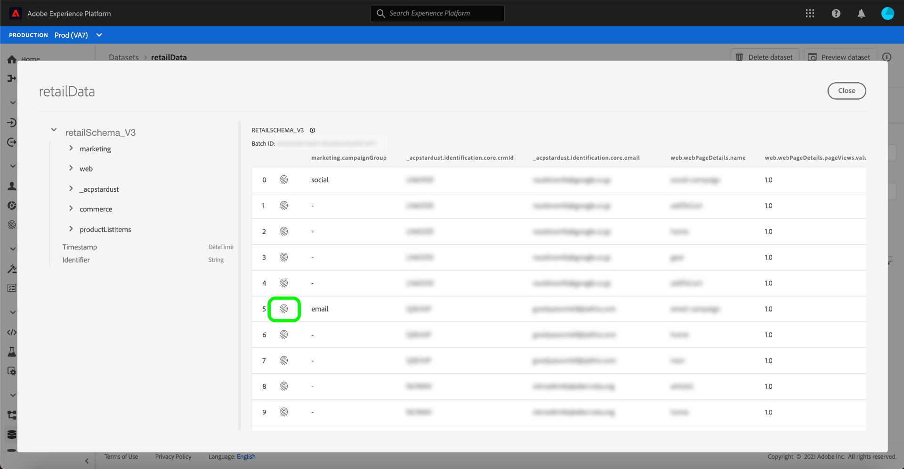
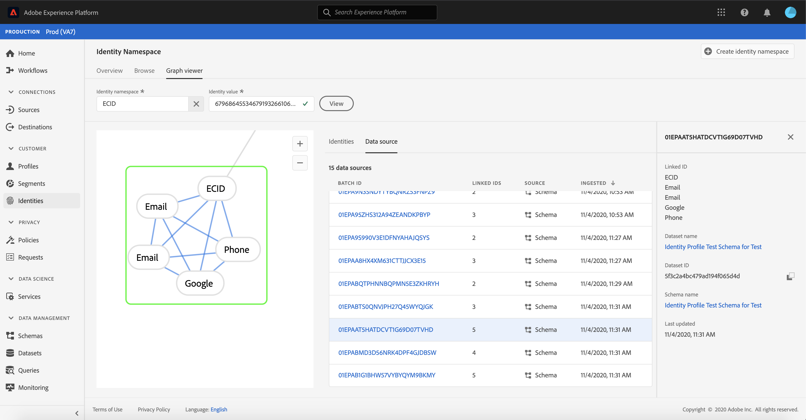

# Panoramica del visualizzatore del grafico di identità

Un grafico delle identità è una mappa delle relazioni tra identità diverse per un particolare cliente, che fornisce una rappresentazione visiva di come il cliente interagisce con il tuo marchio su diversi canali. Tutti i grafici dell’identità del cliente vengono gestiti e aggiornati collettivamente da Adobe Experience Platform Identity Service in tempo quasi reale, in risposta all’attività del cliente.

Il visualizzatore del grafico delle identità nell’interfaccia utente di Platform ti consente di visualizzare e comprendere meglio quali sono le identità dei clienti unite e in che modo. Il visualizzatore consente di trascinare e interagire con diverse parti del grafico, consentendoti di esaminare relazioni di identità complesse, eseguire il debug in modo più efficiente e beneficiare di una maggiore trasparenza nell’utilizzo delle informazioni.

## Video tutorial

Il video seguente ha lo scopo di supportare la comprensione del visualizzatore grafico dell’identità.

>[!VIDEO](https://video.tv.adobe.com/v/331030/?quality=12&learn=on)

## Introduzione

Lavorare con il visualizzatore grafico dell&#39;identità richiede una comprensione dei vari servizi Adobe Experience Platform coinvolti. Prima di iniziare a lavorare con il visualizzatore grafico delle identità, controlla la documentazione relativa ai seguenti servizi:

- [[!DNL Identity Service]](../home.md): Ottieni una visione migliore dei singoli clienti e del loro comportamento attraverso il collegamento delle identità tra dispositivi e sistemi.

### Terminologia

- **Identità (nodo):** Un&#39;identità o un nodo sono dati unici di un&#39;entità, in genere una persona. Un&#39;identità è composta da uno spazio dei nomi e un valore di identità.
- **Collegamento (bordo):** Un collegamento o un bordo rappresenta la connessione tra le identità.
- **Grafico (cluster):** Un grafico o un cluster è un gruppo di identità e collegamenti che rappresentano una persona.

## Accedere al visualizzatore grafico delle identità {#access-identity-graph-viewer}

Per utilizzare il visualizzatore grafico delle identità nell’interfaccia utente, seleziona **[!UICONTROL Identità]** nella navigazione a sinistra, quindi seleziona la **[!UICONTROL Grafico di identità]** scheda . Da **[!UICONTROL Namespace Identity]** fai clic su **[!UICONTROL Seleziona spazio dei nomi identità]** per cercare lo spazio dei nomi che si intende utilizzare.

La **[!UICONTROL Seleziona spazio dei nomi identità]** viene visualizzato il pannello . Questa schermata contiene un elenco dei namespace disponibili per la tua organizzazione, incluse informazioni sui namespace **[!UICONTROL Nome visualizzato]**, **[!UICONTROL Simbolo di identità]**, **[!UICONTROL Proprietario]**, **[!UICONTROL Ultimo aggiornamento]** data e **[!UICONTROL Descrizione]**. È possibile utilizzare uno qualsiasi dei namespace forniti a condizione che vi sia collegato un valore di identità valido.

Seleziona lo spazio dei nomi da utilizzare e fai clic su **[!UICONTROL Seleziona]** per procedere.

Dopo aver selezionato uno spazio dei nomi, inserisci il valore corrispondente per un particolare cliente nel **[!UICONTROL Valore identità]** casella di testo e seleziona **[!UICONTROL Visualizza]**.

### Accedere al visualizzatore del grafico delle identità dai set di dati

Puoi anche accedere al visualizzatore del grafico delle identità utilizzando l’interfaccia set di dati. Dai set di dati [!UICONTROL Sfoglia] , seleziona un set di dati con cui desideri interagire, quindi seleziona **[!UICONTROL Anteprima set di dati]**

Dalla finestra di anteprima, seleziona un’icona dell’impronta digitale per visualizzare le identità rappresentate dal visualizzatore grafico dell’identità.

>[!TIP]
>
>L’icona dell’impronta digitale viene visualizzata solo se il set di dati presenta due o più identità.

Viene visualizzato il visualizzatore del grafico delle identità. Sul lato sinistro dello schermo è riportato il grafico delle identità che mostra tutte le identità collegate allo spazio dei nomi selezionato e il valore di identità immesso. Ogni nodo di identità è costituito da uno spazio dei nomi e dal relativo valore ID. Puoi selezionare e mantenere qualsiasi identità da trascinare e interagire con il grafico. In alternativa, puoi passare il puntatore del mouse su un&#39;identità per visualizzare le informazioni sul suo valore ID. L&#39;output grafico viene visualizzato anche come elenco presentato al centro dello schermo.

>[!IMPORTANT]
>
>Un grafico delle identità richiede la generazione di almeno due identità collegate, nonché uno spazio dei nomi e una coppia ID validi. Il numero massimo di identità visualizzabili dal visualizzatore grafico è 150. Consulta la sezione [appendice](#appendix) per ulteriori informazioni, consulta la sezione seguente.

Selezionare un&#39;identità per aggiornare la riga evidenziata **[!UICONTROL Identità]** e per aggiornare le informazioni fornite nella barra a destra, che include **[!UICONTROL Valore]**, **[!UICONTROL ID batch]** e le sue **[!UICONTROL Ultimo aggiornamento]** data.

Puoi filtrare attraverso un grafico e isolare uno specifico spazio dei nomi utilizzando l’opzione di ordinamento disponibile sopra **[!UICONTROL Identità]** tabella. Dal menu a discesa, seleziona lo spazio dei nomi da evidenziare.

Viene restituito il visualizzatore grafico, evidenziando lo spazio dei nomi selezionato. L’opzione di filtro aggiorna anche la **[!UICONTROL Identità]** per restituire informazioni solo per lo spazio dei nomi selezionato.

L’angolo in alto a destra della casella del visualizzatore grafico contiene opzioni per l’ingrandimento. Seleziona la **(+)** icona per ingrandire il grafico o **(-)** icona per ridurre lo zoom.

Per visualizzare ulteriori informazioni sui batch, seleziona la **[!UICONTROL Origine dati]** dall’intestazione. La **[!UICONTROL Origine dati]** nella tabella viene visualizzato un elenco di **[!UICONTROL ID batch]** associati al grafico, nonché i relativi **[!UICONTROL ID collegati]**, lo schema di origine e la data di acquisizione.

Puoi selezionare uno qualsiasi dei collegamenti all’interno di un grafico delle identità per visualizzare tutti i batch di origine che hanno contribuito al collegamento.

In alternativa, è possibile selezionare un batch per visualizzare tutti i collegamenti a cui ha contribuito questo batch.

I grafici di identità con più grandi raggruppamenti di identità sono accessibili anche attraverso il visualizzatore di grafici di identità.

## Appendice

La sezione seguente fornisce informazioni aggiuntive su come utilizzare il visualizzatore grafico delle identità.

### Informazioni sui messaggi di errore

Possono verificarsi errori quando si accede al visualizzatore grafico dell’identità. Di seguito è riportato un elenco di prerequisiti e limitazioni di cui tenere conto quando si lavora con il visualizzatore grafico dell’identità.

- Un valore di identità deve esistere nello spazio dei nomi selezionato.
- Il visualizzatore del grafico delle identità richiede almeno due identità collegate da generare. È possibile che ci sia un solo valore di identità e nessuna identità collegata, e in questo caso, il valore esisterebbe solo in [!DNL Profile] visualizzatore.
- Il visualizzatore del grafico delle identità non può superare il massimo di 150 identità.

## Passaggi successivi

Leggendo questo documento, hai imparato a esplorare i grafici di identità dei tuoi clienti nell’interfaccia utente di Platform. Per ulteriori informazioni sulle identità in Platform, consulta la [Panoramica del servizio Identity](../home.md)

## Changelog

| Data | Azione |
| ---- | ------ |
| 2021-01 | <ul><li>È stato aggiunto il supporto per lo streaming di dati acquisiti e sandbox non di produzione.</li><li>Correzioni di bug minori.</li></ul> |
| 2021-02 | <ul><li>Il visualizzatore del grafico di identità è accessibile tramite l’anteprima del set di dati.</li><li>Correzioni di bug minori.</li><li>Il visualizzatore del grafico di identità è reso generalmente disponibile.</li></ul> |
