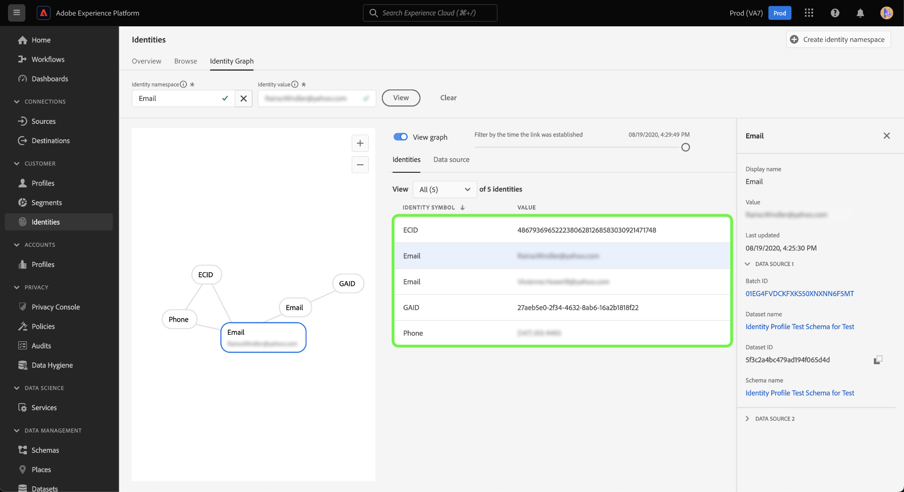
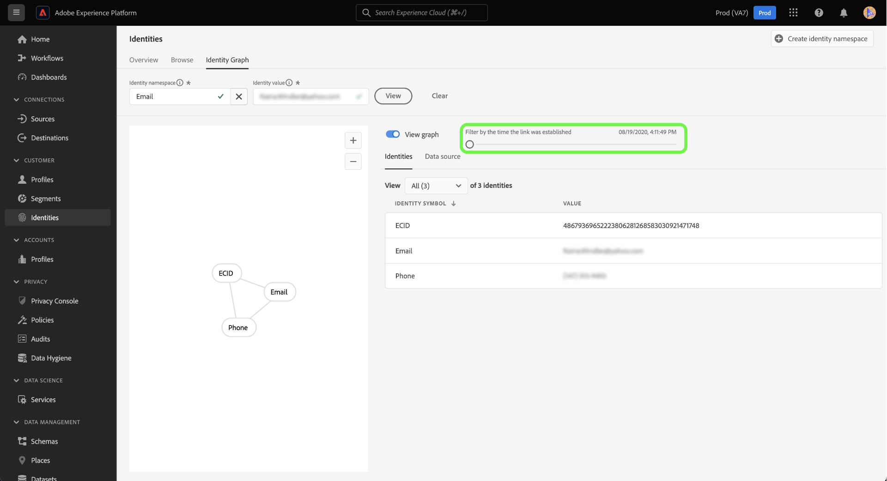

# Visualizzatore del grafico delle identità

Un grafo di identità è una mappa delle relazioni tra identità diverse per un particolare cliente, che fornisce una rappresentazione visiva di come il cliente interagisce con il brand su canali diversi. Tutti i grafici dell’identità del cliente vengono gestiti e aggiornati collettivamente da Adobe Experience Platform Identity Service in tempo quasi reale, in risposta all’attività del cliente.

Il visualizzatore del grafico delle identità nell’interfaccia utente di Platform consente di visualizzare e comprendere meglio quali identità dei clienti sono unite tra loro e in quali modi. Il visualizzatore consente di trascinare e interagire con diverse parti del grafico, consentendoti di esaminare relazioni di identità complesse, eseguire il debug in modo più efficiente e beneficiare di una maggiore trasparenza nell’utilizzo delle informazioni.

Il documento seguente illustra come accedere e utilizzare il visualizzatore del grafico delle identità nell’interfaccia utente di Platform.

## Video tutorial

Il video seguente ha lo scopo di facilitare la comprensione del visualizzatore del grafico delle identità.

>[!VIDEO](https://video.tv.adobe.com/v/331030/?quality=12&learn=on)

## Introduzione

L’utilizzo del visualizzatore del grafo delle identità richiede una comprensione dei vari servizi Adobe Experience Platform coinvolti. Prima di iniziare a utilizzare il visualizzatore del grafico delle identità, consulta la documentazione per i seguenti servizi:

- [[!DNL Identity Service]](../home.md): ottieni una visione migliore dei singoli clienti e del loro comportamento collegando le identità tra dispositivi e sistemi.
- [Profilo cliente in tempo reale](../../profile/home.md): i grafici delle identità vengono utilizzati da Real-Time Customer Profile per creare una visualizzazione completa e unica degli attributi e del comportamento dei clienti.

### Terminologia

- **Identità (nodo):** Un’identità o un nodo sono dati univoci relativi a un’entità, in genere una persona. Un’identità è composta da uno spazio dei nomi dell’identità e da un valore di identità. Ad esempio, un’identità completa potrebbe essere costituita da uno spazio dei nomi dell’identità per **E-mail**, combinato con un valore di identità di **pettirosso@email.com**.
- **Collegamento (bordo):** Un collegamento o un bordo rappresenta la connessione tra identità. I collegamenti di identità includono proprietà come i timestamp del primo stabilito e dell’ultimo aggiornamento. La prima marca temporale stabilita definisce la data e l’ora in cui una nuova identità è collegata a un’identità esistente. La marca temporale dell’ultimo aggiornamento definisce la data e l’ora dell’ultimo aggiornamento di un collegamento di identità esistente.
- **Grafico (cluster):** Un grafico o un cluster è un gruppo di identità e collegamenti che rappresentano una persona.

## Accedere al visualizzatore del grafico delle identità {#access-identity-graph-viewer}

Nell’interfaccia utente di Platform, seleziona **[!UICONTROL Identità]** nel menu di navigazione a sinistra, quindi seleziona **[!UICONTROL Grafico delle identità]** dall’elenco di schede nell’intestazione.

Per visualizzare un grafo delle identità, fornisci uno spazio dei nomi delle identità e il relativo valore corrispondente, quindi seleziona **[!UICONTROL Visualizza]**.

>[!TIP]
>
>Seleziona l’icona della tabella  per visualizzare un pannello con un elenco di tutti gli spazi dei nomi di identità disponibili nell’organizzazione. Puoi utilizzare uno qualsiasi degli spazi dei nomi di identità purché sia connesso un valore di identità valido. Per ulteriori informazioni, leggere [guida allo spazio dei nomi delle identità](../namespaces.md).

## Interfaccia del visualizzatore del grafico delle identità

L’interfaccia del visualizzatore del grafico delle identità è costituita da diversi elementi che puoi utilizzare per interagire con e comprendere meglio i dati di identità.

Il grafo delle identità visualizza tutte le identità collegate alla combinazione di spazio dei nomi e valore dell’identità immessa. Ogni nodo è costituito da uno spazio dei nomi di identità e dal relativo valore corrispondente. Puoi selezionare, tenere premuto e trascinare qualsiasi nodo per interagire con il grafico. In alternativa, puoi passare il cursore su un nodo per visualizzare informazioni sul valore di identità corrispondente. Seleziona **[!UICONTROL Visualizza grafico]** per nascondere o visualizzare il grafico.

>[!IMPORTANT]
>
>Un grafo delle identità richiede la generazione di almeno due identità collegate e una combinazione valida di spazio dei nomi e valore dell’identità. Il numero massimo di identità visualizzabili dal visualizzatore grafico è 50. Consulta la [appendice](#appendix) per ulteriori informazioni.

Seleziona un collegamento all’interno del grafico per visualizzare il set di dati e l’ID batch che contribuiscono a tale collegamento. Selezionando un collegamento si aggiorna anche la barra a destra per fornire ulteriori informazioni sui dettagli dell’origine dati, nonché proprietà quali i timestamp stabiliti per la prima volta e aggiornati per l’ultima volta.

Il [!UICONTROL Identità] La tabella fornisce una visualizzazione diversa dei dati di identità, elencando in formato tabulare lo spazio dei nomi dell’identità e la combinazione di valori di identità. La selezione di un nodo nel grafico aggiornerà la riga evidenziata nel [!UICONTROL Identità] tabella.

Utilizza il menu a discesa per ordinare i dati del grafico ed evidenziare le informazioni su uno spazio dei nomi di identità specifico. Ad esempio, seleziona **[!UICONTROL E-mail]** dal menu per visualizzare i dati specifici dello spazio dei nomi dell’identità e-mail.

La barra a destra mostra le informazioni su un’identità selezionata, incluso il timestamp dell’ultimo aggiornamento. La barra a destra visualizza inoltre informazioni sull’origine dati che corrispondono all’identità selezionata, tra cui l’ID batch, il nome del set di dati, l’ID set di dati e il nome dello schema.

La tabella seguente fornisce informazioni aggiuntive sulle proprietà dell’origine dati visualizzate nella barra a destra:

| Origine dati | Descrizione |
| --- | --- | 
| ID batch | L’identificatore generato automaticamente che corrisponde ai dati batch. |
| ID set di dati | L’identificatore generato automaticamente che corrisponde al set di dati. |
| Nome del set di dati | Nome del set di dati che contiene i dati batch. |
| Nome dello schema | Nome dello schema. Lo schema fornisce un set di regole che rappresentano e convalidano la struttura e il formato dei dati. |

È inoltre possibile utilizzare *[!UICONTROL Origine dati]* per visualizzare un elenco di origini dati che contribuiscono alle tue identità. Seleziona [!UICONTROL Origine dati] per una visualizzazione tabulare dei set di dati e degli ID batch.

Utilizza il cursore per filtrare i dati del grafico in base al momento in cui le identità sono state stabilite per la prima volta. Per impostazione predefinita, il visualizzatore del grafico delle identità visualizza tutte le identità collegate all’interno del grafico. Tieni premuto e trascina il cursore per regolare l’ora dell’ultimo timestamp in cui una nuova identità è stata collegata al grafico. Nell’esempio seguente, il grafico mostra che il collegamento di identità più recente (GAID) è stato stabilito in **[!UICONTROL 08/19/2020, 4:29:29 PM]**.

Regola il cursore per vedere che è stato stabilito un altro collegamento di identità (e-mail) su **[!UICONTROL 08/19/2020, 4:25:22:00]**.

Potete anche regolare il cursore per visualizzare la prima iterazione del grafico. Nell’esempio seguente, il visualizzatore del grafico delle identità mostra che il grafico è stato creato per la prima volta il **[!UICONTROL 08/19/2020, 4:11:16:00]**, i cui primi collegamenti sono ECID, E-mail e Telefono.

## Appendice

La sezione seguente fornisce informazioni aggiuntive sull’utilizzo del visualizzatore del grafico delle identità.

### Informazioni sui messaggi di errore

Possono verificarsi errori durante l’accesso al visualizzatore del grafico delle identità. Di seguito è riportato un elenco di prerequisiti e limitazioni da considerare quando si lavora con il visualizzatore del grafico delle identità.

- Un valore di identità deve esistere nello spazio dei nomi selezionato.
- Il visualizzatore del grafo delle identità richiede almeno due identità collegate da generare. È possibile che esista un solo valore di identità e che non siano presenti identità collegate e, in questo caso, che il valore esista solo in [!DNL Profile] visualizzatore.
- Il visualizzatore del grafo delle identità non può superare il massimo di 50 identità.

### Accedere al visualizzatore del grafico delle identità dai set di dati

Puoi anche accedere al visualizzatore del grafico delle identità utilizzando l’interfaccia dei set di dati. Dai set di dati [!UICONTROL Sfoglia] , seleziona un set di dati con cui desideri interagire, quindi seleziona **[!UICONTROL Anteprima set di dati]**

Nella finestra di anteprima, seleziona un’icona di impronta digitale per visualizzare le identità rappresentate tramite il visualizzatore del grafico delle identità.

>[!TIP]
>
>L’icona dell’impronta digitale viene visualizzata solo se il set di dati ha due o più identità.

## Passaggi successivi

Dopo aver letto questo documento, hai imparato a esplorare i grafici delle identità dei tuoi clienti nell’interfaccia utente di Platform. Per ulteriori informazioni sulle identità in Platform, consulta [Panoramica del servizio Identity](../home.md)

## Changelog

| Data | Azione |
| ---- | ------ |
| 01/2021 | <ul><li>È stato aggiunto il supporto per lo streaming di dati acquisiti e di sandbox non di produzione.</li><li>Correzioni di bug minori.</li></ul> |
| 02/2021 | <ul><li>Il visualizzatore del grafico delle identità è reso accessibile tramite l’anteprima del set di dati.</li><li>Correzioni di bug minori.</li><li>Il visualizzatore del grafo delle identità è reso disponibile in generale.</li></ul> |
| 01/2023 | <ul><li>Aggiornamenti dell’interfaccia utente.</li></ul> |
