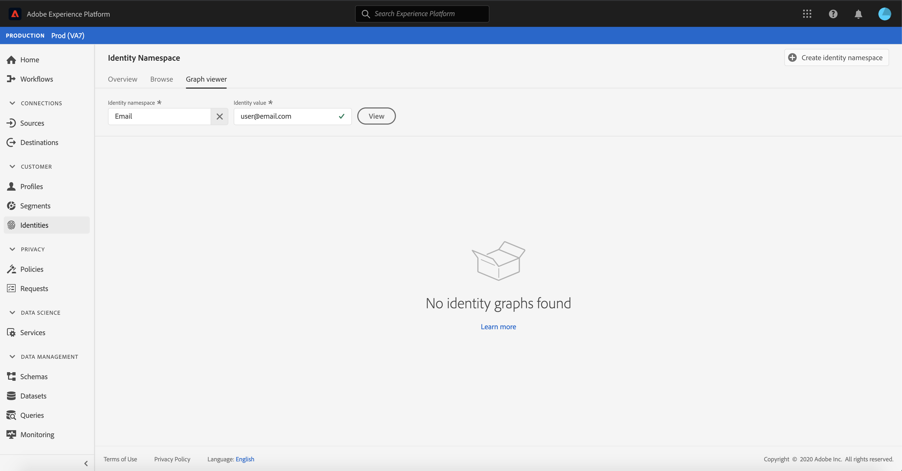

# (Beta) Visualizzatore grafico identità

>[!NOTE]
>
>Il visualizzatore del grafico dell&#39;identità è attualmente in versione beta. Le sue caratteristiche sono soggette a modifiche.

Un grafico di identità è una mappa delle relazioni tra identità diverse per un particolare cliente, che fornisce una rappresentazione visiva del modo in cui il cliente interagisce con il proprio marchio tra canali diversi. Tutti i grafici dell&#39;identità del cliente vengono gestiti e aggiornati collettivamente da Adobe Experience Platform Identity Service in tempo quasi reale, in risposta all&#39;attività del cliente.

Il visualizzatore grafico dell&#39;identità nell&#39;interfaccia utente della piattaforma consente di visualizzare e capire meglio le identità dei clienti unite e in che modo. Il visualizzatore consente di trascinare e interagire con diverse parti del grafico, consentendo di esaminare complesse relazioni di identità, eseguire il debug in modo più efficiente e sfruttare una maggiore trasparenza con il modo in cui vengono utilizzate le informazioni.

## Introduzione

Per utilizzare il visualizzatore grafico dell&#39;identità è necessario conoscere i diversi servizi Adobe Experience Platform coinvolti. Prima di iniziare a lavorare con il visualizzatore grafico dell&#39;identità, consulta la documentazione relativa ai seguenti servizi:

- [[!DNL Identity Service]](../home.md): Ottenete una visione migliore dei singoli clienti e del loro comportamento, collegando le identità tra dispositivi e sistemi.

### Terminologia

- **Identità (nodo):** un&#39;identità o un nodo è un dato univoco per un&#39;entità, in genere una persona. Un&#39;identità è composta da uno spazio dei nomi e un valore di identità.
- **Collegamento (bordo):** Un collegamento o un bordo rappresenta la connessione tra le identità.
- **Grafico (cluster):** Un grafico o un cluster è un gruppo di identità e collegamenti che rappresentano una persona.

## Accesso al visualizzatore del grafico dell&#39;identità

Per utilizzare il visualizzatore del grafico dell&#39;identità nell&#39;interfaccia utente, selezionate **[!UICONTROL Identities]** nel menu di navigazione a sinistra, quindi selezionate la scheda **[!UICONTROL Identity graph]**. Dalla schermata **[!UICONTROL Identity Namespace]**, fare clic sull&#39;icona **[!UICONTROL Select identity namespace]** per cercare lo spazio dei nomi che si intende utilizzare.

Viene visualizzato il pannello **[!UICONTROL Select identity namespace]**. Questa schermata contiene un elenco di spazi dei nomi disponibili per l&#39;organizzazione, con informazioni su **[!UICONTROL Display name]**, **[!UICONTROL Identity symbol]**, **[!UICONTROL Owner]**, **[!UICONTROL Last updated]** data e **[!UICONTROL Description]** di uno spazio dei nomi. È possibile utilizzare uno qualsiasi degli spazi dei nomi forniti a condizione che vi sia collegato un valore di identità valido.

Selezionare lo spazio dei nomi che si desidera utilizzare e fare clic su **[!UICONTROL Select]** per proseguire.

Dopo aver selezionato uno spazio nomi, immettete il valore corrispondente per un cliente specifico nella casella di testo **[!UICONTROL Identity value]** e selezionate **[!UICONTROL View]**.

Viene visualizzato il visualizzatore del grafico dell&#39;identità. Sul lato sinistro dello schermo è riportato il grafico dell&#39;identità che visualizza tutte le identità collegate allo spazio dei nomi selezionato e il valore dell&#39;identità immesso. Ogni nodo di identità è costituito da uno spazio dei nomi e dal valore ID corrispondente. Potete selezionare e mantenere qualsiasi identità da trascinare e interagire con il grafico. In alternativa, puoi passare il puntatore del mouse su un&#39;identità per visualizzare informazioni sul suo valore ID. L’output del grafico viene visualizzato anche come elenco al centro dello schermo.

>[!IMPORTANT]
>
>Un grafico dell&#39;identità richiede la generazione di almeno due identità collegate, nonché una coppia di nomi e ID valida. Il numero massimo di identità visualizzabili dal visualizzatore grafico è 150. Per ulteriori informazioni, vedere la sezione [appendice](#appendix) di seguito.

Selezionare un&#39;identità per aggiornare la riga evidenziata nella tabella **[!UICONTROL Identities]** e per aggiornare le informazioni fornite nella barra a destra, che include **[!UICONTROL Value]**, **[!UICONTROL Batch ID]** dell&#39;identità e la data **[!UICONTROL Last updated]**.

Potete filtrare attraverso un grafico e isolare uno specifico spazio nomi utilizzando l&#39;opzione di ordinamento sopra la tabella **[!UICONTROL Identities]**. Dal menu a discesa, selezionate lo spazio nomi da evidenziare.

Il visualizzatore grafico restituisce un valore che evidenzia lo spazio nomi selezionato. L&#39;opzione del filtro consente inoltre di aggiornare la tabella **[!UICONTROL Identities]** per restituire informazioni solo per lo spazio dei nomi selezionato.

L’angolo superiore destro della casella del visualizzatore grafico contiene le opzioni per l’ingrandimento. Selezionate l&#39;icona **(+)** per ingrandire il grafico oppure l&#39;icona **(-)** per ridurre lo zoom.

Per visualizzare ulteriori informazioni sui batch, selezionare **[!UICONTROL Data source]** dall&#39;intestazione. La tabella **[!UICONTROL Data source]** visualizza un elenco di **[!UICONTROL Batch IDs]** associati al grafico, nonché il relativo **[!UICONTROL Linked IDs]**, lo schema di origine e la data di inserimento.

Potete selezionare uno qualsiasi dei collegamenti all&#39;interno di un grafico di identità per visualizzare tutti i batch di origine che hanno contribuito al collegamento.

In alternativa, potete selezionare un batch per visualizzare tutti i collegamenti a cui ha contribuito questo batch.

I grafici di identità con cluster di identità più grandi sono accessibili anche tramite il visualizzatore grafico di identità.

## Appendice

La sezione seguente contiene informazioni aggiuntive sull’utilizzo del visualizzatore grafico dell’identità.

### Informazioni sui messaggi di errore

Gli errori possono verificarsi quando si accede al visualizzatore del grafico dell&#39;identità. Di seguito è riportato un elenco di prerequisiti e limitazioni di cui tenere conto quando si utilizza il visualizzatore grafico dell’identità.

- Un valore di identità deve esistere nello spazio nomi selezionato.
- Il visualizzatore del grafico dell&#39;identità richiede almeno due identità collegate da generare. È possibile che esista un solo valore di identità e nessuna identità collegata e, in questo caso, il valore esiste solo nel visualizzatore [!DNL Profile].
- Il visualizzatore grafico dell&#39;identità non può superare il massimo di 150 identità.

## Passaggi successivi

Leggendo questo documento, hai imparato a esplorare i grafici di identità dei clienti nell&#39;interfaccia utente della piattaforma. Per ulteriori informazioni sulle identità nella piattaforma, fare riferimento alla [Panoramica del servizio identità](../home.md)