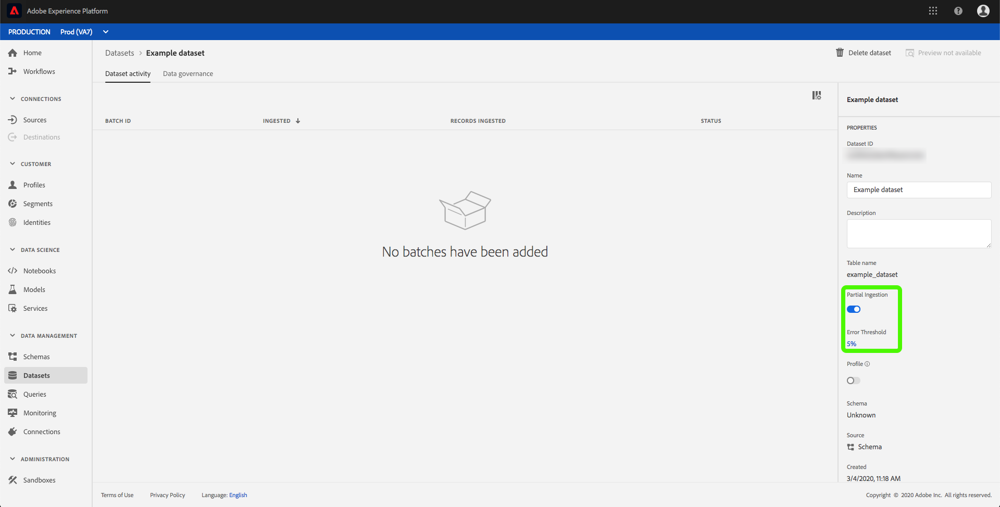

# Iniezione batch parziale (versione beta)

L&#39;assimilazione parziale dei batch è la capacità di assimilare i dati contenenti errori, fino a una determinata soglia. Grazie a questa funzionalità, gli utenti possono trasferire con successo tutti i dati corretti  Adobe Experience Platform mentre tutti i dati errati vengono inseriti in batch separatamente, insieme ai dettagli sul motivo per cui non sono validi.

Questo documento fornisce un’esercitazione per la gestione dell’assimilazione parziale dei batch.

Inoltre, l&#39; [appendice](#appendix) di questa esercitazione fornisce un riferimento per i tipi di errori di caricamento batch parziale.

>[!IMPORTANT]
>
>Questa funzione esiste solo utilizzando l&#39;API. Per accedere a questa funzione, contattate il team.

## Introduzione

Questa esercitazione richiede una conoscenza approfondita dei diversi servizi di Adobe Experience Platform  coinvolti nell&#39;assimilazione parziale dei batch. Prima di iniziare questa esercitazione, consulta la documentazione relativa ai seguenti servizi:

- [Caricamento](./overview.md)batch: Il metodo che Platform acquisisce e memorizza i dati dai file di dati, come CSV e Parquet.
- [Experience Data Model (XDM)](../../xdm/home.md): Framework standard con cui Platform organizza i dati sull&#39;esperienza dei clienti.

Le sezioni seguenti forniscono informazioni aggiuntive che sarà necessario conoscere per eseguire correttamente le chiamate alle API Platform.

### Lettura di chiamate API di esempio

Questa guida fornisce esempi di chiamate API per dimostrare come formattare le richieste. Questi includono percorsi, intestazioni richieste e payload di richieste formattati correttamente. Viene inoltre fornito un JSON di esempio restituito nelle risposte API. Per informazioni sulle convenzioni utilizzate nella documentazione per le chiamate API di esempio, vedete la sezione [come leggere le chiamate](../../landing/troubleshooting.md#how-do-i-format-an-api-request) API di esempio nella guida alla risoluzione dei problemi di  Experience Platform.

### Raccogli valori per le intestazioni richieste

Per effettuare chiamate alle API Platform, è prima necessario completare l&#39;esercitazione [di](../../tutorials/authentication.md)autenticazione. Completando l&#39;esercitazione sull&#39;autenticazione, vengono forniti i valori per ciascuna delle intestazioni richieste in tutte  chiamate API Experience Platform, come illustrato di seguito:

- Autorizzazione: Portatore `{ACCESS_TOKEN}`
- x-api-key: `{API_KEY}`
- x-gw-ims-org-id: `{IMS_ORG}`

Tutte le risorse in  Experience Platform sono isolate in sandbox virtuali specifiche. Tutte le richieste alle API Platform richiedono un&#39;intestazione che specifica il nome della sandbox in cui avrà luogo l&#39;operazione:

- x-sandbox-name: `{SANDBOX_NAME}`

>[!NOTE]
>
>Per ulteriori informazioni sulle sandbox in Platform, consultate la documentazione [sulla panoramica della](../../sandboxes/home.md)sandbox.

## Abilitare un set di dati per l&#39;assimilazione parziale dei batch nell&#39;API

<!-- >[!NOTE] This section describes enabling a dataset for partial batch ingestion using the API. For instructions on using the UI, please read the [enable a dataset for partial batch ingestion in the UI](#enable-a-dataset-for-partial-batch-ingestion-in-the-ui) step. -->

È possibile creare un nuovo set di dati o modificare un set di dati esistente con l&#39;inserimento parziale abilitato.

Per creare un nuovo set di dati, seguite i passaggi descritti nell&#39;esercitazione [sulla](../../catalog/api/create-dataset.md)creazione di un set di dati. Una volta raggiunto il passaggio *Crea un dataset* , aggiungi il seguente campo all’interno del corpo della richiesta:

```json
{
    ...
    "tags" : {
        "partialBatchIngestion":["errorThresholdPercentage:5"]
    },
    ...
}
```

| Proprietà | Descrizione |
| -------- | ----------- |
| `errorThresholdPercentage` | Percentuale di errori accettabili prima che l&#39;intero batch non riesca. |

Analogamente, per modificare un dataset esistente, seguite i passaggi descritti nella guida [per gli sviluppatori del](../../catalog/api/update-object.md)catalogo.

All&#39;interno del set di dati, dovrete aggiungere il tag descritto in precedenza.

<!-- ## Enable a dataset for partial batch ingestion in the UI

>[!NOTE]
>
>This section describes enabling a dataset for partial batch ingestion using the UI. If you have already enabled a dataset for partial batch ingestion using the API, you can skip ahead to the next section.

To enable a dataset for partial ingestion through the Platform UI, click **Datasets** in the left navigation. You can either [create a new dataset](#create-a-new-dataset-with-partial-batch-ingestion-enabled) or [modify an existing dataset](#modify-an-existing-dataset-to-enable-partial-batch-ingestion).

### Create a new dataset with partial batch ingestion enabled

To create a new dataset, follow the steps in the [dataset user guide](../../catalog/datasets/user-guide.md). Once you reach the *Configure dataset* step, take note of the *Partial Ingestion* and *Error Diagnostics* fields.


The *Partial ingestion* toggle allows you to enable or disable the use of partial batch ingestion.

The *Error Diagnostics* toggle only appears when the *Partial Ingestion* toggle is off. This feature allows Platform to generate detailed error messages about your ingested batches. If the *Partial Ingestion* toggle is turned on, enhanced error diagnostics are automatically enforced.


The *Error threshold* allows you to set the percentage of acceptable errors before the entire batch will fail. By default, this value is set to 5%.

### Modify an existing dataset to enable partial batch ingestion

To modify an existing dataset, select the dataset you want to modify. The sidebar on the right populates with information about the dataset. 



The *Partial ingestion* toggle allows you to enable or disable the use of partial batch ingestion.

The *Error threshold* allows you to set the percentage of acceptable errors before the entire batch will fail. By default, this value is set to 5%. -->

## Recupero degli errori di caricamento batch parziale

Se i batch contengono errori, sarà necessario recuperare le informazioni di errore relative a tali errori in modo da poter nuovamente assimilare i dati.

### Verifica stato

Per verificare lo stato del batch assimilato, dovete fornire l&#39;ID del batch nel percorso di una richiesta GET.

**Formato API**

```http
GET /catalog/batches/{BATCH_ID}
```

| Parametro | Descrizione |
| --------- | ----------- |
| `{BATCH_ID}` | Il `id` valore del batch di cui si desidera controllare lo stato. |

**Richiesta**

```shell
curl -X GET https://platform.adobe.io/data/foundation/catalog/batches/{BATCH_ID} \
  -H 'Authorization: Bearer {ACCESS_TOKEN}' \
  -H 'x-api-key: {API_KEY}' \
  -H 'x-gw-ims-org-id: {IMS_ORG}' \
  -H 'x-sandbox-name: {SANDBOX_NAME}'
```

**Risposta**

Una risposta corretta restituisce lo stato HTTP 200 con informazioni dettagliate sullo stato del batch.

```json
{
    "af838510-2233-11ea-acf0-f3edfcded2d2": {
        "status": "success",
        "tags": {
            ...
        },
        "relatedObjects": [
            {
                "type": "dataSet",
                "id": "5deac2648a19d218a888d2b1"
            }
        ],
        "id": "af838510-2233-11ea-acf0-f3edfcded2d2",
        "externalId": "af838510-2233-11ea-acf0-f3edfcded2d2",
        "inputFormat": {
            "format": "parquet"
        },
        "imsOrg": "{IMS_ORG}",
        "started": 1576741718543,
        "metrics": {
            "inputByteSize": 568,
            "inputFileCount": 4,
            "inputRecordCount": 519,
            "outputRecordCount": 497
        },
        "completed": 1576741722026,
        "created": 1576741597205,
        "createdClient": "{API_KEY}",
        "createdUser": "{USER_ID}",
        "updatedUser": "{USER_ID}",
        "updated": 1576741722644,
        "version": "1.0.5"
    }    
}
```

Se il batch presenta un errore e la diagnostica degli errori è abilitata, lo stato sarà &quot;success&quot; con ulteriori informazioni sull&#39;errore fornito in un file di errore scaricabile.

## Passaggi successivi

In questa esercitazione è stato illustrato come creare o modificare un dataset per abilitare l’assimilazione parziale dei batch. Per ulteriori informazioni sull&#39;assimilazione batch, leggere la guida [per gli sviluppatori di](./api-overview.md)inserimento batch.

## Tipi di errori di assimilazione parziale dei batch {#appendix}

L’assimilazione parziale dei batch presenta quattro tipi di errore diversi durante l’assimilazione dei dati.

- [File illeggibili](#unreadable)
- [Schemi o intestazioni non validi](#schemas-headers)
- [Righe non analizzabili](#unparsable)
- [Conversione XDM non valida](#conversion)

### File illeggibili {#unreadable}

Se il batch ingerito contiene file illeggibili, gli errori del batch verranno allegati al batch stesso. Ulteriori informazioni sul recupero del batch non riuscito sono disponibili nella guida [al](../quality/retrieve-failed-batches.md)recupero dei batch non riusciti.

### Schemi o intestazioni non validi {#schemas-headers}

Se lo schema del batch ingerito non è valido o le intestazioni non sono valide, gli errori del batch verranno collegati al batch stesso. Ulteriori informazioni sul recupero del batch non riuscito sono disponibili nella guida [al](../quality/retrieve-failed-batches.md)recupero dei batch non riusciti.

### Righe non analizzabili {#unparsable}

Se il batch ingerito contiene righe non analizzabili, gli errori del batch verranno memorizzati in un file a cui è possibile accedere utilizzando l&#39;endpoint indicato di seguito.

**Formato API**

```http
GET /export/batches/{BATCH_ID}/failed?path=parse_errors
```

| Parametro | Descrizione |
| --------- | ----------- |
| `{BATCH_ID}` | Il `id` valore del batch da cui si recuperano le informazioni sull&#39;errore. |

**Richiesta**

```shell
curl -X GET https://platform.adobe.io/data/foundation/export/batches/{BATCH_ID}/failed?path=parse_errors \
  -H 'Authorization: Bearer {ACCESS_TOKEN}' \
  -H 'x-api-key: {API_KEY}' \
  -H 'x-gw-ims-org-id: {IMS_ORG}' \
  -H 'x-sandbox-name: {SANDBOX_NAME}'
```

**Risposta**

Una risposta corretta restituisce lo stato HTTP 200 con i dettagli delle righe non analizzabili.

```json
{
    "_corrupt_record":"{missingQuotes:"v1"}",
    "_errors": [{
         "code":"1401",
         "message":"Row is corrupted and cannot be read, please fix and resend."
    }],
    "_filename": "a1.json"
}
```

### Conversione XDM non valida {#conversion}

Se il batch ingerito contiene conversioni XDM non valide, gli errori del batch verranno memorizzati in un file a cui è possibile accedere utilizzando il seguente endpoint.

**Formato API**

```http
GET /export/batches/{BATCH_ID}/failed?path=conversion_errors
```

| Parametro | Descrizione |
| --------- | ----------- |
| `{BATCH_ID}` | Il `id` valore del batch da cui si recuperano le informazioni sull&#39;errore. |

**Richiesta**

```shell
curl -X GET https://platform.adobe.io/data/foundation/export/batches/{BATCH_ID}/failed?path=conversion_errors \
  -H 'Authorization: Bearer {ACCESS_TOKEN}' \
  -H 'x-api-key: {API_KEY}' \
  -H 'x-gw-ims-org-id: {IMS_ORG}' \
  -H 'x-sandbox-name: {SANDBOX_NAME}'
```

**Risposta**

Una risposta corretta restituisce lo stato HTTP 200 con dettagli sugli errori di conversione XDM.

```json
{
    "col1":"v1",
    "col2":"v2",
    "col3":[{
        "g1":"h1"
    }],
    "_errors":[{
        "column":"col3",
        "code":"123",
        "message":"Cannot convert array element from Object to String"
    }],
    "_filename":"a1.json"
},
{
    "col1":"v1",
    "col2":"v2",
    "col3":[{
        "g1":"h1"
    }],
    "_errors":[{
        "column":"col1",
        "code":"100",
        "message":"Cannot convert string to float"
    }],
    "_filename":"a2.json"
}
```
