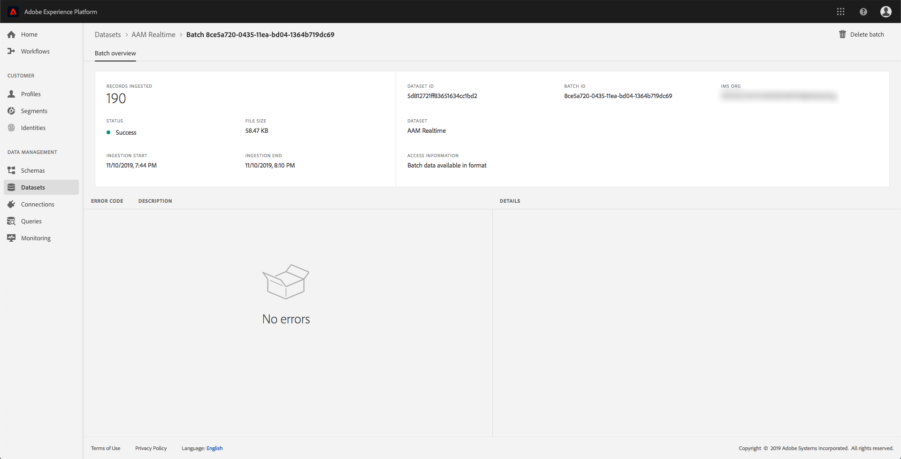

# Monitoraggio dell’assimilazione dei dati

L’assimilazione dei dati consente di trasferire i dati ad Adobe Experience Platform. Potete utilizzare l’assimilazione batch, che consente di inserire i dati utilizzando vari tipi di file (come i CSV), oppure l’assimilazione in streaming, per acquisire i dati [!DNL Platform] utilizzando gli endpoint in streaming in tempo reale.

Questa guida utente descrive come monitorare i dati nell’interfaccia utente di Adobe Experience Platform. Questa guida richiede un Adobe ID  e l&#39;accesso ad Adobe Experience Platform.

## Monitorare l’inserimento di dati end-to-end

Nell’interfaccia utente [del Experience Platform](https://platform.adobe.com), fate clic **[!UICONTROL Monitoring]** sul menu di navigazione a sinistra, quindi fate clic su **[!UICONTROL Streaming end-to-end]**.

Viene visualizzata la pagina *[!UICONTROL Streaming end-to-end]* di monitoraggio. Questa area di lavoro fornisce un grafico che mostra la frequenza degli eventi in streaming ricevuti da [!DNL Platform], un grafico che mostra la frequenza degli eventi in streaming elaborati con successo da [!DNL Real-time Customer Profile](../../profile/home.md), nonché un elenco dettagliato dei dati in arrivo.

Per impostazione predefinita, il grafico superiore mostra il tasso di assimilazione degli ultimi sette giorni. È possibile modificare questo intervallo di date per visualizzare diversi periodi di tempo facendo clic sul pulsante evidenziato.

Il grafico inferiore mostra la frequenza degli eventi in streaming elaborati correttamente [!DNL Profile] negli ultimi sette giorni. È possibile modificare questo intervallo di date per visualizzare diversi periodi di tempo facendo clic sul pulsante evidenziato.

>[!NOTE]
>
>Affinché i dati vengano visualizzati su questo grafico, è necessario che i dati siano **esplicitamente** attivati per [!DNL Profile]. Per informazioni su come abilitare i dati di streaming per [!DNL Profile], consulta la guida [utente per i](../../catalog/datasets/user-guide.md#enable-a-dataset-for-real-time-customer-profile)set di dati.

Sotto i grafici è riportato un elenco di tutti i record di assimilazione in streaming corrispondenti all’intervallo di date visualizzato sopra. Ciascun batch elencato visualizza il proprio ID, il nome del set di dati, al momento dell&#39;ultimo aggiornamento, il numero di record nel batch, nonché il numero di eventuali errori (se presenti). È possibile fare clic su uno dei record per ottenere informazioni più dettagliate su tale record.

### Visualizzazione dei record in streaming

Quando si visualizzano i dettagli di un record trasmesso con successo, vengono visualizzate informazioni quali il numero di record acquisiti, la dimensione del file e l&#39;ora di inizio e fine dell&#39;assimilazione.

I dettagli di un record di streaming non riuscito visualizzano le stesse informazioni di un record riuscito.

Inoltre, i record con errore forniscono dettagli sugli errori che si sono verificati durante l&#39;elaborazione del batch. Nell&#39;esempio seguente si è verificato un errore di sistema durante la convalida dell&#39;datasetId dal catalogo.

## Monitorare l’inserimento di dati end-to-end in batch

Nel [!DNL Experience Platform UI](https://platform.adobe.com), fate clic **[!UICONTROL Monitoring]** sul menu di navigazione a sinistra.

Viene visualizzata la pagina di **[!UICONTROL Batch end-to-end]** monitoraggio, in cui è riportato un elenco dei batch precedentemente assimilati. Potete fare clic su uno dei batch per ottenere informazioni più dettagliate su tale record.

### Visualizzazione dei batch

Quando si visualizzano i dettagli di un batch di successo, vengono visualizzate informazioni quali il numero di record acquisiti, la dimensione del file e l’ora di inizio e fine dell’assimilazione.

Nei dettagli di un batch con errore vengono visualizzate le stesse informazioni di un batch con esito positivo, con l&#39;aggiunta del numero di record con esito negativo.

Inoltre, i batch con errore forniscono dettagli sugli errori che si sono verificati durante l&#39;elaborazione del batch. Nell&#39;esempio seguente si è verificato un errore con il batch assimilato perché utilizzava un campo sconosciuto di `_experience`.

