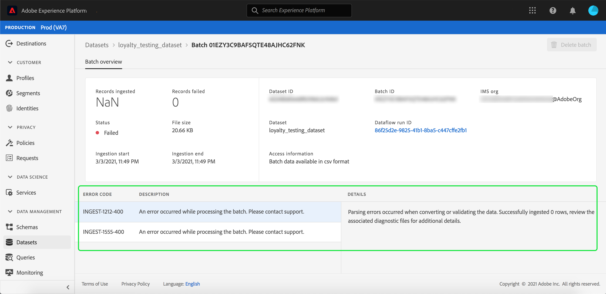

# Monitoraggio dell’acquisizione di dati

L’inserimento dei dati consente di acquisire i dati in Adobe Experience Platform. Puoi utilizzare l’acquisizione batch, che ti consente di inserire i dati utilizzando vari tipi di file (come i CSV), o l’acquisizione in streaming, che ti consente di inserire i dati in [!DNL Platform] utilizzo di endpoint di streaming in tempo reale.

Questa guida utente descrive come monitorare i dati all’interno dell’interfaccia utente di Adobe Experience Platform. Questa guida richiede un Adobe ID e l’accesso a Adobe Experience Platform.

## Monitorare l’acquisizione di dati end-to-end in streaming {#monitor-streaming-end-to-end-data-ingestion}

>[!CONTEXTUALHELP]
>id="platform_ingestion_streaming_ingestionrate"
>title="Tasso di acquisizione"
>abstract="Numero di eventi elaborati correttamente al secondo."
>text="Learn more in the documentation"
>additional-url="https://experienceleague.adobe.com/docs/experience-platform/dataflows/ui/monitor-sources.html?lang=it" text="Monitorare i flussi di dati per le origini nell’interfaccia utente"

>[!TIP]
>
>Per calcolare gli eventi totali in una data particolare, utilizza l’espressione di: `total events / day = ingestion rate * 60 * 60 * 24`.

In [Interfaccia utente Experience Platform](https://platform.adobe.com), seleziona **[!UICONTROL Monitoraggio]** nel menu di navigazione a sinistra, seguito da **[!UICONTROL Streaming end-to-end]**.

La **[!UICONTROL Streaming end-to-end]** viene visualizzata la pagina di monitoraggio. Questa area di lavoro fornisce un grafico che mostra il tasso di eventi in streaming ricevuti da [!DNL Platform], un grafico che mostra il tasso di eventi in streaming elaborati correttamente da [[!DNL Real-Time Customer Profile]](../../profile/home.md), nonché un elenco dettagliato dei dati in arrivo.

Per impostazione predefinita, il grafico superiore mostra il tasso di acquisizione degli ultimi sette giorni. Questo intervallo di date può essere regolato per mostrare vari periodi di tempo selezionando il pulsante evidenziato.

Il grafico in basso mostra la frequenza degli eventi in streaming elaborati correttamente da [!DNL Profile] negli ultimi sette giorni. Questo intervallo di date può essere regolato per mostrare vari periodi di tempo selezionando il pulsante evidenziato.

>[!NOTE]
>
>Affinché i dati vengano visualizzati su questo grafico, i dati devono essere **esplicitamente** abilitato per [!DNL Profile]. Per scoprire come abilitare i dati di streaming per [!DNL Profile], leggi [guida utente dei set di dati](../../catalog/datasets/user-guide.md#enable-a-dataset-for-real-time-customer-profile).

Sotto i grafici è riportato un elenco di tutti i record di acquisizione in streaming corrispondenti all’intervallo di date visualizzato sopra. Ogni batch elencato visualizza il proprio ID, il nome del set di dati, al momento dell’ultimo aggiornamento, il numero di record nel batch e il numero di errori (se presenti). È possibile selezionare uno qualsiasi dei record per informazioni più dettagliate su quel record.

### Visualizzazione dei record in streaming

Quando si visualizzano i dettagli di un record con streaming riuscito, vengono visualizzate informazioni quali il numero di record acquisiti, le dimensioni del file e gli orari di inizio e fine dell’acquisizione.

I dettagli di un record di streaming non riuscito visualizzano le stesse informazioni di un record riuscito.

Inoltre, i record non riusciti forniscono dettagli sugli errori che si sono verificati durante l&#39;elaborazione del batch. Nell’esempio seguente si è verificato un errore di analisi durante la conversione o la convalida dei dati.

>[!NOTE]
>
>In presenza di errori nelle righe acquisite, queste righe vengono **not** viene rilasciato a meno che il messaggio risultante non restituisca XDM non valido.

## Monitorare l’acquisizione di dati in batch end-to-end

In [[!DNL Experience Platform UI]](https://platform.adobe.com), seleziona **[!UICONTROL Monitoraggio]** nel menu di navigazione a sinistra.

La **[!UICONTROL Fine-end batch]** viene visualizzata la pagina di monitoraggio, in cui viene visualizzato un elenco dei batch precedentemente acquisiti. Puoi selezionare uno dei batch per informazioni più dettagliate su tale record.

### Visualizzazione dei batch

Quando si visualizzano i dettagli di un batch di successo, vengono visualizzate informazioni quali il numero di record acquisiti, le dimensioni del file e gli orari di inizio e fine dell’acquisizione.

I dettagli di un batch non riuscito visualizzano le stesse informazioni di un batch riuscito, con l&#39;aggiunta del numero di record non riusciti.

Inoltre, i batch con errori forniscono dettagli sugli errori che si sono verificati durante l&#39;elaborazione del batch. Nell’esempio seguente, si è verificato un errore con il batch acquisito perché contiene il numero massimo di identità per la persona.

>[!NOTE]
>
>In presenza di errori nelle righe acquisite, queste righe vengono **not** viene rilasciato a meno che il messaggio risultante non restituisca XDM non valido.

