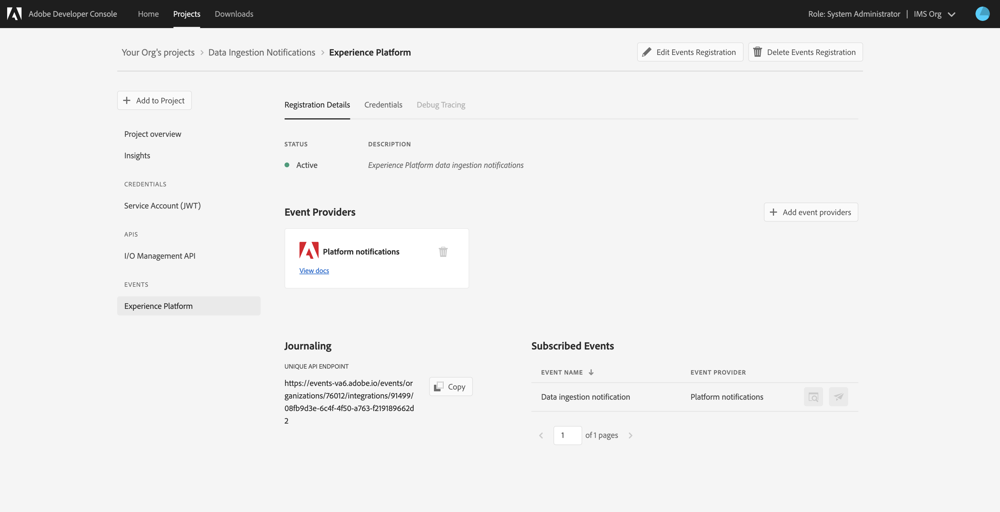

# Notifiche di assimilazione dei dati

Il processo di assimilazione dei dati in  Adobe Experience Platform consiste di più passaggi. Una volta identificati i file di dati in cui è necessario eseguire l&#39;assimilazione, [!DNL Platform]il processo di assimilazione inizia e ogni passaggio si verifica consecutivamente fino a quando i dati non vengono correttamente acquisiti o non hanno esito negativo. Il processo di assimilazione può essere avviato utilizzando l&#39;API [di inserimento dati](https://www.adobe.io/apis/experienceplatform/home/api-reference.html#!acpdr/swagger-specs/ingest-api.yaml) Adobe Experience Platform o utilizzando l&#39;interfaccia [!DNL Experience Platform] utente.

I dati caricati in [!DNL Platform] devono passare attraverso più passaggi per raggiungere la destinazione, l&#39;archivio [!DNL Data Lake] o l&#39;archivio [!DNL Real-time Customer Profile] dati. Ogni passaggio prevede l&#39;elaborazione dei dati, la convalida dei dati e la memorizzazione dei dati prima di passare al passaggio successivo. A seconda della quantità di dati che vengono acquisiti, questo può diventare un processo che richiede molto tempo ed è sempre possibile che il processo non riesca a causa di errori di convalida, semantica o elaborazione. In caso di errore, i problemi relativi ai dati devono essere risolti e l&#39;intero processo di assimilazione deve essere riavviato utilizzando i file di dati corretti.

Per assistere nel monitoraggio del processo di assimilazione, [!DNL Experience Platform] consente di sottoscrivere un set di eventi pubblicati in ogni fase del processo, notificando all’utente lo stato dei dati acquisiti e ogni possibile errore.

## Eventi di notifica dello stato disponibili

Di seguito è riportato un elenco delle notifiche di stato relative all’inserimento dei dati disponibili a cui puoi iscriverti.

>[!NOTE]
>
>È disponibile un solo argomento evento per tutte le notifiche di assimilazione dei dati. Per distinguere tra stati diversi, è possibile utilizzare il codice evento.

| Platform Service | Stato | Descrizione evento | Codice evento |
| ---------------- | ------ | ----------------- | ---------- |
| Destinazione dati | success | Ingestione - Batch completato | ing_load_success |
| Destinazione dati | fallimento | Ingestione - Batch non riuscito | ing_load_failure |
| Profilo del cliente in tempo reale | success | Servizio profilo - Batch di caricamento dati completato | ps_load_success |
| Profilo del cliente in tempo reale | fallimento | Servizio profilo: batch di caricamento dati non riuscito | ps_load_failure |
| Grafico identità | success | Grafico identità: batch di caricamento dati completato | ig_load_success |
| Grafico identità | fallimento | Grafico identità: batch di caricamento dati non riuscito | ig_load_failure |

## Schema payload di notifica

Lo schema dell&#39;evento di notifica dell&#39;assimilazione dei dati è uno schema [!DNL Experience Data Model] (XDM) contenente campi e valori che forniscono dettagli sullo stato dei dati da assimilare. Per visualizzare lo schema [!DNL GitHub] di payload di [notifica più recente, visitare il](https://github.com/adobe/xdm/blob/master/schemas/common/notifications/ingestion.schema.json)repo pubblico XDM.

## Iscriviti alle notifiche sullo stato di inserimento dei dati

Attraverso gli eventi di I/O [Adobe](https://www.adobe.io/apis/experienceplatform/events.html), potete abbonarvi a più tipi di notifiche mediante i webhooks. Le sezioni seguenti descrivono i passaggi per iscriversi alle [!DNL Platform] notifiche per gli eventi di inserimento dei dati tramite Adobe Developer Console.

### Creare un nuovo progetto in Adobe Developer Console

Andate ad [Adobe Developer Console](https://www.adobe.com/go/devs_console_ui) ed effettuate l&#39;accesso con il vostro Adobe ID . Attenetevi quindi ai passaggi descritti nell&#39;esercitazione sulla [creazione di un progetto](https://www.adobe.io/apis/experienceplatform/console/docs.html#!AdobeDocs/adobeio-console/master/projects-empty.md) vuoto nella documentazione di Adobe Developer Console.

### Aggiunta di [!DNL Experience Platform] eventi al progetto

Dopo aver creato un nuovo progetto, andate alla schermata di panoramica del progetto. Da qui, clicca **[!UICONTROL Add event]**.

Viene visualizzata _[!UICONTROL Add events]_la finestra di dialogo. Fare clic **[!UICONTROL Experience Platform]**per filtrare l&#39;elenco delle opzioni disponibili, quindi fare clic **[!UICONTROL Platform notifications]**prima di fare clic su **[!UICONTROL Next]**.

Nella schermata successiva viene visualizzato un elenco dei tipi di evento a cui effettuare la sottoscrizione. Selezionate **[!UICONTROL Data ingestion notification]**, quindi fate clic su **[!UICONTROL Next]**.

Nella schermata successiva viene richiesto di creare un token Web JSON (JWT). Potete generare automaticamente una coppia di chiavi o caricare la vostra chiave pubblica generata nel terminale.

Ai fini di questa esercitazione, viene seguita la prima opzione. Fare clic sulla casella delle opzioni **[!UICONTROL Generate a key pair]**, quindi sul **[!UICONTROL Generate keypair]** pulsante nell&#39;angolo inferiore destro.

Quando la coppia di chiavi viene generata, viene scaricata automaticamente dal browser. Il file deve essere memorizzato personalmente, in quanto non è persistente nella Developer Console.

Nella schermata successiva è possibile esaminare i dettagli della coppia di chiavi appena generata. Fare clic **[!UICONTROL Next]** per continuare.

Nella schermata successiva, fornite un nome e una descrizione per la registrazione all’evento. È buona norma creare un nome univoco e facilmente identificabile per distinguere la registrazione a questo evento da altri sullo stesso progetto.

Nella stessa schermata, potete configurare facoltativamente la modalità di ricezione degli eventi. **[!UICONTROL Webhook]** consente di fornire un indirizzo webhook personalizzato per ricevere gli eventi, mentre **[!UICONTROL Runtime action]** consente di eseguire le stesse operazioni utilizzando [Adobe I/O Runtime](https://www.adobe.io/apis/experienceplatform/runtime/docs.html).

Questa esercitazione salta questo passaggio di configurazione facoltativo. Al termine, fate clic **[!UICONTROL Save configured events]** per completare la registrazione dell&#39;evento.

Viene visualizzata la pagina dei dettagli per la registrazione dell&#39;evento appena creata, in cui potete esaminare gli eventi ricevuti, eseguire il debug di traccia e modificare la configurazione.

## Passaggi successivi

Una volta registrate [!DNL Platform] le notifiche al progetto, potete visualizzare gli eventi ricevuti dal dashboard del progetto. Per istruzioni dettagliate su come tenere traccia degli eventi, consultate la guida [Tracing Adobe I/O Events](https://www.adobe.io/apis/experienceplatform/events/docs.html#!adobedocs/adobeio-events/master/support/tracing.md) .
