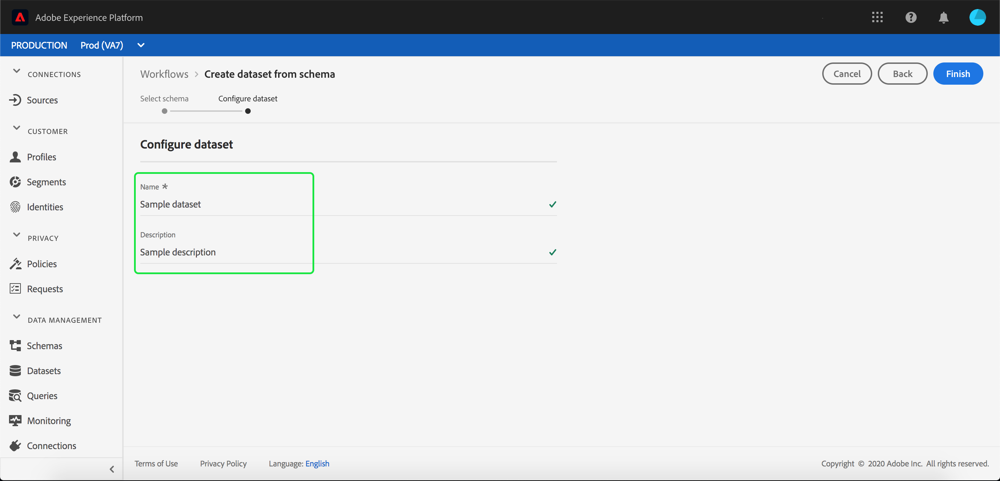

# Inserire dati in Adobe Experience Platform

Adobe Experience Platform consente di importare facilmente i dati in [!DNL Platform] come file batch. Esempi di dati da acquisire possono includere dati di profilo da un file flat in un sistema CRM (ad esempio un file Parquet) o dati conformi a uno schema [!DNL Experience Data Model] (XDM) noto nel registro degli schemi.

## Introduzione

Per completare questa esercitazione, devi avere accesso a [!DNL Experience Platform]. Se non si dispone dell&#39;accesso a un&#39;organizzazione in [!DNL Experience Platform], contattare l&#39;amministratore di sistema prima di procedere.

Se preferisci acquisire i dati utilizzando le API di acquisizione dati, inizia consultando la [guida per gli sviluppatori per l&#39;acquisizione in batch](../batch-ingestion/api-overview.md).

## Area di lavoro Set di dati

L&#39;area di lavoro Set di dati all&#39;interno di [!DNL Experience Platform] consente di visualizzare e gestire tutti i set di dati creati dall&#39;organizzazione, nonché di crearne di nuovi.

Visualizzare l&#39;area di lavoro Set di dati facendo clic su **[!UICONTROL Set di dati]** nell&#39;area di navigazione a sinistra. L’area di lavoro Set di dati contiene un elenco di set di dati, incluse le colonne con nome, data e ora di creazione, origine, schema e ultimo stato batch, nonché la data e l’ora dell’ultimo aggiornamento del set di dati.

>[!NOTE]
>
>Fare clic sull&#39;icona del filtro accanto alla barra di ricerca per utilizzare le funzionalità di filtro per visualizzare solo i set di dati abilitati per [!DNL Profile].

## Creare un set di dati

Per creare un set di dati, fare clic su **[!UICONTROL Crea set di dati]** nell&#39;angolo superiore destro dell&#39;area di lavoro Set di dati.

Nella schermata **[!UICONTROL Crea set di dati]**, selezionare se si desidera &quot;[!UICONTROL Creare set di dati dallo schema]&quot; o &quot;[!UICONTROL Creare set di dati dal file CSV]&quot;.

Per questa esercitazione, verrà utilizzato uno schema per creare il set di dati. Fai clic su **[!UICONTROL Crea set di dati dallo schema]** per continuare.

## Seleziona schema set di dati

Nella schermata **[!UICONTROL Seleziona schema]**, scegliere uno schema facendo clic sul pulsante di opzione accanto allo schema che si desidera utilizzare. Per questa esercitazione, il set di dati verrà creato utilizzando lo schema Membri fedeltà. L’utilizzo della barra di ricerca per filtrare gli schemi è utile per trovare lo schema esatto desiderato.

Dopo aver selezionato il pulsante di opzione accanto allo schema che desideri utilizzare, fai clic su **[!UICONTROL Avanti]**.

## Configura il set di dati

Nella schermata **[!UICONTROL Configura set di dati]**, ti verrà richiesto di assegnare un nome al set di dati e di fornirne anche una descrizione.

**Note sui nomi dei set di dati:**

- I nomi dei set di dati devono essere brevi e descrittivi in modo che il set di dati possa essere facilmente trovato in un secondo momento nella libreria.
- I nomi dei set di dati devono essere univoci, ovvero devono essere sufficientemente specifici da non poter essere riutilizzati in futuro.
- È consigliabile fornire informazioni aggiuntive sul set di dati utilizzando il campo descrizione, in quanto in futuro potrebbe aiutare altri utenti a distinguere tra i set di dati.

Una volta che il set di dati ha un nome e una descrizione, fare clic su **[!UICONTROL Fine]**.

## Attività del set di dati

È stato creato un set di dati vuoto. Sei stato riportato alla scheda **[!UICONTROL Attività set di dati]** nell&#39;area di lavoro Set di dati. Dovresti visualizzare il nome del set di dati nell’angolo in alto a sinistra dell’area di lavoro, insieme a una notifica che informa che &quot;Non è stato aggiunto alcun batch&quot;. Ciò è previsto perché non hai ancora aggiunto batch a questo set di dati.

Sul lato destro dell&#39;area di lavoro Set di dati verrà visualizzata la scheda **[!UICONTROL Informazioni]** contenente informazioni relative al nuovo set di dati, ad esempio ID set di dati, nome, descrizione, nome tabella, schema, flusso e origine. La scheda Info include anche informazioni su quando è stato creato il set di dati e sulla data dell’ultima modifica.

Nella scheda Info è presente anche un interruttore **[!UICONTROL Profilo]** utilizzato per abilitare il set di dati per l&#39;utilizzo con [!DNL Real-Time Customer Profile]. L&#39;utilizzo di questo interruttore e di [!DNL Real-Time Customer Profile] verrà illustrato più dettagliatamente nella sezione seguente.

## Abilita set di dati per [!DNL Real-Time Customer Profile]

I set di dati vengono utilizzati per acquisire i dati in [!DNL Experience Platform] e tali dati vengono utilizzati per identificare i singoli utenti e unire le informazioni provenienti da più origini. Queste informazioni unite sono denominate [!DNL Real-Time Customer Profile]. Affinché [!DNL Platform] sappia quali informazioni includere in [!DNL Real-Time Profile], i set di dati possono essere contrassegnati per l&#39;inclusione utilizzando l&#39;interruttore **[!UICONTROL Profilo]**.

Per impostazione predefinita, questa opzione è disattivata. Se scegli di attivare [!DNL Profile], tutti i dati acquisiti nel set di dati verranno utilizzati per identificare un individuo e unire il suo [!DNL Real-Time Profile].

Per ulteriori informazioni su [!DNL Real-Time Customer Profile] e sull&#39;utilizzo delle identità, consulta la documentazione di [Identity Service](../../identity-service/home.md).

Per abilitare il set di dati per [!DNL Real-Time Customer Profile], fai clic sull&#39;interruttore **[!UICONTROL Profilo]** nella scheda **[!UICONTROL Informazioni]**.

Verrà visualizzata una finestra di dialogo in cui viene richiesto di confermare che si desidera abilitare il set di dati per [!DNL Real-Time Customer Profile].

Fare clic su **[!UICONTROL Abilita]** e l&#39;interruttore diventerà di colore blu, a indicare che è attivo.

## Aggiungi dati al set di dati

I dati possono essere aggiunti a un set di dati in diversi modi. Puoi scegliere di utilizzare [!DNL Data Ingestion] API o un partner ETL come [!DNL Unifi] o [!DNL Informatica]. Per questa esercitazione, i dati verranno aggiunti al set di dati utilizzando la scheda **[!UICONTROL Aggiungi dati]** nell&#39;interfaccia utente.

Per iniziare ad aggiungere dati al set di dati, fai clic sulla scheda **[!UICONTROL Aggiungi dati]**. È ora possibile trascinare e rilasciare i file o cercare nel computer i file che si desidera aggiungere.

>[!NOTE]
>
>Platform supporta due tipi di file per l’acquisizione dei dati, Parquet o JSON. È possibile aggiungere fino a cinque file alla volta, con la dimensione massima di ogni file pari a 1 GB.

## Carica un file {#upload-file}

Dopo aver trascinato e rilasciato (o sfogliato e selezionato) un file Parquet o JSON da caricare, [!DNL Platform] inizierà immediatamente a elaborare il file e verrà visualizzata una finestra di dialogo **[!UICONTROL Caricamento]** nella scheda **[!UICONTROL Aggiungi dati]** che mostra l&#39;avanzamento del caricamento del file.

## Metriche del set di dati

Al termine del caricamento del file, nella scheda **[!UICONTROL Attività set di dati]** non viene più visualizzato il messaggio &quot;Nessun batch aggiunto&quot;. La scheda **[!UICONTROL Attività set di dati]** mostra invece le metriche del set di dati. Tutte le metriche mostrano &quot;0&quot; in questa fase perché il batch non è ancora stato caricato.

Nella parte inferiore della scheda è presente un elenco che mostra l&#39;**[!UICONTROL ID batch]** dei dati appena acquisiti tramite il processo [&quot;Aggiungi dati al set di dati&quot;](#add-data-to-dataset). Sono incluse anche le informazioni relative al batch, tra cui data di acquisizione, numero di record acquisiti e stato corrente del batch.

## Dettagli batch

Fai clic sul **[!UICONTROL ID batch]** per visualizzare una **[!UICONTROL Panoramica batch]**, con ulteriori dettagli relativi al batch. Una volta completato il caricamento del batch, le informazioni sul batch vengono aggiornate per mostrare il numero di record acquisiti e la dimensione del file. Lo stato cambia anche in &quot;Completato&quot; o &quot;Non riuscito&quot;. Se il batch non riesce, la sezione **[!UICONTROL Codice errore]** conterrà i dettagli relativi a eventuali errori durante l&#39;acquisizione.

Per ulteriori informazioni e domande frequenti relative all&#39;acquisizione batch, consulta la [guida alla risoluzione dei problemi di acquisizione batch](../batch-ingestion/troubleshooting.md).

Per tornare alla schermata **[!UICONTROL Attività set di dati]**, fare clic sul nome del set di dati (**[!UICONTROL Dettagli fedeltà]**) nel breadcrumb.

## Anteprima set di dati

Quando il set di dati è pronto, viene visualizzata un&#39;opzione per **[!UICONTROL Anteprima set di dati]** nella parte superiore della scheda **[!UICONTROL Attività set di dati]**.

Fai clic su **[!UICONTROL Anteprima set di dati]** per aprire una finestra di dialogo che mostra dati di esempio dall&#39;interno del set di dati. Se il set di dati è stato creato utilizzando uno schema, i dettagli dello schema del set di dati verranno visualizzati sul lato sinistro dell’anteprima. Puoi espandere lo schema utilizzando le frecce per visualizzare la struttura dello schema. Ogni intestazione di colonna nei dati di anteprima rappresenta un campo nel set di dati.

## Passaggi successivi e risorse aggiuntive

Dopo aver creato un set di dati e aver acquisito correttamente i dati in [!DNL Experience Platform], è possibile ripetere questi passaggi per creare un nuovo set di dati o acquisire più dati nel set di dati esistente.

Per ulteriori informazioni sull&#39;acquisizione in batch, leggi la [panoramica sull&#39;acquisizione in batch](../batch-ingestion/overview.md) e segui il video seguente per completare l&#39;apprendimento.

>[!WARNING]
>
>L&#39;interfaccia utente [!DNL Platform] mostrata nel video seguente non è aggiornata. Per le schermate e le funzionalità più recenti dell’interfaccia utente, consulta la documentazione precedente.

>[!VIDEO](https://video.tv.adobe.com/v/27269?quality=12&learn=on)
