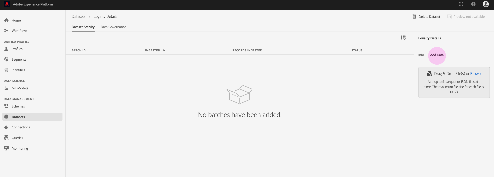
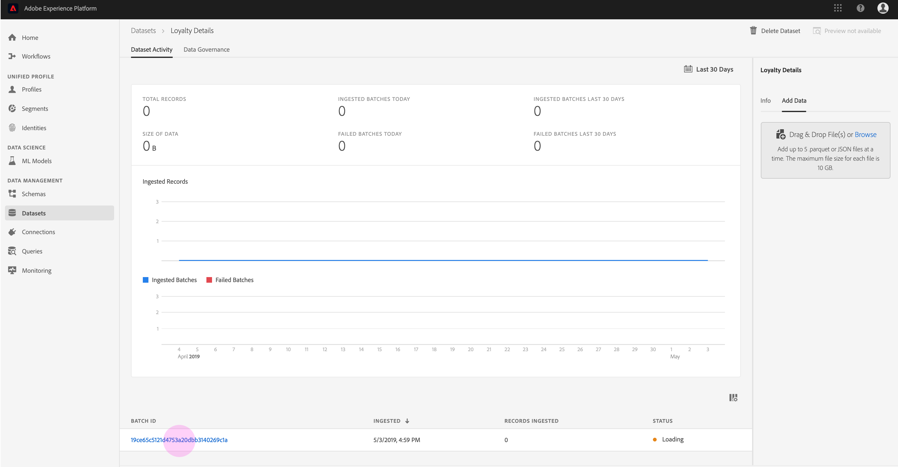

# Assimilazione di dati in  Adobe Experience Platform

 Adobe Experience Platform consente di importare facilmente i dati in [!DNL Platform] file batch. Esempi di dati da assimilare possono includere dati di profilo da un file semplice in un sistema CRM (ad esempio un file parquet) o dati conformi a uno schema [!DNL Experience Data Model] (XDM) noto nel Registro di sistema dello schema.

## Introduzione

Per completare questa esercitazione, è necessario avere accesso a [!DNL Experience Platform]. Se non disponete dell&#39;accesso a un&#39;organizzazione IMS in [!DNL Experience Platform], rivolgetevi all&#39;amministratore di sistema prima di procedere.

Se preferite assimilare i dati utilizzando le API di inserimento dati, iniziate leggendo la guida [per gli sviluppatori di](../batch-ingestion/api-overview.md)inserimento batch.

## Area di lavoro DataSet

L&#39;area di lavoro Set di dati all&#39;interno [!DNL Experience Platform] consente di visualizzare e gestire tutti i set di dati creati dall&#39;organizzazione IMS e di crearne di nuovi.

Visualizzare l&#39;area di lavoro Set di dati facendo clic **[!UICONTROL Datasets]** nella barra di navigazione a sinistra. L&#39;area di lavoro Set di dati contiene un elenco di set di dati, incluse colonne che mostrano _[!UICONTROL Name]_,_[!UICONTROL Created]_ (data e ora), _[!UICONTROL Source]_,_[!UICONTROL Schema]_ e _[!UICONTROL Last Batch Status]_la data e l&#39;ora in cui si trovava il dataset_[!UICONTROL Last Updated]_.

>[!NOTE]
>
>Fate clic sull&#39;icona del filtro accanto alla barra di ricerca per utilizzare le funzionalità di filtro per visualizzare solo i set di dati abilitati [!DNL Profile].

## Creare un dataset

Per creare un set di dati, fare clic **[!UICONTROL Create Dataset]** nell&#39;angolo superiore destro dell&#39;area di lavoro Set di dati.

Nella **[!UICONTROL Create Dataset]** schermata, selezionate se desiderate &quot;[!UICONTROL Create Dataset from Schema]&quot; o &quot;[!UICONTROL Create Dataset from CSV File]&quot;.

Per questa esercitazione, verrà utilizzato uno schema per creare il dataset. Fare clic **[!UICONTROL Create Dataset from Schema]** per continuare.

## Seleziona schema set di dati

Nella **[!UICONTROL Select Schema]** schermata, scegliere uno schema facendo clic sul pulsante di scelta accanto allo schema da utilizzare. Per questa esercitazione, il dataset verrà creato utilizzando lo schema Membri fedeltà. L&#39;utilizzo della barra di ricerca per filtrare gli schemi è un modo utile per individuare lo schema esatto che si sta cercando.

Dopo aver selezionato il pulsante di scelta accanto allo schema da utilizzare, fare clic su **[!UICONTROL Next]**.

## Configura set di dati

Sullo **[!UICONTROL Configure Dataset]** schermo, sarà necessario fornire al dataset un **[!UICONTROL Name]** e può anche fornire un **[!UICONTROL Description]** del dataset.

**Note sui nomi dei set di dati:**

- I nomi dei set di dati devono essere brevi e descrittivi in modo che il set di dati possa essere facilmente trovato nella libreria in un secondo momento.
- I nomi dei set di dati devono essere univoci, il che significa che devono essere sufficientemente specifici da non essere riutilizzati in futuro.
- È consigliabile fornire informazioni aggiuntive sul set di dati utilizzando il campo di descrizione, in quanto potrebbe aiutare altri utenti a distinguere tra set di dati in futuro.

Una volta che il dataset ha un nome e una descrizione, fare clic su **[!UICONTROL Finish]**.

## Attività DataSet

È stato creato un set di dati vuoto e l&#39;utente è stato riportato nella **[!UICONTROL Dataset Activity]** scheda nell&#39;area di lavoro Set di dati. Il nome del set di dati deve essere visualizzato nell’angolo in alto a sinistra dell’area di lavoro, insieme alla notifica che &quot;Non sono stati aggiunti batch&quot;. Questo è previsto perché non avete ancora aggiunto alcun batch a questo set di dati.

Sul lato destro dell&#39;area di lavoro Set di dati è visibile la **[!UICONTROL Info]** scheda contenente informazioni relative al nuovo set di dati, ad esempio _[!UICONTROL Dataset ID]_,_[!UICONTROL Name]_, _[!UICONTROL Description]_,_[!UICONTROL Table Name]_, _[!UICONTROL Schema]_,_[!UICONTROL Streaming]_ e _[!UICONTROL Source]_. La scheda Informazioni include anche informazioni su quando il set di dati era_[!UICONTROL Created]_ e la relativa _[!UICONTROL Last Modified]_data.

Nella scheda Informazioni è inoltre disponibile un _[!UICONTROL Profile]_interruttore che consente di abilitare il set di dati per l’uso con[!DNL Real-time Customer Profile]. L&#39;utilizzo di questa opzione e[!DNL Real-time Customer Profile], verranno spiegati più dettagliatamente nella sezione che segue.

## Abilita set di dati per [!DNL Real-time Customer Profile]

I set di dati vengono utilizzati per l&#39;assimilazione dei dati in [!DNL Experience Platform]e i dati vengono utilizzati per identificare gli individui e unire le informazioni provenienti da più origini. Quelle informazioni cucite insieme si chiamano [!DNL Real-Time Customer Profile]. Per [!DNL Platform] sapere quali informazioni includere nel [!DNL Real-Time Profile], i set di dati possono essere contrassegnati per l’inclusione utilizzando l’ **[!UICONTROL Profile]** interruttore.

Per impostazione predefinita, questa opzione è disattivata. Se si sceglie di attivare [!DNL Profile], tutti i dati inseriti nel dataset verranno utilizzati per identificare un singolo e unire insieme i relativi dati [!DNL Real-Time Profile].

Per ulteriori informazioni [!DNL Real-time Customer Profile] e per utilizzare le identità, consulta la documentazione del servizio  identità.

Per abilitare il set di dati per [!DNL Real-time Customer Profile], fare clic sull&#39; **[!UICONTROL Profile]** interruttore nella **[!UICONTROL Info]** scheda.

Viene visualizzata una finestra di dialogo in cui viene richiesto di confermare che si desidera abilitare il dataset per [!DNL Real-time Customer Profile].

Fate clic **[!UICONTROL Enable]** e l&#39;interruttore diventa blu, a indicare che è attivato.

## Aggiungere dati al dataset

I dati possono essere aggiunti in un set di dati in diversi modi. Potete scegliere di utilizzare [!DNL Data Ingestion] le API o un partner ETL, ad esempio [!DNL Unifi] o [!DNL Informatica]. Per questa esercitazione, i dati verranno aggiunti al dataset utilizzando la **[!UICONTROL Add Data]** scheda all&#39;interno dell&#39;interfaccia utente.

Per iniziare ad aggiungere dati al dataset, fare clic sulla **[!UICONTROL Add Data]** scheda. È ora possibile trascinare e rilasciare i file o cercare nel computer i file da aggiungere.

>[!NOTE]
>
>[!DNL Platform] supporta due tipi di file per l&#39;assimilazione dei dati, parquet o JSON. È possibile aggiungere fino a cinque file alla volta, con una dimensione massima di file pari a 10 GB.

## Caricare un file

Dopo aver trascinato e rilasciato (o sfogliare e selezionare) un file parquet o JSON che si desidera caricare, [!DNL Platform] inizierà immediatamente a elaborare il file e sulla **[!UICONTROL Uploading]** scheda verrà visualizzata una **[!UICONTROL Add Data]** finestra di dialogo che mostra l&#39;avanzamento del caricamento del file.

## Metriche DataSet

Al termine del caricamento del file, nella **[!UICONTROL Dataset Activity]** scheda non viene più visualizzato &quot;Nessun batch aggiunto&quot;. Al contrario, la *[!UICONTROL Dataset Activity]* scheda ora mostra le metriche del set di dati. Tutte le metriche mostreranno &quot;0&quot; in questa fase perché il batch non è ancora caricato.

Nella parte inferiore della scheda è presente un elenco che mostra i dati _[!UICONTROL Batch ID]_appena acquisiti tramite il processo[&quot;Aggiungi dati a dataset&quot;](#add-data-to-dataset). Sono incluse anche le informazioni relative al batch, inclusa_[!UICONTROL Ingested]_ la data, il numero di _[!UICONTROL Records Ingested]_e il batch corrente_[!UICONTROL Status]_.

## Dettagli batch

Fare clic sul _[!UICONTROL Batch ID]_pulsante per visualizzare un **[!UICONTROL Batch Overview]**, con dettagli aggiuntivi relativi al batch. Al termine del caricamento del batch, le informazioni relative al batch vengono aggiornate per mostrare il numero di_[!UICONTROL Records Ingested]_ e di _[!UICONTROL File Size]_. Inoltre,_[!UICONTROL Status]_ verrà sostituita da &quot;Success&quot; o &quot;Failed&quot; (Non riuscito). Se il batch non riesce, la _[!UICONTROL Error Code]_sezione conterrà dettagli relativi a eventuali errori durante l&#39;assimilazione.

Per ulteriori informazioni e domande frequenti sull’inserimento di batch, consulta la guida [alla risoluzione dei problemi di inserimento](../batch-ingestion/troubleshooting.md)batch.

Per tornare alla **[!UICONTROL Dataset Activity]** schermata, fate clic sul nome del set di dati (_[!UICONTROL Loyalty Details]_) nella breadcrumb.

## Anteprima set di dati

Una volta che il set di dati è pronto, **[!UICONTROL Preview Dataset]** viene visualizzata un&#39;opzione nella parte superiore della **[!UICONTROL Dataset Activity]** scheda.

Fare clic **[!UICONTROL Preview Dataset]** per aprire una finestra di dialogo che mostra i dati di esempio dall&#39;interno del dataset. Se il set di dati è stato creato utilizzando uno schema, i dettagli per lo schema del set di dati verranno visualizzati sul lato sinistro dell&#39;anteprima. È possibile espandere lo schema utilizzando le frecce per visualizzare la struttura dello schema. Ogni intestazione di colonna nei dati di anteprima rappresenta un campo nel dataset.

## Passaggi successivi e risorse aggiuntive

Dopo aver creato un set di dati e aver correttamente inserito i dati in [!DNL Experience Platform], è possibile ripetere questi passaggi per creare un nuovo set di dati o per inserire più dati nel set di dati esistente.

Per saperne di più sull&#39;assimilazione batch, si prega di leggere la panoramica  Batch Ingestion e completare il vostro apprendimento guardando il video qui sotto.

>[!WARNING]
>
> L’ [!DNL Platform] interfaccia utente mostrata nel video seguente è obsoleta. Per informazioni sulle ultime funzionalità e videate dell’interfaccia, consulta la documentazione precedente.

>[!VIDEO](https://video.tv.adobe.com/v/27269?quality=12&learn=on)
