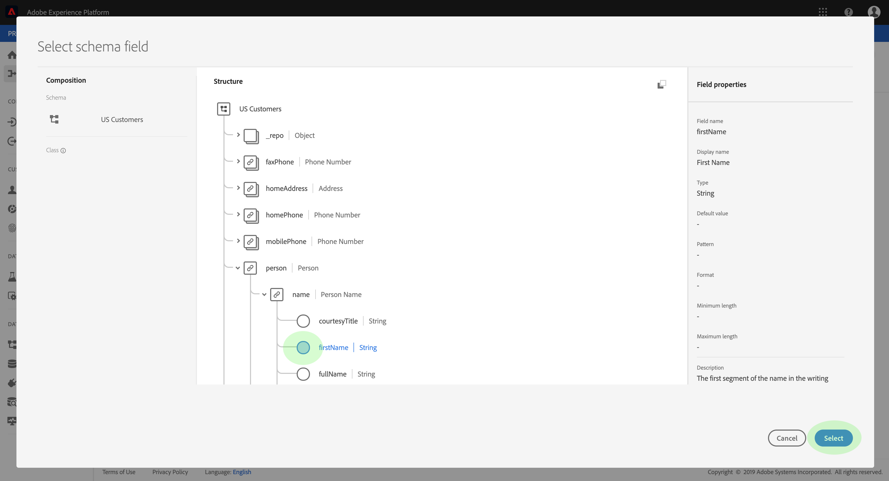
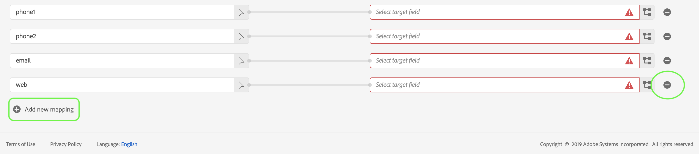

# Mappare un file CSV su uno schema XDM

Per assimilare i dati CSV in Adobe Experience Platform, questi devono essere mappati su uno schema Experience Data Model (XDM). Questa esercitazione illustra come mappare un file CSV su uno schema XDM mediante l’interfaccia utente della piattaforma Experience.

Inoltre, l&#39;appendice di questa esercitazione fornisce ulteriori informazioni sull&#39;utilizzo delle funzioni [di](#mapping-functions)mappatura.

## Introduzione

Questa esercitazione richiede una buona conoscenza dei seguenti componenti di Adobe Experience Platform:

- [Modello dati esperienza (XDM System)](../../xdm/home.md): Il framework standardizzato tramite il quale Experience Platform organizza i dati sull&#39;esperienza dei clienti.
- [Caricamento](../batch-ingestion/overview.md)batch: Metodo con cui la piattaforma acquisisce i dati dai file di dati forniti dall&#39;utente.

Questa esercitazione richiede anche che sia già stato creato un set di dati in cui assimilare i dati CSV. Per i passaggi sulla creazione di un dataset nell&#39;interfaccia utente, consulta l&#39;esercitazione [sull&#39;acquisizione dei](./ingest-batch-data.md)dati.

## Aggiungi dati

Nell’interfaccia utente della piattaforma Esperienza, fai clic su **Flussi** di lavoro nella barra di navigazione a sinistra, quindi fai clic su **Mappa CSV nello schema** XDM. Nella barra a destra visualizzata, fate clic su **Avvia**.

Viene visualizzato il flusso di lavoro _Mappa CSV a schema_ XDM, a partire dal passaggio _Aggiungi dati_ .

Trascinate e rilasciate il file CSV nello spazio disponibile oppure fate clic su **Sfoglia** per selezionare direttamente un file. Una volta caricato il file, viene visualizzata una sezione di dati _di_ esempio che mostra le prime dieci righe di dati. Dopo aver confermato che i dati sono stati caricati come previsto, fate clic su **Avanti**.

## Scegliere una destinazione

Viene visualizzato il passaggio _Destinazione_ . Dall’elenco fornito, selezionate il set di dati in cui saranno inviati i dati CSV, quindi fate clic su **Avanti**.

## Mappatura di campi CSV nei campi dello schema XDM

Viene visualizzato il passaggio _Mapping_ . Le colonne del file CSV sono elencate in Campo _di_ origine, con i campi dello schema XDM corrispondenti elencati in Campo _di_ destinazione. I campi di destinazione non selezionati sono evidenziati in rosso.

Per mappare una colonna CSV su un campo XDM, fate clic sull&#39;icona dello schema accanto al campo di destinazione corrispondente della colonna.

Viene visualizzata la finestra del campo __ Seleziona schema. Qui puoi spostarti nella struttura dello schema XDM e individuare il campo a cui mappare la colonna CSV. Fate clic su un campo XDM per selezionarlo, quindi fate clic su **Seleziona**.

La schermata _Mappatura_ viene visualizzata di nuovo, con il campo XDM selezionato ora sotto il campo __ Target.

Se non desiderate mappare una particolare colonna CSV, potete rimuovere la mappatura facendo clic sull&#39;icona **di** rimozione accanto al campo di destinazione. Per aggiungere una nuova mappatura, fate clic su **Aggiungi nuova mappatura** in fondo all’elenco.

Quando mappate i campi, potete anche includere funzioni per calcolare i valori in base ai campi di origine di input. Per ulteriori informazioni, consulta la sezione delle funzioni [di](#mapping-functions) mappatura nell’appendice.

Ripetete i passaggi indicati sopra per continuare la mappatura delle colonne CSV ai campi XDM. Al termine, fate clic su **Avanti**.

## Dati di assimilazione

Viene visualizzato il passaggio _Assegna_ , che consente di controllare i dettagli del file di origine e del set di dati di destinazione. Fate clic su **Assegna** per iniziare a assimilare i dati CSV. A seconda delle dimensioni del file CSV, questo processo potrebbe richiedere alcuni minuti. Lo schermo si aggiorna una volta completata l&#39;assimilazione, indicando se l&#39;operazione ha esito positivo o negativo. Fate clic su **Fine** per completare il flusso di lavoro.

## Passaggi successivi

Seguendo questa esercitazione, avete mappato correttamente un file CSV semplice su uno schema XDM e lo avete assimilato in Piattaforma. Questi dati possono ora essere utilizzati dai servizi della piattaforma a valle, ad esempio Profilo cliente in tempo reale. Per ulteriori informazioni, consulta la panoramica [Profilo cliente](../../profile/home.md) in tempo reale.

## Appendice

La sezione seguente fornisce informazioni aggiuntive per la mappatura delle colonne CSV ai campi XDM.

### Funzioni di mappatura

Alcune funzioni di mappatura possono essere utilizzate per calcolare e calcolare i valori in base a quanto immesso nei campi di origine. Per utilizzare una funzione, digitarla in Campo _di_ origine con sintassi e input appropriati.

Ad esempio, per concatenare i campi CSV **città** e **paese** e assegnarli al campo XDM **città** , impostate il campo di origine come `concat(city, ", ", county)`.

Nella tabella seguente sono elencate tutte le funzioni di mappatura supportate, incluse le espressioni di esempio e i relativi output.

| Funzione | Descrizione | Espressione esempio | Output di esempio |
| -------- | ----------- | ----------------- | ------------- |
| concat | Concatenate le stringhe date. | concat(&quot;Ciao, &quot;, &quot;lì&quot;, &quot;!&quot;) | `"Hi, there!"` |
| esplodere | Divide la stringa in base a un regex e restituisce un array di parti. | esplode(&quot;Ciao, ciao!&quot;, &quot; &quot;) | `["Hi,", "there"]` |
| instr | Restituisce la posizione/indice di una sottostringa. | instr(&quot;adobe.com&quot;, &quot;com&quot;) | 6 |
| sostituto | Sostituisce la stringa di ricerca, se presente nella stringa originale. | replace(&quot;Questa è una stringa ri test&quot;, &quot;re&quot;, &quot;replace&quot;) | &quot;Questo è un test di sostituzione delle stringhe&quot; |
| substr | Restituisce una sottostringa della lunghezza specificata. | substr(&quot;Questo è un test di sottostringa&quot;, 7, 8) | &quot; a subst&quot; |
| Lower / lcase | Converte una stringa in caratteri minuscoli. | lower(&quot;HeLL&quot;) lcase(&quot;HeLLo&quot;) | &quot;hello&quot; |
| Upper / ucase | Converte una stringa in caratteri maiuscoli. | Upper(&quot;HeLL&quot;) ucase(&quot;HeLLo&quot;) | &quot;HELLO&quot; |
| split | Divide una stringa di input su un separatore. | split(&quot;Hello world&quot;, &quot; &quot;) | `["Hello", "world"]` |
| join | Unisce un elenco di oggetti utilizzando il separatore. | `join(" ", ["Hello", "world"]`) | &quot;Hello world&quot; |
| fondersi | Restituisce il primo oggetto non-null in un elenco specificato. | coalesce(null, null, null, &quot;first&quot;, null, &quot;seconda&quot;) | &quot;first&quot; |
| decodificare | Data una chiave e un elenco di coppie di valori chiave appiattite come array, la funzione restituisce il valore se viene trovata una chiave o restituisce un valore predefinito se presente nell&#39;array. | decode(&quot;k2&quot;, &quot;k1&quot;, &quot;v1&quot;, &quot;k2&quot;, &quot;v2&quot;, &quot;default&quot;) | &quot;v2&quot; |
| iif | Valuta una determinata espressione booleana e restituisce il valore specificato in base al risultato. | iif(&quot;s&quot;.equalsIgnoreCase(&quot;S&quot;), &quot;True&quot;, &quot;False&quot;) | &quot;True&quot; |
| min | Restituisce il minimo degli argomenti specificati. Utilizza l&#39;ordine naturale. | min(3, 1, 4) | 1 |
| max | Restituisce il massimo degli argomenti specificati. Utilizza l&#39;ordine naturale. | max(3, 1, 4) | 4 |
| first | Recupera il primo argomento specificato. | first(&quot;1&quot;, &quot;2&quot;, &quot;3&quot;) | &quot;1&quot; |
| last | Recupera l&#39;ultimo argomento specificato. | last(&quot;1&quot;, &quot;2&quot;, &quot;3&quot;) | &quot;3&quot; |
| uuid / guid | Genera un ID pseudo-casuale. | uid() guid() | {UNIQUE_ID} |
| now | Recupera l&#39;ora corrente. | now() | `2019-10-23T10:10:24.556-07:00[America/Los_Angeles]` |
| timestamp | Recupera l&#39;ora Unix corrente. | timestamp() | 1571850624571 |
| format | Formatta la data di input in base a un formato specificato. | format({DATE}, &quot;yyyy-MM-dd HH:mm:ss&quot;) | &quot;2019-10-23 11:24:35&quot; |
| dformat | Converte una marca temporale in una stringa data in base a un formato specificato. | dformat(1571829875, &quot;dd-MMM-yyyy hh:mm&quot;) | &quot;23-ott-2019 11:24&quot; |
| date | Converte una stringa data in un oggetto ZoningDateTime (formato ISO 8601). | date(&quot;23-ott-2019 11:24&quot;) | &quot;2019-10-23T11:24:00+00:00&quot; |
| date_part | Recupera le parti della data. Sono supportati i seguenti valori di componente:   &quot;anno&quot; &quot;yyyy&quot; &quot;yy&quot;  &quot;trimestre&quot; &quot;qq&quot; &quot;q&quot;  &quot;mese&quot; &quot;mm&quot; &quot;m&quot;dayofyear&quot;&quot;&quot;&quot;y&quot;&quot;giorno&quot;&quot;d&quot;&quot;d&quot;&quot;settimana&quot;d&quot;ora&quot;&quot;giorno feriale&quot;                                &quot;dw&quot;&quot;w&quot;&quot;h&quot; &quot;hh24&quot;&quot;hh12&quot;&quot;minuto&quot;mi&quot;&quot;n&quot;&quot;2&quot;2&quot;&quot;ss&quot;&quot;s&quot;&quot;&quot;millisecond&quot;&quot;ms&quot; | date_part(date(&quot;2019-10-17 11:55:12&quot;), &quot;MM&quot;) | 10 |
| set_date_part | Sostituisce un componente in una data specificata. Sono accettati i seguenti componenti:   &quot;anno&quot; &quot;yyyy&quot; &quot;yy&quot;  &quot;month&quot; &quot;mm&quot; &quot;m&quot;  &quot;day&quot; &quot;dd&quot; &quot;d&quot;ora&quot;           &quot;&quot;hh&quot;&quot;minuti&quot;&quot;mi&quot;&quot;n&quot;&quot;&quot;secondi&quot;ss&quot;&quot;s&quot;&quot; | set_date_part(&quot;m&quot;, 4, date(&quot;2016-11-09T11:44:44.797&quot;) | &quot;2016-04-09T11:44:44.797&quot; |
| make_date_time / make_timestamp | Crea una data da parti. | make_date_time(2019, 10, 17, 11, 55, 12, 999, &quot;America/Los_Angeles&quot;) | `2019-10-17T11:55:12.0&#x200B;00000999-07:00[America/Los_Angeles]` |
| current_timestamp | Restituisce il timestamp corrente. | current_timestamp() | 1571850624571 |
| current_date | Restituisce la data corrente senza un componente ora. | current_date() | &quot;18-nov-2019&quot; |