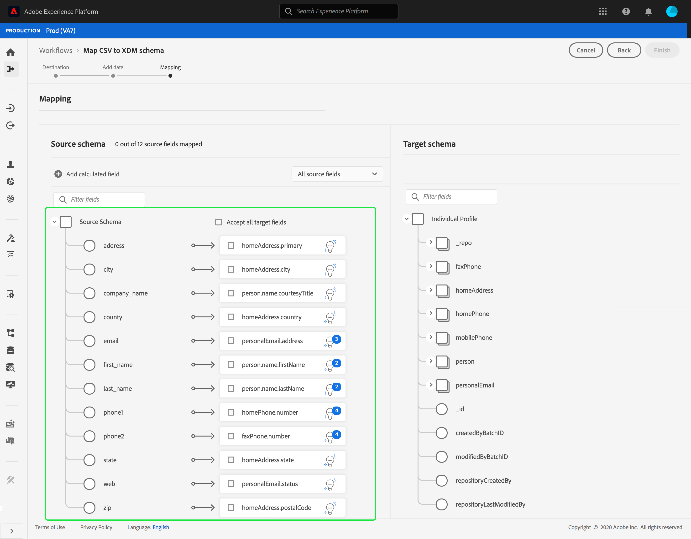

# Mappare un file CSV su uno schema XDM esistente

>[!NOTE]
>
>Questo documento illustra come mappare un file CSV su uno schema XDM esistente. Per informazioni su come utilizzare lo strumento di raccomandazione dello schema generato dall’intelligenza artificiale (attualmente in versione beta), consulta il documento su [mappatura di un file CSV utilizzando i consigli di apprendimento automatico](./recommendations.md).

Per acquisire dati CSV in [!DNL Adobe Experience Platform], i dati devono essere mappati su un [!DNL Experience Data Model] Schema (XDM). Questa esercitazione illustra come mappare un file CSV su uno schema XDM utilizzando [!DNL Platform] interfaccia utente.

## Introduzione

Questa esercitazione richiede una buona comprensione dei seguenti componenti di [!DNL Platform]:

- [[!DNL Experience Data Model (XDM System)]](../../../xdm/home.md): Il quadro standardizzato [!DNL Platform] organizza i dati sulla customer experience.
- [Acquisizione batch](../../batch-ingestion/overview.md): Il metodo [!DNL Platform] acquisisce i dati dai file di dati forniti dall’utente.
- [Preparazione dei dati di Adobe Experience Platform](../../batch-ingestion/overview.md): Una suite di funzionalità che ti consente di mappare e trasformare i dati acquisiti in modo che siano conformi agli schemi XDM. La documentazione su [Funzioni di preparazione dei dati](../../../data-prep/functions.md) è particolarmente pertinente per la mappatura dello schema.

Questa esercitazione richiede anche di aver già creato un set di dati per acquisire i dati CSV in . Per i passaggi sulla creazione di un set di dati nell’interfaccia utente, consulta [esercitazione sull’acquisizione dei dati](../ingest-batch-data.md).

## Scegliere una destinazione

Accedi a [[!DNL Adobe Experience Platform]](https://platform.adobe.com) quindi seleziona **[!UICONTROL Flussi di lavoro]** dalla barra di navigazione a sinistra per accedere al **[!UICONTROL Flussi di lavoro]** workspace.

Da **[!UICONTROL Flussi di lavoro]** schermata, seleziona **[!UICONTROL Mappatura di CSV su schema XDM]** in **[!UICONTROL Acquisizione dati]** e quindi seleziona **[!UICONTROL Launch]**.

La **[!UICONTROL Mappatura di CSV su schema XDM]** viene visualizzato il flusso di lavoro, a partire dal **[!UICONTROL Destinazione]** passo. Scegli un set di dati in entrata in cui acquisire i dati. Puoi utilizzare un set di dati esistente o crearne uno nuovo.

**Utilizzare un set di dati esistente**

Per acquisire i dati CSV in un set di dati esistente, seleziona **[!UICONTROL Utilizza set di dati esistenti]**. Puoi recuperare un set di dati esistente utilizzando la funzione di ricerca o scorrendo l’elenco dei set di dati esistenti nel pannello.

Per acquisire i dati CSV in un nuovo set di dati, seleziona **[!UICONTROL Creare un nuovo set di dati]** e immetti un nome e una descrizione per il set di dati nei campi forniti. Selezionare uno schema utilizzando la funzione di ricerca o scorrendo l’elenco degli schemi forniti. Seleziona **[!UICONTROL Successivo]** per procedere.

## Aggiungi dati

La **[!UICONTROL Aggiungi dati]** viene visualizzato il passaggio . Trascina il file CSV nello spazio disponibile oppure seleziona **[!UICONTROL Scegliere i file]** per inserire manualmente il file CSV.

La **[!UICONTROL Dati di esempio]** viene visualizzata una volta caricato il file, mostrando le prime dieci righe di dati. Dopo aver confermato che i dati sono stati caricati come previsto, seleziona **[!UICONTROL Successivo]**.

## Mappatura di campi CSV nei campi dello schema XDM

La **[!UICONTROL Mappatura]** viene visualizzato il passaggio . Le colonne del file CSV sono elencate in **[!UICONTROL Campo di origine]**, con i campi dello schema XDM corrispondenti elencati in **[!UICONTROL Campo di destinazione]**.

[!DNL Platform] fornisce automaticamente raccomandazioni intelligenti per i campi mappati automaticamente in base allo schema o al set di dati di destinazione selezionato. Puoi regolare manualmente le regole di mappatura in base ai tuoi casi d’uso.

Per accettare tutti i valori di mappatura di generazione automatica, seleziona la casella di controllo &quot;[!UICONTROL Accetta tutti i campi di destinazione]&quot;.

A volte, per lo schema di origine sono disponibili più consigli. In questo caso, la scheda di mappatura visualizza la raccomandazione più importante, seguita da un cerchio blu che contiene il numero di raccomandazioni aggiuntive disponibili. Selezionando l’icona della lampadina viene visualizzato un elenco dei consigli aggiuntivi. Potete scegliere una delle raccomandazioni alternative selezionando la casella di controllo accanto alla raccomandazione a cui desiderate eseguire la mappatura.

In alternativa, puoi scegliere di mappare manualmente lo schema di origine sullo schema di destinazione. Passa il puntatore del mouse sullo schema di origine da mappare, quindi seleziona l’icona più .

La **[!UICONTROL Mappatura origine su campo di destinazione]** appare il puntatore. Da qui puoi selezionare il campo da mappare, seguito da **[!UICONTROL Salva]** per aggiungere la nuova mappatura.

Per rimuovere una delle mappature, posiziona il cursore del mouse su tale mappatura, quindi seleziona l’icona meno .

### Aggiungi campo calcolato {#add-calculated-field}

I campi calcolati consentono la creazione di valori in base agli attributi nello schema di input. Questi valori possono quindi essere assegnati agli attributi nello schema di destinazione e ricevere un nome e una descrizione per facilitarne il riferimento.

Seleziona la **[!UICONTROL Aggiungi campo calcolato]** per continuare.

La **[!UICONTROL Crea campo calcolato]** viene visualizzato il pannello . La finestra di dialogo a sinistra contiene i campi, le funzioni e gli operatori supportati nei campi calcolati. Seleziona una delle schede per iniziare ad aggiungere funzioni, campi o operatori all’editor di espressioni.

| Scheda | Descrizione |
| --------- | ----------- |
| Campi | Nella scheda Campi sono elencati i campi e gli attributi disponibili nello schema di origine. |
| Funzioni | Nella scheda Funzioni sono elencate le funzioni disponibili per la trasformazione dei dati. Per ulteriori informazioni sulle funzioni che è possibile utilizzare all&#39;interno dei campi calcolati, leggere la guida in [utilizzo delle funzioni di preparazione dei dati (mappatore)](../../../data-prep/functions.md). |
| Operatori | La scheda operatori elenca gli operatori disponibili per la trasformazione dei dati. |

Puoi aggiungere manualmente campi, funzioni e operatori utilizzando l’editor espressioni al centro. Seleziona l’editor per iniziare a creare un’espressione.

Seleziona **[!UICONTROL Salva]** per procedere.

La schermata di mappatura viene visualizzata nuovamente con il campo sorgente appena creato. Applica il campo di destinazione corrispondente appropriato e seleziona **[!UICONTROL Fine]** per completare la mappatura.

## Monitoraggio dell’acquisizione di dati

Una volta mappato e creato il file CSV, puoi monitorare i dati che vengono acquisiti tramite di esso. Per ulteriori informazioni sul monitoraggio dell’acquisizione dei dati, consulta l’esercitazione su [monitoraggio dell’acquisizione dei dati](../../../ingestion/quality/monitor-data-ingestion.md).

## Passaggi successivi

Seguendo questa esercitazione, hai mappato correttamente un file CSV flat in uno schema XDM e lo hai acquisito in [!DNL Platform]. Questi dati possono ora essere utilizzati da downstream [!DNL Platform] servizi quali [!DNL Real-time Customer Profile]. Consulta la panoramica di [[!DNL Real-time Customer Profile]](../../../profile/home.md) per ulteriori informazioni.
