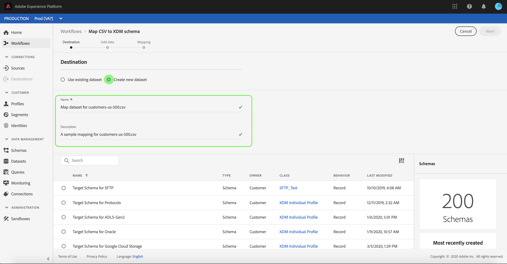
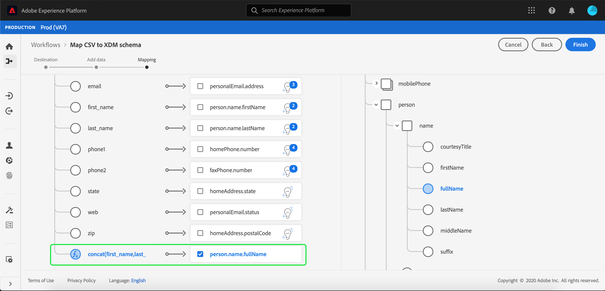

# Mappare un file CSV su uno schema XDM esistente

>[!NOTE]
>
>Questo documento illustra come mappare un file CSV a uno schema XDM esistente. Per informazioni su come utilizzare lo strumento di consigli per gli schemi generati dall’intelligenza artificiale (attualmente in versione beta), consulta il documento su [mappatura di un file CSV utilizzando i consigli di apprendimento automatico](./recommendations.md).

Per acquisire i dati CSV in [!DNL Adobe Experience Platform], i dati devono essere mappati su un [!DNL Experience Data Model] (XDM). Questo tutorial illustra come mappare un file CSV a uno schema XDM utilizzando [!DNL Platform] dell&#39;utente.

## Introduzione

Questo tutorial richiede una buona conoscenza dei seguenti componenti di [!DNL Platform]:

- [[!DNL Experience Data Model (XDM System)]](../../../xdm/home.md): il quadro standardizzato mediante il quale [!DNL Platform] organizza i dati sull’esperienza del cliente.
- [Acquisizione in batch](../../batch-ingestion/overview.md): il metodo con cui [!DNL Platform] acquisisce i dati dai file di dati forniti dall’utente.
- [Preparazione dati di Adobe Experience Platform](../../batch-ingestion/overview.md): suite di funzionalità che consente di mappare e trasformare i dati acquisiti per renderli conformi agli schemi XDM. La documentazione su [Funzioni di preparazione dati](../../../data-prep/functions.md) è particolarmente rilevante per la mappatura dello schema.

Questo tutorial richiede anche di aver già creato un set di dati in cui acquisire i dati CSV. Per informazioni sulla creazione di un set di dati nell’interfaccia utente, consulta la sezione [tutorial sull’acquisizione dei dati](../ingest-batch-data.md).

## Scegli una destinazione

Accedi a [[!DNL Adobe Experience Platform]](https://platform.adobe.com) e quindi seleziona **[!UICONTROL Flussi di lavoro]** dalla barra di navigazione a sinistra per accedere al **[!UICONTROL Flussi di lavoro]** Workspace.

Dalla sezione **[!UICONTROL Flussi di lavoro]** schermata, seleziona **[!UICONTROL Mappa lo schema CSV a XDM]** sotto **[!UICONTROL Acquisizione dei dati]** e quindi selezionare **[!UICONTROL Launch]**.

Il **[!UICONTROL Mappa lo schema CSV a XDM]** viene visualizzato il flusso di lavoro, a partire dal **[!UICONTROL Destinazione]** passaggio. Scegli un set di dati per i dati in entrata da acquisire in. Puoi utilizzare un set di dati esistente o crearne uno nuovo.

**Usa un set di dati esistente**

Per acquisire i dati CSV in un set di dati esistente, seleziona **[!UICONTROL Usa set di dati esistente]**. Puoi recuperare un set di dati esistente utilizzando la funzione di ricerca oppure scorrendo l’elenco dei set di dati esistenti nel pannello.

Per acquisire i dati CSV in un nuovo set di dati, seleziona **[!UICONTROL Crea nuovo set di dati]** e immetti un nome e una descrizione per il set di dati nei campi forniti. Seleziona uno schema utilizzando la funzione di ricerca o scorrendo l’elenco degli schemi forniti. Seleziona **[!UICONTROL Successivo]** per procedere.

## Aggiungi dati

Il **[!UICONTROL Aggiungi dati]** viene visualizzato il passaggio. Trascina il file CSV nello spazio apposito, oppure seleziona **[!UICONTROL Scegli i file]** per inserire manualmente il file CSV.

Il **[!UICONTROL Dati di esempio]** viene visualizzata una volta caricato il file, mostrando le prime dieci righe di dati. Dopo aver confermato che i dati sono stati caricati come previsto, seleziona **[!UICONTROL Successivo]**.

## Mappare i campi CSV su campi schema XDM

Il **[!UICONTROL Mappatura]** viene visualizzato il passaggio. Le colonne del file CSV sono elencate in **[!UICONTROL Campo di origine]**, con i campi dello schema XDM corrispondenti elencati in **[!UICONTROL Campo di destinazione]**.

[!DNL Platform] fornisce automaticamente consigli intelligenti per campi mappati automaticamente in base allo schema o al set di dati di destinazione selezionato. Puoi regolare manualmente le regole di mappatura in base ai tuoi casi d’uso.

Per accettare tutti i valori di mappatura che generano automaticamente, seleziona la casella di controllo etichettata &quot;[!UICONTROL Accetta tutti i campi di destinazione]&quot;.

A volte, per lo schema di origine sono disponibili più consigli. In questo caso, nella scheda di mappatura viene visualizzato il consiglio più importante, seguito da un cerchio blu contenente il numero di consigli aggiuntivi disponibili. Selezionando l’icona a forma di lampadina viene visualizzato un elenco dei consigli aggiuntivi. Puoi scegliere uno dei consigli alternativi selezionando la casella di controllo accanto al consiglio a cui desideri mappare.

In alternativa, puoi scegliere di mappare manualmente lo schema di origine sullo schema di destinazione. Passa il puntatore del mouse sullo schema di origine da mappare, quindi seleziona l’icona più.

Il **[!UICONTROL Mappa origine a campo di destinazione]** viene visualizzato popover. Da qui, puoi selezionare il campo da mappare, seguito da **[!UICONTROL Salva]** per aggiungere la nuova mappatura.

Se vuoi rimuovere una delle mappature, passa il cursore su di essa, quindi seleziona l’icona meno.

### Aggiungi campo calcolato {#add-calculated-field}

I campi calcolati consentono la creazione di valori in base agli attributi nello schema di input. Questi valori possono quindi essere assegnati ad attributi nello schema di destinazione e ricevere un nome e una descrizione per consentire un riferimento più semplice.

Seleziona la **[!UICONTROL Aggiungi campo calcolato]** per procedere.

Il **[!UICONTROL Crea campo calcolato]** viene visualizzato il pannello. La finestra di dialogo a sinistra contiene i campi, le funzioni e gli operatori supportati nei campi calcolati. Seleziona una delle schede per iniziare ad aggiungere funzioni, campi o operatori all’editor di espressioni.

| Scheda | Descrizione |
| --------- | ----------- |
| Campi | Nella scheda Campi sono elencati i campi e gli attributi disponibili nello schema di origine. |
| Funzioni | Nella scheda Funzioni sono elencate le funzioni disponibili per la trasformazione dei dati. Per ulteriori informazioni sulle funzioni utilizzabili nei campi calcolati, consulta la guida su [utilizzo delle funzioni di preparazione dati (Mapper)](../../../data-prep/functions.md). |
| Operatori | Nella scheda operatori sono elencati gli operatori disponibili per la trasformazione dei dati. |

Puoi aggiungere manualmente campi, funzioni e operatori utilizzando l’editor di espressioni al centro. Seleziona l’editor per iniziare a creare un’espressione.

Seleziona **[!UICONTROL Salva]** per procedere.

Viene visualizzata di nuovo la schermata di mappatura con il campo sorgente appena creato. Applica il campo di destinazione corrispondente appropriato e seleziona **[!UICONTROL Fine]** per completare la mappatura.

## Monitoraggio dell’acquisizione di dati

Una volta mappato e creato il file CSV, puoi monitorare i dati che vengono acquisiti tramite di esso. Per ulteriori informazioni sul monitoraggio dell’acquisizione dei dati, consulta l’esercitazione su [monitoraggio dell’acquisizione dei dati](../../../ingestion/quality/monitor-data-ingestion.md).

## Passaggi successivi

Seguendo questa esercitazione, hai mappato correttamente un file CSV semplice su uno schema XDM e lo hai acquisito in [!DNL Platform]. Questi dati possono ora essere utilizzati da downstream [!DNL Platform] servizi quali [!DNL Real-Time Customer Profile]. Consulta la panoramica di [[!DNL Real-Time Customer Profile]](../../../profile/home.md) per ulteriori informazioni.
