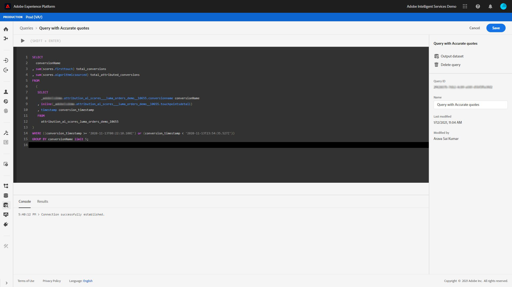

# Analisi dei punteggi di attribuzione tramite Query Service

Ogni riga nei dati rappresenta una conversione, in cui le informazioni per i relativi punti di contatto sono memorizzate come una matrice di strutture sotto la `touchpointsDetail` colonna.

| Informazioni sui punti di contatto | Colonna |
| ---------------------- | ------ |
| Nome punto di contatto | `touchpointsDetail. touchpointName` |
| Canale punto di contatto | `touchpointsDetail.touchPoint.mediaChannel` |
| Punteggi algoritmici per Attribution AI punto di contatto | <li>`touchpointsDetail.scores.algorithmicSourced`</li> <li> `touchpointsDetail.scores.algorithmicInfluenced` </li> |

## Ricerca dei percorsi dati

Nell’interfaccia utente di Adobe Experience Platform, seleziona **[!UICONTROL Set di dati]** nella navigazione a sinistra. La **[!UICONTROL Set di dati]** viene visualizzata la pagina . Quindi, seleziona la **[!UICONTROL Sfoglia]** e trova il set di dati di output per i punteggi delle Attribution AI.


Seleziona il set di dati di output. Viene visualizzata la pagina dell’attività del set di dati.


Nella pagina dell’attività del set di dati, seleziona **[!UICONTROL Anteprima set di dati]** nell’angolo in alto a destra per visualizzare in anteprima i dati e assicurarsi che siano stati acquisiti come previsto.


Dopo aver visualizzato l’anteprima dei dati, seleziona lo schema nella barra a destra. Viene visualizzato un percorso con il nome e la descrizione dello schema. Selezionare il collegamento ipertestuale del nome dello schema per reindirizzare allo schema di punteggio.


Utilizzando lo schema di punteggio, puoi selezionare o cercare un valore. Una volta selezionato, il **[!UICONTROL Proprietà campo]** si apre la barra laterale che consente di copiare il percorso da utilizzare nella creazione delle query.


## Servizio query di accesso

Per accedere a Query Service dall’interfaccia utente di Platform, inizia selezionando **[!UICONTROL Query]** nel menu di navigazione a sinistra, seleziona il **[!UICONTROL Sfoglia]** scheda . Viene caricato un elenco delle query salvate in precedenza.


Quindi, seleziona **[!UICONTROL Crea query]** nell&#39;angolo in alto a destra. Viene caricato l’editor delle query. Utilizzando l’editor delle query è possibile iniziare a creare query utilizzando i dati di punteggio.



Per ulteriori informazioni sull’editor delle query, visita il [Guida utente dell’editor delle query](../../query-service/ui/user-guide.md).

## Modelli di query per l’analisi del punteggio di attribuzione

Le query riportate di seguito possono essere utilizzate come modello per diversi scenari di analisi dei punteggi. È necessario sostituire il `_tenantId` e `your_score_output_dataset` con i valori corretti trovati nello schema di output del punteggio.

>[!NOTE]
>
> A seconda di come sono stati acquisiti i dati, i valori utilizzati di seguito, come `timestamp` potrebbe essere in un formato diverso.

### Esempi di convalida

**Numero totale di conversioni per evento di conversione (all’interno di una finestra di conversione)**

```sql
    SELECT conversionName,
           SUM(scores.firstTouch) as total_conversions,
           SUM(scores.algorithmicSourced) as total_attributed_conversions
    FROM
        (SELECT
                _tenantId.your_score_output_dataset.conversionName
                    as conversionName,
                inline(_tenantId.your_score_output_dataset.touchpointsDetail),
                timestamp as conversion_timestamp
         FROM
                your_score_output_dataset
        )
    WHERE
        conversion_timestamp >= '2020-07-16'
      AND
        conversion_timestamp <  '2020-10-14'
    GROUP BY
        conversionName
```

**Numero totale di eventi solo conversione (all’interno di una finestra di conversione)**

```sql
    SELECT
        _tenantId.your_score_output_dataset.conversionName as conversionName,
        COUNT(1) as convOnly_cnt
    FROM
        your_score_output_dataset
    WHERE
        _tenantId.your_score_output_dataset.touchpointsDetail.touchpointName[0] IS NULL AND
        timestamp >= '2020-07-16' AND
        timestamp <  '2020-10-14'
    GROUP BY
        conversionName
```

### Esempio di analisi delle tendenze

**Numero di conversioni al giorno**

```sql
    SELECT conversionName,
           DATE(conversion_timestamp) as conversion_date,
           SUM(scores.firstTouch) as convertion_cnt
    FROM
        (SELECT
                _tenantId.your_score_output_dataset.conversionName as conversionName,
                inline(_tenantId.your_score_output_dataset.touchpointsDetail),
                timestamp as conversion_timestamp
         FROM
                your_score_output_dataset
        )
    GROUP BY
        conversionName, DATE(conversion_timestamp)
    ORDER BY
        conversionName, DATE(conversion_timestamp)
    LIMIT 20
```

### Esempio di analisi della distribuzione

**Quantità di punti di contatto sui percorsi di conversione per tipo definito (all’interno di una finestra di conversione)**

```sql
    SELECT conversionName,
           touchpointName,
           COUNT(1) as tp_count
    FROM
        (SELECT
                _tenantId.your_score_output_dataset.conversionName as conversionName,
                inline(_tenantId.your_score_output_dataset.touchpointsDetail),
                timestamp as conversion_timestamp
         FROM
                your_score_output_dataset
        )
    WHERE
        conversion_timestamp >= '2020-07-16' AND
        conversion_timestamp < '2020-10-14' AND
        touchpointName IS NOT NULL
    GROUP BY
        conversionName, touchpointName
    ORDER BY
        conversionName, tp_count DESC
```

### Esempi di generazione di informazioni

**Suddivisione delle unità incrementali per punto di contatto e data di conversione (all’interno di una finestra di conversione)**

```sql
    SELECT conversionName,
           touchpointName,
           DATE(conversion_timestamp) as conversion_date,
           SUM(scores.algorithmicSourced) as incremental_units
    FROM
        (SELECT
                _tenantId.your_score_output_dataset.conversionName as conversionName,
                inline(_tenantId.your_score_output_dataset.touchpointsDetail),
                timestamp as conversion_timestamp
         FROM
                your_score_output_dataset
        )
    WHERE
        conversion_timestamp >= '2020-07-16' AND
        conversion_timestamp < '2020-10-14'  AND
        touchpointName IS NOT NULL
    GROUP BY
        conversionName, touchpointName, DATE(conversion_timestamp)
    ORDER BY
        conversionName, touchpointName, DATE(conversion_timestamp)
```

**Suddivisione delle unità incrementali per punto di contatto e data del punto di contatto (all’interno di una finestra di conversione)**

```sql
    SELECT conversionName,
           touchpointName,
           DATE(touchpoint.timestamp) as touchpoint_date,
           SUM(scores.algorithmicSourced) as incremental_units
    FROM
        (SELECT
                _tenantId.your_score_output_dataset.conversionName as conversionName,
                inline(_tenantId.your_score_output_dataset.touchpointsDetail),
                timestamp as conversion_timestamp
         FROM
                your_score_output_dataset
        )
    WHERE
        conversion_timestamp >= '2020-07-16' AND
        conversion_timestamp < '2020-10-14'  AND
        touchpointName IS NOT NULL
    GROUP BY
        conversionName, touchpointName, DATE(touchpoint.timestamp)
    ORDER BY
        conversionName, touchpointName, DATE(touchpoint.timestamp)
    LIMIT 20
```

**Punteggi aggregati per un determinato tipo di punto di contatto per tutti i modelli di punteggio (all’interno di una finestra di conversione)**

```sql
    SELECT
           conversionName,
           touchpointName,
           SUM(scores.algorithmicSourced) as total_incremental_units,
           SUM(scores.algorithmicInfluenced) as total_influenced_units,
           SUM(scores.uShape) as total_uShape_units,
           SUM(scores.decayUnits) as total_decay_units,
           SUM(scores.linear) as total_linear_units,
           SUM(scores.lastTouch) as total_lastTouch_units,
           SUM(scores.firstTouch) as total_firstTouch_units
    FROM
        (SELECT
                _tenantId.your_score_output_dataset.conversionName as conversionName,
                inline(_tenantId.your_score_output_dataset.touchpointsDetail),
                timestamp as conversion_timestamp
         FROM
                your_score_output_dataset
        )
    WHERE
        conversion_timestamp >= '2020-07-16' AND
        conversion_timestamp < '2020-10-14'  AND
        touchpointName = 'display'
    GROUP BY
        conversionName, touchpointName
    ORDER BY
        conversionName, touchpointName
```

**Avanzate - analisi della lunghezza del percorso**

Ottieni una distribuzione della lunghezza del percorso per ogni tipo di evento di conversione:

```sql
    WITH agg_path AS (
          SELECT
            _tenantId.your_score_output_dataset.conversionName as conversionName,
            sum(size(_tenantId.your_score_output_dataset.touchpointsDetail)) as path_length
          FROM
            your_score_output_dataset
          WHERE
            _tenantId.your_score_output_dataset.touchpointsDetail.touchpointName[0] IS NOT NULL AND
            timestamp >= '2020-07-16' AND
            timestamp <  '2020-10-14'
          GROUP BY
            _tenantId.your_score_output_dataset.conversionName,
            eventMergeId
    )
    SELECT
        conversionName,
        path_length,
        count(1) as conversionPath_count
    FROM
        agg_path
    GROUP BY
        conversionName, path_length
    ORDER BY
        conversionName, path_length
```

**Avanzate : numero distinto di punti di contatto nell’analisi dei percorsi di conversione**

Ottieni la distribuzione del numero di punti di contatto distinti in un percorso di conversione per ogni tipo di evento di conversione:

```sql
    WITH agg_path AS (
      SELECT
        _tenantId.your_score_output_dataset.conversionName as conversionName,
        size(array_distinct(flatten(collect_list(_tenantId.your_score_output_dataset.touchpointsDetail.touchpointName)))) as num_dist_tp
      FROM
        your_score_output_dataset
      WHERE
        _tenantId.your_score_output_dataset.touchpointsDetail.touchpointName[0] IS NOT NULL AND
        timestamp >= '2020-07-16' AND
        timestamp <  '2020-10-14'
      GROUP BY
        _tenantId.your_score_output_dataset.conversionName,
        eventMergeId
    )
    SELECT
        conversionName,
        num_dist_tp,
        count(1) as conversionPath_count
    FROM
     agg_path
    GROUP BY
        conversionName, num_dist_tp
    ORDER BY
        conversionName, num_dist_tp
```

### Esempio di appiattimento ed esplosione dello schema

Questa query appiattisce la colonna di struttura in più colonne singole ed esplode array in più righe. Questo consente di trasformare i punteggi di attribuzione in un formato CSV. L’output di questa query presenta una conversione e uno dei punti di contatto corrispondenti a tale conversione in ogni riga.

>[!TIP]
>
> In questo esempio, devi sostituire `{COLUMN_NAME}` oltre a `_tenantId` e `your_score_output_dataset`. La `COLUMN_NAME` può accettare i valori dei nomi di colonna facoltativi passati attraverso (colonne di reporting) aggiunti durante la configurazione dell’istanza di Attribution AI. Controlla lo schema di output del punteggio per trovare il `{COLUMN_NAME}` valori necessari per completare la query.

```sql
SELECT 
  segmentation,
  conversionName,
  scoreCreatedTime,
  aaid, _id, eventMergeId,
  conversion.eventType as conversion_eventType,
  conversion.quantity as conversion_quantity,
  conversion.eventSource as conversion_eventSource,
  conversion.priceTotal as conversion_priceTotal,
  conversion.timestamp as conversion_timestamp,
  conversion.geo as conversion_geo,
  conversion.receivedTimestamp as conversion_receivedTimestamp,
  conversion.dataSource as conversion_dataSource,
  conversion.productType as conversion_productType,
  conversion.passThrough.{COLUMN_NAME} as conversion_passThru_column,
  conversion.skuId as conversion_skuId,
  conversion.product as conversion_product,
  touchpointName,
  touchPoint.campaignGroup as tp_campaignGroup, 
  touchPoint.mediaType as tp_mediaType,
  touchPoint.campaignTag as tp_campaignTag,
  touchPoint.timestamp as tp_timestamp,
  touchPoint.geo as tp_geo,
  touchPoint.receivedTimestamp as tp_receivedTimestamp,
  touchPoint.passThrough.{COLUMN_NAME} as tp_passThru_column,
  touchPoint.campaignName as tp_campaignName,
  touchPoint.mediaAction as tp_mediaAction,
  touchPoint.mediaChannel as tp_mediaChannel,
  touchPoint.eventid as tp_eventid,
  scores.*
FROM (
  SELECT
        _tenantId.your_score_output_dataset.segmentation,
        _tenantId.your_score_output_dataset.conversionName,
        _tenantId.your_score_output_dataset.scoreCreatedTime,
        _tenantId.your_score_output_dataset.conversion,
        _id,
        eventMergeId,
        map_values(identityMap)[0][0].id as aaid,
        inline(_tenantId.your_score_output_dataset.touchpointsDetail)
  FROM
        your_score_output_dataset
)
```
