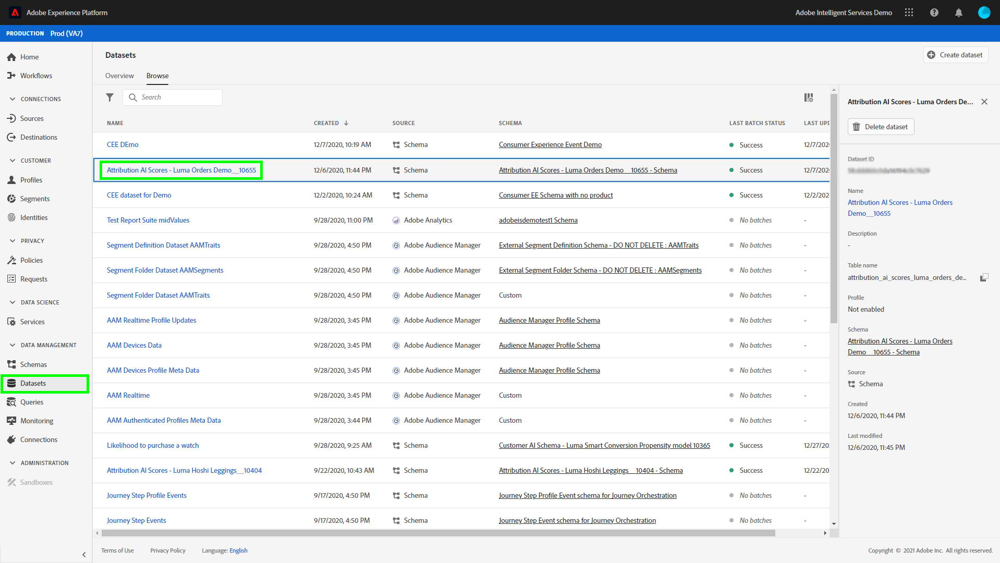

# Guida rapida di Adobe Experience Platform Query Service per l&#39;analisi dei punteggi di attribuzione

Ogni riga nei dati rappresenta una conversione, in cui le informazioni per i punti di contatto correlati vengono memorizzate come un array di strutture sotto la colonna `touchpointsDetail`.

| Informazioni sul punto di contatto | Colonna |
| ---------------------- | ------ |
| Nome punto di contatto | `touchpointsDetail. touchpointName` |
| Canale punto di contatto | `touchpointsDetail.touchPoint.mediaChannel` |
| Punti algoritmici di Touchpoint AAI | <li>`touchpointsDetail.scores.algorithmicSourced`</li> <li> `touchpointsDetail.scores.algorithmicInfluenced` </li> |

## Ricerca dei percorsi di dati

Nell’interfaccia utente di Adobe Experience Platform, selezionate **[!UICONTROL Datasets]** nella navigazione a sinistra. Viene visualizzata la pagina **[!UICONTROL Datasets]**. Quindi, selezionate la scheda **[!UICONTROL Browse]** e trovate il set di dati di output per le valutazioni delle Attribution AI .



Selezionare il set di dati di output. Viene visualizzata la pagina dell&#39;attività del dataset.


Nella pagina dell&#39;attività del dataset, selezionate **[!UICONTROL Preview dataset]** nell&#39;angolo in alto a destra per visualizzare l&#39;anteprima dei dati e accertatevi che siano stati acquisiti come previsto.


Dopo aver visualizzato l&#39;anteprima dei dati, selezionare lo schema nella barra a destra. Viene visualizzato un puntatore con il nome e la descrizione dello schema. Selezionare il collegamento ipertestuale del nome dello schema per reindirizzare allo schema di punteggio.


Utilizzando lo schema di punteggio, è possibile selezionare o cercare un valore. Una volta selezionata questa opzione, si apre la barra laterale **[!UICONTROL Field properties]** che consente di copiare il percorso da usare per la creazione di query.


## Servizio query di accesso

Per accedere a Servizio query dall&#39;interfaccia utente della piattaforma, iniziare selezionando **[!UICONTROL Queries]** nella navigazione a sinistra, quindi selezionare la scheda **[!UICONTROL Browse]**. Viene caricato un elenco delle query salvate in precedenza.


Quindi, selezionare **[!UICONTROL Create query]** nell&#39;angolo superiore destro. Viene caricato l’Editor query. Utilizzando l&#39;Editor query è possibile iniziare a creare query utilizzando i dati di punteggio.


Per ulteriori informazioni sull&#39;Editor query, visitare la [Guida utente dell&#39;Editor query](../../query-service/ui/user-guide.md).

## Modelli di query per l&#39;analisi del punteggio di attribuzione

Le query riportate di seguito possono essere utilizzate come modello per diversi scenari di analisi dei punteggi. È necessario sostituire `_tenantId` e `your_score_output_dataset` con i valori corretti che si trovano nello schema di output del punteggio.

>[!NOTE]
>
> A seconda di come sono stati acquisiti i dati, i valori utilizzati di seguito, come `timestamp`, potrebbero essere in un formato diverso.

### Esempi di convalida

**Numero totale di conversioni per evento di conversione (all&#39;interno di una finestra di conversione)**

```sql
    SELECT conversionName,
           SUM(scores.firstTouch) as total_conversions,
           SUM(scores.algorithmicSourced) as total_attributed_conversions
    FROM
        (SELECT
                _tenantId.your_score_output_dataset.conversionName
                    as conversionName,
                inline(_tenantId.your_score_output_dataset.touchpointsDetail),
                timestamp as conversion_timestamp
         FROM
                your_score_output_dataset
        )
    WHERE
        conversion_timestamp >= '2020-07-16'
      AND
        conversion_timestamp <  '2020-10-14'
    GROUP BY
        conversionName
```

**Numero totale di eventi solo conversione (all&#39;interno di una finestra di conversione)**

```sql
    SELECT
        _tenantId.your_score_output_dataset.conversionName as conversionName,
        COUNT(1) as convOnly_cnt
    FROM
        your_score_output_dataset
    WHERE
        _tenantId.your_score_output_dataset.touchpointsDetail.touchpointName[0] IS NULL AND
        timestamp >= '2020-07-16' AND
        timestamp <  '2020-10-14'
    GROUP BY
        conversionName
```

### Esempi di analisi delle tendenze

**Numero di conversioni al giorno**

```sql
    SELECT conversionName,
           DATE(conversion_timestamp) as conversion_date,
           SUM(scores.firstTouch) as convertion_cnt
    FROM
        (SELECT
                _tenantId.your_score_output_dataset.conversionName as conversionName,
                inline(_tenantId.your_score_output_dataset.touchpointsDetail),
                timestamp as conversion_timestamp
         FROM
                your_score_output_dataset
        )
    GROUP BY
        conversionName, DATE(conversion_timestamp)
    ORDER BY
        conversionName, DATE(conversion_timestamp)
    LIMIT 20
```

### Esempi di analisi di distribuzione

**Quantità di punti di contatto sui percorsi di conversione per tipo definito (all&#39;interno di una finestra di conversione)**

```sql
    SELECT conversionName,
           touchpointName,
           COUNT(1) as tp_count
    FROM
        (SELECT
                _tenantId.your_score_output_dataset.conversionName as conversionName,
                inline(_tenantId.your_score_output_dataset.touchpointsDetail),
                timestamp as conversion_timestamp
         FROM
                your_score_output_dataset
        )
    WHERE
        conversion_timestamp >= '2020-07-16' AND
        conversion_timestamp < '2020-10-14' AND
        touchpointName IS NOT NULL
    GROUP BY
        conversionName, touchpointName
    ORDER BY
        conversionName, tp_count DESC
```

### Esempi di generazione di informazioni

**Suddivisione delle unità incrementali per punto di contatto e data di conversione (entro una finestra di conversione)**

```sql
    SELECT conversionName,
           touchpointName,
           DATE(conversion_timestamp) as conversion_date,
           SUM(scores.algorithmicSourced) as incremental_units
    FROM
        (SELECT
                _tenantId.your_score_output_dataset.conversionName as conversionName,
                inline(_tenantId.your_score_output_dataset.touchpointsDetail),
                timestamp as conversion_timestamp
         FROM
                your_score_output_dataset
        )
    WHERE
        conversion_timestamp >= '2020-07-16' AND
        conversion_timestamp < '2020-10-14'  AND
        touchpointName IS NOT NULL
    GROUP BY
        conversionName, touchpointName, DATE(conversion_timestamp)
    ORDER BY
        conversionName, touchpointName, DATE(conversion_timestamp)
```

**Suddivisione delle unità incrementali per punto di contatto e data punto di contatto (all’interno in una finestra di conversione)**

```sql
    SELECT conversionName,
           touchpointName,
           DATE(touchpoint.timestamp) as touchpoint_date,
           SUM(scores.algorithmicSourced) as incremental_units
    FROM
        (SELECT
                _tenantId.your_score_output_dataset.conversionName as conversionName,
                inline(_tenantId.your_score_output_dataset.touchpointsDetail),
                timestamp as conversion_timestamp
         FROM
                your_score_output_dataset
        )
    WHERE
        conversion_timestamp >= '2020-07-16' AND
        conversion_timestamp < '2020-10-14'  AND
        touchpointName IS NOT NULL
    GROUP BY
        conversionName, touchpointName, DATE(touchpoint.timestamp)
    ORDER BY
        conversionName, touchpointName, DATE(touchpoint.timestamp)
    LIMIT 20
```

**Punteggi aggregati per un determinato tipo di punto di contatto per tutti i modelli di punteggio (all’interno di una finestra di conversione)**

```sql
    SELECT
           conversionName,
           touchpointName,
           SUM(scores.algorithmicSourced) as total_incremental_units,
           SUM(scores.algorithmicInfluenced) as total_influenced_units,
           SUM(scores.uShape) as total_uShape_units,
           SUM(scores.decayUnits) as total_decay_units,
           SUM(scores.linear) as total_linear_units,
           SUM(scores.lastTouch) as total_lastTouch_units,
           SUM(scores.firstTouch) as total_firstTouch_units
    FROM
        (SELECT
                _tenantId.your_score_output_dataset.conversionName as conversionName,
                inline(_tenantId.your_score_output_dataset.touchpointsDetail),
                timestamp as conversion_timestamp
         FROM
                your_score_output_dataset
        )
    WHERE
        conversion_timestamp >= '2020-07-16' AND
        conversion_timestamp < '2020-10-14'  AND
        touchpointName = 'display'
    GROUP BY
        conversionName, touchpointName
    ORDER BY
        conversionName, touchpointName
```

**Advanced - analisi della lunghezza del percorso**

Ottenere una distribuzione della lunghezza del percorso per ciascun tipo di evento di conversione:

```sql
    WITH agg_path AS (
          SELECT
            _tenantId.your_score_output_dataset.conversionName as conversionName,
            sum(size(_tenantId.your_score_output_dataset.touchpointsDetail)) as path_length
          FROM
            your_score_output_dataset
          WHERE
            _tenantId.your_score_output_dataset.touchpointsDetail.touchpointName[0] IS NOT NULL AND
            timestamp >= '2020-07-16' AND
            timestamp <  '2020-10-14'
          GROUP BY
            _tenantId.your_score_output_dataset.conversionName,
            eventMergeId
    )
    SELECT
        conversionName,
        path_length,
        count(1) as conversionPath_count
    FROM
        agg_path
    GROUP BY
        conversionName, path_length
    ORDER BY
        conversionName, path_length
```

**Avanzate - numero distinto di punti di contatto sull&#39;analisi dei percorsi di conversione**

Ottenere la distribuzione per il numero di punti di contatto distinti su un percorso di conversione per ciascun tipo di evento di conversione:

```sql
    WITH agg_path AS (
      SELECT
        _tenantId.your_score_output_dataset.conversionName as conversionName,
        size(array_distinct(flatten(collect_list(_tenantId.your_score_output_dataset.touchpointsDetail.touchpointName)))) as num_dist_tp
      FROM
        your_score_output_dataset
      WHERE
        _tenantId.your_score_output_dataset.touchpointsDetail.touchpointName[0] IS NOT NULL AND
        timestamp >= '2020-07-16' AND
        timestamp <  '2020-10-14'
      GROUP BY
        _tenantId.your_score_output_dataset.conversionName,
        eventMergeId
    )
    SELECT
        conversionName,
        num_dist_tp,
        count(1) as conversionPath_count
    FROM
     agg_path
    GROUP BY
        conversionName, num_dist_tp
    ORDER BY
        conversionName, num_dist_tp
```
