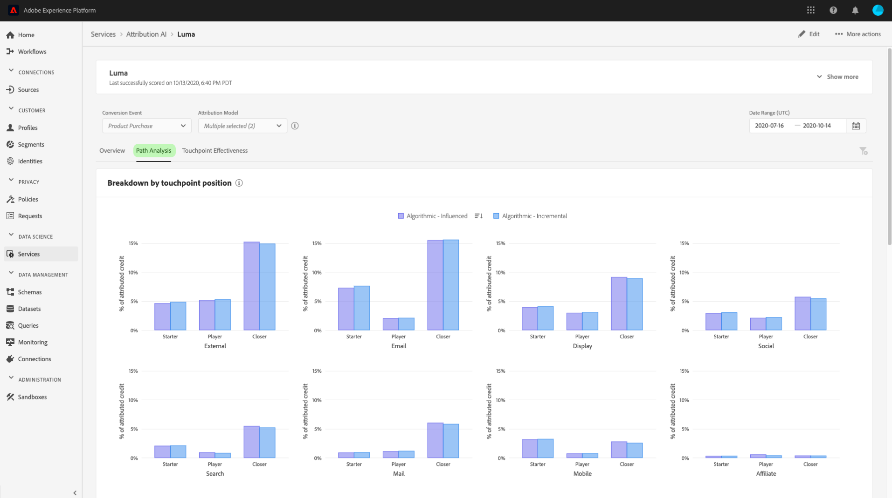

# Scopri le informazioni in Attribution AI

Le istanze del servizio Attribution AI forniscono informazioni utili per prendere e misurare le decisioni di marketing relative alle prestazioni di marketing e al ritorno sull’investimento. La selezione di un’istanza di servizio fornisce visualizzazioni e filtri che ti aiutano a comprendere l’impatto di ogni interazione con il cliente in ogni fase del percorso di clienti.

Questo documento funge da guida per interagire con le informazioni sulle istanze del servizio nell’interfaccia utente di Adobe Intelligent Services.

## Introduzione

Per utilizzare le informazioni per Attribution AI, è necessario disporre di un’istanza di servizio con uno stato di esecuzione riuscito. Per creare una nuova istanza di servizio, visita il [Guida all’interfaccia utente di Attribution AI](./user-guide.md). Se hai creato di recente un&#39;istanza di servizio ed è ancora in fase di formazione e valutazione, ti preghiamo di consentire 24 ore per il completamento dell&#39;esecuzione.

## Panoramica delle informazioni sulle istanze del servizio

In [!DNL Adobe Experience Platform] Interfaccia utente, seleziona **[!UICONTROL Servizi]** nella navigazione a sinistra. La **[!UICONTROL Servizi]** viene visualizzato il browser e viene visualizzato l&#39;Adobe Intelligent Services disponibile. Nel contenitore per Attribution AI, seleziona **[!UICONTROL Apri]**.

Viene visualizzata la pagina del servizio Attribution AI. In questa pagina sono elencate le istanze di servizio di Attribution AI e vengono visualizzate informazioni su di esse, tra cui il nome dell’istanza, gli eventi di conversione, la frequenza di esecuzione dell’istanza e lo stato dell’ultimo aggiornamento. Seleziona un nome di istanza del servizio da iniziare.

>[!NOTE]
>
>È possibile selezionare solo le istanze del servizio che hanno completato con successo le esecuzioni dei punteggi.

Viene quindi visualizzata la pagina delle informazioni relative all’istanza del servizio, in cui vengono fornite le visualizzazioni e una serie di filtri per interagire con i dati. Le visualizzazioni e i filtri sono descritti più dettagliatamente in questa guida.

### Dettagli istanza servizio

Per visualizzare ulteriori dettagli per un&#39;istanza di servizio, seleziona **[!UICONTROL Mostra altro]** in alto a destra.

Viene visualizzato un elenco dettagliato. Per maggiori informazioni sulle proprietà elencate, visita [Guida utente di Attribution AI](./user-guide.md).

### Modificare un’istanza

Per modificare un’istanza, seleziona **[!UICONTROL Modifica]** nella navigazione in alto a destra.

Viene visualizzata la finestra di dialogo di modifica, che consente di modificare il nome, la descrizione e la frequenza di punteggio dell’istanza. Se lo stato dell’istanza è disabilitato, non è possibile modificare la frequenza di punteggio. Per confermare le modifiche e chiudere la finestra di dialogo, seleziona **[!UICONTROL Salva]** nell&#39;angolo in basso a destra.

### Altre azioni {#more-actions}

La **[!UICONTROL Altre azioni]** si trova nella navigazione in alto a destra accanto a **[!UICONTROL Modifica]**. Selezione **[!UICONTROL Altre azioni]** apre un menu a discesa che consente di selezionare una delle seguenti operazioni:

- **[!UICONTROL Clona]**: Duplica l&#39;istanza.
- **[!UICONTROL Elimina]**: Elimina l’istanza.
- **[!UICONTROL Scaricare i dati di riepilogo]**: Scarica un file CSV contenente i dati di riepilogo.
- **[!UICONTROL Punteggi di accesso]**: Selezione **[!UICONTROL Punteggi di accesso]** reindirizza l&#39;utente al [punteggio di accesso per tutorial Attribution AI](./download-scores.md).
- **[!UICONTROL Visualizza cronologia di esecuzione]**: Viene visualizzato un pover contenente un elenco di tutte le esecuzioni del punteggio associate all’istanza del servizio.

## Filtrare i dati

Le informazioni di Attribution AI ti consentono di filtrare i dati e aggiornare automaticamente le visualizzazioni dell’interfaccia utente in base ai filtri selezionati.

### Evento di conversione

Quando crei una nuova istanza in Attribution AI, uno dei campi obbligatori è &quot;Eventi di conversione&quot;. Gli eventi di conversione sono obiettivi aziendali che identificano l’impatto delle attività di marketing, come ordini di e-commerce, acquisti in-store e visite a siti web.

Dall’interno dell’istanza, il **[!UICONTROL Eventi di conversione]** Il menu a discesa ti consente di selezionare uno degli eventi definiti per l’istanza per filtrare i dati. Quando si selezionano eventi specifici, le visualizzazioni dell’interfaccia utente vengono modificate per compilare solo le conversioni appartenenti a tali eventi.

### Modello di attribuzione

Selezione **[!UICONTROL Modello di attribuzione]** apre un menu a discesa con tutti i diversi modelli di attribuzione disponibili. Puoi selezionare più modelli per confrontare i risultati. Per ulteriori informazioni sui diversi modelli di attribuzione e sul loro funzionamento, visita il [Attribution AI](./overview.md) panoramica contenente una tabella con informazioni su ciascun modello.

### Area geografica

>[!NOTE]
>
>Questo filtro è presente solo se hai eseguito il passaggio facoltativo [modellazione basata su regione](./user-guide.md#region-based-modeling-optional) nella guida all’interfaccia utente di Attribution AI al momento della creazione dell’istanza del servizio.

Questo filtro consente di selezionare le aree configurate nel processo di creazione delle istanze.

### Aggiungere filtri

Puoi aggiungere altri filtri selezionando la **filter** per aprire **[!UICONTROL Aggiungere filtri]** popover. La **[!UICONTROL Aggiungere filtri]** popover ti consente di filtrare per canale, geografia, tipo di file multimediali e prodotto. Solo i filtri applicabili per un&#39;istanza di servizio sono compilati dal proxy. Ad esempio, se non hai fornito dati geografici o un tipo di supporto, questi attributi di filtro non saranno disponibili per la tua istanza.

- **[!UICONTROL Canale]:** Selezionando l’attributo del canale puoi filtrare uno qualsiasi dei canali di marketing disponibili. Puoi selezionare più canali per confrontarli.
- **[!UICONTROL Informazioni geografiche]:** Selezionando l’attributo geografia è possibile filtrare i codici paese in base ai modelli basati su regione. A seconda dei dati, questo filtro potrebbe essere presente o meno. I codici paese sono lunghi due caratteri. Vedi l&#39;elenco completo dei codici paese [qui](https://datahub.io/core/country-list).
- **[!UICONTROL Tipo di supporto]:** Selezionando l’attributo tipo di file multimediale è possibile filtrare uno qualsiasi dei tipi di file multimediali definiti.
- **[!UICONTROL Prodotto]:** Selezionando l’attributo di prodotto puoi filtrare da tutti i prodotti inizialmente acquisiti nella creazione dell’istanza.

### Date Range

Seleziona l’icona del calendario per aprire l’intervallo di date. Le date dell’evento di conversione iniziale e finale determinano la quantità di dati compilati nell’interfaccia utente. È possibile scegliere di restringere o ampliare l’intervallo di date per attivare o espandere la quantità di dati compilati.

## Panoramica dei dati

La **[!UICONTROL Panoramica]** la scheda mostra le conversioni totali per modello di attribuzione. Il numero totale cambia in base alla specifica ricerca effettuata utilizzando i filtri precedentemente descritti in questo documento. Selezionando più modelli, vengono aggiunti ulteriori cerchi alla Panoramica, ciascuno con il proprio colore corrispondente alla legenda.

## Tendenze settimanali

La **[!UICONTROL Tendenze settimanali]** la scheda suddivide la conversione totale in base all&#39;intervallo di date impostato durante il processo di filtraggio.

Selezione dei puntini di sospensione in alto a destra del **Tendenze settimanali** visualizza un elenco a discesa che consente di selezionare le tendenze giornaliere, settimanali o mensili.

Passando il puntatore del mouse sulla riga dati di un modello di attribuzione specifico, viene creato un puntatore che mostra il numero totale di conversioni per tale data.

## Suddivisione per canale

La **[!UICONTROL Suddivisione per canale]** viene utilizzata per determinare il numero totale di conversioni in relazione a ciascun canale. Questa scheda può essere utilizzata per prendere decisioni sull&#39;efficacia di ogni canale e sul ritorno sull&#39;investimento.

Selezione dei puntini di sospensione in alto a destra del **[!UICONTROL Suddivisione per canale]** apre un menu a discesa che consente di compilare i dati in base ai punti di contatto.

## Campagne principali

La **[!UICONTROL Campagne principali]** viene visualizzata una panoramica delle campagne e delle prestazioni della campagna in ciascun canale. Questa scheda può aiutare a informare il tuo team dell’efficacia di una campagna specifica per un dato canale e fornire informazioni quali le campagne in cui investire ulteriormente.

## Suddivisione per posizione punto di contatto

Selezione della **[!UICONTROL Analisi del percorso]** viene caricata la scheda **[!UICONTROL Suddivisione per posizione punto di contatto]** e **[!UICONTROL Percorsi di conversione principali]** grafici.

La **[!UICONTROL Suddivisione per posizione punto di contatto]** grafico è una suddivisione delle conversioni attribuite in base alla posizione del punto di contatto rispetto a tutti i percorsi di conversione. Questo grafico ti aiuta a comprendere quali punti di contatto sono più efficaci nelle diverse fasi del percorso di conversione. Le tappe sono di inizio, giocatore e più vicino.

- **Avviatore:** Indica che il punto di contatto è stato il primo tocco in un percorso di conversione.
- **Lettore:** Indica che il punto di contatto non è stato il primo o l’ultimo contatto che ha portato a una conversione.
- **Più vicino:** Indica che il punto di contatto è stato l’ultimo contatto prima di una conversione.

>!![NOTE]
La somma del contributo percentuale per un modello di attribuzione per tutti i punti di contatto e le posizioni deve essere pari a 100.

## Percorsi di conversione principali

La **[!UICONTROL Percorsi di conversione principali]** Il grafico mostra i punteggi algoritmici e influenzati sui percorsi di conversione principali nelle aree selezionate. Questo grafico ti consente di visualizzare cosa i punti di contatto contribuiscono alle conversioni e qual è il punteggio di attribuzione per ogni punto di contatto. Puoi utilizzare queste informazioni per visualizzare i percorsi più frequenti in una determinata area e vedere se emergono dei pattern tra i diversi set di punti di contatto.

## Efficienza dei punti di contatto

Selezione della **[!UICONTROL Efficienza dei punti di contatto]** viene caricata la scheda **[!UICONTROL Efficienza dei punti di contatto]** il Card. Questa scheda utilizza la distribuzione dei dati da parte di Attribution AI per visualizzare le informazioni per ogni punto di contatto. I dati per questa tabella vengono generati solo per periodi di tempo specifici, come indicato dalla **[!UICONTROL A partire da]** in alto a destra della scheda.

È possibile utilizzare **[!UICONTROL Efficienza dei punti di contatto]** informazioni su come un punto di contatto contribuisce a una conversione. Puoi anche vedere l’efficacia di ogni punto di contatto con le seguenti metriche di prestazioni:

**Percorsi toccati**: Questa metrica mostra una percentuale di percorsi che raggiungono o meno la conversione per il punto di contatto. Vedrai conversioni attribuite più elevate se il rapporto di percorsi (percentuale) che raggiungono la conversione in percorsi che non raggiungono la conversione è alto.

**Misura di efficienza**: Questa metrica mostra le stelle su una scala da uno a cinque. La scala indica l’importanza relativa di un punto di contatto per effettuare una conversione.

>[!NOTE]
Un volume più elevato dei punti di contatto non garantisce una maggiore efficienza.

**Volume totale**: Il numero aggregato di volte in cui un punto di contatto è stato toccato da un utente. Questo include i punti di contatto che vengono visualizzati su un percorso che raggiunge la conversione e i percorsi che non determinano una conversione.

## Passaggi successivi

Una volta completato il filtraggio dei dati e in grado di visualizzare le informazioni appropriate, puoi accedere ai punteggi. Per una guida dettagliata su come accedere ai tuoi punteggi, visita il [punteggi di accesso in Attribution AI](./download-scores.md) esercitazione. Inoltre, puoi scaricare i dati di riepilogo come indicato in [altre azioni](#more-actions). Selezionando &quot;Scarica dati di riepilogo&quot; vengono scaricati i dati di riepilogo aggregati per date.

## Risorse aggiuntive

Il video seguente è stato progettato per aiutare nell’apprendimento dell’utilizzo della pagina Informazioni sulle Attribution AI per comprendere il ROI dei canali e delle campagne di marketing.

>[!VIDEO](https://video.tv.adobe.com/v/32669?learn=on&quality=12)
