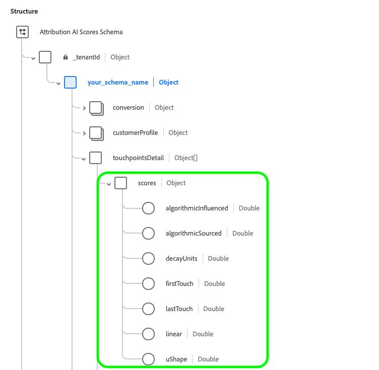

# Ingresso e uscita [!DNL Attribution AI]

Il seguente documento delinea i diversi input e output utilizzati in [!DNL Attribution AI].

## [!DNL Attribution AI] dati di input

Attribution AI funziona analizzando i seguenti set di dati per calcolare i punteggi algoritmici:

- Set di dati Adobe Analytics che utilizzano [Connettore sorgente di Analytics](../../sources/tutorials/ui/create/adobe-applications/analytics.md)
- Set di dati Experience Event (EE) in generale dallo schema Adobe Experience Platform
- Set di dati di Consumer Experience Event (CEE)

È ora possibile aggiungere più set di dati da origini diverse in base alla **mappa identità** (campo) se ciascuno dei set di dati condivide lo stesso tipo di identità (namespace), ad esempio un ECID. Dopo aver selezionato un&#39;identità e uno spazio dei nomi, vengono visualizzate le metriche di completezza della colonna ID che indicano il volume di dati da unire. Per ulteriori informazioni sull’aggiunta di più set di dati, visita la [Guida utente di Attribution AI](./user-guide.md#identity).

Le informazioni sul canale non vengono sempre mappate per impostazione predefinita. In alcuni casi, se mediaChannel (field) è vuoto, non puoi &quot;continuare&quot; finché non mappi un campo su mediaChannel in quanto è una colonna obbligatoria. Se il canale viene rilevato nel set di dati, viene mappato su mediaChannel per impostazione predefinita. altre colonne, ad esempio **tipo di supporto** e **azione media** sono ancora opzionali.

Dopo aver mappato il campo del canale, continua al passaggio &quot;Definisci eventi&quot; in cui puoi selezionare gli eventi di conversione, gli eventi dei punti di contatto e scegliere campi specifici dai singoli set di dati.

>[!IMPORTANT]
>
>Il connettore di origine Adobe Analytics può richiedere fino a quattro settimane per il backfill dei dati. Se hai recentemente configurato un connettore, verifica che il set di dati abbia la lunghezza minima dei dati necessari per Attribution AI. Controlla la [dati storici](#data-requirements) per verificare di disporre di dati sufficienti per calcolare punteggi algoritmici accurati.

Per maggiori dettagli sulla configurazione della [!DNL Consumer Experience Event] (CEE) schema, fare riferimento al [Preparazione dei dati di Intelligent Services](../data-preparation.md) guida. Per ulteriori informazioni sulla mappatura dei dati di Adobe Analytics, visita il [Mappature dei campi di Analytics](../../sources/connectors/adobe-applications/analytics.md) documentazione.

Non tutte le colonne nel [!DNL Consumer Experience Event] (CEE) Lo schema è obbligatorio per Attribution AI.

Puoi configurare i punti di contatto utilizzando tutti i campi consigliati di seguito nello schema o nel set di dati selezionato.

| Colonne consigliate | Necessario per |
| --- | --- |
| Campo identità principale | Punto di contatto / Conversione |
| Marca temporale | Punto di contatto / Conversione |
| Channel._Tipo | Punto di contatto |
| Channel.mediaAction | Punto di contatto |
| Channel.mediaType | Punto di contatto |
| Marketing.trackingCode | Punto di contatto |
| Marketing.campaignname | Punto di contatto |
| Marketing.campaigngroup | Punto di contatto |
| Commerce | Conversione |

In genere, l’attribuzione viene eseguita su colonne di conversione quali ordine, acquisti e checkout in &quot;commerce&quot;. Le colonne per &quot;canale&quot; e &quot;marketing&quot; vengono utilizzate per definire i punti di contatto per Attribution AI (ad esempio, `channel._type = 'https://ns.adobe.com/xdm/channel-types/email'`). Per risultati e informazioni ottimali, si consiglia vivamente di includere il maggior numero possibile di colonne di conversione e punto di contatto. Inoltre, non sei limitato alle sole colonne di cui sopra. Puoi includere qualsiasi altra colonna consigliata o personalizzata come definizione di conversione o punto di contatto.

I set di dati di Experience Event (EE) non devono avere in modo esplicito mixin Canale e Marketing purché le informazioni sul canale o sulla campagna rilevanti per configurare un punto di contatto siano presenti in uno dei campi mixin o pass through.

>[!TIP]
>
>Se utilizzi i dati di Adobe Analytics nello schema CEE, le informazioni sui punti di contatto per Analytics vengono in genere memorizzate in `channel.typeAtSource` (ad esempio, `channel.typeAtSource = 'email'`).

## Dati storici {#data-requirements}

>[!IMPORTANT]
>
> La quantità minima di dati necessaria per il funzionamento di Attribution AI è la seguente:
> - È necessario fornire almeno 3 mesi (90 giorni) di dati per eseguire un buon modello.
> - Ci vogliono almeno 1000 conversioni.

Attribution AI richiede dati storici come input per l&#39;addestramento dei modelli. La durata dei dati richiesti è determinata principalmente da due fattori chiave: finestra di formazione e finestra di look-back. Gli input con finestre di formazione più brevi sono più sensibili alle tendenze recenti, mentre le finestre di formazione più lunghe aiutano a produrre modelli più stabili e precisi. È importante modellare l&#39;obiettivo con dati storici che meglio rappresentano i tuoi obiettivi aziendali.

La [configurazione della finestra di formazione](./user-guide.md#training-window) filtra gli eventi di conversione impostati per essere inclusi nell’addestramento del modello in base al tempo di occorrenza. Attualmente, il periodo minimo di addestramento è di 1 trimestre (90 giorni). La [finestra di lookback](./user-guide.md#lookback-window) fornisce un intervallo di tempo che indica quanti giorni prima dei punti di contatto dell’evento di conversione devono essere inclusi in questo evento di conversione. Questi due concetti determinano insieme la quantità di dati di input (misurati in giorni) necessari per un&#39;applicazione.

Per impostazione predefinita, Attribution AI definisce la finestra di formazione come l’ultimo periodo di 2 trimestri (6 mesi) e l’intervallo di lookback come 56 giorni. In altre parole, il modello terrà conto di tutti gli eventi di conversione definiti che si sono verificati negli ultimi 2 trimestri e cercherà tutti i punti di contatto che si sono verificati entro 56 giorni prima degli eventi di conversione associati.

**Formula**:

Lunghezza minima dei dati richiesti = finestra di formazione + intervallo di lookback

>[!TIP]
>
> La lunghezza minima dei dati richiesti per un&#39;applicazione con configurazioni predefinite è: 2 trimestri (180 giorni) + 56 giorni = 236 giorni.

Esempio:

- Vuoi attribuire gli eventi di conversione che si sono verificati negli ultimi 90 giorni (3 mesi) e tenere traccia di tutti i punti di contatto che si sono verificati entro 4 settimane prima dell’evento di conversione. La durata dei dati di input dovrebbe estendersi negli ultimi 90 giorni + 28 giorni (4 settimane). La finestra di addestramento è di 90 giorni e l&#39;intervallo di lookback è di 28 giorni per un totale di 118 giorni.

## Attribution AI dati di output

Le uscite di Attribution AI sono le seguenti:

- [Punteggi granulari grezzi](#raw-granular-scores)
- [Punteggi aggregati](#aggregated-attribution-scores)

**Esempio di schema di output:**

### Punteggi granulari grezzi {#raw-granular-scores}

Attribution AI restituisce i punteggi di attribuzione nel livello più granulare possibile, in modo da poter suddividere i punteggi in base a qualsiasi colonna di punteggio. Per visualizzare questi punteggi nell’interfaccia utente, consulta la sezione [visualizzazione dei percorsi di valutazione non elaborati](#raw-score-path). Per scaricare i punteggi utilizzando l’API visita la pagina [download dei punteggi in Attribution AI](./download-scores.md) documento.

>[!NOTE]
>
> Puoi visualizzare qualsiasi colonna di reporting desiderata dal set di dati di input nel set di dati di output del punteggio solo se una delle seguenti affermazioni è vera:
> - La colonna di reporting è inclusa nella pagina di configurazione come parte della configurazione del punto di contatto o della definizione di conversione.
> - La colonna di reporting è inclusa in colonne di set di dati di punteggio aggiuntive.

La tabella seguente delinea i campi dello schema nell’output di esempio di punteggio non elaborato:

| Nome colonna (DataType) | Nullable | Descrizione |
| --- | --- | --- |
| timestamp (DateTime) | False | Il momento in cui si è verificato un evento o un’osservazione di conversione.   **Esempio:** 2020-06-09T00:01:51.000Z |
| identityMap (Map) | True | identityMap dell&#39;utente simile al formato CEE XDM. |
| eventType (String) | True | Il tipo di evento principale per il record della serie temporale.   **Esempio:** &quot;Ordine&quot;, &quot;Acquisto&quot;, &quot;Visita&quot; |
| eventMergeId (String) | True | Un ID per correlare o unire più [!DNL Experience Events] insieme che sono essenzialmente lo stesso evento o che devono essere uniti. Questo è destinato a essere compilato dal produttore di dati prima dell’acquisizione.   **Esempio:** 575525617716-0-edc2ed37-1aab-4750-a820-1c2b3844b8c4 |
| _id (String) | False | Identificatore univoco dell&#39;evento serie temporale.   **Esempio:** 4461-edc2ed37-1aab-4750-a820-1c2b3844b8c4 |
| _tenantId (oggetto) | False | Il contenitore di oggetti di livello superiore corrispondente all&#39;ID tentante.   **Esempio:** _atsdsnrmmsv2 |
| your_schema_name (oggetto) | False | Punteggio riga con evento di conversione tutti gli eventi dei punti di contatto associati ad esso e i relativi metadati.   **Esempio:** Punteggi delle Attribution AI - Nome modello__2020 |
| segmentazione (stringa) | True | Segmento di conversione, ad esempio la segmentazione geografica in base alla quale il modello è costruito. In caso di assenza di segmenti, il segmento è uguale a conversionName.   **Esempio:** ORDER_US |
| conversionName (String) | True | Nome della conversione configurata durante l&#39;installazione.   **Esempio:** Ordine, lead, visita |
| conversion (oggetto) | False | Colonne dei metadati di conversione. |
| dataSource (String) | True | Identificazione univoca a livello globale di un’origine dati.   **Esempio:** Adobe Analytics |
| eventSource (String) | True | L&#39;origine quando si è verificato l&#39;evento effettivo.   **Esempio:** Adobe.com |
| eventType (String) | True | Il tipo di evento principale per il record della serie temporale.   **Esempio:** Ordine |
| geo (Stringa) | True | Posizione geografica in cui è stata consegnata la conversione `placeContext.geo.countryCode`.   **Esempio:** US |
| priceTotal (Double) | True | Entrate ottenute tramite la conversione   **Esempio:** 99,9 |
| product (String) | True | Identificatore XDM del prodotto stesso.   **Esempio:** RX 1080 ti |
| productType (String) | True | Nome visualizzato del prodotto presentato all’utente per la visualizzazione del prodotto.   **Esempio:** Gpus |
| quantità (numero intero) | True | Quantità acquistata durante la conversione.   **Esempio:** 1 1080 ti |
| ReceivedTimestamp (DateTime) | True | È stata ricevuta la marca temporale della conversione.   **Esempio:** 2020-06-09T00:01:51.000Z |
| skuId (String) | True | Unità di conservazione delle scorte (SKU), l&#39;identificativo univoco di un prodotto definito dal fornitore.   **Esempio:** MJ-03-XS-Black |
| timestamp (DateTime) | True | Timestamp della conversione.   **Esempio:** 2020-06-09T00:01:51.000Z |
| passThrough (oggetto) | True | Colonne del set di dati Punteggio aggiuntive specificate dall&#39;utente durante la configurazione del modello. |
| commerce_order_purchaseCity (Stringa) | True | Colonna del set di dati Punteggio aggiuntiva.   **Esempio:** città: San Jose |
| customerProfile (oggetto) | False | Dettagli dell&#39;identità dell&#39;utente utilizzato per generare il modello. |
| identity (Object) | False | Contiene i dettagli dell&#39;utente utilizzato per creare il modello, ad esempio `id` e `namespace`. |
| id (String) | True | ID identità dell’utente, ad esempio ID cookie o AAID o MCID ecc.   **Esempio:** 1734876272540865634468320891369597404 |
| namespace (String) | True | Spazio dei nomi Identity utilizzato per creare i percorsi e quindi il modello.   **Esempio:** aiuto |
| touchpointsDetail (Array di oggetti) | True | Elenco dei dettagli dei punti di contatto che conducono alla conversione ordinata da | occorrenza punto di contatto o marca temporale. |
| touchpointName (String) | True | Nome del punto di contatto configurato durante la configurazione.   **Esempio:** PAID_SEARCH_CLICK |
| punteggi (oggetto) | True | Contributo punto di contatto a questa conversione come punteggio. Per ulteriori informazioni sui punteggi prodotti all&#39;interno di questo oggetto, consulta la sezione [punteggi di attribuzione aggregati](#aggregated-attribution-scores) sezione . |
| touchPoint (oggetto) | True | Metadati dei punti di contatto. Per ulteriori informazioni sui punteggi prodotti all&#39;interno di questo oggetto, consulta la sezione [punteggi aggregati](#aggregated-scores) sezione . |

### Visualizzazione dei percorsi dei punti non elaborati (interfaccia utente) {#raw-score-path}

Puoi visualizzare il percorso dei punteggi non elaborati nell’interfaccia utente. Inizia selezionando **[!UICONTROL Schemi]** nell’interfaccia utente di Platform, cerca e seleziona lo schema dei punteggi di attribuzione AI dall’interno di **[!UICONTROL Sfoglia]** scheda .

Quindi, seleziona un campo all’interno di **[!UICONTROL Struttura]** dell&#39;interfaccia utente, **[!UICONTROL Proprietà campo]** viene visualizzata la scheda . Within **[!UICONTROL Proprietà campo]** è il campo percorso che viene mappato sui punteggi non elaborati.

### Punteggi di attribuzione aggregati {#aggregated-attribution-scores}

I punteggi aggregati possono essere scaricati in formato CSV dall’interfaccia utente di Platform se l’intervallo di date è inferiore a 30 giorni.

Attribution AI supporta due categorie di punteggi di attribuzione, algoritmici e basati su regole.

Attribution AI produce due diversi tipi di punteggi algoritmici, incrementali e influenzati. Un punteggio influenzato è la frazione della conversione di cui è responsabile ogni punto di contatto marketing. Un punteggio incrementale è la quantità di impatto marginale direttamente causato dal punto di contatto marketing. La differenza principale tra il punteggio incrementale e il punteggio influenzato è che il punteggio incrementale tiene conto dell&#39;effetto previsto. Non presuppone che una conversione sia causata esclusivamente dai punti di contatto marketing precedenti.

Di seguito è riportato un rapido esempio di output dello schema Attribution AI dall’interfaccia utente Adobe Experience Platform:

Vedi la tabella seguente per maggiori dettagli su ciascuno di questi punteggi di attribuzione:

| Punteggi di attribuzione | Descrizione |
| ----- | ----------- |
| Influenzato (algoritmico) | Il punteggio influenzato è la frazione della conversione di cui è responsabile ogni punto di contatto marketing. |
| Incrementale (algoritmico) | Il punteggio incrementale è la quantità di impatto marginale direttamente causato da un punto di contatto di marketing. |
| Primo contatto | Punteggio di attribuzione basato su regole che assegna tutti i crediti al punto di contatto iniziale su un percorso di conversione. |
| Ultimo contatto | Punteggio di attribuzione basato su regole che assegna tutto il credito al punto di contatto più vicino alla conversione. |
| Lineare | Punteggio di attribuzione basato su regole che assegna lo stesso credito a ogni punto di contatto su un percorso di conversione. |
| A forma di U | Punteggio di attribuzione basato su regole che assegna il 40% del credito al primo punto di contatto e il 40% del credito all’ultimo punto di contatto, con gli altri punti di contatto che suddividono il restante 20% in modo uniforme. |
| Decadimento nel tempo | Un punteggio di attribuzione basato su regole laddove i punti di contatto più vicini alla conversione ricevono più credito rispetto ai punti di contatto più lontani nel tempo dalla conversione. |

**Riferimento Punteggio non elaborato (punteggi di attribuzione)**

La tabella seguente mappa i punteggi di attribuzione ai punteggi non elaborati. Se desideri scaricare i punteggi grezzi, visita il [download dei punteggi in Attribution AI](./download-scores.md) documentazione.

| Punteggi di attribuzione | Colonna di riferimento del punteggio non elaborato |
| --- | --- |
| Influenzato (algoritmico) | _tenantID.your_schema_name.element.touchpoint.algoritmicInfluenzated |
| Incrementale (algoritmico) | _tenantID.your_schema_name.touchpointsDetail.element.touchpoint.algoritmicInfluenzated |
| Primo contatto | _tenantID.your_schema_name.touchpointsDetail.element.touchpoint.firstTouch |
| Ultimo contatto | _tenantID.your_schema_name.touchpointsDetail.element.touchpoint.lastTouch |
| Lineare | _tenantID.your_schema_name.touchpointsDetail.element.touchpoint.lineare |
| A forma di U | _tenantID.your_schema_name.touchpointsDetail.element.touchpoint.uShape |
| Decadimento nel tempo | _tenantID.your_schema_name.touchpointsDetail.element.touchpoint.decayUnits |

### Punteggi aggregati {#aggregated-scores}

I punteggi aggregati possono essere scaricati in formato CSV dall’interfaccia utente di Platform se l’intervallo di date è inferiore a 30 giorni. Per ulteriori informazioni su ciascuna di queste colonne di aggregazione, consulta la tabella seguente.

| Nome colonna | Vincolo | Nullable | Descrizione |
| --- | --- | --- | --- |
| customerevents_date (DateTime) | Formato definito dall&#39;utente e fisso | False | Data evento cliente in formato AAAA-MM-GG.   **Esempio**: 02/05/2016 |
| mediatouchpoints_date (DateTime) | Formato definito dall&#39;utente e fisso | True | Data punto di contatto contenuti multimediali in formato AAAA-MM-GG   **Esempio**: 21/04/2017 |
| segment (String) | Calcolato | False | Segmento di conversione, ad esempio la segmentazione geografica in base alla quale il modello è costruito. In caso di assenza di segmenti, il segmento è uguale a conversion_scope.   **Esempio**: ORDER_AMER |
| conversion_scope (Stringa) | Definito dall&#39;utente | False | Nome della conversione configurata dall&#39;utente.   **Esempio**: ORDINE |
| touchpoint_scope (Stringa) | Definito dall&#39;utente | True | Nome del punto di contatto configurato dall’utente   **Esempio**: PAID_SEARCH_CLICK |
| product (String) | Definito dall&#39;utente | True | Identificatore XDM del prodotto.   **Esempio**: CC |
| product_type (String) | Definito dall&#39;utente | True | Nome visualizzato del prodotto presentato all’utente per la visualizzazione del prodotto.   **Esempio**: gpus, laptop |
| geo (Stringa) | Definito dall&#39;utente | True | Posizione geografica in cui è stata consegnata la conversione (placeContext.geo.countryCode)   **Esempio**: US |
| event_type (String) | Definito dall&#39;utente | True | Tipo di evento principale per il record della serie temporale   **Esempio**: Conversione a pagamento |
| media_type (String) | ENUM | False | Descrive se il tipo di supporto è pagato, posseduto o ottenuto.   **Esempio**: PAGATO, DI PROPRIETÀ |
| channel (String) | ENUM | False | La `channel._type` proprietà utilizzata per fornire una classificazione approssimativa di canali con proprietà simili in [!DNL Consumer Experience Event] XDM   **Esempio**: RICERCA |
| action (String) | ENUM | False | La `mediaAction` viene utilizzato per fornire un tipo di azione multimediale dell&#39;evento esperienza.   **Esempio**: FAI CLIC SU |
| campaign_group (String) | Definito dall&#39;utente | True | Nome del gruppo di campagne in cui più campagne sono raggruppate insieme come &#39;50%_DISCOUNT&#39;.   **Esempio**: COMMERCIALE |
| campaign_name (String) | Definito dall&#39;utente | True | Nome della campagna utilizzata per identificare la campagna di marketing come &#39;50%_DISCOUNT_USA&#39; o &#39;50%_DISCOUNT_ASIA&#39;.   **Esempio**: Vendita del ringraziamento |

**Riferimento Punteggio grezzo (aggregato)**

La tabella seguente mappa i punteggi aggregati ai punteggi non elaborati. Se desideri scaricare i punteggi grezzi, visita il [download dei punteggi in Attribution AI](./download-scores.md) documentazione. Per visualizzare i percorsi dei punti non elaborati dall’interno dell’interfaccia utente, visita la sezione su [visualizzazione dei percorsi di valutazione non elaborati](#raw-score-path) in questo documento.

| Nome colonna | Colonna di riferimento Punteggio non elaborato |
| --- | --- |
| customerevents_date | timestamp |
| mediatouchpoints_date | _tenantID.your_schema_name.touchpointsDetail.element.touchpoint.timestamp |
| segmento | _tenantID.your_schema_name.segmentation |
| conversion_scope | _tenantID.your_schema_name.conversion.conversionName |
| touchpoint_scope | _tenantID.your_schema_name.touchpointsDetail.element.touchpointName |
| prodotto | _tenantID.your_schema_name.conversion.product |
| product_type | _tenantID.your_schema_name.conversion.product_type |
| geo | _tenantID.your_schema_name.conversion.geo |
| event_type | eventType |
| media_type | _tenantID.your_schema_name.touchpointsDetail.element.touchpoint.mediaType |
| channel | _tenantID.your_schema_name.touchpointsDetail.element.touchpoint.mediaChannel |
| action | _tenantID.your_schema_name.touchpointsDetail.element.touchpoint.mediaAction |
| campaign_group | _tenantID.your_schema_name.touchpointsDetail.element.touchpoint.campaignGroup |
| nome_campagna | _tenantID.your_schema_name.touchpointsDetail.element.touchpoint.campaignName |

>[!IMPORTANT]
>
> - Attribution AI utilizza solo dati aggiornati per l’ulteriore formazione e il punteggio. Allo stesso modo, quando si richiede di eliminare i dati, Attribution AI rifiuta di utilizzare i dati eliminati.
> - Per facilitare la conformità ai requisiti RGPD in Attribution AI, puoi utilizzare Adobe Experience Platform Privacy Service per configurare i protocolli per soddisfare le richieste dei clienti di accesso ed eliminazione dei loro dati nel data lake, nel servizio Identity e nel profilo cliente in tempo reale.
> - Tutti i dati sono crittografati in transito e a riposo. Per ulteriori informazioni, consulta la documentazione . [crittografia dei dati](../../../help/landing/governance-privacy-security/encryption.md)

## Passaggi successivi {#next-steps}

Dopo aver preparato i dati e aver impostato tutte le credenziali e gli schemi, inizia seguendo [Guida utente di Attribution AI](./user-guide.md). Questa guida illustra come creare un’istanza per Attribution AI.
