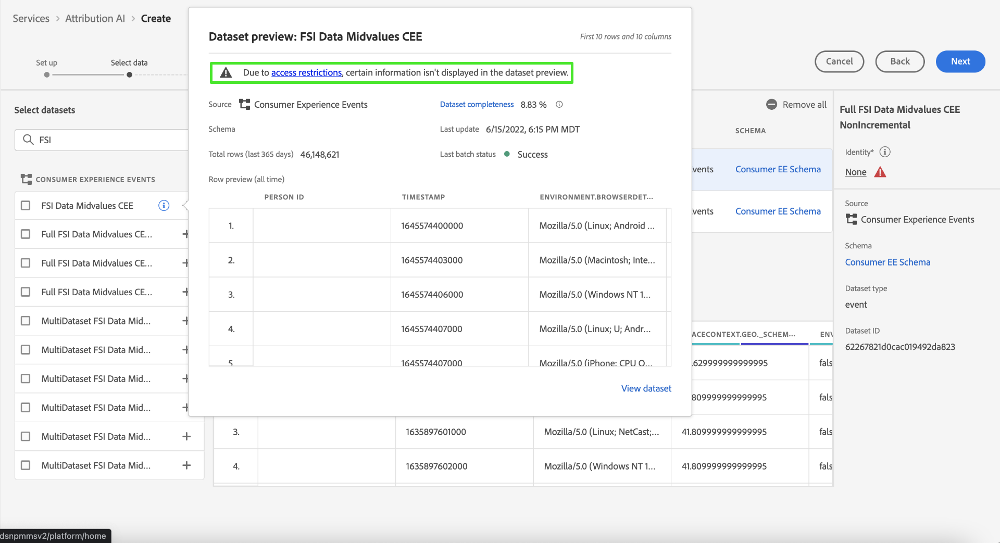

# Guida all’interfaccia utente di Attribution AI

Nell’ambito di Intelligent Services, Attribution AI è un servizio di attribuzione algoritmica multicanale che calcola l’influenza e l’impatto incrementale delle interazioni dei clienti rispetto a risultati specifici. Con Attribution AI, gli esperti di marketing possono misurare e ottimizzare le spese di marketing e pubblicitarie comprendendo l’impatto di ogni singola interazione con i clienti in ogni fase del percorso del cliente.

Questo documento funge da guida per l’interazione con Attribution AI nell’interfaccia utente di Intelligent Services.

## Creare un’istanza

In [!DNL Adobe Experience Platform] Interfaccia utente, seleziona **[!UICONTROL Servizi]** nella navigazione a sinistra. La **[!UICONTROL Servizi]** viene visualizzato il browser e vengono visualizzati i servizi intelligenti di Adobe disponibili. Nel contenitore per Attribution AI, seleziona **[!UICONTROL Apri]**.

Viene visualizzata la pagina del servizio Attribution AI. In questa pagina sono elencate le istanze di servizio di Attribution AI e vengono visualizzate informazioni su di esse, tra cui il nome dell’istanza, gli eventi di conversione, la frequenza di esecuzione dell’istanza e lo stato dell’ultimo aggiornamento.

È possibile trovare le **[!UICONTROL Totale degli eventi di conversione valutati]** in basso a destra **[!UICONTROL Crea istanza]** contenitore. Questa metrica tiene traccia del numero totale di eventi di conversione valutati per Attribution AI per l’anno solare corrente, inclusi tutti gli ambienti sandbox ed eventuali istanze di servizio eliminate.

Le istanze del servizio possono essere modificate, clonate ed eliminate utilizzando i controlli sul lato destro dell’interfaccia utente. Per visualizzare questi controlli, seleziona un&#39;istanza dal tuo esistente **[!UICONTROL Istanze del servizio]**. I controlli contengono le seguenti informazioni:

- **[!UICONTROL Modifica]**: Selezione **[!UICONTROL Modifica]** consente di modificare un’istanza di servizio esistente. Puoi modificare il nome, la descrizione, lo stato e la frequenza di punteggio dell’istanza.
- **[!UICONTROL Clona]**: Selezione **[!UICONTROL Clona]** copia l&#39;istanza di servizio selezionata. Puoi quindi modificare il flusso di lavoro per apportare modifiche minori e rinominarlo come nuova istanza.
- **[!UICONTROL Elimina]**: Puoi eliminare un’istanza di servizio, comprese eventuali esecuzioni cronologiche.
- **[!UICONTROL Origine dati]**: Un collegamento al set di dati in uso. Se Attribution AI utilizza più di un set di dati, viene visualizzato &quot;Multiplo&quot; seguito dal numero di set di dati. Quando si seleziona il collegamento ipertestuale, viene visualizzato il profilo di anteprima dei set di dati.
- **[!UICONTROL Dettagli dell&#39;ultima esecuzione]**: Viene visualizzato solo in caso di errore di un&#39;esecuzione. Informazioni sul motivo per cui l’esecuzione non riuscita, ad esempio i codici di errore, sono visualizzati qui.

- **[!UICONTROL Eventi di conversione]**: Panoramica rapida degli eventi di conversione configurati per questa istanza.
- **[!UICONTROL Intervallo di lookback]**: Intervallo di tempo definito che indica quanti giorni prima dei punti di contatto dell’evento di conversione sono inclusi.
- **[!UICONTROL Punti di contatto]**: Elenco di tutti i punti di contatto definiti durante la creazione dell’istanza.

Seleziona **[!UICONTROL Crea istanza]** per iniziare.

Viene quindi visualizzata la pagina di configurazione per Attribution AI in cui puoi specificare un nome e una descrizione facoltative per l’istanza del servizio.

## Seleziona dati {#select-data}

<!-- https://www.adobe.com/go/aai-select-data -->

Per progettazione, Attribution AI può utilizzare i dati di Adobe Analytics, Experience event e Consumer Experience Event per calcolare i punteggi di attribuzione. Quando selezioni un set di dati vengono elencati solo quelli compatibili con Attribution AI. Per selezionare un set di dati, seleziona il (**+**) accanto al nome del set di dati o seleziona la casella di controllo per aggiungere più set di dati contemporaneamente. Puoi anche utilizzare l’opzione di ricerca per trovare rapidamente i set di dati che ti interessano.

Dopo aver selezionato i set di dati da utilizzare, seleziona la **[!UICONTROL Aggiungi]** per aggiungere i set di dati al riquadro di anteprima del set di dati.

Selezione dell’icona delle informazioni  accanto a un set di dati viene aperto il set di dati preview pover.

L’anteprima del set di dati contiene dati quali l’ora dell’ultimo aggiornamento, lo schema di origine e un’anteprima delle prime dieci colonne.

### Completezza del set di dati {#dataset-completeness}

<!-- https://www.adobe.com/go/aai-dataset-completeness -->

Nell’anteprima del set di dati è presente un valore percentuale di completezza del set di dati. Questo valore fornisce un’istantanea rapida del numero di colonne del set di dati vuote o nulle. Se un set di dati contiene molti valori mancanti e questi valori vengono acquisiti altrove, si consiglia vivamente di includere il set di dati contenente i valori mancanti.

>[!NOTE]
>
>La completezza del set di dati viene calcolata utilizzando la finestra di addestramento massima per le Attribution AI (un anno). Ciò significa che i dati di età superiore a un anno non vengono presi in considerazione quando visualizzi il valore di completezza del set di dati.

### Selezionare un&#39;identità {#identity}

È ora possibile unire più set di dati tra loro in base alla mappa identità (campo ). È necessario selezionare un tipo di identità (noto anche come &quot;spazio dei nomi identità&quot;) e un valore di identità all’interno di tale spazio dei nomi. Se hai assegnato più di un campo come identità all’interno dello schema sotto lo stesso spazio dei nomi, tutti i valori di identità assegnati vengono visualizzati nel menu a discesa Identità preceduto dallo spazio dei nomi, ad esempio `EMAIL (personalEmail.address)` o `EMAIL (workEmail.address)`.

>[!IMPORTANT]
>
>Lo stesso tipo di identità (namespace) deve essere utilizzato per ogni set di dati selezionato. Accanto al tipo di identità all&#39;interno della colonna Identity, viene visualizzato un segno di spunta verde che indica che i set di dati sono compatibili. Ad esempio, quando utilizzi lo spazio dei nomi Telefono e `mobilePhone.number` come identificatore, tutti gli identificatori per i set di dati rimanenti devono contenere e utilizzare lo spazio dei nomi Telefono .

Per selezionare un&#39;identità, selezionare il valore sottolineato che si trova nella colonna identità. Viene visualizzato il puntatore di selezione di un&#39;identità.

Se in uno spazio dei nomi sono disponibili più identità, accertati di selezionare il campo di identità corretto per il caso d’uso. Ad esempio, due identità e-mail sono disponibili all’interno dello spazio dei nomi e-mail, un messaggio e-mail aziendale e personale. A seconda del caso d’uso, è più probabile che un’e-mail personale venga compilata ed è più utile nelle singole previsioni. Ciò significa che puoi selezionare `EMAIL (personalEmail.address)` come la tua identità.

>[!NOTE]
>
> Se non esiste un tipo di identità (namespace) valido per un set di dati, è necessario impostare un&#39;identità primaria e assegnarla a uno spazio dei nomi di identità utilizzando [editor di schemi](../../xdm/schema/composition.md#identity). Per ulteriori informazioni sugli spazi dei nomi e le identità, visita il [Namespace del servizio Identity](../../identity-service/namespaces.md) documentazione.

## Mappatura dei campi del canale e della campagna multimediale {#aai-mapping}

<!-- https://www.adobe.com/go/aai-mapping -->

Dopo aver selezionato e aggiunto i set di dati, la **Mappa** viene visualizzato il passaggio di configurazione. Attribution AI richiede di mappare il campo Canale multimediale per ogni set di dati selezionato nel passaggio precedente. Questo perché senza la mappatura del canale multimediale tra set di dati, le informazioni derivate da Attribution AI potrebbero non essere visualizzate correttamente rendendo difficile l’interpretazione della pagina delle informazioni. Anche se è richiesto solo il canale Media, si consiglia vivamente di mappare alcuni dei campi facoltativi quali azione Media, nome della campagna, gruppo Campaign e tag Campaign. In questo modo le Attribution AI possono fornire informazioni più chiare e risultati ottimali.

## Definizione degli eventi {#define-events}

<!-- https://www.adobe.com/go/aai-define-events -->

Esistono tre diversi tipi di dati di input utilizzati per definire gli eventi:

- **Eventi di conversione:** Obiettivi aziendali che identificano l&#39;impatto delle attività di marketing, come ordini di e-commerce, acquisti in-store e visite a siti web.
- **Intervallo di lookback:** Fornisce un intervallo di tempo che indica quanti giorni prima dei punti di contatto dell’evento di conversione devono essere inclusi.
- **Punti di contatto:** eventi di marketing a livello di destinatari, singoli e o cookie utilizzati per valutare l’impatto numerico o basato sui ricavi delle conversioni.

### Definire gli eventi di conversione {#define-conversion-events}

Per definire un evento di conversione, devi assegnare un nome all’evento e selezionare il tipo di evento selezionando il set di dati e il campo dalla **Selezionare un set di dati e un campo** menu a discesa.

Una volta selezionato un evento, viene visualizzato un nuovo menu a discesa a destra di tale evento. Il secondo menu a discesa viene utilizzato per fornire ulteriore contesto all’evento attraverso le operazioni. Per questo evento di conversione, l’operazione predefinita *esiste* viene utilizzato.

>[!NOTE]
>
>Una stringa sotto il tuo *nome conversione* viene aggiornato mentre definisci l’evento.

Successivamente, puoi selezionare un set di dati combinato generato dalla combinazione di tutti i set di dati di input nel passaggio precedente. In alternativa, puoi selezionare una colonna basata su singoli set di dati dal **Selezionare un set di dati e un campo** menu a discesa.

La **[!UICONTROL Aggiungi evento]** e **[!UICONTROL Aggiungi gruppo]** i pulsanti vengono utilizzati per definire ulteriormente la conversione. A seconda della conversione che stai definendo, potrebbe essere necessario utilizzare il **[!UICONTROL Aggiungi evento]** e **[!UICONTROL Aggiungi gruppo]** per fornire ulteriore contesto.

Selezione **[!UICONTROL Aggiungi evento]** crea campi aggiuntivi che possono essere compilati utilizzando lo stesso metodo descritto in precedenza. In questo modo viene aggiunta un&#39;istruzione AND alla definizione della stringa sotto il nome di conversione. Seleziona la **x** per rimuovere un evento aggiunto.

Selezione **[!UICONTROL Aggiungi gruppo]** consente di creare campi aggiuntivi separati dall’originale. Con l&#39;aggiunta di gruppi, un blu *E* viene visualizzato il pulsante . Selezione **E** offre un’opzione per modificare il parametro in modo che contenga &quot;OR&quot;. &quot;OR&quot; viene utilizzato per definire più percorsi di conversione riusciti. &quot;And&quot; estende il percorso di conversione per includere condizioni aggiuntive.

Se hai bisogno di più di una conversione, seleziona **Aggiungi conversione** per creare una nuova scheda di conversione. Puoi ripetere il processo sopra descritto per definire più conversioni.

### Definisci l’intervallo di lookback {#lookback-window}

Dopo aver definito la conversione, devi confermare l’intervallo di lookback. Utilizzando i tasti freccia o selezionando il valore predefinito (56), specifica quanti giorni prima dell’evento di conversione da cui desideri includere i punti di contatto. I punti di contatto sono definiti nel passaggio successivo.

### Definire i punti di contatto

La definizione dei punti di contatto segue un flusso di lavoro simile a [definizione delle conversioni](#define-conversion-events). Inizialmente devi denominare il punto di contatto e selezionare un valore del punto di contatto dal *Immettere il nome del campo* menu a discesa. Una volta selezionato, viene visualizzato il menu a discesa dell’operatore con il valore predefinito &quot;exists&quot; (esiste). Seleziona il menu a discesa per visualizzare un elenco di operatori.

Per questo punto di contatto, seleziona **è**.

Quando viene selezionato un operatore per un punto di contatto, *Immetti valore campo* è reso disponibile. Valori a discesa per *Immetti valore campo* viene compilata in base all’operatore e al valore del punto di contatto precedentemente selezionati. Se un valore non viene compilato nel menu a discesa, è possibile digitarlo manualmente. Seleziona il menu a discesa e seleziona **FAI CLIC SU**.

>[!NOTE]
>
>Agli operatori &quot;esiste&quot; e &quot;non esiste&quot; non sono associati valori di campo.

La **Aggiungi evento** e **Aggiungi gruppo** i pulsanti vengono utilizzati per definire ulteriormente il punto di contatto. A causa della complessità dei punti di contatto, non è raro che si disponga di più eventi e gruppi per un singolo punto di contatto.

Se selezionato, **Aggiungi evento** consente l’aggiunta di campi aggiuntivi. seleziona la **x** per rimuovere un evento aggiunto.

Selezione **Aggiungi gruppo** consente di creare campi aggiuntivi separati dall’originale. Con l&#39;aggiunta di gruppi, un blu *E* viene visualizzato il pulsante . Seleziona **E** per modificare il parametro, il nuovo parametro &quot;OR&quot; viene utilizzato per definire più percorsi riusciti. Questo particolare punto di contatto ha un solo percorso di successo, quindi non è necessario &quot;O&quot;.

>[!NOTE]
>
>Usa la stringa sotto *Nome punto di contatto* per una rapida panoramica del punto di contatto. La stringa corrisponde al nome del punto di contatto.

Per aggiungere altri punti di contatto, seleziona **Aggiungi punto di contatto** e ripetendo il processo di cui sopra.

Al termine della definizione di tutti i punti di contatto necessari, scorri verso l’alto e seleziona **Successivo** nell’angolo in alto a destra per passare al passaggio finale.

## Impostazione avanzata di formazione e valutazione

La pagina finale in Attribution AI è la **[!UICONTROL Avanzate]** pagina utilizzata per l’impostazione della formazione e del punteggio.

### Formazione programmata

Utilizzo della *Pianificazione*, puoi selezionare un giorno e un’ora della settimana in cui desideri eseguire il punteggio.

Seleziona il menu a discesa sotto *Frequenza punteggio* per selezionare il punteggio giornaliero, settimanale e mensile. Quindi, seleziona i giorni della settimana in cui desideri che si verifichi il punteggio. È possibile selezionare più giorni. Selezionando di nuovo lo stesso giorno, lo deseleziona.

Per modificare l’ora del giorno in cui si desidera che si verifichi il punteggio, selezionare l’icona dell’orologio. Nella nuova sovrapposizione visualizzata, immetti l’ora del giorno in cui desideri che venga effettuato il punteggio. Seleziona all’esterno della sovrapposizione per chiuderla.

>[!NOTE]
>
>Il completamento di ogni processo di punteggio può richiedere fino a 24 ore.

### Colonne di set di dati con punteggio aggiuntivo (facoltativo)

Per impostazione predefinita, viene creato un set di dati di punteggio per ogni istanza di servizio in uno schema standard. Puoi scegliere di aggiungere ulteriori colonne in base alle configurazioni Evento di conversione e Punto di contatto all’output del set di dati di valutazione. Per iniziare, seleziona le colonne dal set di dati di input, puoi trascinarle e rilasciarle per modificare l’ordine tenendo premuto il pulsante sinistro del mouse sull’icona hamburger.

### Modellazione basata su regione (facoltativo) {#region-based-modeling-optional}

I comportamenti dei clienti possono variare in modo significativo a seconda del paese e dell’area geografica. Per le aziende globali, l’utilizzo di modelli basati su paesi o aree geografiche può aumentare l’accuratezza dell’attribuzione. Ogni area aggiunta crea un nuovo modello con i dati di tale area.

Per definire una nuova area, inizia selezionando **[!UICONTROL Aggiungi area]**. Specifica un nome per la regione nel contenitore visualizzato. Viene compilato un solo valore (&quot;placeContext.geo.countryCode&quot;) dal **[!UICONTROL Immettere il nome del campo]** a discesa. Selezionare questo valore.

Quindi, seleziona un operatore.

Infine, digitare il codice del paese nel **[!UICONTROL Immetti valore campo]** a discesa.

>[!NOTE]
>
>I codici paese sono lunghi due caratteri. Un elenco completo è disponibile qui [ISO 3166-1 alfa-2](https://datahub.io/core/country-list).

### Finestra di formazione {#training-window}

Per garantire che il modello sia il più accurato possibile, è importante addestrare il modello con dati storici che rappresentano la vostra attività. Per impostazione predefinita, il modello viene addestrato utilizzando 2 quarti (6 mesi) dei dati degli eventi di conversione. Seleziona il menu a discesa per modificare il valore predefinito. Puoi scegliere di allenarti con uno o quattro quarti di dati (3-12 mesi).

>[!NOTE]
>
>Una finestra di formazione più breve è più sensibile alle tendenze recenti, mentre una finestra di formazione più lunga crea un modello più robusto ed è meno sensibile alle tendenze recenti.

Dopo aver selezionato la finestra di formazione, seleziona **[!UICONTROL Fine]** nell&#39;angolo in alto a destra. Consentire un po&#39; di tempo per l&#39;elaborazione dei dati. Una volta completata, viene visualizzata una finestra di dialogo di attivazione che conferma il completamento della configurazione dell&#39;istanza. Seleziona **[!UICONTROL Ok]** da reindirizzare al **[!UICONTROL Istanze del servizio]** in cui puoi vedere la tua istanza di servizio.

## Controllo dell’accesso basato su attributi

>[!IMPORTANT]
>
>Il controllo dell&#39;accesso basato su attributi è attualmente disponibile solo in una versione limitata.

[Controllo dell&#39;accesso basato su attributi](../../../help/access-control/abac/overview.md) è una funzionalità di Adobe Experience Platform che consente agli amministratori di controllare l’accesso a oggetti e/o funzionalità specifici in base agli attributi. Gli attributi possono essere metadati aggiunti a un oggetto, ad esempio un’etichetta aggiunta a un campo o a un segmento dello schema. Un amministratore definisce i criteri di accesso che includono gli attributi per gestire le autorizzazioni di accesso degli utenti.

Questa funzionalità ti consente di etichettare i campi dello schema Experience Data Model (XDM) con etichette che definiscono gli ambiti di utilizzo organizzativi o dei dati. In parallelo, gli amministratori possono utilizzare l’interfaccia utente e l’interfaccia di amministrazione dei ruoli per definire i criteri di accesso ai campi dello schema XDM e gestire meglio l’accesso dato a utenti o gruppi di utenti (utenti interni, esterni o di terze parti). Inoltre, il controllo degli accessi basato sugli attributi consente agli amministratori di gestire l’accesso a segmenti specifici.

Grazie al controllo degli accessi basato sugli attributi, gli amministratori possono controllare l’accesso degli utenti ai dati personali sensibili (SPD) e alle informazioni personali identificabili (PII) in tutti i flussi di lavoro e le risorse di Platform. Gli amministratori possono definire ruoli utente con accesso solo a campi e dati specifici corrispondenti a tali campi.

A causa del controllo degli accessi basato sugli attributi, alcuni campi e funzionalità potrebbero avere accesso limitato e non essere disponibili per alcune istanze del servizio Attribution AI. Ad esempio, &quot;Identity&quot;, &quot;Score Definition&quot; e &quot;Clone&quot;.

Nella parte superiore dell’area di lavoro Attribution AI **pagina approfondimenti**, i dettagli visualizzati nella barra laterale hanno accesso limitato.

Se selezioni set di dati con schemi limitati nel **[!UICONTROL Creare un flusso di lavoro delle istanze]** accanto al nome del set di dati viene visualizzato un avviso con il messaggio: [!UICONTROL Sono escluse le informazioni limitate].

Quando si visualizzano in anteprima i set di dati con schema limitato nel **[!UICONTROL Creare un flusso di lavoro delle istanze]** viene visualizzato un avviso che informa che [!UICONTROL A causa di restrizioni di accesso, alcune informazioni non vengono visualizzate nell’anteprima del set di dati.]

Dopo aver creato un&#39;istanza con informazioni limitate e passare alla **[!UICONTROL Definire l&#39;obiettivo]** viene visualizzato un avviso nella parte superiore: [!UICONTROL A causa di restrizioni di accesso, alcune informazioni non vengono visualizzate nella configurazione.]

## Passaggi successivi

Seguendo questa esercitazione, hai creato correttamente un&#39;istanza di servizio in Attribution AI. Al termine del punteggio dell’istanza (consenti fino a 24 ore), puoi [scoprire informazioni approfondite sulle Attribution AI](./discover-insights.md). Inoltre, se desideri scaricare i risultati del punteggio, visita il [download dei punteggi](./download-scores.md) documentazione.

## Risorse aggiuntive

Il video seguente illustra un flusso di lavoro end-to-end per la creazione di una nuova istanza in Attribution AI.

>[!VIDEO](https://video.tv.adobe.com/v/32668?learn=on&quality=12)
