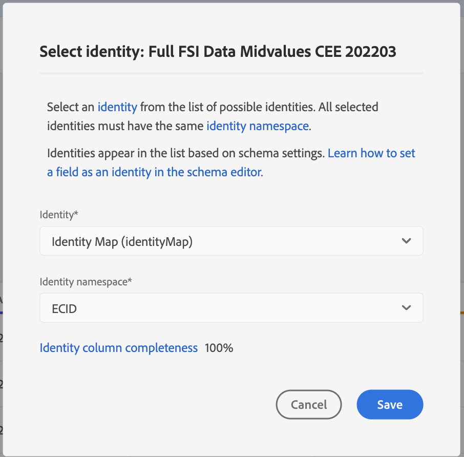

# Guida all’interfaccia utente di Attribution AI

Attribution AI, parte di Intelligent Services è un servizio di attribuzione algoritmica multicanale che calcola l’influenza e l’impatto incrementale delle interazioni dei clienti rispetto a risultati specifici. Con Attribution AI, gli esperti di marketing possono misurare e ottimizzare le spese di marketing e pubblicitarie comprendendo l’impatto di ogni singola interazione con i clienti in ogni fase dei loro percorsi.

Questo documento funge da guida per l’interazione con Attribution AI nell’interfaccia utente di Intelligent Services.

## Creare un modello

In [!DNL Adobe Experience Platform] UI, seleziona **[!UICONTROL Servizi]** nel menu di navigazione a sinistra. Il **[!UICONTROL Servizi]** viene visualizzato il browser e vengono visualizzati i servizi Adobi intelligenti disponibili. Nel contenitore per Attribution AI, seleziona **[!UICONTROL Apri]**.

Viene visualizzata la pagina Servizio di Attribution AI. In questa pagina sono elencati i modelli di servizio di Attribution AI e vengono visualizzate informazioni su di essi, tra cui il nome del modello, gli eventi di conversione, la frequenza di esecuzione del modello e lo stato dell&#39;ultimo aggiornamento.

È possibile trovare **[!UICONTROL Totale eventi di conversione valutati]** metrica situata nella parte inferiore destra del **[!UICONTROL Crea modello]** contenitore. Questa metrica tiene traccia del numero totale di eventi di conversione valutati dalle Attribution AI per l’anno civile corrente, inclusi tutti gli ambienti sandbox ed eventuali modelli di servizio eliminati.

I modelli di servizio possono essere modificati, clonati ed eliminati utilizzando i controlli sul lato destro dell’interfaccia utente. Per visualizzare questi controlli, selezionate un modello dal modello esistente **[!UICONTROL Modelli di servizio]**. I controlli contengono le seguenti informazioni:

- **[!UICONTROL Modifica]**: selezione **[!UICONTROL Modifica]** consente di modificare un modello di servizio esistente. Puoi modificare il nome, la descrizione, lo stato, la frequenza di punteggio del modello e colonne aggiuntive del set di dati di punteggio.
- **[!UICONTROL Clona]**: selezione **[!UICONTROL Clona]** copia il modello di servizio selezionato. Puoi quindi modificare il flusso di lavoro per apportare modifiche minori e rinominarlo come nuovo modello.
- **[!UICONTROL Elimina]**: è possibile eliminare un modello di servizio, incluse eventuali esecuzioni storiche. Il set di dati di output corrispondente verrà eliminato da Platform. Tuttavia, i punteggi sincronizzati con Real-Time Customer Profile non vengono eliminati.
- **[!UICONTROL Origine dati]**: collegamento al set di dati in uso. Se un’Attribution AI utilizza più set di dati, viene visualizzato &quot;Multiple&quot; seguito dal numero di set di dati. Quando si seleziona il collegamento ipertestuale, viene visualizzato il popover di anteprima dei set di dati.
- **[!UICONTROL Dettagli ultima esecuzione]**: viene visualizzato solo quando un’esecuzione non riesce. Qui vengono visualizzate le informazioni sul motivo per cui l’esecuzione non è riuscita, ad esempio i codici di errore.

- **[!UICONTROL Eventi di conversione]**: panoramica rapida degli eventi di conversione configurati per questo modello.
- **[!UICONTROL Intervallo di lookback]**: l’intervallo di tempo definito che indica quanti giorni precedenti i punti di contatto dell’evento di conversione sono inclusi.
- **[!UICONTROL Punti di contatto]**: elenco di tutti i punti di contatto definiti durante la creazione di questo modello.

Seleziona **[!UICONTROL Crea modello]** per iniziare.

Viene quindi visualizzata la pagina di configurazione di Attribution AI, in cui è possibile specificare un nome e una descrizione facoltativa per il modello di servizio.

## Selezionare i dati {#select-data}

<!-- https://www.adobe.com/go/aai-select-data -->

Per impostazione predefinita, Attribution AI può utilizzare i dati di Adobe Analytics, Experience event e Consumer Experience Event per calcolare i punteggi di attribuzione. Quando selezioni un set di dati, vengono elencati solo quelli compatibili con Attribution AI. Per selezionare un set di dati, seleziona la voce (**+**) accanto al nome del set di dati o seleziona la casella di controllo per aggiungere più set di dati contemporaneamente. Puoi anche utilizzare l’opzione di ricerca per trovare rapidamente i set di dati che ti interessano.

Dopo aver selezionato i set di dati da utilizzare, seleziona la **[!UICONTROL Aggiungi]** per aggiungere i set di dati al riquadro di anteprima dei set di dati.

Selezione dell&#39;icona Info  accanto a un set di dati apre il popover anteprima set di dati.

L’anteprima del set di dati contiene dati quali l’ora dell’ultimo aggiornamento, lo schema di origine e un’anteprima delle prime dieci colonne.

Seleziona **[!UICONTROL Salva]** per salvare le bozze durante lo spostamento lungo il flusso di lavoro. Puoi anche salvare le configurazioni del modello di bozza e passare al passaggio successivo nel flusso di lavoro. Utilizzare **[!UICONTROL Salva e continua]** per creare e salvare le bozze durante le configurazioni del modello. La funzione consente di creare e salvare le bozze della configurazione del modello ed è particolarmente utile quando è necessario definire molti campi nel flusso di lavoro di configurazione.

### Completezza del set di dati {#dataset-completeness}

<!-- https://www.adobe.com/go/aai-dataset-completeness -->

Nell’anteprima del set di dati è un valore percentuale di completezza del set di dati. Questo valore fornisce un’istantanea rapida del numero di colonne vuote o nulle nel set di dati. Se un set di dati contiene molti valori mancanti e questi valori vengono acquisiti altrove, è consigliabile includere il set di dati contenente i valori mancanti.

>[!NOTE]
>
>La completezza del set di dati viene calcolata utilizzando la finestra di formazione massima per le Attribution AI (un anno). Ciò significa che i dati che hanno più di un anno non vengono presi in considerazione durante la visualizzazione del valore di completezza del set di dati.

### Seleziona un’identità {#identity}

Ora puoi unire più set di dati in base alla mappa di identità (campo). Devi selezionare un tipo di identità (noto anche come &quot;spazio dei nomi delle identità&quot;) e un valore di identità all’interno di tale spazio dei nomi. Se hai assegnato più di un campo come identità all’interno dello schema nello stesso spazio dei nomi, tutti i valori di identità assegnati vengono visualizzati nel menu a discesa delle identità anteposto dallo spazio dei nomi, ad esempio `EMAIL (personalEmail.address)` o `EMAIL (workEmail.address)`.

>[!IMPORTANT]
>
>Per ogni set di dati selezionato deve essere utilizzato lo stesso tipo di identità (spazio dei nomi). Accanto al tipo di identità nella colonna Identity viene visualizzato un segno di spunta verde per indicare che i set di dati sono compatibili. Ad esempio, quando utilizzi lo spazio dei nomi del telefono e `mobilePhone.number` come identificatore, tutti gli identificatori per i set di dati rimanenti devono contenere e utilizzare lo spazio dei nomi Telefono.

Per selezionare un’identità, seleziona il valore sottolineato che si trova nella colonna Identità. Viene visualizzato il popover seleziona un’identità.

Se in uno spazio dei nomi sono disponibili più identità, assicurati di selezionare il campo di identità corretto per il caso d’uso. Ad esempio, nello spazio dei nomi dell’e-mail sono disponibili due identità e-mail: un’e-mail aziendale e personale. A seconda del caso d’uso, un’e-mail personale ha più probabilità di essere compilata ed è più utile nelle previsioni individuali. Ciò significa che è necessario selezionare `EMAIL (personalEmail.address)` come la tua identità.

>[!NOTE]
>
> Se non esiste un tipo di identità (spazio dei nomi) valido per un set di dati, è necessario impostare un’identità primaria e assegnarla a uno spazio dei nomi di identità utilizzando [editor schema](../../xdm/schema/composition.md#identity). Per ulteriori informazioni sugli spazi dei nomi e sulle identità, visita [Spazi dei nomi di Identity Service](../../identity-service/features/namespaces.md) documentazione.

## Mappatura dei campi del canale e della campagna multimediale {#aai-mapping}

<!-- https://www.adobe.com/go/aai-mapping -->

Dopo aver selezionato e aggiunto i set di dati, la **Mappa** viene visualizzato il passaggio di configurazione. Attribution AI richiede la mappatura del campo Canale media per ogni set di dati selezionato nel passaggio precedente. Questo perché senza la mappatura del canale Media tra set di dati, le informazioni derivate da Attribution AI potrebbero non essere visualizzate correttamente, rendendo la pagina delle informazioni difficile da interpretare. Anche se è richiesto solo il canale Media, è consigliabile mappare alcuni dei campi facoltativi, ad esempio Azione su media, Nome campagna, Gruppo campagna e Tag campagna. In questo modo le Attribution AI possono fornire informazioni più chiare e risultati ottimali.

## Definizione degli eventi {#define-events}

<!-- https://www.adobe.com/go/aai-define-events -->

Esistono tre diversi tipi di dati di input utilizzati per definire gli eventi:

- **Eventi di conversione:** Obiettivi aziendali che identificano l’impatto delle attività di marketing, come ordini di e-commerce, acquisti in-store e visite al sito web.
- **Finestra di lookback:** Fornisce un intervallo di tempo che indica quanti giorni prima dell’evento di conversione devono essere inclusi i punti di contatto.
- **Punti di contatto:** eventi di marketing a livello di destinatario, singolo e/o cookie utilizzati per valutare l’impatto numerico o basato sui ricavi delle conversioni.

### Definire gli eventi di conversione {#define-conversion-events}

Per definire un evento di conversione, devi assegnare un nome all’evento e selezionare il tipo di evento selezionando il set di dati e il campo dalla sezione **Seleziona un set di dati e un campo** menu a discesa.

Una volta selezionato un evento, a destra viene visualizzato un nuovo menu a discesa. Il secondo elenco a discesa viene utilizzato per fornire ulteriore contesto all’evento tramite l’utilizzo di operazioni. Per questo evento di conversione, l’operazione predefinita *esiste* viene utilizzato.

>[!NOTE]
>
>Una stringa sotto il *nome conversione* viene aggiornato durante la definizione dell’evento.

Successivamente, puoi selezionare un set di dati combinato generato combinando tutti i set di dati di input nel passaggio precedente. In alternativa, puoi selezionare una colonna in base a singoli set di dati dall’ **Seleziona un set di dati e un campo** menu a discesa.

Il **[!UICONTROL Aggiungi evento]** e **[!UICONTROL Aggiungi gruppo]** I pulsanti vengono utilizzati per definire ulteriormente la conversione. A seconda della conversione che stai definendo, potrebbe essere necessario utilizzare il **[!UICONTROL Aggiungi evento]** e **[!UICONTROL Aggiungi gruppo]** per fornire ulteriore contesto.

Selezione **[!UICONTROL Aggiungi evento]** crea campi aggiuntivi che possono essere compilati con lo stesso metodo descritto sopra. In questo modo viene aggiunta un’istruzione AND alla definizione della stringa sotto il nome della conversione. Seleziona la **x** per rimuovere un evento aggiunto.

Selezione **[!UICONTROL Aggiungi gruppo]** consente di creare campi aggiuntivi separati dall&#39;originale. Con l&#39;aggiunta di gruppi, un blu *E* viene visualizzato. Selezione **E** offre un&#39;opzione per modificare il parametro in modo che contenga &quot;Or&quot;. &quot;Or&quot; viene utilizzato per definire più percorsi di conversione riusciti. &quot;And&quot; estende il percorso di conversione per includere condizioni aggiuntive.

Se hai bisogno di più di una conversione, seleziona **Aggiungi conversione** per creare una nuova scheda di conversione. Puoi ripetere il processo precedente per definire più conversioni.

### Definire l’intervallo di lookback {#lookback-window}

Dopo aver definito la conversione, devi confermare l’intervallo di lookback. Utilizzando i tasti freccia o selezionando il valore predefinito (56), specifica quanti giorni prima dell’evento di conversione desideri includere i punti di contatto da. I punti di contatto vengono definiti nel passaggio successivo.

### Definire i punti di contatto

La definizione dei punti di contatto segue un flusso di lavoro simile a [definizione delle conversioni](#define-conversion-events). Inizialmente devi assegnare un nome al punto di contatto e selezionarne un valore dal campo *Inserisci il nome del campo* menu a discesa. Una volta selezionato, viene visualizzato il menu a discesa dell’operatore con il valore predefinito &quot;exists&quot; (esiste). Seleziona il menu a discesa per visualizzare un elenco di operatori.

Ai fini di questo punto di contatto, seleziona **è uguale a**.

Una volta selezionato un operatore per un punto di contatto, *Immetti il valore del campo* è reso disponibile. I valori del menu a discesa per *Immetti il valore del campo* compila in base al valore dell’operatore e del punto di contatto selezionato in precedenza. Se un valore non viene popolato nel menu a discesa, puoi digitarlo manualmente in. Seleziona il menu a discesa e seleziona **FAI CLIC**.

>[!NOTE]
>
>Agli operatori &quot;exists&quot; (esiste) e &quot;not exists&quot; (non esiste) non sono associati valori di campo.

Il **Aggiungi evento** e **Aggiungi gruppo** vengono utilizzati per definire ulteriormente il punto di contatto. A causa della natura complessa che circonda i punti di contatto, non è raro avere più eventi e gruppi per un singolo punto di contatto.

Se selezionata, **Aggiungi evento** consente di aggiungere campi aggiuntivi. seleziona la **x** per rimuovere un evento aggiunto.

Selezione **Aggiungi gruppo** consente di creare campi aggiuntivi separati dall&#39;originale. Con l&#39;aggiunta di gruppi, un blu *E* viene visualizzato. Seleziona **E** per modificare il parametro, viene utilizzato il nuovo parametro &quot;Or&quot; per definire più percorsi riusciti. Questo particolare punto di contatto ha un solo percorso di successo, quindi &quot;Or&quot; non è necessario.

>[!NOTE]
>
>Utilizza la stringa in *Nome punto di contatto* per una rapida panoramica del punto di contatto. Tieni presente che la stringa corrisponde al nome del punto di contatto.

Puoi aggiungere altri punti di contatto selezionando **Aggiungi punto di contatto** e ripetendo il processo descritto sopra.

Una volta definiti tutti i punti di contatto necessari, scorri verso l’alto e seleziona **Successivo** nell’angolo in alto a destra per procedere al passaggio finale.

## Configurazione avanzata di formazione e punteggio

La pagina finale nell’Attribution AI è la **[!UICONTROL Avanzate]** pagina utilizzata per impostare l’apprendimento e il punteggio.

### Pianifica l’apprendimento

Utilizzo di *Pianificazione*, è possibile selezionare il giorno e l’ora della settimana per la quale si desidera eseguire il punteggio.

Seleziona il menu a discesa in *Frequenza punteggio* per scegliere tra punteggio giornaliero, settimanale e mensile. Quindi, selezionare i giorni della settimana in cui si desidera che venga eseguito il punteggio. È possibile selezionare più giorni. Se si seleziona nuovamente lo stesso giorno, viene deselezionato.

Per modificare l’ora del giorno in cui si desidera ottenere il punteggio, seleziona l’icona dell’orologio. Nella nuova sovrapposizione visualizzata, inserisci l’ora del giorno in cui desideri eseguire il punteggio. Selezionate all&#39;esterno della sovrapposizione per chiuderla.

>[!NOTE]
>
>Il completamento di ogni processo di punteggio può richiedere fino a 24 ore.

### Colonne aggiuntive del set di dati di punteggio (facoltativo)

Per impostazione predefinita, viene creato un set di dati di punteggio per ogni modello di servizio in uno schema standard. Puoi scegliere di aggiungere ulteriori colonne in base all’evento di conversione e alle configurazioni dei punti di contatto nell’output del set di dati di punteggio. Inizia selezionando le colonne dal set di dati di input, trascinale e rilasciale per modificare l’ordine tenendo premuto il pulsante sinistro del mouse sull’icona dell’hamburger.

### Modellazione basata su regione (facoltativo) {#region-based-modeling-optional}

I comportamenti dei clienti potrebbero differire in modo significativo a seconda del paese e dell’area geografica. Per le aziende globali, l’utilizzo di modelli basati su paesi o su regioni può aumentare la precisione dell’attribuzione. Ogni area aggiunta crea un nuovo modello con i dati dell&#39;area.

Per definire una nuova area, inizia selezionando **[!UICONTROL Aggiungi area geografica]**. Nel contenitore visualizzato, fornisci un nome per l’area. Viene popolato un solo valore (&quot;placeContext.geo.countryCode&quot;) dal **[!UICONTROL Inserisci il nome del campo]** a discesa. Seleziona questo valore.

Quindi, seleziona un operatore.

Infine, digita il codice del paese nel **[!UICONTROL Immetti il valore del campo]** a discesa.

>[!NOTE]
>
>I codici di paese hanno una lunghezza di due caratteri. Un elenco completo è disponibile qui [ISO 3166-1 alfa-2](https://datahub.io/core/country-list).

### Finestra di formazione {#training-window}

Per garantire il modello più accurato possibile, è importante addestrare il modello con dati storici che rappresentano la tua attività. Per impostazione predefinita, il modello viene addestrato utilizzando 2 trimestri (6 mesi) di dati di eventi di conversione. Seleziona il menu a discesa per modificare l’impostazione predefinita. Puoi scegliere di addestrarti con da uno a quattro trimestri di dati (3-12 mesi).

>[!NOTE]
>
>Una finestra di formazione più breve è più sensibile alle tendenze recenti, mentre una finestra di formazione più lunga crea un modello più solido ed è meno sensibile alle tendenze recenti.

Dopo aver selezionato la finestra di formazione, seleziona **[!UICONTROL Fine]** in alto a destra. Attendere un po&#39; di tempo per l&#39;elaborazione dei dati. Al termine, viene visualizzata una finestra di dialogo a comparsa che conferma il completamento della configurazione dell&#39;istanza. Seleziona **[!UICONTROL Ok]** da reindirizzare al **[!UICONTROL Istanze del servizio]** pagina in cui puoi visualizzare l’istanza del servizio.

## Passaggi successivi

Seguendo questa esercitazione, hai creato correttamente un’istanza del servizio in Attribution AI. Una volta che l’istanza ha terminato il punteggio (consenti fino a 24 ore), puoi iniziare a [scopri informazioni su Attribution AI](./discover-insights.md). Inoltre, se desideri scaricare i risultati del punteggio, visita il [download dei punteggi](./download-scores.md) documentazione.

## Risorse aggiuntive

Il video seguente illustra un flusso di lavoro end-to-end per la creazione di una nuova istanza in Attribution AI.

>[!VIDEO](https://video.tv.adobe.com/v/32668?learn=on&quality=12)
