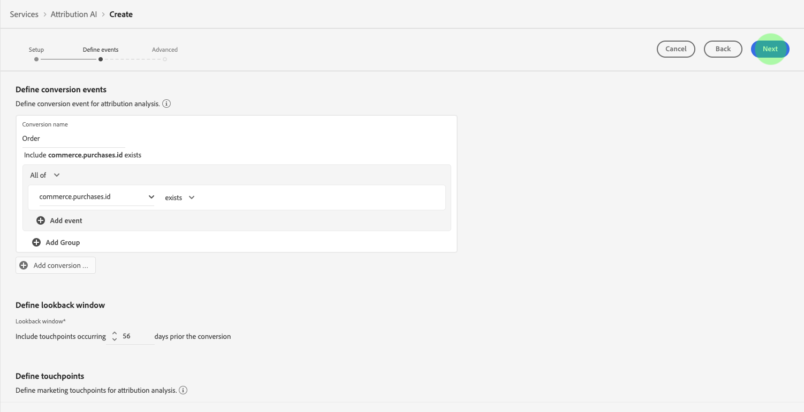

# Guida utente  Attribution AI

 Attribution AI, come parte di Intelligent Services è un servizio di attribuzione algoritmica multicanale che calcola l&#39;influenza e l&#39;impatto incrementale delle interazioni dei clienti rispetto a determinati risultati. Con Attribution AI, gli esperti di marketing possono misurare e ottimizzare le spese di marketing e pubblicitarie comprendendo l’impatto di ogni singola interazione con i clienti in ogni fase del percorso del cliente.

Questo documento funge da guida per l&#39;interazione con  Attribution AI nell&#39;interfaccia utente di Intelligent Services.

## Creare un&#39;istanza

Nell’ [!DNL Adobe Experience Platform] interfaccia utente, fate clic **[!UICONTROL Services]** nel menu di navigazione a sinistra. Viene visualizzato il **[!UICONTROL Services]** browser e vengono visualizzati i servizi intelligenti  Adobe disponibili. Nel contenitore per  Attribution AI, fare clic su **[!UICONTROL Open]**.

Viene visualizzata la pagina del servizio  Attribution AI. In questa pagina sono elencate le istanze di servizio delle  Attribution AI e vengono visualizzate informazioni su di esse, incluso il nome dell&#39;istanza, gli eventi di conversione, la frequenza di esecuzione dell&#39;istanza e lo stato dell&#39;ultimo aggiornamento.

Potete trovare la **[!UICONTROL Total conversion events scored]** metrica in basso a destra del **[!UICONTROL Create instance]** contenitore. Questa metrica tiene traccia del numero totale di eventi di conversione segnati da  Attribution AI per l&#39;anno civile corrente, compresi tutti gli ambienti sandbox ed eventuali istanze di servizi eliminate.

Le istanze del servizio possono essere modificate, clonate ed eliminate utilizzando i controlli sul lato destro dell’interfaccia utente. Per visualizzare questi controlli, selezionare un&#39;istanza dall&#39;istanza esistente **[!UICONTROL Service instances]**. I controlli contengono le seguenti informazioni:

- **[!UICONTROL Edit]**: La selezione **[!UICONTROL Edit]** consente di modificare un&#39;istanza di servizio esistente. Potete modificare il nome, la descrizione, lo stato e la frequenza di punteggio dell’istanza.
- **[!UICONTROL Clone]**: Selezionando **[!UICONTROL Clone]** copia l&#39;istanza di servizio selezionata. Potete quindi modificare il flusso di lavoro per apportare modifiche minori e rinominarlo come nuova istanza.
- **[!UICONTROL Delete]**: È possibile eliminare un&#39;istanza di servizio, comprese eventuali esecuzioni cronologiche.
- **[!UICONTROL Data source]**: Un collegamento al set di dati utilizzato dall&#39;istanza.
- **[!UICONTROL Last run details]**: Viene visualizzato solo quando un&#39;esecuzione non riesce. Le informazioni sul motivo per cui l&#39;esecuzione non riuscita, ad esempio i codici di errore, sono visualizzate qui.

- **[!UICONTROL Conversion events]**: Panoramica rapida degli eventi di conversione configurati per questa istanza.
- **[!UICONTROL Lookback window]**: L&#39;intervallo di tempo definito che indica quanti giorni prima dei punti di contatto dell&#39;evento di conversione sono inclusi.
- **[!UICONTROL Touchpoints]**: Elenco di tutti i punti di contatto definiti durante la creazione dell’istanza.

Selezionare **[!UICONTROL Create instance]** per iniziare.

Viene quindi visualizzata la pagina di configurazione per  Attribution AI, in cui è possibile fornire informazioni di base e specificare un dataset per l&#39;istanza.

### Denominate l’istanza

In **[!UICONTROL Basic information]**, specificate un nome e una descrizione facoltativa per l’istanza del servizio.

### Selezionare un dataset

Dopo aver compilato le informazioni di base, fai clic sul menu a discesa **Seleziona set** di dati per selezionare il set di dati. Il dataset viene utilizzato per formare il modello e segnare i dati successivi che produce. Quando si seleziona un dataset dal selettore a discesa, vengono elencati solo quelli compatibili con  Attribution AI e conformi allo schema Experience Data Model (XDM). Una volta scelto un set di dati, fate clic su **Avanti** nell&#39;angolo in alto a destra per passare alla pagina degli eventi di definizione.

## Definizione degli eventi

Esistono tre tipi diversi di dati di input utilizzati per definire gli eventi:

- **Eventi di conversione:** Obiettivi aziendali che identificano l&#39;impatto delle attività di marketing, come ordini di e-commerce, acquisti in-store e visite ai siti web.
- **Finestra di ricerca:** Fornisce un intervallo di tempo che indica quanti giorni prima dei punti di contatto dell&#39;evento di conversione devono essere inclusi.
- **Punti di contatto:** eventi di marketing a livello di destinatari, singoli e o cookie utilizzati per valutare l&#39;impatto numerico o basato sulle entrate delle conversioni.

### Definizione degli eventi di conversione {#define-conversion-events}

Per definire un evento di conversione, è necessario assegnare all&#39;evento un nome e selezionare il tipo di evento facendo clic sul menu a discesa **Inserisci nome** campo.

Una volta selezionato un evento, viene visualizzato un nuovo menu a discesa a destra. Il secondo menu a discesa viene utilizzato per fornire ulteriore contesto all&#39;evento attraverso l&#39;utilizzo di operazioni. Per questo evento di conversione, *esiste* l&#39;operazione predefinita.

>[!NOTE]
>
>Una stringa sotto il nome *di* conversione viene aggiornata mentre definite l&#39;evento.

I **[!UICONTROL Add event]** pulsanti e **[!UICONTROL Add Group]** i pulsanti consentono di definire ulteriormente la conversione. A seconda della conversione che state definendo, potrebbe essere necessario utilizzare i **[!UICONTROL Add event]** pulsanti e **[!UICONTROL Add group]** i pulsanti per fornire un ulteriore contesto.

Facendo clic su **[!UICONTROL Add event]** di essa vengono creati altri campi che possono essere compilati con lo stesso metodo descritto in precedenza. In questo modo viene aggiunta un&#39;istruzione AND alla definizione della stringa sotto il nome di conversione. Fate clic sulla **x** per rimuovere un evento aggiunto.

Facendo clic **[!UICONTROL Add Group]** potete creare altri campi separati dall’originale. Con l’aggiunta di gruppi, viene visualizzato un pulsante blu *E* . Facendo clic su **And** (E) è possibile modificare il parametro in modo che contenga &quot;OR&quot;. &quot;OR&quot; viene utilizzato per definire più percorsi di conversione con esito positivo. &quot;And&quot; estende il percorso di conversione per includere condizioni aggiuntive.

Se è necessaria più di una conversione, fare clic su **Aggiungi conversione** per creare una nuova scheda di conversione. Potete ripetere il processo sopra descritto per definire più conversioni.

### Definisci finestra di lookback {#lookback-window}

Dopo aver definito la conversione, è necessario confermare la finestra di lookback. Utilizzando i tasti freccia o facendo clic sul valore predefinito (56), specificate quanti giorni prima dell’evento di conversione da cui desiderate includere i punti di contatto. I punti di contatto sono definiti nel passaggio successivo.

### Definire i punti di contatto

La definizione dei punti di contatto segue un flusso di lavoro simile a quello della [definizione delle conversioni](#define-conversion-events). Inizialmente devi assegnare un nome al punto di contatto e selezionare un valore per il punto di contatto dal menu a discesa *Inserisci nome* campo. Una volta selezionato, il menu a discesa dell&#39;operatore viene visualizzato con il valore predefinito &quot;exists&quot; (esiste). Fare clic sul menu a discesa per visualizzare un elenco di operatori.

Per questo punto di contatto, seleziona **uguale a**.

Dopo aver selezionato un operatore per un punto di contatto, *Inserisci valore* campo è disponibile. I valori a discesa per *Immettere il valore* del campo vengono compilati in base all&#39;operatore e al valore del punto di contatto precedentemente selezionati. Se un valore non viene compilato nel menu a discesa, è possibile digitarlo manualmente. Fate clic sul menu a discesa e selezionate **CLIC**.

>[!NOTE]
>
>Agli operatori &quot;esiste&quot; e &quot;non esiste&quot; non sono associati valori di campo.

I pulsanti *Aggiungi evento* e *Aggiungi gruppo* vengono utilizzati per definire ulteriormente il punto di contatto. A causa della natura complessa che circonda i punti di contatto, non è raro avere più eventi e gruppi per un singolo punto di contatto.

Quando un utente fa clic su **Aggiungi evento** , è possibile aggiungere altri campi. Fate clic sulla **x** per rimuovere un evento aggiunto.

Facendo clic su **Aggiungi gruppo** potete creare altri campi separati dall’originale. Con l’aggiunta di gruppi, viene visualizzato un pulsante blu *E* . Fate clic su **E** per cambiare il parametro. Il nuovo parametro &quot;OR&quot; viene usato per definire più percorsi con esito positivo. Questo particolare punto di contatto ha un solo percorso di successo, pertanto &quot;OR&quot; non è necessario.

>[!NOTE]
>
>Usa la stringa sotto Nome *punto di* contatto per una panoramica rapida del punto di contatto. La stringa corrisponde al nome del punto di contatto.

Per aggiungere altri punti di contatto, fai clic su **Aggiungi punto di contatto** e ripeti la procedura descritta sopra.

Dopo aver definito tutti i punti di contatto necessari, scorri verso l’alto e fai clic su **Avanti** nell’angolo in alto a destra per passare al passaggio finale.

## Configurazione avanzata della formazione e del punteggio

La pagina finale in  Attribution AI è la **[!UICONTROL Advanced]** pagina utilizzata per impostare formazione e punteggio.

### Pianificazione formazione

Utilizzando la *pianificazione*, potete selezionare un giorno e un&#39;ora della settimana in cui eseguire il punteggio.

Fai clic sul menu a discesa sotto Frequenza ** punteggio per selezionare tra il punteggio giornaliero, settimanale e mensile. Quindi, selezionare i giorni della settimana in cui si desidera che venga eseguito il punteggio. È possibile selezionare più giorni. Fate clic una volta al giorno per deselezionare la relativa opzione.

Per modificare l&#39;ora del giorno in cui si desidera che venga eseguito il punteggio, fare clic sull&#39;icona dell&#39;orologio. Nella nuova sovrapposizione che viene visualizzata, inserite l’ora del giorno in cui si desidera che venga eseguito il punteggio. Fate clic all’esterno della sovrapposizione per chiuderla.

>[!NOTE]
>
>Il completamento di ogni processo di punteggio può richiedere fino a 24 ore.

### Colonne di set di dati con punteggio aggiuntivo (facoltativo)

Per impostazione predefinita, viene creato un dataset di valutazione per ogni istanza di servizio in uno schema standard. È possibile scegliere di aggiungere ulteriori colonne in base alle configurazioni Evento conversione e Punto di contatto all&#39;output del set di dati del punteggio. Per iniziare, seleziona le colonne dal set di dati di input, puoi trascinarle e rilasciarle per modificare l&#39;ordine tenendo premuto il pulsante sinistro del mouse sull&#39;icona dell&#39;hamburger.

### Modellazione basata sulle regioni (facoltativo) {#region-based-modeling-optional}

I comportamenti dei clienti possono essere significativamente diversi per paese e area geografica. Per le aziende globali, l&#39;utilizzo di modelli basati su paesi o regioni può aumentare la precisione di attribuzione. Ogni area aggiunta crea un nuovo modello con i dati di tale regione.

Per definire una nuova area, fare clic su **[!UICONTROL Add region]**. Nel contenitore visualizzato, specificate un nome per la regione. Solo un valore (&quot;placeContext.geo.countryCode&quot;) viene popolato dall&#39; **[!UICONTROL Enter Field Name]** elenco a discesa. Selezionare questo valore.

Quindi, selezionare un operatore.

Infine, digitare il codice del paese nel **[!UICONTROL Enter Field Value]** menu a discesa.

>[!NOTE]
>
>I codici paese sono lunghi due caratteri. Un elenco completo è disponibile qui [ISO 3166-1 alpha-2](https://datahub.io/core/country-list).

### Finestra Formazione {#training-window}

Per garantire che si ottenga il modello più accurato possibile, è importante formare il modello con dati storici che rappresentano il business. Per impostazione predefinita, il modello viene addestrato utilizzando 2 trimestri (6 mesi) di dati degli eventi di conversione. Selezionate il menu a discesa per modificare il valore predefinito. È possibile scegliere di allenarsi con uno o quattro quarti di dati (3-12 mesi).

>[!NOTE]
>
>Una finestra di formazione più breve è più sensibile alle tendenze recenti, mentre una finestra di formazione più lunga crea un modello più robusto ed è meno sensibile alle tendenze recenti.

Dopo aver selezionato la finestra di formazione, fate clic **[!UICONTROL Finish]** nell’angolo in alto a destra. Consentire l&#39;elaborazione dei dati entro un certo periodo di tempo. Al termine, viene visualizzata una finestra di dialogo di conferma del completamento dell’impostazione dell’istanza. Fate clic per **[!UICONTROL Ok]** essere reindirizzati alla **[!UICONTROL Service instances]** pagina in cui è possibile visualizzare l&#39;istanza del servizio.

## Passaggi successivi

Seguendo questa esercitazione, è stata creata correttamente un&#39;istanza di servizio in  Attribution AI. Una volta che l&#39;istanza ha terminato il punteggio (consentire fino a 24 ore), è possibile [scoprire  approfondimenti](./discover-insights.md)delle Attribution AI. Inoltre, se desideri scaricare i risultati del punteggio, consulta la documentazione sul [download dei punteggi](./download-scores.md) .

## Risorse aggiuntive

Il seguente video illustra un flusso di lavoro end-to-end per la creazione di una nuova istanza nelle Attribution AI .

>[!VIDEO](https://video.tv.adobe.com/v/32668?learn=on&quality=12)