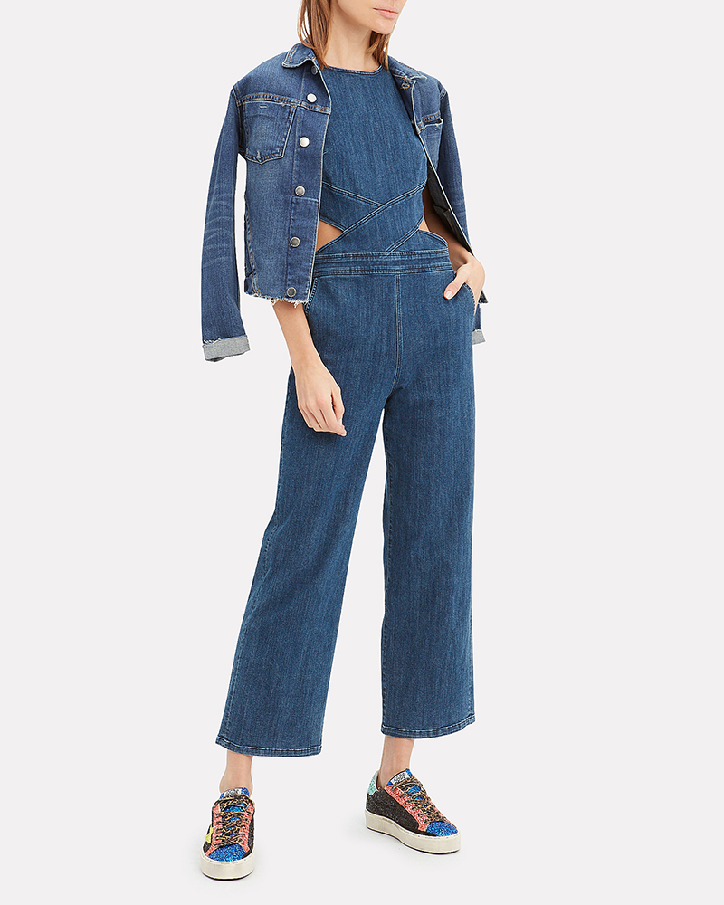

# Estrazione colore

>[!NOTE]
>
>[!DNL Content and Commerce AI] è in versione beta. La documentazione è soggetta a modifiche.

Il servizio di estrazione del colore, se viene data un&#39;immagine, può calcolare un istogramma di colori in pixel e ordinarli in base ai colori dominanti in bucket. I colori nei pixel dell’immagine sono raggruppati in 40 colori predominanti che rappresentano lo spettro di colori. Un istogramma di valori di colore viene quindi calcolato tra i 40 colori. Il servizio ha due varianti:

**Estrazione del colore (immagine completa)**

Questo metodo estrae un istogramma di colore per l’intera immagine.

**Estrazione colore (con maschera)**

Questo metodo utilizza un estrattore in primo piano basato su un apprendimento approfondito per identificare gli oggetti in primo piano. Il modello è formato da un catalogo di immagini per il commercio elettronico. Una volta estratto l&#39;oggetto in primo piano, viene calcolato un istogramma sui colori dominanti come descritto in precedenza.

L&#39;immagine seguente è stata utilizzata nell&#39;esempio illustrato in questo documento:



**Formato API**

```http
POST /services/v1/predict
```

**Richiesta**

La richiesta di esempio seguente utilizza il metodo full-image per l’estrazione del colore.

La richiesta seguente estrae i colori da un’immagine in base ai parametri di input forniti nel payload. Per ulteriori informazioni sui parametri di input, vedere la tabella sotto il payload di esempio.

>[!CAUTION]
>
>`analyzer_id` determina quale [!DNL Sensei Content Framework] viene utilizzato. Prima di effettuare la richiesta, verificare di disporre dei dati necessari `analyzer_id` .

```SHELL
curl -i -X POST https://sensei.adobe.io/services/v1/predict \
  -H 'Authorization: Bearer {ACCESS_TOKEN}' \
  -H 'Content-Type: multipart/form-data' \
  -H 'x-api-key: {API_KEY}' \
  -H 'cache-control: no-cache,no-cache' \
  -F file=@test_image.jpg \
  -F 'contentAnalyzerRequests={
   "enable_diagnostics":"true",
   "requests":[
     {
         "analyzer_id": "Feature:image-color-histogram:Service-6fe52999293e483b8e4ae9a95f1b81a7",
         "parameters": {
          "application-id": "1234", 
          "content-type": "inline", 
          "encoding": "jpeg", 
          "threshold": "0", 
          "top-N": "0", 
          "custom": {}, 
          "data": [{
            "content-id": "0987", 
            "content": "inline-image", 
            "content-type": "inline", 
            "encoding": "jpeg", 
            "threshold": "0", 
            "top-N": "0", 
            "historic-metadata": [], 
            "custom": {"exclude_mask": 1}
            }]
          }
      }
    ]
}'
```

| Proprietà | Descrizione | Obbligatorio |
| --- | --- | --- |
| `analyzer_id` | L’ID [!DNL Sensei] del servizio in cui viene distribuita la richiesta. Questo ID determina quale dei due [!DNL Sensei Content Frameworks] vengono utilizzati. | Sì |
| `application-id` | ID dell’applicazione creata. | Sì |
| `data` | Un array che contiene oggetti JSON. Ciascun oggetto nell&#39;array rappresenta un&#39;immagine. Eventuali parametri passati come parte di questa matrice sovrascrivono i parametri globali specificati al di fuori della `data` matrice. Qualsiasi proprietà rimanente descritta in questa tabella può essere ignorata dall&#39;interno `data`. | Sì |
| `content-id` | L&#39;ID univoco per l&#39;elemento dati restituito nella risposta. Se non viene passato, viene assegnato un ID generato automaticamente. | No |
| `content` | Contenuto da analizzare dal servizio di estrazione del colore. Se l’immagine fa parte del corpo della richiesta, usate `-F file=@<filename>` il comando curl per trasmettere l’immagine, lasciando questo parametro come una stringa vuota. <br> Se l&#39;immagine è un file su S3, passare l&#39;URL firmato. Quando il contenuto fa parte del corpo della richiesta, l&#39;elenco degli elementi dati deve avere un solo oggetto. Se vengono passati più oggetti, viene elaborato solo il primo oggetto. | Sì |
| `content-type` | Utilizzato per indicare se l&#39;input fa parte del corpo della richiesta o un URL firmato per un bucket S3. L&#39;impostazione predefinita di questa proprietà è `inline`. | No |
| `encoding` | Il formato file dell&#39;immagine di input. Attualmente è possibile elaborare solo immagini JPEG e PNG. L&#39;impostazione predefinita di questa proprietà è `jpeg`. | No |
| `threshold` | La soglia di punteggio (da 0 a 1) al di sopra della quale devono essere restituiti i risultati. Utilizzate il valore `0` per restituire tutti i risultati. L&#39;impostazione predefinita di questa proprietà è `0`. | No |
| `top-N` | Il numero di risultati da restituire (non può essere un numero intero negativo). Utilizzate il valore `0` per restituire tutti i risultati. Se utilizzato insieme a `threshold`, il numero di risultati restituiti è minore di uno dei due set di limiti. L&#39;impostazione predefinita di questa proprietà è `0`. | No |
| `custom` | Eventuali parametri personalizzati da passare. | No |
| `historic-metadata` | Un array che può essere trasmesso dai metadati. | No |

**Risposta**

Una risposta corretta restituisce i dettagli dei colori estratti. Ogni colore è rappresentato da una `feature_value` chiave, che contiene le seguenti informazioni:

- Un nome di colore
- Percentuale di questo colore rispetto all’immagine
- Il valore RGB del colore

Nel primo oggetto di esempio riportato di seguito, il valore `feature_value` di `White,0.82,239,239,239` indica che il colore rilevato è bianco, il bianco si trova nell&#39;82% dell&#39;immagine e ha un valore RGB di 239.239.239.

```json
{
  "status": 200,
  "content_id": "test_image.jpg",
  "cas_responses": [
    {
      "status": 200,
      "analyzer_id": "Feature:image-color-histogram:Service-e952f4acd7c2425199b476a2eb459635",
      "content_id": "test_image.jpg",
      "result": {
        "response_type": "feature",
        "response": [
          {
            "feature_value": [
              {
                "feature_name": "color_name_and_rgb",
                "feature_value": "White,0.82,239,239,239"
              },
              {
                "feature_value": "Dark_Blue,0.11,41,60,86",
                "feature_name": "color_name_and_rgb"
              },
              {
                "feature_name": "color_name_and_rgb",
                "feature_value": "Royal_Blue,0.08,63,91,123"
              }
            ],
            "feature_name": "color"
          }
        ]
      }
    }
  ],
  "error": []
}
```

| Proprietà | Descrizione |
| --- | --- |
| `content_id` | Nome dell’immagine caricata nella richiesta di POST. |
| `feature_value` | Un array i cui oggetti contengono chiavi con lo stesso nome di proprietà. Queste chiavi contengono una stringa che rappresenta il nome del colore, una percentuale che questo colore appare in relazione all’immagine inviata in `content_id`e il valore RGB del colore. |
