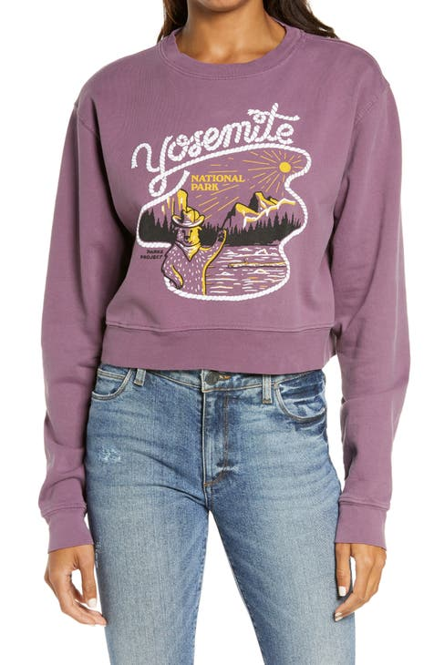

# Presenza di testo e riconoscimento ottico dei caratteri

Il servizio OCR (Text Presence/Optical Character Recognition), quando viene fornita un&#39;immagine, può indicare se il testo è presente nell&#39;immagine. Se è presente del testo, l&#39;OCR può restituirlo.

L’immagine seguente è stata utilizzata nella richiesta di esempio mostrata in questo documento:



**Formato API**

```http
POST /services/v2/predict
```

**Richiesta**

La richiesta seguente controlla se è presente testo in base all’immagine di input fornita nel payload. Per ulteriori informazioni sui parametri di input mostrati, consulta la tabella seguente il payload di esempio.

Esecuzione con immagine in linea:

```SHELL
curl -w'\n' -i -X POST https://sensei.adobe.io/services/v2/predict \
-H 'Prefer: respond-async, wait=59' \
-H "x-api-key: $API_KEY" \
-H "content-type: multipart/form-data" \
-H "authorization: Bearer $API_TOKEN" \
-F file=@sample_image.png \
-F 'contentAnalyzerRequests={
  "sensei:name": "Feature:cintel-object-detection:Service-b9ace8b348b6433e9e7d82371aa16690",
  "sensei:invocation_mode": "asynchronous",
  "sensei:invocation_batch": false,
  "sensei:engines": [
    {
      "sensei:execution_info": {
        "sensei:engine": "Feature:cintel-object-detection:Service-b9ace8b348b6433e9e7d82371aa16690"
      },
      "sensei:inputs": {
        "documents": [
        {
          "sensei:multipart_field_name": "file",
          "dc:format": "image/jpg"
        }
        ]
      },
      "sensei:params": {
        "correct_with_dictionary": true,
        "min_probability": 0.2,
        "min_relevance": 0.01,
        "filter_with_dictionary": true
      },
      "sensei:outputs":{
        "result" : {
          "sensei:multipart_field_name" : "result",
          "dc:format": "application/json"
        }
      }
    }
  ]
}'
```

**Risposta**

Una risposta corretta restituisce il testo rilevato nel `tags` per ogni immagine trasmessa nella richiesta. Se in una determinata immagine non è presente testo, `is_text_present` è 0 e `tags` è un elenco vuoto.

[result0, result1, ...]: elenco di risposte per ciascun documento di input. Ogni risultato è un dado con le chiavi:

1. request_element_id: indice corrispondente al file di input per questa risposta, 0 per la prima immagine nell’elenco dei documenti della richiesta, 1 per quella successiva e così via.
2. tag: elenco di dizionari, ogni dizionario ha due chiavi: testo, che è una parola riconosciuta dall’immagine, e rilevanza, che viene calcolata come frazione dell’area del riquadro del testo estratto rispetto all’immagine completa. 0,01 si tradurrebbe in un testo che occupi almeno l’1% dell’immagine.
3. is_text_present: 0 o 1 a seconda che il testo sia presente nell’immagine. Se tag è 0, l’elenco è vuoto.

```json
{
  "contentAnalyzerResponse": {
    "statuses": [
      {
        "sensei:engine": "Feature:cintel-object-detection:Service-b9ace8b348b6433e9e7d82371aa16690",
        "invocations": [
          {
            "sensei:outputs": {
              "result": {
                "sensei:multipart_field_name": "result",
                "dc:format": "application/json"
              }
            },
            "message": null,
            "status": "200"
          }
        ]
      }
    ],
    "request_id": "dttklFR7DPtMtEmjlRSx5BYP5WGg3tTx"
  },
  "result": [
    {
      "is_text_present": 1,
      "tags": [
        {
          "text": "yosemite",
          "relevance": 0.05604639115920341
        }
      ],
      "request_element_id": 0
    }
  ]
}
```

**Richiesta**

La richiesta seguente controlla se è presente testo in base all’immagine di input fornita nel payload. Per ulteriori informazioni sui parametri di input mostrati, consulta la tabella seguente il payload di esempio.

Esecuzione con URL:

```SHELL
curl -w'\n' -i -X POST https://sensei.adobe.io/services/v2/predict \
-H 'Prefer: respond-async, wait=59' \
-H "x-api-key: $API_KEY" \
-H "content-type: multipart/form-data" \
-H "authorization: Bearer $API_TOKEN" \
-F 'contentAnalyzerRequests={
  "sensei:name": "Feature:cintel-object-detection:Service-b9ace8b348b6433e9e7d82371aa16690",
  "sensei:invocation_mode": "asynchronous",
  "sensei:invocation_batch": false,
  "sensei:engines": [
    {
      "sensei:execution_info": {
        "sensei:engine": "Feature:cintel-object-detection:Service-b9ace8b348b6433e9e7d82371aa16690"
      },
      "sensei:inputs": {
        "documents": [
        {
          "repo:path": <IMG_URL_PATH>,
          "sensei:repoType": "HTTP",
          "dc:format": "image/jpg"
        }
        ]
      },
      "sensei:params": {
        "correct_with_dictionary": true
      },
      "sensei:outputs":{
        "result" : {
          "sensei:multipart_field_name" : "result",
          "dc:format": "application/json"
        }
      }
    }
  ]
}'
```

```json
{
  "contentAnalyzerResponse": {
    "statuses": [
      {
        "sensei:engine": "Feature:cintel-object-detection:Service-b9ace8b348b6433e9e7d82371aa16690",
        "invocations": [
          {
            "sensei:outputs": {
              "result": {
                "sensei:multipart_field_name": "result",
                "dc:format": "application/json"
              }
            },
            "message": null,
            "status": "200"
          }
        ]
      }
    ],
    "request_id": "ZbdhcK0JqS4Wg1wGdlEHGR3JOm530YNn"
  },
  "result": [
    {
      "is_text_present": 0,
      "tags": [],
      "request_element_id": 0
    }
  ]
}
```

| Proprietà | Descrizione | Obbligatorio |
| --- | --- | --- |
| `documents` | Elenco di elementi JSON in cui ogni elemento dell’elenco rappresenta un’immagine. Qualsiasi parametro passato come parte di questo elenco, sovrascrive il parametro globale specificato all&#39;esterno dell&#39;elenco, per l&#39;elemento elenco corrispondente. | Sì |
| `sensei:multipart_field_name` | nome_campo da cui leggere il percorso del file di input. | Sì |
| `repo:path` | URL preceduto per risorsa immagine. | Sì |
| `sensei:repoType` | &quot;HTTP&quot; (per presigned-url). | No |
| `dc:format` | Formato codificato dell&#39;immagine di input. Per la codifica delle immagini sono consentiti solo i formati immagine come jpeg, jpg, png e tiff. Dc:format viene confrontato con i formati consentiti. | No |
| `correct_with_dictionary` | Se correggere le parole con un dizionario di inglese? Se questa opzione non è attivata, è possibile che vengano riconosciute parole non inglesi. Il valore predefinito è True: attivato.) Quando il dizionario è attivato, non è necessario che si ottenga sempre una parola inglese. Cerchiamo di correggerlo, ma se non è possibile entro una certa distanza di modifica, restituiamo la parola originale. | No |
| `filter_with_dictionary` | Se filtrare le parole in modo che contengano solo le parole del dizionario inglese? Se questa opzione è attivata, le parole restituite apparterranno sempre al grande inglese, che comprende 470.000 parole. | No |
| `min_probability` | Qual è la probabilità minima per le parole riconosciute? Il servizio restituisce solo le parole estratte dall&#39;immagine e con una probabilità maggiore rispetto a min_probability. Il valore predefinito è 0,2. | No |
| `min_relevance` | Qual è la rilevanza minima per le parole riconosciute? Il servizio restituisce solo le parole estratte dall’immagine e di maggiore rilevanza rispetto a min_importance. Il valore predefinito è 0,01. La rilevanza viene calcolata come frazione dell’area del riquadro del testo estratto rispetto all’immagine completa. 0,01 si tradurrebbe in un testo che occupi almeno l’1% dell’immagine. | No |

| Nome | Tipo di dati | Obbligatorio | Impostazione predefinita | Valori | Descrizione |
| -----| --------- | -------- | ------- | ------ | ----------- |
| `repo:path` | string | - | - | - | URL preceduto dell’immagine da cui deve essere estratto il testo. |
| `sensei:repoType` | string | - | - | HTTPS | Tipo di archivio in cui viene memorizzata l’immagine. |
| `sensei:multipart_field_name` | string | - | - | - | Utilizzalo quando trasmetti l’immagine come argomento multipart invece di utilizzare URL prefirmati. |
| `dc:format` | string | Sì | - | &quot;image/jpg&quot;, <br>image/jpeg <br>&quot;image/png&quot;, <br>&quot;image/tiff&quot; | La codifica dell’immagine viene verificata in base ai tipi di codifica di input consentiti prima dell’elaborazione. |