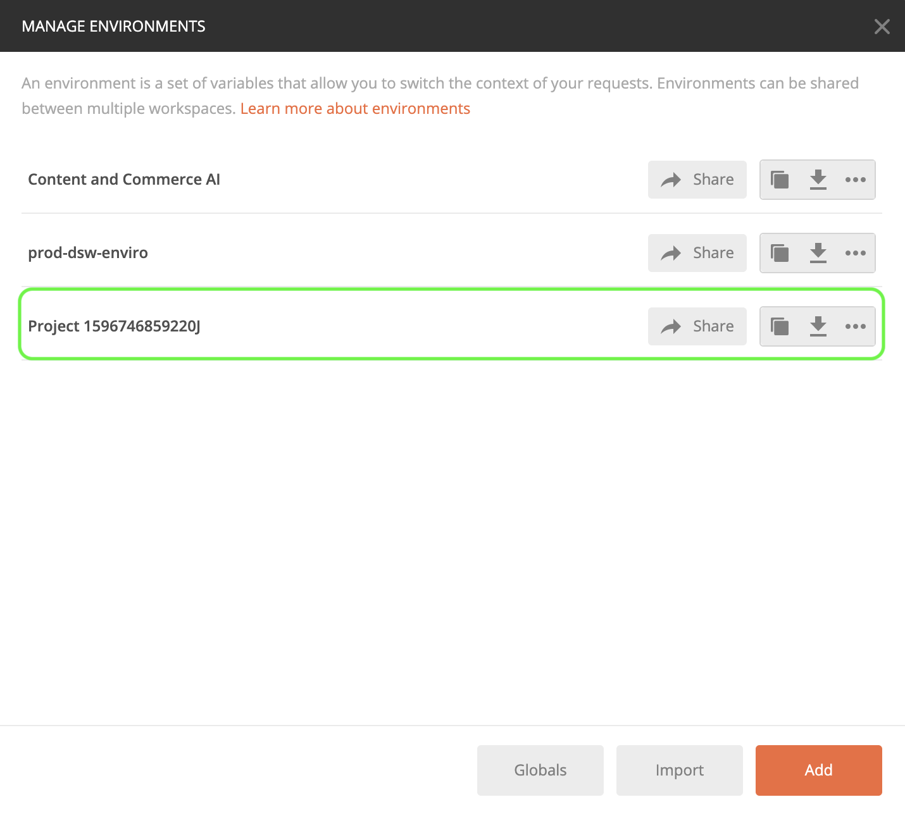

# Guida introduttiva a Content and Commerce AI

>[!NOTE]
>
>Content and Commerce AI è in versione beta. La documentazione è soggetta a modifiche.

[!DNL Content and Commerce AI] utilizza le API di Adobe I/O. Per effettuare chiamate alle API di Adobe I/O e all’integrazione della console I/O, devi prima completare l’ [esercitazione sull&#39;autenticazione](https://www.adobe.com/go/platform-api-authentication-en).

Tuttavia, quando si accede al **Aggiungi API** a questo punto, l’API si trova in Experience Cloud invece di Adobe Experience Platform, come illustrato nella schermata seguente:

Il completamento dell’esercitazione di autenticazione fornisce i valori per ciascuna delle intestazioni richieste in tutte le chiamate API di Adobe I/O, come mostrato di seguito:

- `Authorization: Bearer {ACCESS_TOKEN}`
- `x-api-key: {API_KEY}`
- `x-gw-ims-org-id: {IMS_ORG}`

## Creare un ambiente Postman (facoltativo)

Dopo aver configurato il progetto e l’API in Adobe Developer Console, è possibile scaricare un file di ambiente per Postman. Sotto **[!UICONTROL API]** nella barra a sinistra del progetto, seleziona **[!UICONTROL Content and Commerce AI]**. Viene visualizzata una nuova scheda contenente una scheda con etichetta &quot;[!DNL Try it out]&quot;. Seleziona **Scarica per Postman** per scaricare un file JSON utilizzato per configurare l’ambiente postman.

Dopo aver scaricato il file, apri Postman e seleziona la **icona ingranaggio** in alto a destra per aprire **gestire gli ambienti** finestra di dialogo.

Quindi, seleziona **Importa** dall&#39;interno del **Gestire gli ambienti** finestra di dialogo.

Viene reindirizzato e viene richiesto di selezionare un file di ambiente dal computer. Seleziona il file JSON scaricato in precedenza, quindi seleziona **Apri** per caricare l’ambiente.

Viene reindirizzato al *Gestire gli ambienti* con un nuovo nome di ambiente popolato. Seleziona il nome dell’ambiente per visualizzare e modificare le variabili disponibili in Postman. È comunque necessario compilare manualmente il `JWT_TOKEN` e `ACCESS_TOKEN`. Questi valori avrebbero dovuto essere ottenuti durante il completamento del [esercitazione sull&#39;autenticazione](https://www.adobe.com/go/platform-api-authentication-en).

Una volta completate, le variabili dovrebbero avere un aspetto simile alla schermata sottostante. Seleziona **Aggiorna** per completare la configurazione dell’ambiente.

Ora puoi selezionare l’ambiente dal menu a discesa nell’angolo in alto a destra e compilare automaticamente i valori salvati. È sufficiente modificare nuovamente i valori in qualsiasi momento per aggiornare tutte le chiamate API.

Per ulteriori informazioni sulle operazioni con le API di Adobe I/O che utilizzano Postman, consulta il post di Medium su [utilizzo di Postman per l’autenticazione JWT su Adobe I/O](https://medium.com/adobetech/using-postman-for-jwt-authentication-on-adobe-i-o-7573428ffe7f).

## Lettura di chiamate API di esempio

Questa guida fornisce esempi di chiamate API per dimostrare come formattare le richieste. Questi includono percorsi, intestazioni richieste e payload di richiesta formattati correttamente. Viene inoltre fornito un esempio di codice JSON restituito nelle risposte API. Per informazioni sulle convenzioni utilizzate nella documentazione per le chiamate API di esempio, consulta la sezione sulle [come leggere le chiamate API di esempio](../../landing/troubleshooting.md) nella guida alla risoluzione dei problemi di Experience Platform.

## Passaggi successivi {#next-steps}

Una volta ottenute tutte le credenziali, è possibile impostare un processo di lavoro personalizzato per [!DNL Content and Commerce AI]. Nei documenti seguenti viene fornita assistenza per comprendere il Framework di estensibilità e la configurazione dell&#39;ambiente.

Per ulteriori informazioni sul framework di estensibilità, leggere innanzitutto il [introduzione all&#39;estensibilità](https://experienceleague.adobe.com/docs/asset-compute/using/extend/understand-extensibility.html) documento. Questo documento illustra i prerequisiti e i requisiti di provisioning.

Per ulteriori informazioni sulla configurazione di un ambiente per [!DNL Content and Commerce AI], inizia leggendo la guida per [configurazione di un ambiente per sviluppatori](https://experienceleague.adobe.com/docs/asset-compute/using/extend/setup-environment.html). Questo documento fornisce istruzioni di configurazione che consentono di sviluppare per il servizio Asset compute.
