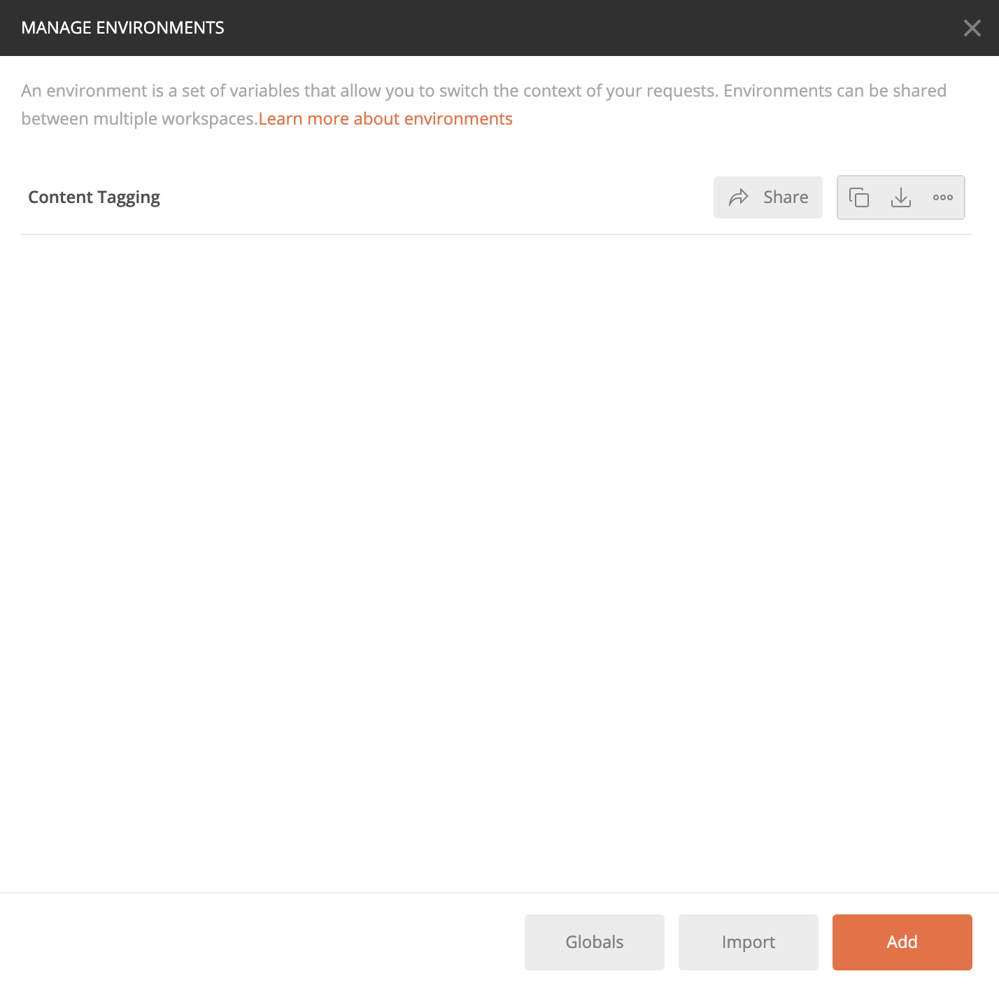
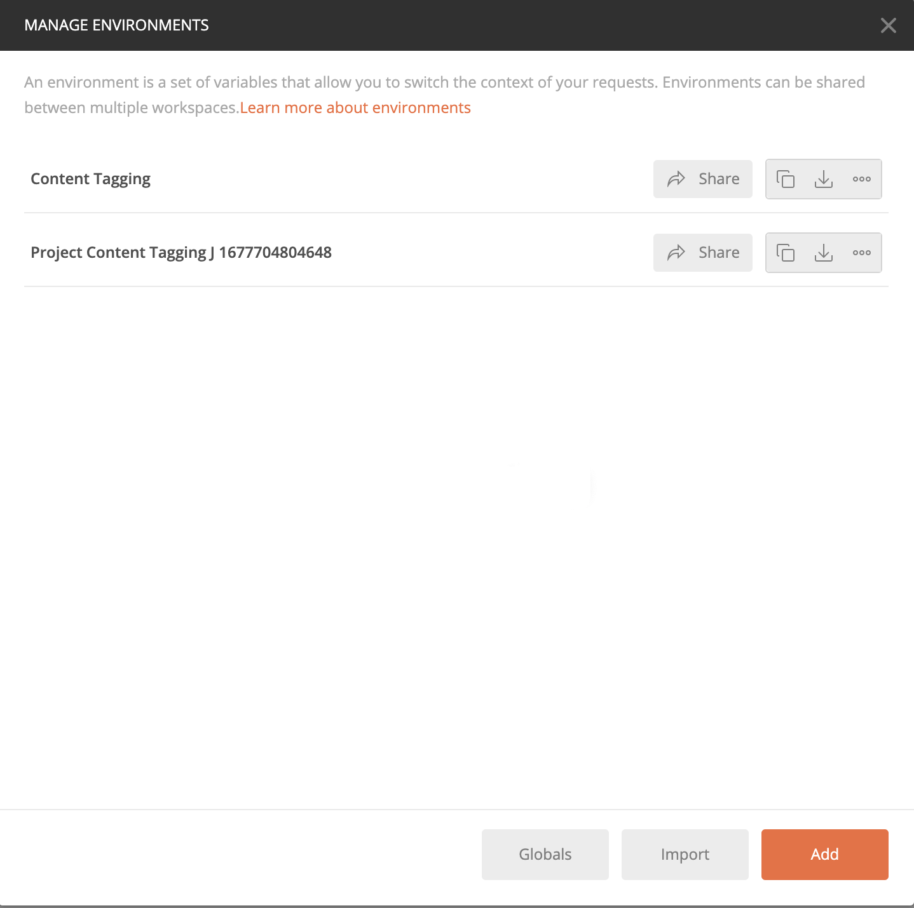

# Guida introduttiva all’assegnazione tag dei contenuti

[!DNL Content tagging] utilizza le API Adobe I/O. Per effettuare chiamate alle API Adobe I/O e all’integrazione della console di I/O, devi prima completare la [tutorial sull’autenticazione](https://www.adobe.com/go/platform-api-authentication-en).

Tuttavia, quando si raggiunge il **Aggiungi API** , l’API si trova in Creative Cloud anziché in Adobe Experience Platform, come illustrato nella schermata seguente:

Il completamento del tutorial di autenticazione fornisce i valori per ciascuna delle intestazioni richieste in tutte le chiamate API di Adobe I/O, come mostrato di seguito:

- `Authorization: Bearer {ACCESS_TOKEN}`
- `x-api-key: {API_KEY}`
- `x-gw-ims-org-id: {ORG_ID}`

## Creazione di un ambiente Postman (facoltativo)

Dopo aver configurato il progetto e l’API all’interno della console Adobe Developer, puoi scaricare un file di ambiente per Postman. Sotto **[!UICONTROL API]** nella barra a sinistra del progetto, seleziona **[!UICONTROL Assegnazione di tag ai contenuti]**. Viene visualizzata una nuova scheda, contenente una scheda con l’etichetta &quot;[!DNL Try it out]&quot;. Seleziona **Scarica per Postman** per scaricare un file JSON usato per configurare l’ambiente postman.

Dopo aver scaricato il file, apri Postman e seleziona la **icona ingranaggio** in alto a destra per aprire **gestire gli ambienti** .

Quindi, seleziona **Importa** dall&#39;interno di **Gestire gli ambienti** .

Viene eseguito il reindirizzamento e viene richiesto di selezionare un file di ambiente dal computer. Seleziona il file JSON scaricato in precedenza, quindi seleziona **Apri** per caricare l’ambiente.

Viene eseguito il reindirizzamento al *Gestire gli ambienti* con un nuovo nome di ambiente compilato. Seleziona il nome dell’ambiente per visualizzare e modificare le variabili disponibili in Postman. È comunque necessario compilare manualmente il `JWT_TOKEN` e `ACCESS_TOKEN`. Questi valori avrebbero dovuto essere ottenuti durante il completamento del [tutorial sull’autenticazione](https://www.adobe.com/go/platform-api-authentication-en).

Una volta completate, le variabili dovrebbero avere un aspetto simile alla schermata seguente. Seleziona **Aggiorna** per completare la configurazione dell’ambiente.

Ora puoi selezionare l’ambiente dal menu a discesa nell’angolo in alto a destra e compilare automaticamente tutti i valori salvati. È sufficiente modificare di nuovo i valori in qualsiasi momento per aggiornare tutte le chiamate API.

Per ulteriori informazioni sull’utilizzo delle API Adobe I/O con Postman, consulta il post Medium su [utilizzo di Postman per l’autenticazione JWT in Adobe I/O](https://medium.com/adobetech/using-postman-for-jwt-authentication-on-adobe-i-o-7573428ffe7f).

## Lettura delle chiamate API di esempio

Questa guida fornisce esempi di chiamate API per dimostrare come formattare le richieste. Questi includono percorsi, intestazioni richieste e payload di richieste formattati correttamente. Viene inoltre fornito il codice JSON di esempio restituito nelle risposte API. Per informazioni sulle convenzioni utilizzate nella documentazione per le chiamate API di esempio, consulta la sezione su [come leggere esempi di chiamate API](../../landing/troubleshooting.md) nella guida alla risoluzione dei problemi di Experience Platform.

## Passaggi successivi {#next-steps}

Una volta ottenute tutte le credenziali, puoi impostare un processo di lavoro personalizzato per [!DNL Content tagging]. I documenti seguenti forniscono informazioni utili per comprendere il framework di estensibilità e la configurazione dell’ambiente.

Per ulteriori informazioni sul framework di estensibilità, leggi [introduzione all’estensibilità](https://experienceleague.adobe.com/docs/asset-compute/using/extend/understand-extensibility.html) documento. Questo documento illustra i prerequisiti e i requisiti di provisioning.

Per ulteriori informazioni sulla configurazione di un ambiente per [!DNL Content tagging], inizia leggendo la guida per [configurazione di un ambiente per sviluppatori](https://experienceleague.adobe.com/docs/asset-compute/using/extend/setup-environment.html). Questo documento fornisce istruzioni di configurazione che consentono di sviluppare per il servizio Asset compute.
