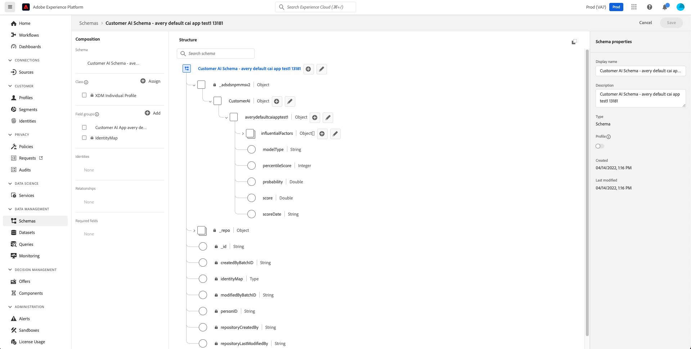

# Ingresso e uscita in Customer AI

Il documento seguente illustra i diversi eventi, input e output richiesti utilizzati in Customer AI.

## Introduzione {#getting-started}

Di seguito sono riportati i passaggi per creare modelli di propensione e identificare tipi di pubblico target per il marketing personalizzato in Customer AI:

1. Casi di utilizzo della struttura: In che modo i modelli di propensione aiuterebbero a identificare i tipi di pubblico target per il marketing personalizzato? Quali sono i miei obiettivi di business e le tattiche corrispondenti per raggiungere l&#39;obiettivo? Dove si adatta la modellazione della propensione in questo processo?

2. Dai priorità ai casi di utilizzo: Quali sono le priorità più importanti per l&#39;azienda?

3. Creare modelli in Customer AI: Guarda questo [esercitazione rapida](https://experienceleague.adobe.com/docs/platform-learn/tutorials/intelligent-services/configure-customer-ai.html?lang=it) e fare riferimento alla [Guida all’interfaccia utente](../customer-ai/user-guide/configure.md) per un processo dettagliato per la creazione di un modello.

4. [Creare segmenti](../customer-ai/user-guide/create-segment.md) utilizzando i risultati del modello.

5. Adottare azioni aziendali mirate in base a questi segmenti. Monitora i risultati e analizza le azioni da migliorare.

Di seguito sono riportati alcuni esempi di configurazioni per il primo modello.  Il modello di esempio, incorporato in questo documento, utilizza un modello di Customer AI per prevedere chi sarà probabile la conversione per un&#39;attività di vendita al dettaglio nei prossimi 30 giorni. Il set di dati di input è un set di dati di Adobe Analytics.

| Passaggio | Definizione | Esempio |
| ---- | ------ | ------- |
| Configurazione | Specifica le informazioni di base sul modello. | **Nome**: Modello di propensione acquisto matita   **Tipo di modello**: Conversione |
| Seleziona dati | Specifica i set di dati utilizzati per generare il modello. | **Set di dati**: Set di dati Adobe Analytics   **Identità**: Assicurati che la colonna Identity per ogni set di dati sia impostata su un’identità comune. |
| Definisci obiettivo | Definisci l’obiettivo, la popolazione idonea, gli eventi personalizzati e gli attributi del profilo. | **Obiettivo di previsione**: Seleziona `commerce.purchases.value` uguale a a matita   **Finestra di uscita**: 30 giorni. |
| Imposta opzioni | Imposta la pianificazione per l&#39;aggiornamento del modello e abilita i punteggi per Profilo | **Pianificazione**: Settimanale   **Abilita per profilo**: Questa opzione deve essere abilitata per l&#39;output del modello da utilizzare nella segmentazione. |

## Panoramica dei dati {#data-overview}

Le sezioni seguenti descrivono i diversi eventi, input e output richiesti utilizzati in Customer AI.

Customer AI funziona analizzando i seguenti set di dati per prevedere il tasso di abbandono (quando un cliente può interrompere l’utilizzo del prodotto) o i punteggi di propensione (quando un cliente è probabile che effettui un acquisto):

- Dati Adobe Analytics utilizzando [Connettore sorgente di Analytics](../../sources/tutorials/ui/create/adobe-applications/analytics.md)
- Dati Adobe Audience Manager utilizzando [Connettore sorgente di Audience Manager](../../sources/tutorials/ui/create/adobe-applications/audience-manager.md)
- [Set di dati Experience Event](https://experienceleague.adobe.com/docs/experience-platform/xdm/classes/experienceevent.html)
- [Set di dati evento esperienza consumer](https://experienceleague.adobe.com/docs/experience-platform/intelligent-services/data-preparation.html#cee-schema)

Puoi aggiungere più set di dati da origini diverse se ciascuno di essi condivide lo stesso tipo di identità (spazio dei nomi), ad esempio un ECID. Per ulteriori informazioni sull’aggiunta di più set di dati, visita la [Guida utente di Customer AI](../customer-ai/user-guide/configure.md).

>[!IMPORTANT]
>
>I connettori sorgente impiegano fino a quattro settimane per eseguire il backfill dei dati. Se recentemente hai impostato un connettore, devi verificare che il set di dati abbia la lunghezza minima dei dati richiesti per Customer AI. Controlla la [dati storici](#data-requirements) per verificare di disporre di dati sufficienti per l&#39;obiettivo di previsione.

La tabella seguente illustra alcuni termini comuni utilizzati in questo documento:

| Termine | Definizione |
| --- | --- |
| [Experience Data Model (XDM)](../../xdm/home.md) | XDM è il framework fondamentale che consente a Adobe Experience Cloud, basato su Adobe Experience Platform, di inviare il messaggio giusto alla persona giusta, sul canale giusto, al momento giusto. Platform utilizza XDM System per organizzare i dati in un modo che ne faciliti l’utilizzo per i servizi Platform. |
| [Schema XDM](../../xdm/schema/composition.md) | Experience Platform utilizza gli schemi per descrivere la struttura dei dati in modo coerente e riutilizzabile. Definendo i dati in modo coerente tra i diversi sistemi, diventa più facile mantenere il significato e quindi ottenere valore dai dati. Prima di poter acquisire i dati in Platform, è necessario comporre uno schema per descrivere la struttura dei dati e fornire vincoli al tipo di dati che possono essere contenuti all’interno di ciascun campo. Gli schemi sono costituiti da una classe XDM di base e da zero o più gruppi di campi dello schema. |
| [Classe XDM](../../xdm/schema/field-constraints.md) | Tutti gli schemi XDM descrivono i dati che possono essere classificati come `Experience Event`. Il comportamento dei dati di uno schema è definito dalla classe dello schema, che viene assegnata a uno schema al momento della sua creazione. Le classi XDM descrivono il numero minimo di proprietà che uno schema deve contenere per rappresentare un particolare comportamento di dati. |
| [Gruppi di campi](../../xdm/schema/composition.md) | Componente che definisce uno o più campi in uno schema. I gruppi di campi impongono la modalità di visualizzazione dei campi nella gerarchia dello schema e quindi presentano la stessa struttura in ogni schema in cui sono inclusi. I gruppi di campi sono compatibili solo con classi specifiche identificate dalle rispettive `meta:intendedToExtend` attributo. |
| [Tipo di dati](../../xdm/schema/composition.md) | Componente che può anche fornire uno o più campi per uno schema. Tuttavia, a differenza dei gruppi di campi, i tipi di dati non sono vincolati a una particolare classe. Questo rende i tipi di dati un’opzione più flessibile per descrivere le strutture di dati comuni riutilizzabili tra più schemi con classi potenzialmente diverse. I tipi di dati descritti in questo documento sono supportati dagli schemi CEE e Adobe Analytics. |
| [Profilo cliente in tempo reale](../../profile/home.md) | Profilo cliente in tempo reale fornisce un profilo consumatore centralizzato per una gestione delle esperienze mirata e personalizzata. Ogni profilo contiene dati aggregati in tutti i sistemi, nonché account con marca temporale utilizzabili per eventi che coinvolgono il singolo utente che si sono verificati in uno dei sistemi utilizzati con Experience Platform. |

## Dati di input di Customer AI {#customer-ai-input-data}

Per i set di dati di input, come Adobe Analytics e Adobe Audience Manager, i rispettivi connettori di origine mappano direttamente gli eventi in questi gruppi di campi standard (Commerce, Web, Application e Search) per impostazione predefinita durante il processo di connessione. La tabella seguente mostra i campi evento nei gruppi di campi standard predefiniti per Customer AI.

Per ulteriori informazioni sulla mappatura dei dati di Adobe Analytics o dei dati di Audience Manager, visita le mappature dei campi di Analytics o Audience Manager [guida alle mappature dei campi](../../sources/connectors/adobe-applications/mapping/audience-manager.md).

Puoi utilizzare gli schemi XDM Experience Event o Consumer Experience Event per i set di dati di input non compilati tramite uno dei connettori di cui sopra. È possibile aggiungere altri gruppi di campi XDM durante il processo di creazione dello schema. I gruppi di campi possono essere forniti da un Adobe come i gruppi di campi standard o un gruppo di campi personalizzato che corrisponde alla rappresentazione dei dati in Platform.

>[!IMPORTANT]
>
>È necessario assicurarsi che i dati vengano compilati in questi set di dati di input. Se nei set di dati di input non vengono trovati eventi da gruppi di campi standard, è necessario aggiungere eventi personalizzati durante il flusso di lavoro di configurazione. Vedi i dettagli sugli eventi personalizzati.

### Gruppi di campi standard utilizzati da Customer AI {#standard-events}

Gli eventi esperienza vengono utilizzati per determinare vari comportamenti dei clienti. A seconda della struttura dei dati, i tipi di evento elencati di seguito potrebbero non includere tutti i comportamenti del cliente. Spetta a te determinare quali campi contengono i dati necessari per identificare in modo chiaro e inequivocabile l’attività utente specifica per il web o un altro canale. A seconda dell’obiettivo di previsione, i campi obbligatori necessari possono cambiare.

>[!NOTE]
>
>Se utilizzi dati Adobe Analytics o Adobe Audience Manager, lo schema viene creato automaticamente con gli eventi standard richiesti necessari per acquisire i dati. Se crei uno schema EE personalizzato per l’acquisizione dei dati, è necessario considerare quali gruppi di campi sono necessari per acquisire i dati.

Per impostazione predefinita, Customer AI utilizza gli eventi nei quattro gruppi di campi standard seguenti: Commercio, Web, applicazioni e ricerca. Non è necessario disporre di dati per ogni evento nei gruppi di campi standard elencati di seguito, ma per alcuni scenari sono necessari alcuni eventi. Se sono disponibili eventi nei gruppi di campi standard, è consigliabile includerli nello schema. Ad esempio, se desideri creare un modello Customer AI per la previsione degli eventi di acquisto, è utile disporre di dati dai gruppi di campi Dettagli pagina Web e Commerce.

Per visualizzare un gruppo di campi nell’interfaccia utente di Platform, seleziona la **[!UICONTROL Schemi]** nella barra a sinistra, quindi seleziona la **[!UICONTROL Gruppi di campi]** scheda .

| Gruppo di campi | Tipo evento | Percorso campo XDM |
| --- | --- | --- |
| [!UICONTROL Dettagli Commerce] | ordine | <li> `commerce.order.purchaseID` </li> <li> `productListItems.SKU` </li> |
|  | productListViews | <li> `commerce.productListViews.value` </li> <li> `productListItems.SKU` </li> |
|  | checkout | <li> `commerce.checkouts.value` </li> <li> `productListItems.SKU` </li> |
|  | acquisti | <li> `commerce.purchases.value` </li> <li> `productListItems.SKU` </li> |
|  | productListRemovals | <li> `commerce.productListRemovals.value` </li> <li> `productListItems.SKU` </li> |
|  | productListViews | <li> `commerce.productListOpens.value` </li> <li> `productListItems.SKU` </li> |
|  | productViews | <li> `commerce.productViews.value` </li> <li> `productListItems.SKU` </li> |
| [!UICONTROL Dettagli Web] | webVisit | `web.webPageDetails.name` |
|  | webInteraction | `web.webInteraction.linkClicks.value` |
| [!UICONTROL Dettagli applicazione] | applicationCloses | <li> `application.applicationCloses.value` </li> <li> `application.name` </li> |
|  | applicationCrash | <li> `application.crashes.value` </li> <li> `application.name` </li> |
|  | applicationFeatureUsages | <li> `application.featureUsages.value` </li> <li> `application.name` </li> |
|  | applicationFirstLaunches | <li> `application.firstLaunches.value` </li> <li> `application.name` </li> |
|  | applicationInstalls | <li> application.installs.value </li> <li> `application.name` </li> |
|  | applicationLaunches | <li> application.launches.value </li> <li> `application.name` </li> |
|  | applicationUpdate | <li> application.upgrades.value </li> <li> `application.name` </li> |
| [!UICONTROL Dettagli ricerca] | ricerca | `search.keywords` |

Inoltre, Customer AI può utilizzare i dati di abbonamento per generare modelli di abbandono migliori. I dati di abbonamento sono necessari per ciascun profilo utilizzando [[!UICONTROL Abbonamento]](../../xdm/data-types/subscription.md) formato del tipo di dati. La maggior parte dei campi è facoltativa, tuttavia, per un modello di abbandono ottimale si consiglia vivamente di fornire dati per il maggior numero possibile di campi, ad esempio: `startDate`, `endDate`e qualsiasi altro dettaglio pertinente. Rivolgiti al team del tuo account per ricevere ulteriore supporto su questa funzione.

### Aggiunta di eventi personalizzati e attributi di profilo {#add-custom-events}

Per informazioni da includere oltre al valore predefinito [campi evento standard](#standard-events) utilizzato da Customer AI, puoi utilizzare il [configurazione evento personalizzata](./user-guide/configure.md#custom-events) per migliorare i dati utilizzati dal modello.

#### Quando utilizzare eventi personalizzati

Gli eventi personalizzati sono necessari quando i set di dati selezionati nella fase di selezione del set di dati contengono *nessuno* dei campi evento predefiniti utilizzati da Customer AI. Customer AI richiede informazioni su almeno un evento comportamentale dell’utente diverso dal risultato.

Gli eventi personalizzati sono utili per:

- Integrare nel modello le conoscenze di dominio o le competenze precedenti.

- Migliorare la qualità del modello predittivo.

- Ottenere ulteriori informazioni e interpretazioni.

I candidati migliori per gli eventi personalizzati sono dati che contengono conoscenze del dominio che potrebbero essere predittive del risultato. Alcuni esempi generali di eventi personalizzati includono:

- Registra per account

- Iscriviti alla newsletter

- Effettuare una chiamata al servizio clienti

Di seguito sono riportati alcuni esempi di eventi personalizzati specifici per il settore:

| Industria | Eventi personalizzati |
| --- | --- |
| Vendita al dettaglio | Transazione in-store Iscriviti alla tessera del club Clip coupon mobile. |
| Intrattenimento | Iscrizione alla stagione acquisti   Trasmetti video. |
| Ospitalità | Prenotazione ristorante   Punti fedeltà acquisto. |
| Viaggi | Aggiungi informazioni sul viaggiatore noto miglia di acquisto. |
| Comunicazioni | Programma di aggiornamento/downgrade/annullamento. |

Per poter essere selezionati, gli eventi personalizzati devono rappresentare le azioni avviate dall’utente. Ad esempio, &quot;Email Send&quot; è un’azione avviata da un addetto al marketing e non dall’utente, quindi non deve essere utilizzato come evento personalizzato.

### Dati storici

Customer AI richiede dati storici per la formazione dei modelli. La durata richiesta per l&#39;esistenza di dati all&#39;interno del sistema è determinata da due elementi chiave: la finestra dei risultati e la popolazione ammissibile.

Per impostazione predefinita, Customer AI cerca un utente che abbia avuto attività negli ultimi 45 giorni, se non viene fornita alcuna definizione di popolazione idonea durante la configurazione dell’applicazione. Inoltre, Customer AI richiede un minimo di 500 eventi qualificati e 500 non qualificati (1000 totali) dai dati storici basati su una definizione di obiettivo prevista.

Negli esempi seguenti viene illustrato l’utilizzo di una formula semplice che consente di determinare la quantità minima di dati necessari. Se si dispone di più dati del requisito minimo, è probabile che il modello fornisca risultati più precisi. Se la quantità minima richiesta è inferiore a quella richiesta, il modello avrà esito negativo, in quanto non sono disponibili dati sufficienti per l’addestramento dei modelli.

**Formula**:

Per decidere la durata minima richiesta dei dati esistenti all&#39;interno del sistema:

- I dati minimi necessari per creare le funzionalità sono 30 giorni. Confronta l’intervallo di lookback di idoneità con 30 giorni:

   - Se l’intervallo di lookback di idoneità è superiore a 30 giorni, il requisito relativo ai dati = intervallo di lookback di idoneità + intervallo di risultati.

   - In caso contrario, il requisito dei dati = 30 giorni + finestra dei risultati.

** Se è presente più di una condizione per la definizione della popolazione ammissibile, l&#39;intervallo di lookback sull&#39;idoneità è il più lungo.

>[!NOTE]
>
>30 è il numero minimo di giorni richiesti per la popolazione ammissibile. Se non viene fornito, il valore predefinito è 45 giorni.

**Esempi**:

- Desideri prevedere se è probabile che un cliente acquisti un orologio nei prossimi 30 giorni per coloro che hanno qualche attività web negli ultimi 60 giorni.

   - Intervallo di lookback di idoneità = 60 giorni

   - Finestra finale = 30 giorni

   - Dati richiesti = 60 giorni + 30 giorni = 90 giorni

- Desideri prevedere se è probabile che l’utente acquisti un orologio nei successivi 7 giorni **senza** fornire una popolazione ammissibile esplicita. In questo caso, la popolazione ammissibile viene considerata come predefinita &quot;coloro che hanno avuto attività negli ultimi 45 giorni&quot; e la finestra dei risultati è di 7 giorni.

   - Intervallo di lookback di idoneità = 45 giorni

   - Finestra di uscita = 7 giorni

   - Dati richiesti = 45 giorni + 7 giorni = 52 giorni

- Desideri prevedere se è probabile che il cliente acquisti un orologio nei prossimi 7 giorni per coloro che hanno qualche attività web negli ultimi 7 giorni.

   - Intervallo di lookback di idoneità = 7 giorni

   - Dati minimi necessari per creare funzionalità = 30 giorni

   - Finestra di uscita = 7 giorni

   - Dati richiesti = 30 giorni + 7 giorni = 37 giorni

Anche se Customer AI richiede un periodo di tempo minimo per l’esistenza dei dati all’interno del sistema, funziona al meglio anche con i dati recenti. Utilizzando dati comportamentali più recenti, è probabile che Customer AI generi una previsione più accurata del comportamento futuro di un utente.

## Dati di output di Customer AI {#customer-ai-output-data}

Customer AI genera diversi attributi per singoli profili ritenuti idonei. Esistono due modi per utilizzare il punteggio (output) in base al provisioning eseguito. Se disponi di un set di dati abilitato per il profilo cliente in tempo reale, puoi utilizzare informazioni provenienti dal profilo cliente in tempo reale nel [Generatore di segmenti](../../segmentation/ui/segment-builder.md). Se non hai un set di dati abilitato per il profilo, puoi [scaricare l&#39;output di Customer AI](./user-guide/download-scores.md) set di dati disponibile sul data lake.

Puoi trovare il set di dati di output in Platform **Set di dati** workspace. Tutti i set di dati di output di Customer AI iniziano con il nome **Punteggi di Customer AI - NAME_OF_APP**. Analogamente, tutti gli schemi di output di Customer AI iniziano con il nome **Schema di Customer AI - Nome_dell_app**.

La tabella seguente descrive i vari attributi trovati nell’output di Customer AI:

| Attributo | Descrizione |
| ----- | ----------- |
| [!UICONTROL Punteggio] | La probabilità relativa che un cliente raggiunga l’obiettivo previsto entro il periodo di tempo definito. Questo valore non deve essere trattato come una percentuale di probabilità, ma piuttosto come la probabilità di un individuo rispetto alla popolazione complessiva. Questo punteggio va da 0 a 100. |
| Probabilità | Questo attributo è la vera probabilità di un profilo di raggiungere l’obiettivo previsto entro l’intervallo di tempo definito. Quando si confrontano gli output tra obiettivi diversi, si consiglia di considerare la probabilità rispetto al percentile o al punteggio. La probabilità deve sempre essere utilizzata per determinare la probabilità media tra la popolazione ammissibile, in quanto la probabilità tende a essere sul lato inferiore per gli eventi che non si verificano frequentemente. Valori per l&#39;intervallo di probabilità compresi tra 0 e 1. |
| Percentile | Questo valore fornisce informazioni sulle prestazioni di un profilo rispetto ad altri profili con punteggio simile. Ad esempio, un profilo con un grado percentile di 99 per abbandono indica che si trova ad un rischio di esecuzione più elevato rispetto al 99% di tutti gli altri profili con punteggio. I percentili variano da 1 a 100. |
| Tipo di tendenza | Il tipo di propensione selezionato. |
| Data punteggio | Data in cui si è verificato il punteggio. |
| Fattori influenti | Questi sono motivi previsti per cui un profilo è probabile che si converta o si abbandono. Questi fattori sono costituiti dai seguenti attributi:<ul><li>Codice: L’attributo di profilo o di comportamento che influenza positivamente il punteggio previsto di un profilo. </li><li>Valore: Il valore dell’attributo di profilo o di comportamento.</li><li>Importanza: Indica il peso del profilo o dell’attributo comportamentale sul punteggio previsto (basso, medio, alto)</li></ul> |

## Passaggi successivi {#next-steps}

Una volta preparati i dati e assicurati che siano presenti tutte le credenziali e gli schemi, fai riferimento al [Configurare un’istanza di Customer AI](./user-guide/configure.md) , che illustra un tutorial dettagliato per creare un’istanza di Customer AI.