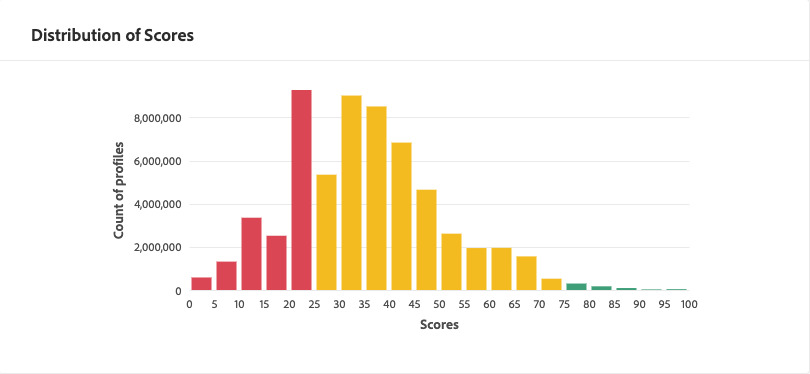

# Scopri informazioni approfondite con l&#39;AI del cliente

L&#39;AI del cliente, come parte di Intelligent Services, fornisce agli esperti di marketing il potere di sfruttare Adobe Sensei per anticipare quali saranno le azioni future dei clienti. L&#39;AI del cliente viene utilizzata per generare punteggi di propensione personalizzati, come il churn e la conversione per i singoli profili su scala. Ciò è possibile senza dover trasformare le esigenze aziendali in un problema di machine learning, scegliendo un algoritmo, una formazione o un&#39;implementazione.

Questo documento funge da guida per l&#39;interazione con le informazioni sulle istanze del servizio nell&#39;interfaccia utente AI del cliente di Servizi intelligenti.

## Introduzione

Per utilizzare le informazioni per l&#39;AI cliente, è necessario disporre di un&#39;istanza di servizio con uno stato di esecuzione riuscito. Per creare una nuova istanza del servizio, visita la guida [utente](./user-guide.md)Customer AI. Se avete creato di recente un&#39;istanza di servizio che continua a essere formativa e valutazione, lasciate 24 ore per completare l&#39;esecuzione.

## Panoramica dell’istanza del servizio

Nell’interfaccia utente di Adobe Experience Platform, fai clic su **Servizi** nella barra di navigazione a sinistra. Viene visualizzato il browser *Servizi* , che presenta i servizi intelligenti disponibili. Nel contenitore per l&#39;API cliente, fate clic su **Apri**.

Viene visualizzata la pagina del servizio AI del cliente. In questa pagina sono elencate le istanze di servizio dell&#39;API cliente e vengono visualizzate informazioni su di esse, incluso il nome dell&#39;istanza, il tipo di propensione, la frequenza di esecuzione dell&#39;istanza e lo stato dell&#39;ultimo aggiornamento.

>[!NOTE] Sono disponibili informazioni approfondite solo le istanze del servizio che hanno completato con successo l’esecuzione del punteggio.

Fate clic sul nome di un&#39;istanza di servizio per iniziare.

Viene quindi visualizzata la pagina delle informazioni relative all’istanza del servizio in cui vengono fornite le visualizzazioni dei dati. Le visualizzazioni e le operazioni che puoi eseguire con i dati sono descritte più dettagliatamente in questa guida.

### Dettagli dell&#39;istanza del servizio

Esistono due modi per visualizzare i dettagli dell&#39;istanza del servizio: la prima proviene dal dashboard e la seconda dall&#39;interno dell&#39;istanza del servizio.

Per visualizzare i dettagli dall&#39;interno del dashboard, fate clic su un contenitore di istanza del servizio, evitando il collegamento ipertestuale associato al nome. Si apre una barra laterale destra che fornisce dettagli aggiuntivi come la descrizione, la frequenza del punteggio, l&#39;obiettivo di previsione e la popolazione ammissibile. Inoltre, potete scegliere di modificare ed eliminare l’istanza facendo clic su **Modifica** o **Elimina**.

>[!NOTE] Nel caso in cui un&#39;esecuzione del punteggio non riesca, viene visualizzato un messaggio di errore. Il messaggio di errore è elencato in Dettagli *dell&#39;* ultima esecuzione nella barra a destra, visibile solo per le esecuzioni non riuscite.

Il secondo modo per visualizzare i dettagli aggiuntivi per un’istanza di servizio si trova nella pagina delle informazioni. Puoi fare clic su **Mostra più** elementi in alto a destra per compilare un elenco a discesa. Vengono elencati i dettagli, ad esempio la definizione del punteggio, la data di creazione e il tipo di propensione. Per maggiori informazioni sulle proprietà elencate, consulta la guida [utente](./user-guide.md)Customer AI.

### Modificare un’istanza

Per modificare un’istanza, fate clic su **Modifica** nella barra di navigazione in alto a destra.

Viene visualizzata la finestra di dialogo di modifica, che consente di modificare la *descrizione* e la frequenza *di* punteggio dell’istanza. Per confermare le modifiche e chiudere la finestra di dialogo, fate clic su **Modifica** nell’angolo in basso a destra.

### Altre azioni

Il pulsante **Altre azioni** si trova nella barra di navigazione in alto a destra accanto a **Modifica**. Facendo clic su **Altre azioni** si apre un menu a discesa che consente di selezionare una delle operazioni seguenti:

- **Elimina**: Elimina l&#39;istanza.
- **Punti** di accesso: Facendo clic sui punteggi *di* accesso si apre una finestra di dialogo che fornisce un collegamento ai punteggi di [scaricamento per l&#39;esercitazione AI](./download-scores.md) del cliente. La finestra di dialogo fornisce inoltre l&#39;ID del set di dati necessario per effettuare chiamate API.
- **Visualizza cronologia** di esecuzione: Viene visualizzata una finestra di dialogo contenente un elenco di tutte le esecuzioni del punteggio associate all&#39;istanza del servizio.

## Riepilogo punteggio

Riepilogo punteggio visualizza il numero totale di profili con punteggio e li classifica in bucket contenenti probabilità alta, media e bassa. I periodi fissi di propensione sono determinati in base all&#39;intervallo di punteggio, il valore basso è inferiore a 24, il valore medio è compreso tra 25 e 74 e il valore massimo è superiore a 74. Ogni intervallo ha un colore corrispondente alla legenda.

>[!NOTE] Se si tratta di un punteggio di propensione alla conversione, i punteggi alti sono indicati in verde e i punteggi bassi in rosso. Se si prevede la propensione del churn questo è capovolto, i punteggi alti sono in rosso e i punteggi bassi sono in verde. Il bucket medio rimane giallo indipendentemente dal tipo di propensione scelto.

## Distribuzione dei punteggi

La scheda *Distribuzione dei punteggi* fornisce un riepilogo visivo della popolazione in base al punteggio. I colori visualizzati nella scheda *Distribuzione di punteggi* rappresentano il tipo di punteggio di propensione generato.

## Fattori di influenza

Per ogni intervallo di punteggio, viene generata una scheda che mostra i primi 10 fattori influenti per tale intervallo. I fattori influenti forniscono ulteriori dettagli sul motivo per cui i clienti appartengono a vari periodi fissi di valutazione.

### Creazione di un segmento

Facendo clic sul pulsante **Crea segmento** in uno qualsiasi dei periodi fissi per Propensione bassa, Media e Alta, si passa al generatore di segmenti.

Il generatore di segmenti viene utilizzato per definire un segmento, tuttavia, l&#39;AI cliente ha già fatto il lavoro per voi. Per completare la creazione del segmento, è sufficiente compilare i contenitori *Nome* e *Descrizione* nella parte destra dell’interfaccia utente del generatore di segmenti. Dopo aver assegnato al segmento un nome e una descrizione, fai clic su **Salva** in alto a destra.

>!![NOTE] Poiché i punteggi di propensione sono scritti sul singolo profilo, sono disponibili nel generatore di segmenti come qualsiasi altro attributo di profilo. Quando vai al generatore di segmenti per creare nuovi segmenti, puoi vedere tutti i vari punteggi di propensione nello spazio dei nomi Customer AI (AI cliente).

Per visualizzare il nuovo segmento nell’interfaccia utente della piattaforma, fai clic su **Segmenti** nella barra di navigazione a sinistra. Viene visualizzata la pagina *Sfoglia* , con tutti i segmenti disponibili.

## Passaggi successivi

Questo documento descrive le informazioni fornite da un&#39;istanza del servizio Customer AI. Ora puoi continuare a seguire l&#39;esercitazione sul [download dei punteggi in Customer AI](./download-scores.md) o consultare le altre guide dei servizi [intelligenti di](../home.md) Adobe disponibili.