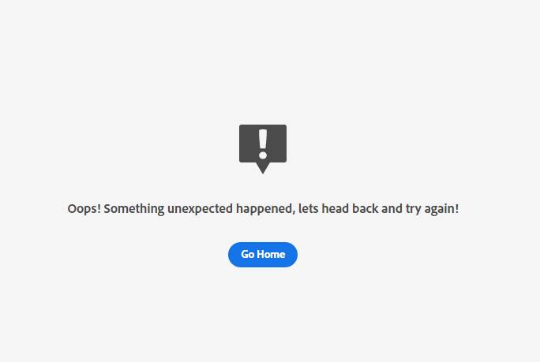

# Risoluzione degli errori di Customer AI

Customer AI visualizza gli errori quando la formazione del modello, il punteggio e la configurazione non riescono. In **[!UICONTROL Istanze del servizio]** una colonna per **[!UICONTROL STATO ULTIMO ESECUZIONE]** visualizza uno dei messaggi seguenti: **[!UICONTROL Completato]**, **[!UICONTROL Problema di formazione]** e **[!UICONTROL Non riuscito]**.

Nel caso in cui **[!UICONTROL Non riuscito]** o **[!UICONTROL Problema di formazione]** viene visualizzato, puoi selezionare lo stato di esecuzione per aprire un pannello laterale. Il pannello laterale contiene **[!UICONTROL Stato dell&#39;ultima esecuzione]** e **[!UICONTROL Dettagli dell&#39;ultima esecuzione]**. **[!UICONTROL Dettagli dell&#39;ultima esecuzione]** contiene informazioni sul motivo per cui l&#39;esecuzione non è riuscita. Nel caso in cui Customer AI non sia in grado di fornire dettagli sull’errore, contatta il supporto con il codice di errore fornito.

 

## Impossibile accedere a Customer AI in Chrome in incognito

Gli errori di caricamento nella modalità in incognito di Google Chrome sono presenti a causa degli aggiornamenti nelle impostazioni di sicurezza in modalità in incognito di Google Chrome. Il problema è in fase di elaborazione con Chrome per rendere experience.adobe.com un dominio fidato.

 

### Correzione consigliata

Per risolvere questo problema è necessario aggiungere experience.adobe.com come sito che può sempre utilizzare i cookie. Inizia passando a **chrome://settings/cookies**. Quindi, scorri verso il basso fino a **Comportamenti personalizzati** seguita dalla selezione della **Aggiungi** accanto a &quot;siti che possono sempre utilizzare i cookie&quot;. Nel pover che appare, copia e incolla `[*.]experience.adobe.com` quindi seleziona la **Inclusione di cookie di terze parti** in questa casella di controllo del sito. Al termine, seleziona **Aggiungi** e ricaricare Customer AI in incognito.

## La qualità del modello è scadente

Se ricevi l&#39;errore &quot;[!UICONTROL La qualità del modello è scarsa. È consigliabile creare una nuova app con la configurazione modificata]&quot;. Segui i passaggi consigliati di seguito per aiutarti a risolvere i problemi.

 

### Correzione consigliata

&quot;La qualità del modello è scarsa&quot; significa che la precisione del modello non rientra in un intervallo accettabile. Customer AI non è stato in grado di creare un modello affidabile e AUC (Area sotto la curva ROC) &lt; 0,65 dopo l&#39;addestramento. Per correggere l’errore, è consigliabile modificare uno dei parametri di configurazione ed eseguire nuovamente il training.

Inizia controllando la precisione dei tuoi dati. È importante che i dati contengano i campi necessari per il risultato predittivo.

- Controlla se il tuo set di dati ha le date più recenti. Customer AI presuppone sempre che i dati siano aggiornati quando il modello viene attivato.
- Verifica i dati mancanti nella finestra di previsione e di idoneità definita. I tuoi dati devono essere completi senza interruzioni. Inoltre, assicurati che il set di dati soddisfi il [Requisiti dei dati storici di Customer AI](./input-output.md#data-requirements).
- Verifica la presenza di dati mancanti in e-commerce, applicazioni, Web e ricerca, all&#39;interno delle proprietà del campo dello schema.

Se i dati non sembrano essere il problema, prova a modificare la condizione di popolazione di idoneità per limitare il modello a determinati profili (ad esempio, `_experience.analytics.customDimensions.eVars.eVar142` esiste negli ultimi 56 giorni). Questo limita la popolazione e le dimensioni dei dati utilizzati nella finestra di formazione.

Se la limitazione della popolazione di idoneità non ha funzionato o non è possibile, modifica la finestra di previsione.

- Prova a cambiare la finestra di previsione a 7 giorni e controlla se l&#39;errore continua a verificarsi. Se l&#39;errore non si verifica più, significa che potrebbe non essere disponibile un numero sufficiente di dati per la finestra di previsione definita.
