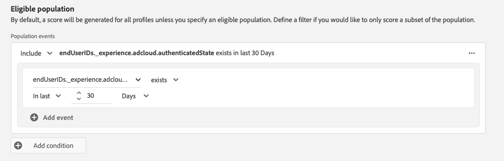
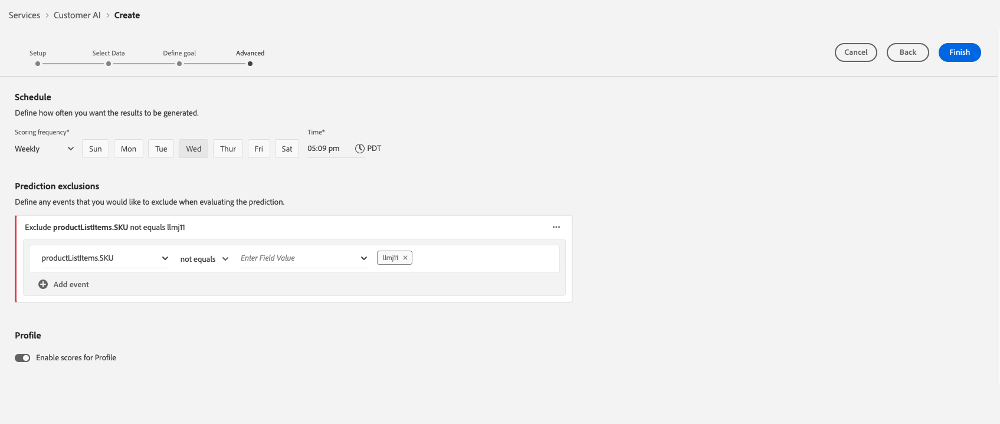

# Configurare un’istanza di Customer AI

Customer AI, come parte di Intelligent Services, consente di generare punteggi di propensione personalizzati senza doversi preoccupare dell’apprendimento automatico.

I servizi intelligenti forniscono Customer AI come servizio Adobe Sensei semplice da utilizzare che può essere configurato per diversi casi d’uso. Le sezioni seguenti forniscono i passaggi per configurare un’istanza di Customer AI.

## Creare un’istanza {#set-up-your-instance}

Nell’interfaccia utente di Platform, seleziona **[!UICONTROL Servizi]** nella navigazione a sinistra. La **[!UICONTROL Servizi]** viene visualizzato il browser e visualizza tutti i servizi disponibili a tua disposizione. Nel contenitore per Customer AI, seleziona **[!UICONTROL Apri]**.

La **Customer AI** Viene visualizzata l’interfaccia utente e vengono visualizzate tutte le istanze del servizio.

- È possibile trovare le **[!UICONTROL Totale profili valutati]** in basso a destra **[!UICONTROL Crea istanza]** contenitore. Questa metrica tiene traccia del numero totale di profili valutati da Customer AI per l’anno civile corrente, inclusi tutti gli ambienti sandbox ed eventuali istanze di servizio eliminate.

Le istanze del servizio possono essere modificate, clonate ed eliminate utilizzando i controlli sul lato destro dell’interfaccia utente. Per visualizzare questi controlli, seleziona un&#39;istanza dal tuo esistente **[!UICONTROL Istanze del servizio]**. I controlli contengono i seguenti elementi:

- **[!UICONTROL Modifica]**: Selezione **[!UICONTROL Modifica]** consente di modificare un’istanza di servizio esistente. Puoi modificare il nome, la descrizione e la frequenza di punteggio dell’istanza.
- **[!UICONTROL Clona]**: Selezione **[!UICONTROL Clona]** copia la configurazione dell&#39;istanza di servizio attualmente selezionata. Puoi quindi modificare il flusso di lavoro per apportare modifiche minori e rinominarlo come nuova istanza.
- **[!UICONTROL Elimina]**: Puoi eliminare un’istanza di servizio, comprese eventuali esecuzioni cronologiche.
- **[!UICONTROL Origine dati]**: Un collegamento al set di dati utilizzato da questa istanza. Se vengono utilizzati più set di dati, selezionando il testo del collegamento ipertestuale si apre il set di dati di anteprima.
- **[!UICONTROL Dettagli dell&#39;ultima esecuzione]**: Viene visualizzato solo in caso di errore di un&#39;esecuzione. Informazioni sul motivo per cui l’esecuzione non è riuscita, ad esempio i codici di errore sono visualizzati qui.
- **[!UICONTROL Definizione del punteggio]**: Panoramica rapida dell’obiettivo configurato per questa istanza.

Per creare una nuova istanza, seleziona **[!UICONTROL Crea istanza]**.

## Configurazione

Viene visualizzato il flusso di lavoro di creazione dell’istanza, a partire dal **[!UICONTROL Configurazione]** passo.

Di seguito sono riportate informazioni importanti sui valori che è necessario fornire all’istanza con:

- **[!UICONTROL Nome]:** Il nome dell’istanza viene utilizzato in tutte le posizioni in cui vengono visualizzati i punteggi di Customer AI. Pertanto, i nomi devono descrivere cosa rappresentano i punteggi di previsione. Ad esempio, &quot;Probabilità di annullare l’abbonamento a una rivista&quot;.

- **[!UICONTROL Descrizione]:** Una descrizione che indica cosa si sta cercando di prevedere.

- **[!UICONTROL Tipo di tendenza]:** Il tipo di propensione determina l’intento del punteggio e la polarità della metrica. Puoi scegliere **[!UICONTROL Abbandono]** o **[!UICONTROL Conversione]**. Vedi la nota sotto [riepilogo del punteggio](./discover-insights.md#scoring-summary) nel documento approfondimenti sulla ricerca per ulteriori informazioni su come il tipo di propensione influisce sull’istanza.

Fornisci i valori richiesti e seleziona **[!UICONTROL Successivo]** per continuare.

## Seleziona dati {#select-data}

Per progettazione, Customer AI utilizza i dati di Adobe Analytics, Adobe Audience Manager, Experience Event e Consumer Experience Event per calcolare i punteggi di propensione. Quando selezioni un set di dati, vengono elencati solo quelli compatibili con Customer AI. Per selezionare un set di dati, seleziona il (**+**) accanto al nome del set di dati o seleziona la casella di controllo per aggiungere più set di dati contemporaneamente. Utilizza l’opzione di ricerca per trovare rapidamente i set di dati che ti interessano.

Dopo aver selezionato i set di dati da utilizzare, seleziona la **[!UICONTROL Aggiungi]** per aggiungere i set di dati al riquadro di anteprima del set di dati.

Selezione dell’icona delle informazioni  accanto al set di dati viene aperto il set di dati preview pover.

L’anteprima del set di dati contiene dati quali l’ora dell’ultimo aggiornamento, lo schema di origine e un’anteprima delle prime dieci colonne.

### Completezza del set di dati {#dataset-completeness}

Nell’anteprima del set di dati è presente un valore percentuale di completezza del set di dati. Questo valore fornisce un’istantanea rapida del numero di colonne del set di dati vuote o nulle. Se un set di dati contiene molti valori mancanti e questi valori vengono acquisiti altrove, si consiglia vivamente di includere il set di dati contenente i valori mancanti. In questo esempio l’ID persona è vuoto, tuttavia, l’ID persona viene acquisito in un set di dati separato che può essere incluso.

>[!NOTE]
>
>La completezza del set di dati viene calcolata utilizzando la finestra di formazione massima per Customer AI (un anno). Ciò significa che i dati di età superiore a un anno non vengono presi in considerazione quando visualizzi il valore di completezza del set di dati.

### Selezionare un&#39;identità {#identity}

Affinché più set di dati si possano unire tra loro, devi selezionare un tipo di identità (noto anche come &quot;namespace identità&quot;) e un valore di identità all’interno dello spazio dei nomi. Se hai assegnato più di un campo come identità all’interno dello schema sotto lo stesso spazio dei nomi, tutti i valori di identità assegnati vengono visualizzati nel menu a discesa Identità preceduto dallo spazio dei nomi, ad esempio `EMAIL (personalEmail.address)` o `EMAIL (workEmail.address)`.

>[!IMPORTANT]
>
>Lo stesso tipo di identità (namespace) deve essere utilizzato per ogni set di dati selezionato. Accanto al tipo di identità all&#39;interno della colonna Identity, viene visualizzato un segno di spunta verde che indica che i set di dati sono compatibili. Ad esempio, quando utilizzi lo spazio dei nomi Telefono e `mobilePhone.number` come identificatore, tutti gli identificatori per i set di dati rimanenti devono contenere e utilizzare lo spazio dei nomi Telefono .

Per selezionare un&#39;identità, selezionare il valore sottolineato che si trova nella colonna identità. Viene visualizzato il puntatore di selezione di un&#39;identità.

Se in uno spazio dei nomi sono disponibili più identità, accertati di selezionare il campo di identità corretto per il caso d’uso. Ad esempio, due identità e-mail sono disponibili all’interno dello spazio dei nomi e-mail, un messaggio e-mail aziendale e personale. A seconda del caso d’uso, è più probabile che un’e-mail personale venga compilata ed è più utile nelle singole previsioni. Ciò significa che `EMAIL (personalEmail.address)` viene selezionata come identità.

>[!NOTE]
>
> Se non esiste un tipo di identità (namespace) valido per un set di dati, è necessario impostare un&#39;identità primaria e assegnarla a uno spazio dei nomi di identità utilizzando [editor di schemi](../../../xdm/schema/composition.md#identity). Per ulteriori informazioni sugli spazi dei nomi e le identità, visita il [Namespace del servizio Identity](../../../identity-service/namespaces.md) documentazione.

## Definire l&#39;obiettivo {#define-a-goal}

<!-- https://www.adobe.com/go/cai-define-a-goal -->

La **[!UICONTROL Definire l&#39;obiettivo]** viene visualizzato un passaggio che fornisce un ambiente interattivo per definire visivamente un obiettivo di previsione. Un obiettivo è composto da uno o più eventi, in cui l&#39;occorrenza di ogni evento è basata sulla condizione in cui si trova. L’obiettivo di un’istanza di Customer AI è quello di determinare la probabilità che il suo obiettivo venga raggiunto entro un determinato intervallo di tempo.

Per creare un obiettivo, seleziona **[!UICONTROL Immettere il nome del campo]** seguito da un campo dell’elenco a discesa. Seleziona il secondo input, una clausola per la condizione dell&#39;evento, quindi facoltativamente fornisci il valore target per completare l&#39;evento. È possibile configurare altri eventi selezionando **[!UICONTROL Aggiungi evento]**. Infine, completa l&#39;obiettivo applicando un intervallo di tempo di previsione in numero di giorni, quindi seleziona **[!UICONTROL Successivo]**.

### Si verificherà e non si verificherà

Quando definisci l’obiettivo, puoi selezionare l’opzione **[!UICONTROL Si verificherà]** o **[!UICONTROL Non si verificherà]**. Selezione **[!UICONTROL Si verificherà]** significa che le condizioni dell’evento definite devono essere soddisfatte affinché i dati dell’evento di un cliente possano essere inclusi nell’interfaccia utente di insights.

Ad esempio, se desideri impostare un’app per prevedere se un cliente effettuerà un acquisto, puoi selezionare **[!UICONTROL Si verificherà]** seguito da **[!UICONTROL Tutti]** e quindi inserisci **commerce.purchased.id** (o un campo simile) e **[!UICONTROL esiste]** come operatore.

Tuttavia, in alcuni casi può essere utile prevedere se un evento non si verifica in un determinato intervallo di tempo. Per configurare un obiettivo con questa opzione, seleziona **[!UICONTROL Non si verificherà]** dall’elenco a discesa di livello superiore.

Ad esempio, se sei interessato a prevedere quali clienti diventano meno coinvolti e non visitare la pagina di accesso al tuo account nel mese successivo. Seleziona **[!UICONTROL Non si verificherà]** seguito da **[!UICONTROL Tutti]** e quindi inserisci **web.webInteraction.URL** (o un campo simile) e **[!UICONTROL è]** come operatore con **accesso account** come valore.

### Tutti e uno di

In alcuni casi, è possibile prevedere se si verificherà una combinazione di eventi e in altri casi, è possibile prevedere l’occorrenza di un evento da un set predefinito. Per prevedere se un cliente avrà una combinazione di eventi, seleziona la **[!UICONTROL Tutti]** dal menu a discesa di secondo livello nella **[!UICONTROL Definisci obiettivo]** pagina.

Ad esempio, è possibile prevedere se un cliente acquista un particolare prodotto. Questo obiettivo di previsione è definito da due condizioni: a `commerce.order.purchaseID` **esiste** e `productListItems.SKU` **è** alcuni valori specifici.

Per prevedere se un cliente avrà un evento da un set specifico, puoi utilizzare la funzione **[!UICONTROL Qualsiasi]** opzione .

Ad esempio, puoi prevedere se un cliente visita un determinato URL o una pagina web con un nome specifico. Questo obiettivo di previsione è definito da due condizioni: `web.webPageDetails.URL` **inizia con** un valore particolare e `web.webPageDetails.name` **inizia con** un valore particolare.

### Popolazione ammissibile *(facoltativo)*

Per impostazione predefinita, i punteggi di propensione vengono generati per tutti i profili, a meno che non venga specificata una popolazione idonea. Puoi specificare una popolazione idonea definendo le condizioni per includere o escludere profili in base agli eventi.

### Eventi personalizzati (*facoltativo*) {#custom-events}

Se disponi di informazioni aggiuntive oltre al [campi evento standard](../input-output.md#standard-events) utilizzata da Customer AI per generare punteggi di propensione, viene fornita un’opzione eventi personalizzata. L’utilizzo di questa opzione consente di aggiungere eventi aggiuntivi che ritieni influenti e che possono migliorare la qualità del modello e contribuire a fornire risultati più precisi. Se il set di dati selezionato include eventi personalizzati definiti nello schema, puoi aggiungerli all’istanza.

>[!NOTE]
>
> Per una spiegazione dettagliata su come gli eventi personalizzati influiscono sui risultati del punteggio di Customer AI, visita il [Esempio di evento personalizzato](#custom-event) sezione .

Per aggiungere un evento personalizzato, seleziona **[!UICONTROL Aggiungi evento personalizzato]**. Quindi, inserisci un nome evento personalizzato, quindi mappalo sul campo evento nello schema. I nomi degli eventi personalizzati vengono visualizzati al posto del valore dei campi quando si esaminano fattori influenti e altre informazioni. Questo significa che il nome dell’evento personalizzato verrà utilizzato al posto dell’ID/valore dell’evento. Per ulteriori informazioni sulla modalità di visualizzazione degli eventi personalizzati, consulta la sezione [sezione esempio di evento personalizzato](#custom-event). Questi eventi personalizzati aggiuntivi vengono utilizzati da Customer AI per migliorare la qualità del modello e fornire risultati più precisi.

Quindi, seleziona l’operatore da utilizzare dal menu a discesa operatori disponibili. Sono elencati solo gli operatori compatibili con l’evento .

Infine, immettere i valori del campo se l&#39;operatore selezionato ne richiede uno. In questo esempio, dobbiamo solo vedere se esiste una prenotazione alberghiera o ristorante. Tuttavia, se vogliamo essere più precisi, potremmo utilizzare l’operatore &quot;uguale a&quot; e inserire un valore esatto nel prompt dei valori.

Al termine, seleziona **[!UICONTROL Successivo]** in alto a destra per continuare.

### Attributi di profilo personalizzati (*facoltativo*)

Puoi definire importanti campi del set di dati di profilo (con marche temporali) nei tuoi dati oltre a [campi evento standard](../input-output.md#standard-events) utilizzato da Customer AI per generare punteggi di propensione. L’utilizzo di questa opzione consente di aggiungere attributi di profilo aggiuntivi che ritieni influenti e che possono migliorare la qualità del modello e fornire risultati più precisi. Inoltre, l’aggiunta di attributi di profilo personalizzati consente a Customer AI di mostrare meglio in che modo particolari profili sono finiti in un bucket di propensione.

>[!NOTE]
>
>L’aggiunta di un attributo di profilo personalizzato segue lo stesso flusso di lavoro dell’aggiunta di un evento personalizzato. Analogamente agli eventi personalizzati, gli attributi di profilo personalizzati influiscono sul punteggio del modello nello stesso modo. Per una spiegazione dettagliata, visita la [Esempio di evento personalizzato](#custom-event) sezione .

### Aggiunta di un esempio di evento personalizzato {#custom-event}

Nell’esempio seguente, un evento personalizzato e un attributo di profilo viene aggiunto a un’istanza di Customer AI. L’obiettivo dell’istanza di Customer AI è prevedere la probabilità che un cliente acquisti un altro prodotto Luma nei successivi 60 giorni. Normalmente, i dati del prodotto sono collegati a una SKU del prodotto. In questo caso, la SKU è `prd1013`. Una volta che il modello Customer AI è stato addestrato/valutato, questo SKU può essere collegato a un evento e visualizzato come fattore influente per un bucket di propensione.

Customer AI applica automaticamente la generazione di funzioni quali &quot;Giorni da&quot; o &quot;Conteggi di&quot; rispetto a eventi personalizzati, come **Acquisto a cura di**. Se questo evento è stato considerato un fattore determinante per determinare perché i clienti hanno una propensione elevata, media o bassa, Customer AI lo visualizza come `Days since prd1013 purchase` o `Count of prd1013 purchase`. Creando questo evento come evento personalizzato, puoi assegnare all’evento un nuovo nome che facilita la lettura dei risultati. Ad esempio, `Days since Watch purchase`. Inoltre, Customer AI utilizza questo evento nella sua formazione e valutazione anche se l’evento non è un evento standard. Ciò significa che puoi aggiungere più eventi che ritieni influenti e personalizzare ulteriormente il modello includendo dati come prenotazioni, registri visitatori e altri eventi. L’aggiunta di questi punti dati aumenta ulteriormente l’accuratezza e la precisione del modello Customer AI.

## Imposta opzioni

Il passaggio Imposta opzioni ti consente di configurare una pianificazione per automatizzare le esecuzioni di previsione, definire esclusioni di previsione per filtrare determinati eventi e attivare/disattivare **[!UICONTROL Profilo]** on/off.

### Configurare una pianificazione *(facoltativo)* {#configure-a-schedule}

Per impostare una pianificazione del punteggio, inizia configurando il **[!UICONTROL Frequenza punteggio]**. È possibile programmare l&#39;esecuzione delle previsioni automatizzate su base settimanale o mensile.

### Esclusioni di previsione *(facoltativo)*

Se il set di dati contiene colonne aggiunte come dati di test, puoi aggiungere tale colonna o evento a un elenco di esclusione selezionando **[!UICONTROL Aggiungi esclusione]** seguito dall’inserimento nel campo da escludere. Questo impedisce la valutazione degli eventi che soddisfano determinate condizioni durante la generazione dei punteggi. Questa funzione può essere utilizzata per filtrare gli input o le promozioni di dati irrilevanti.

Per escludere un evento, seleziona **[!UICONTROL Aggiungi esclusione]** e definire l’evento. Per rimuovere un’esclusione, seleziona i puntini di sospensione (**[!UICONTROL ...]**) in alto a destra del contenitore evento, quindi seleziona **[!UICONTROL Rimuovi contenitore]**.

### Attiva/disattiva profilo

L’opzione Profilo consente a Customer AI di esportare i risultati del punteggio in Profilo cliente in tempo reale. La disattivazione di questa opzione impedisce l’aggiunta al profilo dei risultati del punteggio dei modelli. I risultati del punteggio di Customer AI sono ancora disponibili con questa funzione disabilitata.

Quando si utilizza Customer AI per la prima volta, è possibile disattivare questa funzione fino a quando non si è soddisfatti dei risultati di output del modello. Questo impedisce il caricamento di più set di dati di punteggio nei profili cliente durante la regolazione del modello. Una volta terminata la calibrazione del modello, è possibile clonare il modello utilizzando [opzione clone](#set-up-your-instance) dal **Istanze del servizio** pagina. Questo consente di creare una copia del modello e attivare il profilo.

Una volta impostata la pianificazione del punteggio, incluse le esclusioni di previsione e l’opzione di profilo in cui desideri che sia, seleziona **[!UICONTROL Fine]** in alto a destra per creare la tua istanza di Customer AI.

Se l&#39;istanza viene creata correttamente, un&#39;esecuzione di previsione viene attivata immediatamente e le esecuzioni successive vengono eseguite in base alla pianificazione definita.

>[!NOTE]
>
>A seconda delle dimensioni dei dati di input, il completamento delle esecuzioni può richiedere fino a 24 ore.

Seguendo questa sezione, hai configurato un&#39;istanza di Customer AI ed eseguito un&#39;esecuzione di previsione. Al completamento dell’esecuzione, le informazioni con punteggio vengono automaticamente compilate nei profili con punteggi previsti se l’opzione di attivazione del profilo è abilitata. Attendi fino a 24 ore prima di continuare la sezione successiva di questa esercitazione.

## Passaggi successivi {#next-steps}

Seguendo questa esercitazione, hai configurato correttamente un’istanza di Customer AI e generato punteggi di propensione. Ora puoi scegliere di utilizzare il Generatore di segmenti in [creare segmenti di clienti con punteggi previsti](./create-segment.md) o [scoprire informazioni approfondite con Customer AI](./discover-insights.md).

## Risorse aggiuntive

Il video seguente è progettato per supportare la comprensione del flusso di lavoro di configurazione per Customer AI. Vengono inoltre fornite le best practice e gli esempi di casi d’uso.

>[!IMPORTANT]
>
> Il video seguente non è aggiornato. Per informazioni aggiornate, consulta la documentazione .

>[!VIDEO](https://video.tv.adobe.com/v/32665?learn=on&quality=12)
