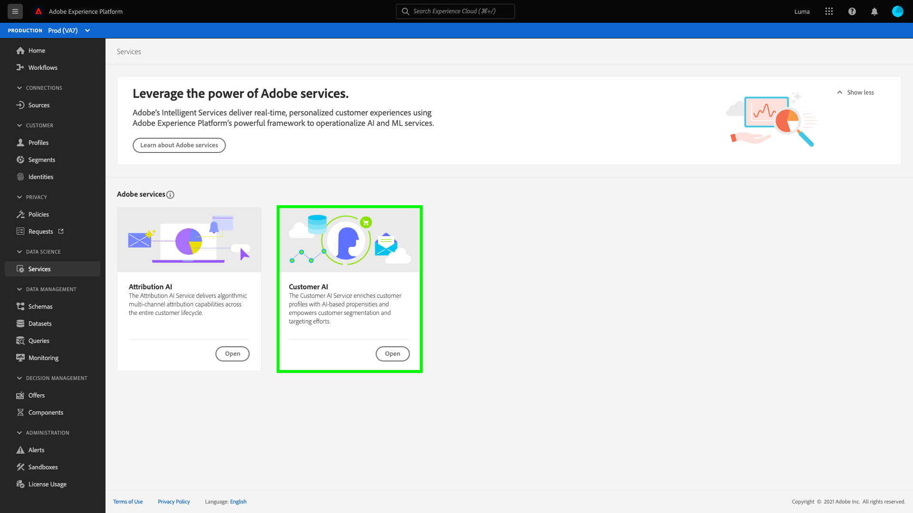
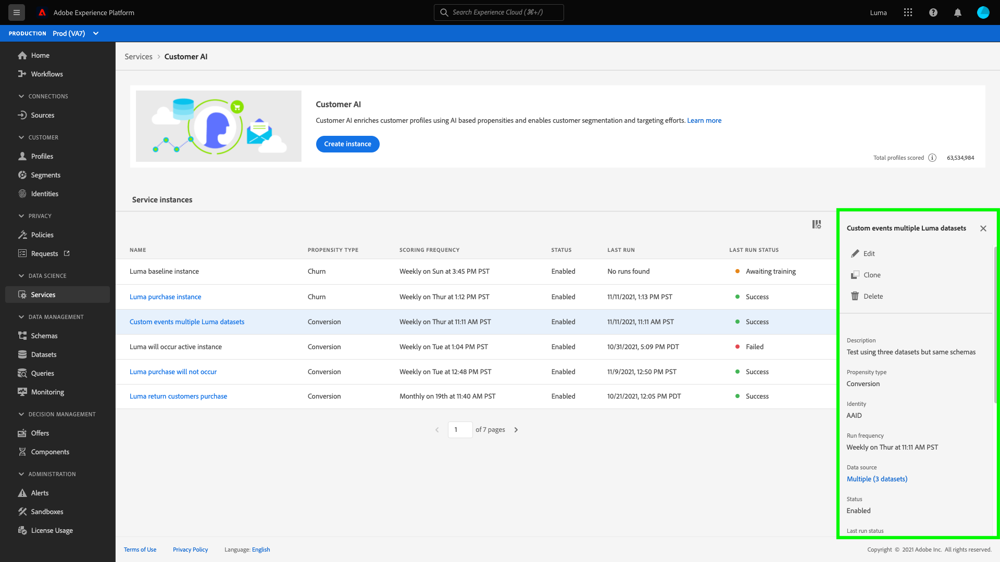

# Configurare un’istanza di Customer AI

Customer AI, come parte di Intelligent Services, consente di generare punteggi di propensione personalizzati senza doversi preoccupare dell’apprendimento automatico.

I servizi intelligenti forniscono Customer AI come servizio Adobe Sensei semplice da utilizzare che può essere configurato per diversi casi d’uso. Le sezioni seguenti forniscono i passaggi per configurare un’istanza di Customer AI.

## Imposta l&#39;istanza {#set-up-your-instance}

Nell’interfaccia utente di Platform, seleziona **[!UICONTROL Servizi]** nel menu di navigazione a sinistra. Viene visualizzato il browser **[!UICONTROL Servizi]** che visualizza tutti i servizi disponibili. Nel contenitore per Customer AI, seleziona **[!UICONTROL Apri]**.

Viene visualizzata l&#39;interfaccia utente **Customer AI** che visualizza tutte le istanze del servizio.

- Puoi trovare la metrica **[!UICONTROL Profili totali con punteggio]** in basso a destra del contenitore **[!UICONTROL Crea istanza]** . Questa metrica tiene traccia del numero totale di profili valutati da Customer AI per l’anno civile corrente, inclusi tutti gli ambienti sandbox ed eventuali istanze di servizio eliminate.

Le istanze del servizio possono essere modificate, clonate ed eliminate utilizzando i controlli sul lato destro dell’interfaccia utente. Per visualizzare questi controlli, seleziona un&#39;istanza dalle **[!UICONTROL istanze di servizio]** esistenti. I controlli contengono i seguenti elementi:

- **[!UICONTROL Modifica]**: Selezionando  **** Modifica puoi modificare un’istanza di servizio esistente. Puoi modificare il nome, la descrizione e la frequenza di punteggio dell’istanza.
- **[!UICONTROL Clona]**: Selezionando  **** Copia la configurazione dell&#39;istanza di servizio attualmente selezionata. Puoi quindi modificare il flusso di lavoro per apportare modifiche minori e rinominarlo come nuova istanza.
- **[!UICONTROL Elimina]**: Puoi eliminare un’istanza di servizio, comprese eventuali esecuzioni cronologiche.
- **[!UICONTROL Origine]** dati: Un collegamento al set di dati utilizzato da questa istanza.
- **[!UICONTROL Dettagli]** dell&#39;ultima esecuzione: Viene visualizzato solo in caso di errore di un&#39;esecuzione. Informazioni sul motivo per cui l’esecuzione non è riuscita, ad esempio i codici di errore sono visualizzati qui.
- **[!UICONTROL Definizione]** punteggio: Panoramica rapida dell’obiettivo configurato per questa istanza.

Per creare una nuova istanza, seleziona **[!UICONTROL Crea istanza]**.

Viene visualizzato il flusso di lavoro di creazione dell&#39;istanza, a partire dal passaggio **[!UICONTROL Configurazione]** .

Di seguito sono riportate informazioni importanti sui valori che è necessario fornire all’istanza con:

- Il nome dell’istanza viene utilizzato in tutte le posizioni in cui vengono visualizzati i punteggi di Customer AI. Pertanto, i nomi devono descrivere ciò che i punteggi di previsione rappresentano, ad esempio, &quot;Probabilità di annullare l&#39;abbonamento a una rivista&quot;.

- Il tipo di propensione determina l’intento del punteggio e la polarità della metrica. È possibile scegliere **[!UICONTROL Churn]** o **[!UICONTROL Conversion]**. Per ulteriori informazioni su come il tipo di propensione influisce sulla tua istanza, consulta la nota in [riepilogo del punteggio](./discover-insights.md#scoring-summary) nel documento delle informazioni sulla scoperta.

- L&#39;origine dati è la posizione in cui si trovano i dati. Set di dati è il set di dati di input utilizzato per prevedere i punteggi. Per progettazione, Customer AI utilizza i dati Consumer Experience Event, Adobe Analytics e Adobe Audience Manager per calcolare i punteggi di propensione. Quando selezioni un set di dati dal selettore a discesa, vengono elencati solo quelli compatibili con Customer AI.

- Per impostazione predefinita, i punteggi di propensione vengono generati per tutti i profili, a meno che non venga specificata una popolazione idonea. Puoi specificare una popolazione idonea definendo le condizioni per includere o escludere profili in base agli eventi.

Fornisci i valori richiesti e quindi seleziona **[!UICONTROL Avanti]**.

### Definire un obiettivo {#define-a-goal}

Viene visualizzato il passaggio **[!UICONTROL Definisci obiettivo]** che fornisce un ambiente interattivo per definire visivamente un obiettivo di previsione. Un obiettivo è composto da uno o più eventi, in cui l&#39;occorrenza di ogni evento è basata sulla condizione in cui si trova. L’obiettivo di un’istanza di Customer AI è quello di determinare la probabilità che il suo obiettivo venga raggiunto entro un determinato intervallo di tempo.

Per creare un obiettivo, seleziona **[!UICONTROL Inserisci nome campo]** e seleziona un campo dall’elenco a discesa. Seleziona il secondo input e seleziona una clausola per la condizione dell&#39;evento, quindi specifica il valore target per completare l&#39;evento. È possibile configurare altri eventi selezionando **[!UICONTROL Aggiungi evento]**. Infine, completa l&#39;obiettivo applicando un intervallo di tempo di previsione in numero di giorni, quindi seleziona **[!UICONTROL Successivo]**.

#### Si verificherà e non si verificherà

Durante la definizione dell&#39;obiettivo, è possibile selezionare **[!UICONTROL Si verificherà]** o **[!UICONTROL Non si verificherà]**. Selezionando **[!UICONTROL Si verificherà]** le condizioni dell&#39;evento definite devono essere soddisfatte affinché i dati dell&#39;evento di un cliente possano essere inclusi nell&#39;interfaccia utente di insights.

Ad esempio, se desideri impostare un’app per prevedere se un cliente effettuerà un acquisto, puoi selezionare **[!UICONTROL Si verificherà]** seguito da **[!UICONTROL Tutto di]** e quindi immettere **commerce.purchased.id** e **esiste** come operatore.

Tuttavia, in alcuni casi può essere utile prevedere se un evento non si verifica in un determinato intervallo di tempo. Per configurare un obiettivo con questa opzione, seleziona **[!UICONTROL Non verrà generato]** dal menu a discesa di livello superiore.

Ad esempio, se sei interessato a prevedere quali clienti diventano meno coinvolti e non visitare la pagina di accesso al tuo account nel mese successivo. Seleziona **[!UICONTROL Non si verificherà]** seguito da **[!UICONTROL Tutto di]** e quindi immetti **web.webInteraction.URL** e **[!UICONTROL è uguale a]** come operatore con **account-login** come valore.

#### Tutti e uno di

In alcuni casi, è possibile prevedere se si verificherà una combinazione di eventi e in altri casi, è possibile prevedere l’occorrenza di un evento da un set predefinito. Per prevedere se un cliente avrà una combinazione di eventi, seleziona l’opzione **[!UICONTROL Tutto di]** dal menu a discesa di secondo livello nella pagina **[!UICONTROL Definisci obiettivo]**.

Ad esempio, è possibile prevedere se un cliente acquista un particolare prodotto. Questo obiettivo di previsione è definito da due condizioni: a `commerce.order.purchaseID` **esiste** e `productListItems.SKU` **è uguale a** alcuni valori specifici.

Per prevedere se un cliente avrà un evento da un set specifico, puoi utilizzare l’opzione **[!UICONTROL Any of]** (Qualsiasi di).

Ad esempio, puoi prevedere se un cliente visita un determinato URL o una pagina web con un nome specifico. Questo obiettivo di previsione è definito da due condizioni: `web.webPageDetails.URL` **inizia con** un particolare valore e `web.webPageDetails.name` **inizia con** un particolare valore.

### Eventi personalizzati (*facoltativo*) {#custom-events}

Se disponi di informazioni aggiuntive oltre ai [campi evento standard](../input-output.md#standard-events) utilizzati da Customer AI per generare punteggi di propensione, viene fornita un’opzione eventi personalizzati. Se il set di dati selezionato include eventi personalizzati definiti nello schema, puoi aggiungerli all’istanza.

Per aggiungere un evento personalizzato, seleziona **[!UICONTROL Aggiungi evento personalizzato]**. Quindi, inserisci un nome evento personalizzato, quindi mappalo sul campo evento nello schema. I nomi degli eventi personalizzati vengono visualizzati al posto del valore dei campi quando si esaminano fattori influenti e altre informazioni. Ciò significa che gli ID utente, gli ID prenotazione, le informazioni sul dispositivo e altri valori personalizzati sono elencati con il nome dell’evento personalizzato anziché con l’ID/valore dell’evento. Questi eventi personalizzati aggiuntivi vengono utilizzati da Customer AI per migliorare la qualità del modello e fornire risultati più precisi.

Quindi, seleziona l’operatore da utilizzare dal menu a discesa operatori disponibili. Sono elencati solo gli operatori compatibili con l’evento .

Infine, immettere i valori del campo se l&#39;operatore selezionato ne richiede uno. In questo esempio, dobbiamo solo vedere se esiste una prenotazione alberghiera o ristorante. Tuttavia, se vogliamo essere più precisi, potremmo utilizzare l’operatore &quot;uguale a&quot; e inserire un valore esatto nel prompt dei valori.

Al termine, seleziona **[!UICONTROL Avanti]** in alto a destra per continuare.

### Configura una pianificazione *(opzionale)* {#configure-a-schedule}

Viene visualizzato il passaggio **[!UICONTROL Avanzate]** . Questo passaggio facoltativo consente di configurare una pianificazione per automatizzare le esecuzioni di previsione, definire esclusioni di previsione per filtrare determinati eventi o selezionare **[!UICONTROL Fine]** se non è necessario alcun elemento.

Imposta una pianificazione del punteggio configurando la **[!UICONTROL Frequenza di punteggio]**. È possibile programmare l&#39;esecuzione delle previsioni automatizzate su base settimanale o mensile.

### Esclusioni di previsione

Se il set di dati conteneva colonne aggiunte come dati di test, puoi aggiungere tale colonna o evento a un elenco di esclusione selezionando **Aggiungi esclusione** e quindi inserendo il campo da escludere. Questo impedisce la valutazione degli eventi che soddisfano determinate condizioni durante la generazione dei punteggi. Questa funzione può essere utilizzata per filtrare gli input di dati irrilevanti o alcune promozioni.

Per escludere un evento, seleziona **[!UICONTROL Aggiungi esclusione]** e definisci l&#39;evento. Per rimuovere un’esclusione, seleziona i puntini di sospensione (**[!UICONTROL ...]**) in alto a destra del contenitore evento, quindi seleziona **[!UICONTROL Rimuovi contenitore]**.

Escludere gli eventi in base alle esigenze, quindi selezionare **[!UICONTROL Fine]** per creare l&#39;istanza.

Se l&#39;istanza viene creata correttamente, un&#39;esecuzione di previsione viene attivata immediatamente e le esecuzioni successive vengono eseguite in base alla pianificazione definita.

>[!NOTE]
>
>A seconda delle dimensioni dei dati di input, il completamento delle esecuzioni può richiedere fino a 24 ore.

Seguendo questa sezione, hai configurato un&#39;istanza di Customer AI ed è stata eseguita un&#39;esecuzione di una previsione. Al completamento dell’esecuzione, le informazioni con punteggio compilano automaticamente i profili con punteggi previsti. Attendi fino a 24 ore prima di continuare la sezione successiva di questa esercitazione.

## Passaggi successivi {#next-steps}

Seguendo questa esercitazione, hai configurato correttamente un’istanza di Customer AI e generato punteggi di propensione. Ora puoi scegliere di utilizzare il Generatore di segmenti per [creare segmenti di clienti con punteggi previsti](./create-segment.md) o [scoprire informazioni con Customer AI](./discover-insights.md).

## Risorse aggiuntive

Il video seguente è progettato per supportare la comprensione del flusso di lavoro di configurazione per Customer AI. Vengono inoltre fornite le best practice e gli esempi di casi d’uso.

>[!VIDEO](https://video.tv.adobe.com/v/32665?learn=on&quality=12)
