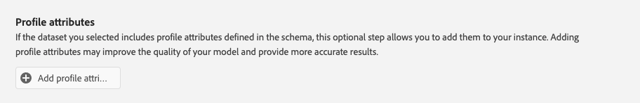

# Configurare un’istanza di Customer AI

IA per l’analisi dei clienti, parte dei servizi di IA/ML, consente di generare punteggi di propensione personalizzati senza doversi preoccupare dell’apprendimento automatico.

I servizi AI/ML forniscono IA per l’analisi dei clienti come servizio Adobe Sensei semplice da utilizzare che può essere configurato per diversi casi d’uso. Le sezioni seguenti illustrano i passaggi per la configurazione di un’istanza di Customer AI.

## Creare un’istanza {#set-up-your-instance}

Nell&#39;interfaccia utente di Platform, seleziona **[!UICONTROL Servizi]** nell&#39;area di navigazione a sinistra. Verrà visualizzato il browser **[!UICONTROL Servizi]** in cui sono visualizzati tutti i servizi disponibili. Nel contenitore di IA per l&#39;analisi dei clienti, seleziona **[!UICONTROL Apri]**.

Viene visualizzata l&#39;interfaccia utente di **Customer AI** con tutte le istanze del servizio.

- Puoi trovare la metrica **[!UICONTROL Profili totali valutati]** nella parte inferiore destra del contenitore **[!UICONTROL Crea istanza]**. Questa metrica tiene traccia del numero totale di profili valutati da IA per l’analisi dei clienti per l’anno civile corrente, inclusi tutti gli ambienti sandbox ed eventuali istanze di servizio eliminate.

Le istanze del servizio possono essere modificate, clonate ed eliminate utilizzando i controlli presenti sul lato destro dell’interfaccia utente. Per visualizzare questi controlli, seleziona un&#39;istanza dalle **[!UICONTROL istanze del servizio]** esistenti. I controlli contengono quanto segue:

- **[!UICONTROL Modifica]**: la selezione di **[!UICONTROL Modifica]** consente di modificare un&#39;istanza del servizio esistente. Puoi modificare il nome, la descrizione e la frequenza di punteggio dell’istanza.
- **[!UICONTROL Clone]**: se si seleziona **[!UICONTROL Clone]**, viene copiata la configurazione dell&#39;istanza del servizio attualmente selezionata. Puoi quindi modificare il flusso di lavoro per apportare modifiche minori e rinominarlo come nuova istanza.
- **[!UICONTROL Elimina]**: è possibile eliminare un&#39;istanza del servizio, incluse le esecuzioni cronologiche. Il set di dati di output corrispondente verrà eliminato da Platform. Tuttavia, i punteggi sincronizzati con Real-Time Customer Profile non vengono eliminati.
- **[!UICONTROL Origine dati]**: collegamento al set di dati utilizzato da questa istanza. Se vengono utilizzati più set di dati, quando si seleziona il testo del collegamento ipertestuale viene aperto il popover di anteprima del set di dati.
- **[!UICONTROL Dettagli ultima esecuzione]**: questa opzione viene visualizzata solo quando un&#39;esecuzione non riesce. Qui vengono visualizzate le informazioni sul motivo per cui l’esecuzione non è riuscita, ad esempio i codici di errore.
- **[!UICONTROL Definizione punteggio]**: panoramica rapida dell&#39;obiettivo configurato per questa istanza.

Per creare una nuova istanza, selezionare **[!UICONTROL Crea istanza]**.

## Configura

Il flusso di lavoro per la creazione dell&#39;istanza viene visualizzato a partire dal passaggio **[!UICONTROL Configurazione]**.

Di seguito sono riportate informazioni importanti sui valori che è necessario fornire all’istanza:

- **[!UICONTROL Nome]:** Il nome dell&#39;istanza viene utilizzato in tutte le posizioni in cui vengono visualizzati i punteggi di IA per l&#39;analisi dei clienti. Pertanto, i nomi devono descrivere cosa rappresentano i punteggi di previsione. Ad esempio, &quot;Probabilità di annullare l’abbonamento alla rivista&quot;.

- **[!UICONTROL Descrizione]:** Una descrizione che indica ciò che si sta tentando di prevedere.

- **[!UICONTROL Tipo di propensione]:** Il tipo di propensione determina l&#39;intento del punteggio e della polarità della metrica. Puoi scegliere **[!UICONTROL Abbandono]** o **[!UICONTROL Conversione]**. Per ulteriori informazioni su come il tipo di propensione influisce sull&#39;istanza, vedi la nota in [riepilogo punteggio](./discover-insights.md#scoring-summary) nel documento individuazione approfondimenti.

Immetti i valori richiesti, quindi seleziona **[!UICONTROL Avanti]** per continuare.

## Selezionare i dati {#select-data}

Per impostazione predefinita, IA per l’analisi dei clienti utilizza Adobe Analytics, Adobe Audience Manager, gli eventi esperienza in generale e i dati degli eventi esperienza del consumatore per calcolare i punteggi di tendenza. Quando selezioni un set di dati, vengono elencati solo quelli compatibili con IA per l’analisi dei clienti. Per selezionare un set di dati, seleziona il simbolo (**+**) accanto al nome del set di dati oppure seleziona la casella di controllo per aggiungere più set di dati contemporaneamente. Utilizza l’opzione di ricerca per trovare rapidamente i set di dati che ti interessano.

Dopo aver selezionato i set di dati da utilizzare, seleziona il pulsante **[!UICONTROL Aggiungi]** per aggiungere i set di dati al riquadro di anteprima dei set di dati.

Selezionando l&#39;icona info  accanto al set di dati si apre il popover di anteprima del set di dati.

L’anteprima del set di dati contiene dati quali l’ora dell’ultimo aggiornamento, lo schema di origine e un’anteprima delle prime dieci colonne.

Seleziona **[!UICONTROL Salva]** per salvare le bozze durante lo spostamento nel flusso di lavoro. Puoi anche salvare le configurazioni del modello di bozza e passare al passaggio successivo nel flusso di lavoro. Usa **[!UICONTROL Salva e continua]** per creare e salvare le bozze durante le configurazioni del modello. La funzione consente di creare e salvare le bozze della configurazione del modello ed è particolarmente utile quando è necessario definire molti campi nel flusso di lavoro di configurazione.

### Completezza del set di dati {#dataset-completeness}

Nell’anteprima del set di dati è presente un valore percentuale di completezza. Questo valore fornisce un’istantanea rapida del numero di colonne vuote o nulle nel set di dati. Se un set di dati contiene molti valori mancanti e questi valori vengono acquisiti altrove, è consigliabile includere il set di dati contenente i valori mancanti. In questo esempio l’ID persona è vuoto, tuttavia, l’ID persona viene acquisito in un set di dati separato che può essere incluso.

>[!NOTE]
>
>La completezza del set di dati viene calcolata utilizzando la finestra di formazione massima per IA per l’analisi dei clienti (un anno). Ciò significa che i dati che hanno più di un anno non vengono presi in considerazione durante la visualizzazione del valore di completezza del set di dati.

### Seleziona un’identità {#identity}

Ora puoi unire più set di dati in base alla mappa di identità (campo). Devi selezionare un tipo di identità (noto anche come &quot;spazio dei nomi delle identità&quot;) e un valore di identità all’interno di tale spazio dei nomi. Se hai assegnato più di un campo come identità all&#39;interno dello schema nello stesso spazio dei nomi, tutti i valori di identità assegnati vengono visualizzati nel menu a discesa delle identità anteposto dallo spazio dei nomi, ad esempio `EMAIL (personalEmail.address)` o `EMAIL (workEmail.address)`.

[seleziona lo stesso spazio dei nomi](../images/user-guide/cai-identity-map.png)

>[!IMPORTANT]
>
>Per ogni set di dati selezionato deve essere utilizzato lo stesso tipo di identità (spazio dei nomi). Accanto al tipo di identità nella colonna Identity viene visualizzato un segno di spunta verde per indicare che i set di dati sono compatibili. Ad esempio, quando si utilizza lo spazio dei nomi Telefono e `mobilePhone.number` come identificatore, tutti gli identificatori per i set di dati rimanenti devono contenere e utilizzare lo spazio dei nomi Telefono.

Per selezionare un’identità, seleziona il valore sottolineato che si trova nella colonna Identità. Viene visualizzato il popover seleziona un’identità.

<!--  -->
[seleziona lo stesso spazio dei nomi](../images/user-guide/cai-identity-namespace.png)

Se in uno spazio dei nomi sono disponibili più identità, assicurati di selezionare il campo di identità corretto per il caso d’uso. Ad esempio, nello spazio dei nomi dell’e-mail sono disponibili due identità e-mail: un’e-mail aziendale e personale. A seconda del caso d’uso, un’e-mail personale ha più probabilità di essere compilata ed è più utile nelle previsioni individuali. Ciò significa che `EMAIL (personalEmail.address)` verrebbe selezionato come identità.

>[!NOTE]
>
> Se non esiste alcun tipo di identità (spazio dei nomi) valido per un set di dati, è necessario impostare un&#39;identità primaria e assegnarla a uno spazio dei nomi di identità utilizzando l&#39;[editor schema](../../../xdm/schema/composition.md#identity). Per ulteriori informazioni sugli spazi dei nomi e sulle identità, consulta la documentazione sugli [spazi dei nomi del servizio Identity](../../../identity-service/features/namespaces.md).

## Definisci l’obiettivo {#define-a-goal}

<!-- https://www.adobe.com/go/cai-define-a-goal -->

Viene visualizzato il passaggio **[!UICONTROL Definisci obiettivo]** che fornisce un ambiente interattivo per la definizione visiva di un obiettivo di previsione. Un obiettivo è composto da uno o più eventi, in cui l’occorrenza di ogni evento è basata sulla condizione che contiene. L’obiettivo di un’istanza di IA per l’analisi dei clienti è determinare la probabilità di raggiungere il proprio obiettivo entro un determinato intervallo di tempo.

Per creare un obiettivo, selezionare **[!UICONTROL Immettere il nome del campo]** seguito da un campo nell&#39;elenco a discesa. Selezionare il secondo input, una clausola per la condizione dell&#39;evento, quindi facoltativamente specificare il valore di destinazione per completare l&#39;evento. È possibile configurare altri eventi selezionando **[!UICONTROL Aggiungi evento]**. Infine, completa l&#39;obiettivo applicando un intervallo di tempo di previsione in numero di giorni, quindi seleziona **[!UICONTROL Successivo]**.

<!--  -->

### Si verifica e non si verifica

Durante la definizione dell&#39;obiettivo, è possibile selezionare **[!UICONTROL Si verificherà]** o **[!UICONTROL Non si verificherà]**. Se selezioni **[!UICONTROL Si verificherà]**, significa che le condizioni dell&#39;evento definite devono essere soddisfatte affinché i dati dell&#39;evento di un cliente possano essere inclusi nell&#39;interfaccia utente di approfondimenti.

Ad esempio, se desideri configurare un&#39;app per prevedere se un cliente effettuerà un acquisto, puoi selezionare **[!UICONTROL Si verificherà]** seguito da **[!UICONTROL Tutti]** e quindi immettere **commerce.purchases.id** (o un campo simile) e **[!UICONTROL esiste]** come operatore.

<!--  -->

Tuttavia, ci possono essere casi in cui sei interessato a prevedere se un evento non si verificherà in un determinato arco temporale. Per configurare un obiettivo con questa opzione, selezionare **[!UICONTROL Non si verificherà]** dal menu a discesa di primo livello.

Ad esempio, se sei interessato a prevedere quali clienti saranno meno coinvolti e non visiti la pagina di accesso del tuo account nel mese successivo. Seleziona **[!UICONTROL Non verrà eseguito]** seguito da **[!UICONTROL Tutti]**, quindi immetti **web.webInteraction.URL** (o un campo simile) e **[!UICONTROL è uguale a]** come operatore con **account-login** come valore.

### Tutti e uno di

In alcuni casi, può essere utile prevedere se si verificherà una combinazione di eventi e in altri casi, può essere utile prevedere il verificarsi di qualsiasi evento da un set predefinito. Per prevedere se un cliente avrà una combinazione di eventi, seleziona l&#39;opzione **[!UICONTROL Tutti]** dall&#39;elenco a discesa di secondo livello nella pagina **[!UICONTROL Definisci obiettivo]**.

Ad esempio, è possibile prevedere se un cliente acquista un particolare prodotto. Questo obiettivo di previsione è definito da due condizioni: un `commerce.order.purchaseID` **exists** e il `productListItems.SKU` **equals** some valore specifico.

Per prevedere se un cliente avrà un evento da un determinato set, puoi utilizzare l&#39;opzione **[!UICONTROL Qualsiasi di]**.

Ad esempio, puoi prevedere se un cliente visita un determinato URL o una pagina web con un nome particolare. Questo obiettivo di previsione è definito da due condizioni: `web.webPageDetails.URL` **inizia con** un valore particolare e `web.webPageDetails.name` **inizia con** un valore particolare.

### Popolazione idonea *(facoltativo)*

Per impostazione predefinita, i punteggi di tendenza vengono generati per tutti i profili, a meno che non sia specificata una popolazione idonea. Puoi specificare una popolazione idonea definendo le condizioni per includere o escludere i profili in base agli eventi.

### Eventi personalizzati (*facoltativi*) {#custom-events}

Se disponi di informazioni aggiuntive oltre ai [campi evento standard](../data-requirements.md#standard-events) utilizzati da IA per l&#39;analisi dei clienti per generare punteggi di tendenza, viene fornita un&#39;opzione eventi personalizzata. L’utilizzo di questa opzione consente di aggiungere altri eventi che ritieni influenti, il che può migliorare la qualità del modello e contribuire a fornire risultati più precisi. Se il set di dati selezionato include eventi personalizzati definiti nello schema, puoi aggiungerli all’istanza.

>[!NOTE]
>
> Per una spiegazione approfondita dell&#39;effetto degli eventi personalizzati sui risultati del punteggio di IA per l&#39;analisi dei clienti, visita la sezione [Esempio di evento personalizzato](#custom-event).

Per aggiungere un evento personalizzato, selezionare **[!UICONTROL Aggiungi evento personalizzato]**. Quindi, inserisci un nome evento personalizzato da mappare al campo evento nello schema. I nomi degli eventi personalizzati vengono visualizzati al posto del valore dei campi quando si esaminano i fattori influenti e altre informazioni. Ciò significa che verrà utilizzato il nome dell’evento personalizzato invece dell’ID/valore dell’evento. Per ulteriori informazioni sulla modalità di visualizzazione degli eventi personalizzati, vedere la [sezione dell&#39;esempio di evento personalizzato](#custom-event). Questi eventi personalizzati aggiuntivi vengono utilizzati da IA per l’analisi dei clienti per migliorare la qualità del modello e fornire risultati più precisi.

Quindi, seleziona l’operatore che desideri utilizzare dal menu a discesa degli operatori disponibili. Vengono elencati solo gli operatori compatibili con l’evento.

Infine, immetti i valori del campo se l’operatore selezionato ne richiede uno. In questo esempio, dobbiamo solo verificare se esiste una prenotazione di un hotel o ristorante. Tuttavia, se vogliamo essere più precisi, possiamo utilizzare l’operatore è uguale a e immettere un valore esatto nel prompt dei valori.

Al termine, seleziona **[!UICONTROL Successivo]** in alto a destra per continuare.

### Attributi di profilo personalizzati (*facoltativo*)

Puoi definire importanti campi del set di dati profilo (con marche temporali) nei tuoi dati, oltre ai [campi evento standard](../data-requirements.md#standard-events) utilizzati da IA per l’analisi dei clienti per generare punteggi di tendenza. L’utilizzo di questa opzione consente di aggiungere attributi di profilo aggiuntivi che ritieni influenti, il che può migliorare la qualità del modello e fornire risultati più precisi. Inoltre, l’aggiunta di attributi di profilo personalizzati consente ad IA per l’analisi dei clienti di mostrare meglio come determinati profili sono finiti in un bucket di propensione.

>[!NOTE]
>
>L’aggiunta di un attributo di profilo personalizzato segue lo stesso flusso di lavoro dell’aggiunta di un evento personalizzato. Analogamente agli eventi personalizzati, gli attributi di profilo personalizzati influiscono sul punteggio del modello nello stesso modo. Per una spiegazione approfondita, visita la sezione [Esempio di evento personalizzato](#custom-event).

#### Seleziona gli attributi del profilo dall’esportazione dello snapshot del profilo

Puoi anche scegliere di includere gli attributi del profilo dall’esportazione giornaliera dello snapshot del profilo. Questi attributi vengono sincronizzati con l’esportazione dello snapshot del profilo e visualizzano l’ultimo valore disponibile. Vengono visualizzati automaticamente e non richiedono la selezione di un set di dati nel passaggio di configurazione.

>[!WARNING]
>
> Non selezionare un attributo di profilo che sia stato aggiornato in seguito all’obiettivo di previsione o sia altamente correlato con tale obiettivo. Questo determina perdite di dati e sovraadattamento del modello. Ad esempio, `total_purchases_in_the_last_3_months` è un attributo che prevede la conversione dell&#39;acquisto.

### Aggiunta di un esempio di evento personalizzato {#custom-event}

Nell’esempio seguente, un evento personalizzato e un attributo di profilo vengono aggiunti a un’istanza di Customer AI. L’obiettivo dell’istanza di IA per l’analisi dei clienti è prevedere la probabilità che un cliente acquisti un altro prodotto Luma nei successivi 60 giorni. Normalmente, i dati del prodotto sono collegati a uno SKU del prodotto. In questo caso, lo SKU è `prd1013`. Dopo aver addestrato/valutato il modello di IA per l’analisi dei clienti, questa SKU può essere collegata a un evento e visualizzata come fattore influente per un bucket di propensione.

IA per l&#39;analisi dei clienti applica automaticamente la generazione di funzionalità come &quot;Giorni da&quot; o &quot;Conteggi di&quot; a fronte di eventi personalizzati come **Acquisto orologio**. Se questo evento è stato considerato un fattore influente sul motivo per cui i clienti hanno una propensione elevata, media o bassa, IA per l&#39;analisi dei clienti lo visualizza come `Days since prd1013 purchase` o `Count of prd1013 purchase`. Creando questo evento come Custom, puoi assegnare all’evento un nuovo nome che ne faciliti la lettura. Ad esempio, `Days since Watch purchase`. Inoltre, IA per l’analisi dei clienti utilizza questo evento per la formazione e il punteggio, anche se non è un evento standard. Ciò significa che puoi aggiungere più eventi che pensi possano essere influenti e personalizzare ulteriormente il modello includendo dati come prenotazioni, registri di visitatori e altri eventi. L’aggiunta di questi punti dati aumenta ulteriormente l’accuratezza e la precisione del modello di IA per l’analisi dei clienti.

## Impostare le opzioni

Il passaggio Imposta opzioni consente di configurare una pianificazione per automatizzare le esecuzioni delle previsioni, definire esclusioni di previsione per filtrare alcuni eventi e attivare/disattivare **[!UICONTROL Profilo]**.

### Configura una pianificazione *(facoltativo)* {#configure-a-schedule}

Per impostare una pianificazione di punteggio, iniziare configurando la **[!UICONTROL Frequenza punteggio]**. È possibile pianificare l’esecuzione di esecuzioni automatizzate di previsioni su base settimanale o mensile.

### Previsioni esclusioni *(facoltativo)*

Se il set di dati contiene colonne aggiunte come dati di test, puoi aggiungere tale colonna o evento a un elenco di esclusione selezionando **[!UICONTROL Aggiungi esclusione]** e immettendo il campo da escludere. Questo impedisce la valutazione degli eventi che soddisfano determinate condizioni durante la generazione dei punteggi. Questa funzione può essere utilizzata per filtrare gli input di dati o le promozioni irrilevanti.

Per escludere un evento, seleziona **[!UICONTROL Aggiungi esclusione]** e definisci l&#39;evento. Per rimuovere un&#39;esclusione, selezionare i puntini di sospensione (**[!UICONTROL ...]**) in alto a destra del contenitore eventi, quindi selezionare **[!UICONTROL Rimuovi contenitore]**.

### Attiva/disattiva profilo

L’interruttore Profilo consente ad IA per l’analisi dei clienti di esportare i risultati del punteggio in Profilo cliente in tempo reale. La disattivazione di questa opzione impedisce l’aggiunta dei risultati del punteggio dei modelli al profilo. I risultati del punteggio di IA per l’analisi dei clienti sono ancora disponibili con questa funzione disabilitata.

Quando utilizzi Customer AI per la prima volta, puoi disattivare questa funzione fino a quando non sei soddisfatto dei risultati di output del modello. Questo impedisce di caricare più set di dati di punteggio nei profili cliente mentre ottimizzi il modello. Dopo aver completato la calibrazione del modello, è possibile clonarlo utilizzando l&#39;[opzione clone](#set-up-your-instance) dalla pagina **Istanze servizio**. Questo consente di creare una copia del modello e attivare/disattivare il profilo.

Dopo aver impostato la pianificazione del punteggio, le esclusioni di previsione e l&#39;interruttore del profilo in cui desideri che sia, seleziona **[!UICONTROL Fine]** in alto a destra per creare l&#39;istanza di Customer AI.

Se l’istanza viene creata correttamente, viene immediatamente attivata un’esecuzione di previsione e le esecuzioni successive vengono eseguite in base alla pianificazione definita.

>[!NOTE]
>
>A seconda delle dimensioni dei dati di input, il completamento delle esecuzioni delle previsioni può richiedere fino a 24 ore.

Seguendo questa sezione, hai configurato un’istanza di Customer AI ed eseguito un’esecuzione di previsione. Al completamento dell’esecuzione, le informazioni con punteggio popolano automaticamente i profili con punteggi previsti se l’opzione di profilo è abilitata. Attendi fino a 24 ore prima di continuare con la sezione successiva di questa esercitazione.

## Passaggi successivi {#next-steps}

Seguendo questa esercitazione, hai configurato correttamente un’istanza di IA per l’analisi dei clienti e generato punteggi di tendenza. Ora puoi scegliere di utilizzare il Generatore di segmenti per [creare segmenti di clienti con punteggi previsti](./create-segment.md) o [individuare informazioni con IA per l&#39;analisi dei clienti](./discover-insights.md).

## Risorse aggiuntive

Il seguente video è progettato per comprendere il flusso di lavoro di configurazione per Customer AI. Inoltre, vengono forniti esempi di best practice e casi d’uso.

>[!IMPORTANT]
>
> Il seguente video non è aggiornato. Per informazioni aggiornate, consulta la documentazione.

>[!VIDEO](https://video.tv.adobe.com/v/32665?learn=on&quality=12)

<!-- comment -->
