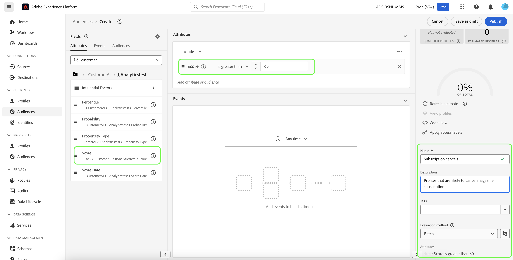

# Creare segmenti di clienti con punteggi previsti

Al termine di un’esecuzione di previsione, i punteggi di propensione previsti vengono utilizzati automaticamente dai profili. L’arricchimento dei profili con i punteggi di IA per l’analisi dei clienti consente di creare segmenti di clienti per trovare tipi di pubblico in base ai loro punteggi di tendenza. Questa sezione descrive i passaggi da seguire per creare segmenti con il Generatore di segmenti. Per un&#39;esercitazione più efficace sulla creazione dei segmenti, consulta la [guida utente di Segment Builder](../../../segmentation/ui/segment-builder.md).

>[!IMPORTANT]
>
>Per utilizzare questo metodo, è necessario abilitare Real-Time Customer Profile per il set di dati.

Nell&#39;interfaccia utente di Platform, fare clic su **[!UICONTROL Segmenti]** nell&#39;area di navigazione a sinistra, quindi fare clic su **[!UICONTROL Crea segmento]**.

Viene visualizzato il **Generatore di segmenti**. Dalla colonna sinistra **[!UICONTROL Campi]** e nella scheda **[!UICONTROL Attributi]**, fai clic sulla cartella denominata **[!UICONTROL Profilo individuale XDM]**, quindi fai clic sulla cartella con lo spazio dei nomi della tua organizzazione. La cartella denominata **[!UICONTROL IA per l&#39;analisi dei clienti]** contiene i risultati delle esecuzioni delle previsioni e prende il nome dall&#39;istanza a cui appartengono i punteggi. Fai clic su una cartella di istanze per accedere ai risultati dell’istanza desiderata.

Situato al centro del Generatore di segmenti, trascina l&#39;attributo **[!UICONTROL Punteggio]** nell&#39;area di lavoro del *generatore di regole* per definire una regola.

Nella colonna *Proprietà segmento* a destra, specifica un nome per il segmento.

Sopra la colonna *Fields* a sinistra, fai clic sull&#39;icona **gear** e seleziona un *criterio di unione* dal menu a discesa. Fai clic su **[!UICONTROL Salva]** per creare il segmento.

## Passaggi successivi

Seguendo questa esercitazione, hai trovato correttamente i tipi di pubblico in base ai loro punteggi di tendenza utilizzando il Generatore di segmenti. Ora puoi indirizzare il pubblico attivandolo nelle destinazioni. Per ulteriori informazioni, consulta la [panoramica delle destinazioni](../../../destinations/home.md).
