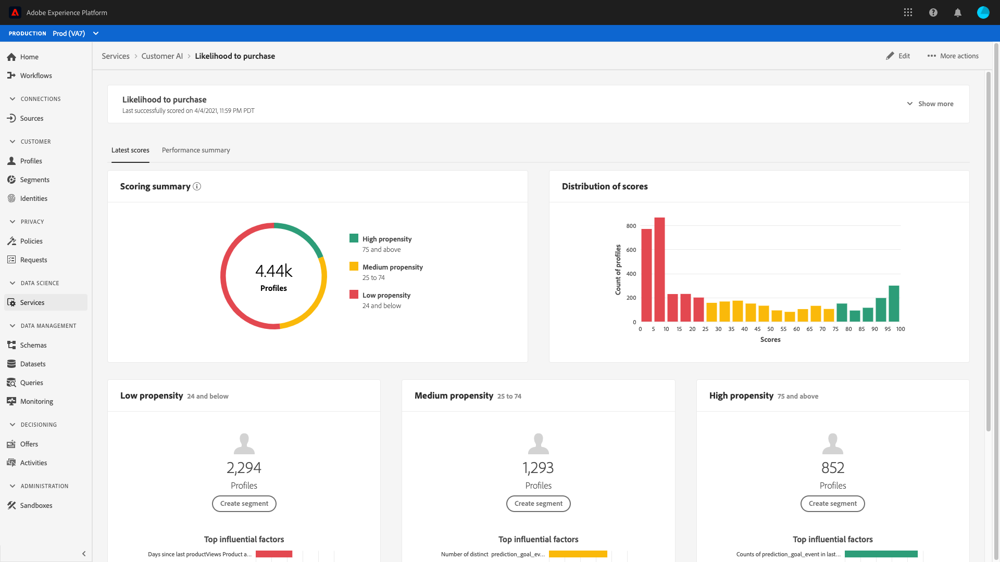

# Scopri informazioni con Customer AI

IA per l’analisi dei clienti, parte di Intelligent Services offre agli esperti di marketing la possibilità di sfruttare Adobe Sensei per anticipare l’azione futura dei clienti. Customer AI viene utilizzato per generare punteggi di propensione personalizzati, come abbandono e conversione per singoli profili su grande scala. Ciò avviene senza dover trasformare le esigenze aziendali in un problema di machine learning, scegliendo un algoritmo, una formazione o una distribuzione.

Questo documento funge da guida per l’interazione con le informazioni approfondite sull’istanza del servizio nell’interfaccia utente di IA per l’analisi dei clienti di Intelligent Services.

## Introduzione

Per utilizzare le informazioni per IA per l’analisi dei clienti, è necessario disporre di un’istanza del servizio con uno stato di esecuzione corretto. Per creare una nuova istanza del servizio, visita [Configurazione di un&#39;istanza di IA per l&#39;analisi dei clienti](./configure.md). Se di recente è stata creata un’istanza del servizio per la quale si sta ancora eseguendo l’apprendimento e il punteggio, attendi 24 ore per il completamento dell’esecuzione.

## Panoramica dell’istanza del servizio

Nell&#39;interfaccia utente di [!DNL Adobe Experience Platform], selezionare **[!UICONTROL Servizi]** nell&#39;area di navigazione a sinistra. Verrà visualizzato il browser *Servizi* in cui sono visualizzati i servizi intelligenti disponibili. Nel contenitore di IA per l&#39;analisi dei clienti, seleziona **[!UICONTROL Apri]**.

Viene visualizzata la pagina del servizio Customer AI. In questa pagina vengono elencate le istanze del servizio di IA per l’analisi dei clienti e vengono visualizzate informazioni su di esse, tra cui il nome dell’istanza, il tipo di propensione, la frequenza di esecuzione dell’istanza e lo stato dell’ultimo aggiornamento.

>[!NOTE]
>
>Solo le istanze del servizio che hanno completato le esecuzioni con punteggio di successo dispongono di approfondimenti.

Seleziona un nome di istanza del servizio per iniziare.

Viene quindi visualizzata la pagina Approfondimenti per l&#39;istanza del servizio con l&#39;opzione di selezionare **[!UICONTROL Punteggi più recenti]** o **[!UICONTROL Riepilogo prestazioni]**. La scheda predefinita **[!UICONTROL Ultimi punteggi]** fornisce visualizzazioni dei dati. Le visualizzazioni e ciò che puoi fare con i dati sono spiegati più dettagliatamente in questa guida.

La scheda **[!UICONTROL Riepilogo prestazioni]** mostra i tassi di abbandono o di conversione effettivi per ogni bucket di propensione. Per ulteriori informazioni, consulta la sezione sulle [metriche di riepilogo delle prestazioni](#performance-metrics).

## Dettagli dell’istanza del servizio

Esistono due modi per visualizzare i dettagli dell’istanza del servizio: dal dashboard o all’interno dell’istanza del servizio.

### Dashboard istanza servizio

Per visualizzare una panoramica dei dettagli dell&#39;istanza del servizio all&#39;interno del dashboard, selezionare un contenitore dell&#39;istanza del servizio, evitando il collegamento ipertestuale associato al nome. Si apre una barra a destra che fornisce ulteriori dettagli. I controlli contengono quanto segue:

- **[!UICONTROL Modifica]**: la selezione di **[!UICONTROL Modifica]** consente di modificare un&#39;istanza del servizio esistente. Puoi modificare il nome, la descrizione e la frequenza di punteggio dell’istanza.
- **[!UICONTROL Clone]**: se si seleziona **[!UICONTROL Clone]**, viene copiata la configurazione dell&#39;istanza del servizio attualmente selezionata. Puoi quindi modificare il flusso di lavoro per apportare modifiche minori e rinominarlo come nuova istanza.
- **[!UICONTROL Elimina]**: è possibile eliminare un&#39;istanza del servizio, incluse eventuali esecuzioni storiche.
- **[!UICONTROL Origine dati]**: collegamento al set di dati utilizzato da questa istanza.
- **[!UICONTROL Frequenza di esecuzione]**: la frequenza con cui viene eseguito un punteggio e quando.
- **[!UICONTROL Definizione punteggio]**: panoramica rapida dell&#39;obiettivo configurato per questa istanza.

>[!NOTE]
>
>Se l’esecuzione di un punteggio non riesce, viene visualizzato un messaggio di errore. Il messaggio di errore è elencato in **Dettagli ultima esecuzione** nella barra a destra, visibile solo per le esecuzioni non riuscite.

### Mostra più informazioni a discesa

Il secondo modo per visualizzare ulteriori dettagli per un’istanza del servizio si trova all’interno della pagina Approfondimenti. Seleziona **[!UICONTROL Mostra altro]** in alto a destra per popolare un elenco a discesa. Vengono elencati dettagli quali la definizione del punteggio, quando è stata creata, il tipo di propensione e i set di dati utilizzati. Per ulteriori informazioni su una delle proprietà elencate, visita [Configurazione di un&#39;istanza di IA per l&#39;analisi dei clienti](./configure.md).

### Popover di anteprima del set di dati di IA per l’analisi dei clienti

Se IA per l&#39;analisi dei clienti utilizza più set di dati, viene fornito un collegamento ipertestuale con etichetta **[!UICONTROL Multipli]** seguito dal numero di set di dati tra parentesi quadre `()`.

Selezionando il collegamento più set di dati si apre il popover di anteprima del set di dati di IA per l’analisi dei clienti. Ogni colore nell’anteprima rappresenta un set di dati come mostrato dalla chiave colore a sinistra delle colonne del set di dati. In questo esempio, è possibile vedere che solo il **Set di dati 1** contiene la colonna `PROP1`.

### Modificare un’istanza

Per modificare un&#39;istanza, seleziona **[!UICONTROL Modifica]** nell&#39;area di navigazione in alto a destra.

Viene visualizzata la finestra di dialogo di modifica, che consente di modificare il nome, la descrizione, lo stato e la frequenza di punteggio dell’istanza. Per confermare le modifiche e chiudere la finestra di dialogo, seleziona **[!UICONTROL Salva]** nell&#39;angolo in basso a destra.

### Altre azioni

Il pulsante **[!UICONTROL Altre azioni]** si trova nella navigazione in alto a destra accanto a **[!UICONTROL Modifica]**. Selezionando **[!UICONTROL Altre azioni]** si apre un menu a discesa che consente di selezionare una delle seguenti operazioni:

- **[!UICONTROL Clone]**: se si seleziona **[!UICONTROL Clone]**, l&#39;istanza del servizio verrà impostata come copia. Puoi quindi modificare il flusso di lavoro per apportare modifiche minori e rinominarlo come nuova istanza.
- **[!UICONTROL Elimina]**: elimina l&#39;istanza.
- **[!UICONTROL Punteggi di accesso]**: selezionando **[!UICONTROL Punteggi di accesso]** viene aperta una finestra di dialogo che fornisce un collegamento ai [punteggi di download per l&#39;esercitazione di IA per l&#39;analisi dei clienti](./download-scores.md). La finestra di dialogo fornisce inoltre l&#39;ID del set di dati necessario per effettuare chiamate API.
- **[!UICONTROL Visualizza cronologia esecuzioni]**: viene visualizzata una finestra di dialogo contenente un elenco di tutte le esecuzioni di punteggio associate all&#39;istanza del servizio.

## Riepilogo punteggio {#scoring-summary}

Il riepilogo del punteggio mostra il numero totale di profili con punteggio e li classifica in contenitori contenenti propensione alta, media e bassa. I bucket di propensione sono determinati in base all’intervallo di punteggio, il valore basso è inferiore a 24, il valore medio è compreso tra 25 e 74 e il valore alto è superiore a 74. Ogni bucket ha un colore corrispondente alla legenda.

>[!NOTE]
>
>Se si tratta di un punteggio di propensione alla conversione, i punteggi alti vengono visualizzati in verde e i punteggi bassi in rosso. Se prevedi una propensione all’abbandono, questo viene capovolto, i punteggi alti sono in rosso e i punteggi bassi in verde. Il bucket medio rimane giallo indipendentemente dal tipo di propensione scelto.

Puoi passare il cursore del mouse su qualsiasi colore dell’anello per visualizzare informazioni aggiuntive, ad esempio la percentuale e il numero totale di profili appartenenti a un bucket.

## Distribuzione dei punteggi

La scheda **[!UICONTROL Distribuzione dei punteggi]** fornisce un riepilogo visivo della popolazione in base al punteggio. I colori visualizzati nella scheda [!UICONTROL Distribuzione dei punteggi] rappresentano il tipo di punteggio tendenza generato. Passando il puntatore del mouse su una delle distribuzioni di punteggio, viene visualizzato il conteggio esatto che appartiene a tale distribuzione.

## Fattori di influenza

Per ogni bucket di punteggio, viene generata una scheda che mostra i primi 10 fattori influenti per tale bucket. I fattori influenti forniscono ulteriori dettagli sul motivo per cui i clienti appartengono a vari bucket di punteggio.

### Espansioni dei fattori di influenza

Passando il puntatore del mouse su uno qualsiasi dei principali fattori influenti i dati vengono ulteriormente suddivisi. Viene fornita una panoramica del motivo per cui alcuni profili appartengono a un bucket di propensione. A seconda del fattore, è possibile che vengano forniti valori numerici, categorici o booleani. L’esempio seguente visualizza i valori categorici per regione.

Inoltre, utilizzando i drill-down, puoi confrontare un fattore di distribuzione se si verifica in due o più bucket di propensione e creare segmenti più specifici con questi valori. L’esempio seguente illustra il primo caso d’uso:

Puoi notare che i profili con bassa propensione alla conversione hanno meno probabilità di aver effettuato una visita recente alle pagine web adobe.com. Il fattore &quot;Giorni dall’ultima visita web&quot; ha una copertura solo dell’8% rispetto al 26% nei profili a media propensione. Utilizzando questi numeri, puoi confrontare la distribuzione del fattore all’interno di ciascun bucket. Queste informazioni possono essere utilizzate per dedurre che l’attualità in webvisit non è influente tanto nel bucket di bassa propensione quanto nel bucket di media propensione.

### Crea un segmento

Se si seleziona il pulsante **[!UICONTROL Crea segmento]** in uno qualsiasi dei bucket per la propensione bassa, media e alta, viene reindirizzato al generatore di segmenti.

>[!NOTE]
>
>Il pulsante **[!UICONTROL Crea segmento]** è disponibile solo se Real-Time Customer Profile è abilitato per il set di dati. Per ulteriori informazioni su come abilitare Real-Time Customer Profile, visitare la [Panoramica del profilo cliente in tempo reale](../../../rtcdp/overview.md).

Il generatore di segmenti viene utilizzato per definire un segmento. Quando si seleziona **[!UICONTROL Crea segmento]** dalla pagina Approfondimenti, IA per l&#39;analisi dei clienti aggiunge automaticamente le informazioni sui bucket selezionati al segmento. Per completare la creazione del segmento, compila i contenitori **Nome** e **Descrizione** che si trovano nella barra a destra dell&#39;interfaccia utente del Generatore di segmenti. Dopo aver assegnato un nome e una descrizione al segmento, seleziona **[!UICONTROL Salva]** in alto a destra.

>[!NOTE]
>
>Poiché i punteggi di tendenza vengono scritti nel singolo profilo, sono disponibili nel Generatore di segmenti come qualsiasi altro attributo di profilo. Quando passi al Generatore di segmenti per creare nuovi segmenti, puoi visualizzare tutti i vari punteggi di tendenza nello spazio dei nomi IA per l’analisi dei clienti.

Per visualizzare il nuovo segmento nell&#39;interfaccia utente di Platform, seleziona **[!UICONTROL Segmenti]** nell&#39;area di navigazione a sinistra. Viene visualizzata la pagina **[!UICONTROL Sfoglia]** in cui sono visualizzati tutti i segmenti disponibili.

## Prestazioni storiche {#historical-performance}

La scheda **[!UICONTROL Riepilogo prestazioni]** mostra i tassi di abbandono o di conversione effettivi, separati in ciascuno dei bucket di propensione valutati da IA per l&#39;analisi dei clienti.

Inizialmente vengono visualizzate solo le tariffe previste (linee tratteggiate). Le percentuali previste vengono visualizzate quando non si è verificata un’esecuzione di punteggio e i dati non sono ancora disponibili. Tuttavia, una volta superata una finestra di risultati, il tasso previsto viene sostituito con un tasso effettivo (linea continua).

Passando il puntatore del mouse sulle righe vengono visualizzati la data e il tasso effettivo/previsto per quel giorno in quel periodo fisso.

Puoi filtrare l’intervallo di tempo per la frequenza prevista ed effettiva visualizzata. Seleziona l&#39;**icona calendario** quindi seleziona un nuovo intervallo di date. I risultati in ciascun bucket vengono aggiornati per essere visualizzati entro il nuovo intervallo di date.

### Percentuali di esecuzione del punteggio individuale

Nella parte inferiore della scheda **[!UICONTROL Riepilogo prestazioni]** vengono visualizzati i risultati per ogni singola esecuzione di punteggio. Seleziona la data a discesa in alto a destra per visualizzare i risultati per un’esecuzione di punteggio diversa.

A seconda che si preveda l&#39;abbandono o la conversione, il grafico [!UICONTROL Distribuzione dei punteggi] visualizza la distribuzione dei profili abbandonati/convertiti e non abbandonati/non convertiti in ogni incremento.

## Valutazione del modello {#model-evaluation}

Oltre a tenere traccia nel tempo dei risultati previsti ed effettivi nella scheda Prestazioni storiche, gli addetti al marketing dispongono di una maggiore trasparenza sulla qualità del modello nella scheda Valutazione modello. È possibile utilizzare i grafici Incremento e Guadagno per determinare le differenze nell&#39;utilizzo di un modello predittivo rispetto al targeting casuale. Inoltre, è in grado di determinare quanti risultati positivi verrebbero acquisiti a ogni cut-off di punteggio. Ciò è utile per la segmentazione e per allineare il ritorno sull’investimento con le azioni di marketing.

### Grafico lift

Il grafico lift misura il miglioramento nell’utilizzo di un modello predittivo invece del targeting casuale.

Gli indicatori dei modelli di alta qualità includono:

- Valori elevati di incremento nei primi decili. Ciò significa che il modello è in grado di identificare gli utenti con la maggiore propensione a intraprendere l’azione di interesse.
- Valori di incremento decrescenti. Ciò significa che i clienti con punteggi più alti hanno più probabilità di intraprendere l’azione di interesse rispetto alle persone con punteggi più bassi.

### Grafico dei guadagni

Il grafico dei guadagni cumulativi misura la percentuale di risultati positivi rilevati con punteggi al di sopra di una certa soglia. Dopo aver ordinato i clienti in base al punteggio di tendenza da alto a basso, la popolazione è divisa in decili - 10 gruppi di uguali dimensioni. Un modello perfetto catturerebbe tutti i risultati positivi nei decili con il punteggio più alto. Un metodo di targeting casuale di base acquisisce risultati positivi in proporzione alle dimensioni del gruppo: il targeting del 30% degli utenti catturerebbe il 30% dei risultati.

Gli indicatori dei modelli di alta qualità includono:

- I guadagni cumulativi si avvicinano rapidamente al 100%.
- La curva dei guadagni cumulativi per il modello è più vicina all&#39;angolo superiore sinistro del grafico.
- Il grafico dei guadagni cumulativi può essere utilizzato per determinare i limiti di punteggio per la segmentazione e il targeting. Ad esempio, se il modello acquisisce il 70% dei risultati positivi nei primi 2 decili di punteggio, il targeting degli utenti con PercentileScore > 80 dovrebbe acquisire circa il 70% dei risultati positivi.

### AUC (area sotto la curva)

L’AUC riflette la forza della relazione tra la classificazione per punteggio e il verificarsi dell’obiettivo previsto. Un **AUC** di 0,5 significa che il modello non è migliore di una stima casuale. Un **AUC** di 1 significa che il modello è in grado di prevedere perfettamente chi intraprenderà l&#39;azione pertinente.

## Passaggi successivi

Questo documento illustra le informazioni fornite da un’istanza del servizio Customer AI. Ora puoi continuare a seguire l&#39;esercitazione su [download di punteggi in IA per l&#39;analisi dei clienti](./download-scores.md) o sfogliare le altre [guide di Adobe Intelligent Services](../../home.md) offerte.

## Risorse aggiuntive

Il video seguente illustra come utilizzare IA per l’analisi dei clienti per visualizzare l’output dei modelli e dei fattori influenti.

>[!VIDEO](https://video.tv.adobe.com/v/32666?learn=on&quality=12)
