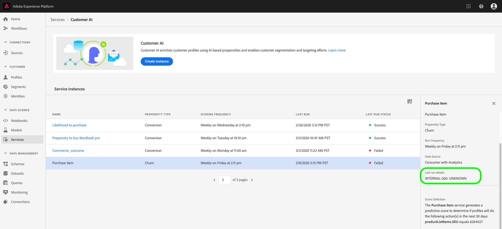

# Scopri informazioni approfondite con Customer AI

Customer AI, come parte di Intelligent Services, fornisce agli addetti al marketing il potere di sfruttare Adobe Sensei per anticipare quali saranno le prossime azioni dei clienti. Customer AI viene utilizzato per generare punteggi di propensione personalizzati, come abbandono e conversione per singoli profili su grande scala. Ciò viene realizzato senza dover trasformare le esigenze aziendali in un problema di apprendimento automatico, scegliendo un algoritmo, una formazione o un&#39;implementazione.

Questo documento funge da guida per interagire con le informazioni sulle istanze del servizio nell’interfaccia utente di Intelligent Services Customer AI.

## Introduzione

Per utilizzare le informazioni per Customer AI, è necessario disporre di un’istanza di servizio con uno stato di esecuzione riuscito. Per creare una nuova istanza di servizio visita [Configurazione di un’istanza di Customer AI](./configure.md). Se hai creato di recente un&#39;istanza di servizio ed è ancora in fase di formazione e valutazione, ti preghiamo di consentire 24 ore per il completamento dell&#39;esecuzione.

## Panoramica dell&#39;istanza del servizio

In [!DNL Adobe Experience Platform] Interfaccia utente, seleziona **[!UICONTROL Servizi]** nella navigazione a sinistra. La *Servizi* viene visualizzato il browser e viene visualizzato Intelligent Services disponibile. Nel contenitore per Customer AI, seleziona **[!UICONTROL Apri]**.

Viene visualizzata la pagina del servizio Customer AI. In questa pagina sono elencate le istanze di servizio di Customer AI e vengono visualizzate informazioni su di esse, tra cui il nome dell’istanza, il tipo di propensione, la frequenza di esecuzione dell’istanza e lo stato dell’ultimo aggiornamento.

>[!NOTE]
>
>Solo le istanze del servizio che hanno completato con successo le esecuzioni con punteggio dispongono di informazioni approfondite.

Seleziona un nome di istanza del servizio da iniziare.

Viene quindi visualizzata la pagina delle informazioni per l’istanza del servizio con l’opzione di selezione **[!UICONTROL Punteggi più recenti]** o **[!UICONTROL Riepilogo delle prestazioni]**. Scheda predefinita **[!UICONTROL Punteggi più recenti]** fornisce visualizzazioni dei tuoi dati. Le visualizzazioni e le operazioni che puoi eseguire con i dati sono descritte più dettagliatamente in questa guida.

La **[!UICONTROL Riepilogo delle prestazioni]** mostra i tassi di abbandono o di conversione effettivi per ogni intervallo di propensione. Per ulteriori informazioni, consulta la sezione su [metriche di riepilogo delle prestazioni](#performance-metrics).

## Dettagli istanza servizio

Esistono due modi per visualizzare i dettagli dell’istanza del servizio: dal dashboard o all&#39;interno dell&#39;istanza del servizio.

### Dashboard delle istanze del servizio

Per visualizzare una panoramica dei dettagli dell&#39;istanza del servizio all&#39;interno del dashboard, selezionare un contenitore di istanza del servizio, evitando il collegamento ipertestuale associato al nome. Viene visualizzata la barra a destra con ulteriori dettagli. I controlli contengono i seguenti elementi:

- **[!UICONTROL Modifica]**: Selezione **[!UICONTROL Modifica]** consente di modificare un’istanza di servizio esistente. Puoi modificare il nome, la descrizione e la frequenza di punteggio dell’istanza.
- **[!UICONTROL Clona]**: Selezione **[!UICONTROL Clona]** copia l&#39;istanza di servizio attualmente selezionata impostata. Puoi quindi modificare il flusso di lavoro per apportare modifiche minori e rinominarlo come nuova istanza.
- **[!UICONTROL Elimina]**: Puoi eliminare un’istanza di servizio, comprese eventuali esecuzioni cronologiche.
- **[!UICONTROL Origine dati]**: Un collegamento al set di dati utilizzato da questa istanza.
- **[!UICONTROL Esegui frequenza]**: Con quale frequenza e quando si svolge un’esecuzione del punteggio.
- **[!UICONTROL Definizione del punteggio]**: Panoramica rapida dell’obiettivo configurato per questa istanza.

>[!NOTE]
>
>Se un’esecuzione del punteggio non riesce, viene visualizzato un messaggio di errore. Il messaggio di errore è elencato in **Dettagli dell&#39;ultima esecuzione** nella barra a destra, visibile solo per le esecuzioni non riuscite.

### Menu a discesa Mostra più approfondimenti

Il secondo modo per visualizzare dettagli aggiuntivi per un’istanza di servizio si trova nella pagina approfondimenti. Seleziona **[!UICONTROL Mostra altro]** in alto a destra per compilare un elenco a discesa. Sono elencati i dettagli, ad esempio la definizione del punteggio, al momento della creazione, il tipo di propensione e i set di dati utilizzati. Per maggiori informazioni sulle proprietà elencate, visitare [Configurazione di un’istanza di Customer AI](./configure.md).

### Puntatore di anteprima del set di dati di Customer AI

Se Customer AI utilizza più di un set di dati, un collegamento ipertestuale etichettato **[!UICONTROL Multipli]** seguito dal numero di set di dati tra parentesi `()` è fornito.

Selezionando il collegamento per più set di dati si apre il profilo di anteprima del set di dati di Customer AI. Ogni colore nell’anteprima rappresenta un set di dati come mostrato dalla chiave colore a sinistra delle colonne del set di dati. In questo esempio, puoi vedere solo **Set di dati 1** contiene `PROP1` colonna.

### Modificare un’istanza

Per modificare un’istanza, seleziona **[!UICONTROL Modifica]** nella navigazione in alto a destra.

Viene visualizzata la finestra di dialogo di modifica, che consente di modificare il nome, la descrizione, lo stato e la frequenza di punteggio dell’istanza. Per confermare le modifiche e chiudere la finestra di dialogo, seleziona **[!UICONTROL Salva]** nell&#39;angolo in basso a destra.

### Altre azioni

La **[!UICONTROL Altre azioni]** si trova nella navigazione in alto a destra accanto a **[!UICONTROL Modifica]**. Selezione **[!UICONTROL Altre azioni]** apre un menu a discesa che consente di selezionare una delle seguenti operazioni:

- **[!UICONTROL Clona]**: Selezione **[!UICONTROL Clona]** copia la configurazione dell&#39;istanza del servizio. Puoi quindi modificare il flusso di lavoro per apportare modifiche minori e rinominarlo come nuova istanza.
- **[!UICONTROL Elimina]**: Elimina l’istanza.
- **[!UICONTROL Punteggi di accesso]**: Selezione **[!UICONTROL Punteggi di accesso]** apre una finestra di dialogo che fornisce un collegamento al [download dei punteggi per Customer AI](./download-scores.md) tutorial, la finestra di dialogo fornisce anche l’ID set di dati necessario per effettuare chiamate API.
- **[!UICONTROL Visualizza cronologia di esecuzione]**: Viene visualizzata una finestra di dialogo contenente un elenco di tutte le esecuzioni del punteggio associate all’istanza del servizio.

## Riepilogo del punteggio {#scoring-summary}

Riepilogo del punteggio visualizza il numero totale di profili con punteggio e li classifica in blocchi contenenti propensione alta, media e bassa. I periodi fissi di propensione sono determinati in base all’intervallo di punteggio, il valore basso è inferiore a 24, il valore medio è compreso tra 25 e 74 e il valore alto è superiore a 74. Ogni bucket ha un colore corrispondente alla legenda.

>[!NOTE]
>
>Se si tratta di un punteggio di propensione di conversione, i punteggi elevati sono visualizzati in verde e i punteggi bassi in rosso. Se prevedi la propensione di abbandono questo viene capovolto, i punteggi alti sono in rosso e i punteggi bassi sono verdi. Il bucket medio rimane giallo indipendentemente dal tipo di propensione scelto.

Passa il cursore del mouse su un colore dell’anello per visualizzare informazioni aggiuntive, ad esempio una percentuale e un numero totale di profili appartenenti a un bucket.

## Distribuzione dei punteggi

La **[!UICONTROL Distribuzione dei punteggi]** scheda fornisce un riepilogo visivo della popolazione in base al punteggio. I colori visualizzati nella [!UICONTROL Distribuzione dei punteggi] la scheda rappresenta il tipo di punteggio di propensione generato. Passando il puntatore del mouse su una delle distribuzioni di punteggio, viene fornito il conteggio esatto appartenente a tale distribuzione.

## Fattori influenti

Per ogni bucket di punteggio, viene generata una scheda che mostra i primi 10 fattori influenti per tale bucket. I fattori influenti ti forniscono ulteriori dettagli sul motivo per cui i tuoi clienti appartengono a vari periodi fissi di valutazione.

### Perdita di fattori influenti

Passando il puntatore del mouse su uno dei principali fattori influenti, i dati vengono ulteriormente suddivisi. Viene fornita una panoramica del motivo per cui alcuni profili appartengono a un bucket di propensione. A seconda del fattore, è possibile assegnare valori numerici, categorici o booleani. Nell’esempio seguente vengono visualizzati i valori categorici per regione.

Inoltre, utilizzando i drill-down, puoi confrontare un fattore di distribuzione se si verifica in due o più bucket di propensione e creare segmenti più specifici con questi valori. L’esempio seguente illustra il primo caso d’uso:

Puoi notare che i profili con bassa propensione alla conversione hanno meno probabilità di aver effettuato una visita recente alle pagine web adobe.com. Il fattore &quot;Giorni dall’ultima visita web&quot; ha una copertura solo dell’8% rispetto al 26% nei profili di propensione medi. Utilizzando questi numeri, puoi confrontare la distribuzione all’interno di ciascun bucket per il fattore. Queste informazioni possono essere utilizzate per dedurre che la recency nella visita web non è così influente nel bucket di bassa propensione, come è nel secchio di media propensione.

### Crea un segmento

Selezione della **[!UICONTROL Crea segmento]** in uno qualsiasi dei bucket per la propensione bassa, media e alta ti reindirizzerà al generatore di segmenti.

>[!NOTE]
>
>La **[!UICONTROL Crea segmento]** Questo pulsante è disponibile solo se per il set di dati è abilitato Profilo cliente in tempo reale . Per ulteriori informazioni su come abilitare il profilo cliente in tempo reale, visita il [Panoramica del profilo cliente in tempo reale](../../../rtcdp/overview.md).

Il generatore di segmenti viene utilizzato per definire un segmento. Quando si seleziona **[!UICONTROL Crea segmento]** dalla pagina Approfondimenti , Customer AI aggiunge automaticamente al segmento le informazioni sui bucket selezionati. Per completare la creazione del segmento, compila semplicemente il **Nome** e **Descrizione** contenitori situati nella barra a destra dell’interfaccia utente del generatore di segmenti. Dopo aver assegnato un nome e una descrizione al segmento, seleziona **[!UICONTROL Salva]** in alto a destra.

>[!NOTE]
>
>Poiché i punteggi di propensione sono scritti sul singolo profilo, sono disponibili nel Generatore di segmenti come qualsiasi altro attributo di profilo. Quando visiti il Generatore di segmenti per creare nuovi segmenti, puoi visualizzare tutti i vari punteggi di propensione nello spazio dei nomi Customer AI.

Per visualizzare il nuovo segmento nell’interfaccia utente di Platform, seleziona **[!UICONTROL Segmenti]** nella navigazione a sinistra. La **[!UICONTROL Sfoglia]** viene visualizzata la pagina e visualizza tutti i segmenti disponibili.

## Prestazioni storiche {#historical-performance}

La **[!UICONTROL Riepilogo delle prestazioni]** La scheda mostra i tassi di abbandono o di conversione effettivi, separati in ciascuno dei periodi di tolleranza valutati da Customer AI.

Inizialmente vengono visualizzate solo le percentuali previste (linee tratteggiate). Le percentuali previste vengono visualizzate quando non si è verificata un’esecuzione del punteggio e i dati non sono ancora disponibili. Tuttavia, una volta superato un intervallo di risultati, il tasso previsto viene sostituito da un tasso effettivo (linea continua).

Passando il puntatore del mouse sopra le righe viene visualizzata la data e il tasso effettivo/previsto per quel giorno nel periodo fisso.

Puoi filtrare l’intervallo di tempo per la visualizzazione dei tassi previsti ed effettivi. Seleziona la **icona calendario** quindi seleziona un nuovo intervallo di date. I risultati in ciascuno dei bucket vengono aggiornati per essere visualizzati all’interno del nuovo intervallo di date.

### Tassi di esecuzione dei punteggi individuali

La metà inferiore del **[!UICONTROL Riepilogo delle prestazioni]** visualizza i risultati per ogni singola esecuzione del punteggio. Seleziona la data a discesa in alto a destra per visualizzare i risultati di una diversa esecuzione del punteggio.

A seconda di se si prevede l’abbandono o la conversione, l’ [!UICONTROL Distribuzione dei punteggi] Il grafico mostra la distribuzione dei profili generati/convertiti e non eseguiti/non convertiti in ogni incremento.

## Valutazione del modello {#model-evaluation}

Oltre a tenere traccia dei risultati previsti ed effettivi nel tempo nella scheda Prestazioni cronologiche, gli esperti di marketing dispongono di una maggiore trasparenza rispetto alla qualità del modello nella scheda Valutazione modello . È possibile utilizzare i grafici Incremento e Guadagno per determinare le differenze nell’utilizzo di un modello predittivo rispetto al targeting casuale. Inoltre, puoi determinare quanti risultati positivi verrebbero acquisiti a ogni riduzione del punteggio. Questo è utile per la segmentazione e per allineare il ritorno sull’investimento con le azioni di marketing.

### Grafico a comparsa

Il grafico di incremento misura il miglioramento dell’utilizzo di un modello predittivo invece del targeting casuale.

Gli indicatori del modello di alta qualità includono:

- Valori di incremento elevati nei primi decili. Ciò significa che il modello è in grado di identificare gli utenti con la più alta propensione a intraprendere l&#39;azione di interesse.
- Valori di incremento decrescente. Ciò significa che i clienti con punteggi più elevati hanno più probabilità di intraprendere un’azione di interesse rispetto alle persone con punteggi più bassi.

### Grafico a torta

Il grafico dei guadagni cumulativi misura la percentuale di risultati positivi acquisiti dai punteggi di targeting al di sopra di una certa soglia. Dopo aver ordinato i clienti per punteggio di propensione da alto a basso, la popolazione è divisa in decili - 10 gruppi di dimensioni uguali. Un modello perfetto catturerebbe tutti i risultati positivi nei decili con punteggio più alto. Un metodo di targeting casuale di base acquisisce risultati positivi proporzionalmente alle dimensioni del gruppo - il targeting del 30% degli utenti acquisirebbe il 30% dei risultati.

Gli indicatori del modello di alta qualità includono:

- I guadagni cumulativi si avvicinano rapidamente al 100%.
- La curva cumulativa dei guadagni per il modello è più vicina all&#39;angolo superiore sinistro del grafico.
- Il grafico degli incrementi cumulativi può essere utilizzato per determinare i tagli di punteggio per la segmentazione e il targeting. Ad esempio, se il modello acquisisce il 70% dei risultati positivi nei primi 2 decili di punteggio, il targeting degli utenti con PercentileScore > 80 dovrebbe catturare circa il 70% dei risultati positivi.

### AUC (Area sotto la curva)

L’AUC riflette l’intensità della relazione tra la classificazione per punteggio e l’occorrenza dell’obiettivo previsto. Un **AUC** 0,5 significa che il modello non è migliore di una stima casuale. Un **AUC** di 1 significa che il modello può prevedere perfettamente chi intraprenderà l&#39;azione pertinente.

## Passaggi successivi

Questo documento descrive le informazioni fornite da un&#39;istanza del servizio Customer AI. Ora puoi continuare l’esercitazione su [download dei punteggi in Customer AI](./download-scores.md) o navigare nell&#39;altro [Adobe Intelligent Services](../../home.md) guide che vengono offerte.

## Risorse aggiuntive

Il video seguente illustra come utilizzare Customer AI per vedere l’output dei modelli e dei fattori influenti.

>[!VIDEO](https://video.tv.adobe.com/v/32666?learn=on&quality=12)
