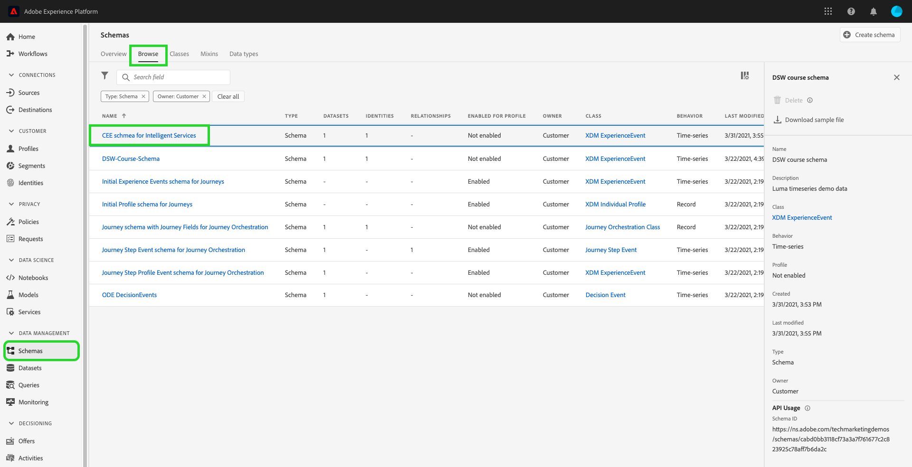
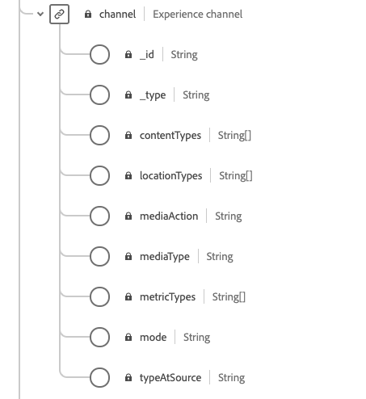

# Prepara i dati per l’utilizzo in [!DNL Intelligent Services]

Per ottenere [!DNL Intelligent Services] per scoprire informazioni approfondite dai dati degli eventi di marketing, i dati devono essere arricchiti semanticamente e mantenuti in una struttura standard. [!DNL Intelligent Services] sfruttare [!DNL Experience Data Model] (XDM). In particolare, tutti i set di dati utilizzati in [!DNL Intelligent Services] deve essere conforme allo schema XDM Consumer ExperienceEvent (CEE) o utilizzare il connettore Adobe Analytics. Inoltre, IA per l’analisi dei clienti supporta il connettore Adobe Audience Manager.

Questo documento fornisce indicazioni generali sulla mappatura dei dati degli eventi di marketing da più canali allo schema CEE, delineando informazioni su campi importanti all’interno dello schema per aiutarti a determinare come mappare in modo efficace i dati alla relativa struttura. Se prevedi di utilizzare i dati di Adobe Analytics, consulta la sezione per [Preparazione dei dati di Adobe Analytics](#analytics-data). Se prevedi di utilizzare i dati di Adobe Audience Manager (solo IA per l’analisi dei clienti), consulta la sezione per [Adobe di preparazione dei dati di Audience Manager](#AAM-data).

## Requisiti dei dati

[!DNL Intelligent Services] richiedono quantità diverse di dati storici a seconda dell’obiettivo creato. Indipendentemente, i dati che prepari per **tutto** [!DNL Intelligent Services] deve includere percorsi/eventi cliente sia positivi che negativi. La presenza di eventi negativi e positivi migliora la precisione e l&#39;accuratezza del modello.

Ad esempio, se utilizzi IA per l’analisi dei clienti per prevedere la propensione all’acquisto di un prodotto, il modello di IA per l’analisi dei clienti richiede sia esempi di percorsi di acquisto riusciti che esempi di percorsi non riusciti. Questo perché durante la formazione sul modello, IA per l’analisi dei clienti cerca di capire quali eventi e percorsi portano a un acquisto. Sono incluse anche le azioni intraprese dai clienti che non hanno effettuato l’acquisto, ad esempio da un utente che ha interrotto il percorso per aggiungere un articolo al carrello. Questi clienti possono mostrare comportamenti simili, tuttavia, IA per l’analisi dei clienti può fornire informazioni approfondite e approfondire le principali differenze e i fattori che portano a un punteggio di propensione più elevato. Allo stesso modo, Attribution AI richiede entrambi i tipi di eventi e percorsi per visualizzare metriche quali l’efficacia dei punti di contatto, i percorsi di conversione principali e i raggruppamenti per posizione dei punti di contatto.

Per ulteriori esempi e informazioni sui requisiti dei dati storici, visita [IA per l’analisi dei clienti](./customer-ai/input-output.md#data-requirements) o [Attribution AI](./attribution-ai/input-output.md#data-requirements) sezione sui requisiti dei dati storici nella documentazione di input/output.

### Linee guida per l’unione dei dati

È consigliabile unire gli eventi di un utente in un ID comune, quando possibile. Ad esempio, potresti avere dati utente con &quot;id1&quot; su 10 eventi. Successivamente, lo stesso utente ha eliminato l’ID cookie e viene registrato come &quot;id2&quot; nei successivi 20 eventi. Se sai che id1 e id2 corrispondono allo stesso utente, la best practice consiste nell’unire tutti e 30 gli eventi con un ID comune.

Se ciò non è possibile, ogni set di eventi deve essere trattato come un utente diverso durante la creazione dei dati di input del modello. Questo garantisce i migliori risultati durante l’apprendimento dei modelli e il punteggio.

## Riepilogo del flusso di lavoro

Il processo di preparazione varia a seconda che i dati siano memorizzati in Adobe Experience Platform o esternamente. In questa sezione vengono riepilogati i passaggi necessari da effettuare, in uno dei due scenari.

### Preparazione dati esterni

Se i dati sono memorizzati al di fuori di Experience Platform, devi mappare i dati ai campi richiesti e rilevanti in una [Schema Consumer ExperienceEvent](#cee-schema). Questo schema può essere potenziato con gruppi di campi personalizzati per acquisire meglio i dati dei clienti. Una volta mappato, puoi creare un set di dati utilizzando lo schema Consumer ExperienceEvent e [Acquisire i dati in Platform](../ingestion/home.md). Il set di dati CEE può quindi essere selezionato durante la configurazione di un [!DNL Intelligent Service].

A seconda della [!DNL Intelligent Service] se lo desideri, potrebbero essere necessari campi diversi. È consigliabile aggiungere dati a un campo se si dispone dei dati disponibili. Per ulteriori informazioni sui campi obbligatori, visita [Attribution AI](./attribution-ai/input-output.md) o [IA per l’analisi dei clienti](./customer-ai/input-output.md) guida di input/output.

### Preparazione dei dati di Adobe Analytics {#analytics-data}

IA per l’analisi dei clienti e Attribution AI supportano in modo nativo i dati di Adobe Analytics. Per utilizzare i dati di Adobe Analytics, segui i passaggi descritti nella documentazione per impostare un’ [Connettore di origine di Analytics](../sources/tutorials/ui/create/adobe-applications/analytics.md).

Una volta che il connettore di origine effettua lo streaming dei dati in Experience Platform, puoi selezionare Adobe Analytics come origine dati seguito da un set di dati durante la configurazione dell’istanza. Tutti i gruppi di campi dello schema e i singoli campi richiesti vengono creati automaticamente durante la configurazione della connessione. Non è necessario effettuare operazioni di ETL (Extract, Transform, Load, cioè Estrai, Trasforma, Carica) dei set di dati nel formato CEE.

Se confronti i dati trasmessi tramite il connettore di origine di Adobe Analytics su Adobe Experience Platform con quelli di Adobe Analytics, potresti notare alcune discrepanze. Il connettore di origine di Analytics potrebbe rilasciare righe durante la trasformazione in uno schema Experience Data Model (XDM). Ci possono essere diversi motivi per cui l’intera riga non è adatta alla trasformazione, tra cui marche temporali mancanti, ID persona mancanti, ID persona non validi o grandi, valori analitici non validi e altro ancora.

Per ulteriori informazioni ed esempi, consulta la documentazione di [confronto dei dati di Adobe Analytics e del Customer Journey Analytics](https://www.adobe.com/go/compare-aa-data-to-cja-data). Questo articolo è progettato per aiutarti a diagnosticare e risolvere tali differenze in modo che tu e il tuo team possiate utilizzare i dati di Adobe Experience Platform per Intelligent Services senza problemi di integrità dei dati.

In Adobe Experience Platform Query Services, esegui i seguenti record totali tra le marche temporali di inizio e fine per query channel.typeAtSource per trovare il conteggio per canali di marketing.

```SELECT channel.typeAtSource as typeAtSource,
       Count(_id) AS Records 
FROM  df_hotel
WHERE timestamp>=from_utc_timestamp('2021-05-15','UTC')
        AND timestamp<from_utc_timestamp('2022-01-10','UTC')
        AND timestamp IS NOT NULL
        AND enduserids._experience.aaid.id IS NOT NULL
GROUP BY channel.typeAtSource
```

>[!IMPORTANT]
>
>Il connettore Adobe Analytics impiega fino a quattro settimane per eseguire la retrocompilazione dei dati. Se hai impostato di recente una connessione, verifica che il set di dati abbia la lunghezza minima dei dati richiesta per il cliente o l’Attribution AI. Consulta le sezioni relative ai dati storici in [IA per l’analisi dei clienti](./customer-ai/input-output.md#data-requirements) o [Attribution AI](./attribution-ai/input-output.md#data-requirements), e verificare di disporre di dati sufficienti per l’obiettivo di previsione.

### Preparazione dei dati di Adobe Audience Manager (solo IA per l’analisi dei clienti) {#AAM-data}

IA per l’analisi dei clienti supporta in modo nativo i dati di Adobe Audience Manager. Per utilizzare i dati di Audience Manager, segui i passaggi descritti nella documentazione per impostare un [Connettore sorgente in Audience Manager](../sources/tutorials/ui/create/adobe-applications/audience-manager.md).

Una volta che il connettore di origine effettua lo streaming dei dati in Experience Platform, puoi selezionare Adobe Audience Manager come origine dati seguito da un set di dati durante la configurazione di Customer AI. Tutti i gruppi di campi dello schema e i singoli campi vengono creati automaticamente durante la configurazione della connessione. Non è necessario effettuare operazioni di ETL (Extract, Transform, Load, cioè Estrai, Trasforma, Carica) dei set di dati nel formato CEE.

>[!IMPORTANT]
>
>Se hai impostato di recente un connettore, verifica che il set di dati abbia la lunghezza minima di dati richiesta. Consulta la sezione dei dati storici nella sezione [documentazione di input/output](./customer-ai/input-output.md) per IA per l’analisi dei clienti e verifica di disporre di dati sufficienti per l’obiettivo predittivo.

### [!DNL Experience Platform] preparazione dei dati

Se i dati sono già memorizzati in [!DNL Platform] e non in streaming tramite i connettori sorgente Adobe Analytics o Adobe Audience Manager (solo IA per l’analisi dei clienti), segui i passaggi seguenti. È comunque consigliabile comprendere lo schema CEE.

1. Rivedi la struttura del [Schema Consumer ExperienceEvent](#cee-schema) e determinare se i dati possono essere mappati ai relativi campi.
2. Contatta Adobe Consulting Services per aiutarti a mappare i dati sullo schema e ad acquisirli in [!DNL Intelligent Services], o [segui i passaggi descritti in questa guida](#mapping) se desideri mappare i dati da solo.

## Informazioni sullo schema CEE {#cee-schema}

Lo schema Consumer ExperienceEvent descrive il comportamento di un individuo in relazione a eventi di marketing digitale (web o mobile) e ad attività di e-commerce online o offline. L’utilizzo di questo schema è necessario per [!DNL Intelligent Services] a causa dei campi (colonne) semanticamente ben definiti, evitando nomi sconosciuti che altrimenti renderebbero i dati meno chiari.

Lo schema CEE, come tutti gli schemi ExperienceEvent XDM, acquisisce lo stato del sistema basato su serie temporali quando si è verificato un evento (o un set di eventi), compreso il momento e l’identità del soggetto interessato. Gli Eventi di esperienza sono registri di ciò che è accaduto, e quindi non sono modificabili e rappresentano ciò che è accaduto senza aggregazione o interpretazione.

[!DNL Intelligent Services] utilizza diversi campi chiave all’interno di questo schema per generare informazioni dai dati degli eventi di marketing, che possono essere trovati a livello principale ed espansi per mostrare i relativi sottocampi richiesti.


Come tutti gli schemi XDM, il gruppo di campi dello schema CEE è estensibile. In altre parole, è possibile aggiungere campi aggiuntivi al gruppo di campi CEE e, se necessario, è possibile includere varianti diverse in più schemi.

Un esempio completo del gruppo di campi è disponibile nella sezione [archivio XDM pubblico](https://github.com/adobe/xdm/blob/797cf4930d5a80799a095256302675b1362c9a15/docs/reference/context/experienceevent-consumer.schema.md). Inoltre, puoi visualizzare e copiare quanto segue: [File JSON](https://github.com/AdobeDocs/experience-platform.en/blob/master/help/intelligent-services/assets/CEE_XDM_sample_rows.json) un esempio di come strutturare i dati in modo che siano conformi allo schema CEE. Per informazioni sui campi chiave descritti nella sezione seguente e su come mappare i propri dati sullo schema, consulta entrambi gli esempi.

## Campi chiave

All&#39;interno del gruppo di campi CEE è necessario utilizzare diversi campi chiave per [!DNL Intelligent Services] per generare informazioni utili. Questa sezione descrive il caso d’uso e i dati previsti per questi campi e fornisce i collegamenti alla documentazione di riferimento per ulteriori esempi.

### Campi obbligatori

Sebbene l’utilizzo di tutti i campi chiave sia vivamente consigliato, esistono due campi che sono **obbligatorio** affinché [!DNL Intelligent Services] per lavorare:

* [Un campo di identità principale](#identity)
* [xdm:timestamp](#timestamp)
* [xdm:channel](#channel) (obbligatorio solo per le Attribution AI)

#### Identità primaria {#identity}

Uno dei campi nello schema deve essere impostato come campo di identità principale, che consente [!DNL Intelligent Services] per collegare ogni istanza di dati di serie temporali a una singola persona.

Devi determinare il campo migliore da utilizzare come identità primaria in base all’origine e alla natura dei dati. Un campo di identità deve includere **spazio dei nomi delle identità** che indica il tipo di dati di identità previsti dal campo come valore. Alcuni valori validi dello spazio dei nomi includono:

>[!NOTE]
>
>L’ID Experience Cloud (ECID) è noto anche come MCID e continua a essere utilizzato nei namespace.

* &quot;e-mail&quot;
* &quot;phone&quot;
* &quot;mcid&quot; (per Adobe Audience Manager ID)
* &quot;aaid&quot; (per Adobe Analytics ID)

Se non sei sicuro del campo da utilizzare come identità principale, contatta Adobe Consulting Services per determinare la soluzione migliore. Se non è impostata un’identità primaria, l’applicazione Intelligent Service utilizza il seguente comportamento predefinito:

| Impostazione predefinita | IA per l’attribuzione | IA per l’analisi dei clienti |
| --- | --- | --- |
| Colonna identità | `endUserIDs._experience.aaid.id` | `endUserIDs._experience.mcid.id` |
| Namespace | AAID | ECID |

Per impostare un’identità primaria, accedi allo schema dalla pagina **[!UICONTROL Schemi]** e selezionare il collegamento ipertestuale nome schema per aprire **[!DNL Schema Editor]**.



Quindi, passa al campo che desideri impostare come identità principale e selezionalo. Il **[!UICONTROL Proprietà campo]** viene visualizzato un menu per tale campo.


In **[!UICONTROL Proprietà campo]** , scorri verso il basso fino a trovare il **[!UICONTROL Identità]** casella di controllo. Dopo aver selezionato la casella, l’opzione per impostare l’identità selezionata come **[!UICONTROL Identità primaria]** viene visualizzato. Seleziona anche questa casella.


Quindi, devi fornire un **[!UICONTROL Spazio dei nomi dell’identità]** dall’elenco degli spazi dei nomi predefiniti nel menu a discesa. In questo esempio, lo spazio dei nomi ECID è selezionato da quando è stato impostato un ID Adobe Audience Manager `mcid.id` è in uso. Seleziona **[!UICONTROL Applica]** per confermare gli aggiornamenti, seleziona **[!UICONTROL Salva]** nell’angolo in alto a destra per salvare le modifiche apportate allo schema.


#### xdm:timestamp {#timestamp}

Questo campo rappresenta il datetime in cui si è verificato l&#39;evento. Questo valore deve essere fornito come stringa, in base allo standard ISO 8601.

#### xdm:channel {#channel}

>[!NOTE]
>
>Questo campo è obbligatorio solo quando si utilizzano Attribution AI.

Questo campo rappresenta il canale di marketing relativo all’ExperienceEvent. Il campo include informazioni sul tipo di canale, il tipo di supporto e il tipo di posizione.



**Schema di esempio**

```json
{
  "@id": "https://ns.adobe.com/xdm/channels/facebook-feed",
  "@type": "https://ns.adobe.com/xdm/channel-types/social",
  "xdm:mediaType": "earned",
  "xdm:mediaAction": "clicks"
}
```

Per informazioni complete su ciascuno dei sottocampi obbligatori per `xdm:channel`, fare riferimento al [schema del canale esperienza](https://github.com/adobe/xdm/blob/797cf4930d5a80799a095256302675b1362c9a15/docs/reference/channels/channel.schema.md) specifiche Per alcuni esempi di mappature, vedi [tabella seguente](#example-channels).

#### Esempi di mappature dei canali {#example-channels}

Nella tabella seguente sono riportati alcuni esempi di canali di marketing mappati su `xdm:channel` schema:

| Channel | `@type` | `mediaType` | `mediaAction` |
| --- | --- | --- | --- |
| Ricerca pagata | https:/<span>/ns.adobe.com/xdm/channel-types/search | pagato | clic |
| Social - Marketing | https:/<span>/ns.adobe.com/xdm/channel-types/social | guadagnato | clic |
| Visualizzazione | https:/<span>/ns.adobe.com/xdm/channel-types/display | pagato | clic |
| E-mail | https:/<span>/ns.adobe.com/xdm/channel-types/email | pagato | clic |
| Referente interno | https:/<span>/ns.adobe.com/xdm/channel-types/direct | di proprietà | clic |
| Visualizza viewThrough | https:/<span>/ns.adobe.com/xdm/channel-types/display | pagato | impressioni |
| Reindirizzamento codice QR | https:/<span>/ns.adobe.com/xdm/channel-types/direct | di proprietà | clic |
| Dispositivi mobili | https:/<span>/ns.adobe.com/xdm/channel-types/mobile | di proprietà | clic |

### Campi consigliati

I restanti campi chiave sono descritti in questa sezione. Anche se questi campi non sono necessariamente necessari per [!DNL Intelligent Services] per lavorare, si consiglia vivamente di utilizzarne il maggior numero possibile per ottenere informazioni più approfondite.

#### xdm:productListItems

Questo campo è un array di articoli che rappresentano i prodotti selezionati da un cliente, inclusi SKU prodotto, nome, prezzo e quantità.


**Schema di esempio**

```json
[
  {
    "xdm:SKU": "1002352692",
    "xdm:name": "24-Watt 8-Light Chrome Integrated LED Bath Light",
    "xdm:currencyCode": "USD",
    "xdm:quantity": 1,
    "xdm:priceTotal": 159.45
  },
  {
    "xdm:SKU": "3398033623",
    "xdm:name": "16ft RGB LED Strips",
    "xdm:currencyCode": "USD",
    "xdm:quantity": 1,
    "xdm:priceTotal": 79.99
  }
]
```

Per informazioni complete su ciascuno dei sottocampi obbligatori per `xdm:productListItems`, fare riferimento al [schema dei dettagli di commerce](https://github.com/adobe/xdm/blob/797cf4930d5a80799a095256302675b1362c9a15/docs/reference/context/experienceevent-commerce.schema.md) specifiche

#### xdm:commerce

Questo campo contiene informazioni specifiche di Commerce su ExperienceEvent, tra cui il numero dell’ordine di acquisto e le informazioni sul pagamento.


**Schema di esempio**

```json
{
    "xdm:order": {
      "xdm:purchaseID": "a8g784hjq1mnp3",
      "xdm:purchaseOrderNumber": "123456",
      "xdm:payments": [
        {
          "xdm:transactionID": "transactid-a111",
          "xdm:paymentAmount": 59,
          "xdm:paymentType": "credit_card",
          "xdm:currencyCode": "USD"
        },
        {
          "xdm:transactionId": "transactid-a222",
          "xdm:paymentAmount": 100,
          "xdm:paymentType": "gift_card",
          "xdm:currencyCode": "USD"
        }
      ],
      "xdm:currencyCode": "USD",
      "xdm:priceTotal": 159
    },
    "xdm:purchases": {
      "xdm:value": 1
    }
  }
```

Per informazioni complete su ciascuno dei sottocampi obbligatori per `xdm:commerce`, fare riferimento al [schema dei dettagli di commerce](https://github.com/adobe/xdm/blob/797cf4930d5a80799a095256302675b1362c9a15/docs/reference/context/experienceevent-commerce.schema.md) specifiche

#### xdm:web

Questo campo rappresenta i dettagli web relativi all’ExperienceEvent, ad esempio l’interazione, i dettagli della pagina e il referente.


**Schema di esempio**

```json
{
  "xdm:webPageDetails": {
    "xdm:siteSection": "Shopping Cart",
    "xdm:server": "example.com",
    "xdm:name": "Purchase Confirmation",
    "xdm:URL": "https://www.example.com/orderConf",
    "xdm:errorPage": false,
    "xdm:homePage": false,
    "xdm:pageViews": {
      "xdm:value": 1
    }
  },
  "xdm:webReferrer": {
    "xdm:URL": "https://www.example.com/checkout",
    "xdm:referrerType": "internal"
  }
}
```

Per informazioni complete su ciascuno dei sottocampi obbligatori per `xdm:productListItems`, fare riferimento al [Schema dei dettagli web di ExperienceEvent](https://github.com/adobe/xdm/blob/797cf4930d5a80799a095256302675b1362c9a15/docs/reference/context/experienceevent-web.schema.md) specifiche

#### xdm:marketing

Questo campo contiene informazioni relative alle attività di marketing che sono attive con il punto di contatto.


**Schema di esempio**

```json
{
  "xdm:trackingCode": "marketingcampaign111",
  "xdm:campaignGroup": "50%_DISCOUNT",
  "xdm:campaignName": "50%_DISCOUNT_USA"
}
```

Per informazioni complete su ciascuno dei sottocampi obbligatori per `xdm:productListItems`, fare riferimento al [sechma di marketing](https://github.com/adobe/xdm/blob/797cf4930d5a80799a095256302675b1362c9a15/docs/reference/context/marketing.schema.md) specifiche

## Mappatura e acquisizione dei dati {#mapping}

Dopo aver determinato se i dati degli eventi di marketing possono essere mappati sullo schema CEE, il passaggio successivo consiste nel determinare quali dati inserire in [!DNL Intelligent Services]. Tutti i dati storici utilizzati in [!DNL Intelligent Services] deve rientrare nell’intervallo di tempo minimo di quattro mesi di dati, più il numero di giorni intesi come periodo di lookback.

Dopo aver stabilito l’intervallo di dati che desideri inviare, contatta i Servizi di consulenza Adobe per aiutarti a mappare i dati sullo schema e acquisirli nel servizio.

Se si dispone di [!DNL Adobe Experience Platform] e desideri mappare e acquisire i dati autonomamente, segui i passaggi descritti nella sezione seguente.

### Utilizzo di Adobe Experience Platform

>[!NOTE]
>
>I passaggi seguenti richiedono un abbonamento a Experience Platform. Se non hai accesso a Platform, passa alla sezione [passaggi successivi](#next-steps) sezione.

Questa sezione descrive il flusso di lavoro per la mappatura e l’acquisizione di dati in Experience Platform per l’utilizzo in [!DNL Intelligent Services], inclusi i collegamenti alle esercitazioni per i passaggi dettagliati.

#### Creare uno schema e un set di dati CEE

Quando sei pronto per iniziare a preparare i dati per l’acquisizione, il primo passaggio consiste nel creare un nuovo schema XDM che utilizza il gruppo di campi CEE. Le seguenti esercitazioni descrivono come creare un nuovo schema nell’interfaccia utente o nell’API:

* [Creare uno schema nell’interfaccia utente](../xdm/tutorials/create-schema-ui.md)
* [Creare uno schema nell’API](../xdm/tutorials/create-schema-api.md)

>[!IMPORTANT]
>
>I tutorial di cui sopra seguono un flusso di lavoro generico per la creazione di uno schema. Quando si sceglie una classe per lo schema, è necessario utilizzare **Classe XDM ExperienceEvent**. Una volta scelta questa classe, è possibile aggiungere il gruppo di campi CEE allo schema.

Dopo aver aggiunto il gruppo di campi CEE allo schema, è possibile aggiungere altri gruppi di campi in base alle esigenze per campi aggiuntivi all’interno dei dati.

Dopo aver creato e salvato lo schema, puoi creare un nuovo set di dati basato su tale schema. Le seguenti esercitazioni descrivono come creare un nuovo set di dati nell’interfaccia utente o nell’API:

* [Creare un set di dati nell’interfaccia utente](../catalog/datasets/user-guide.md#create) (Segui il flusso di lavoro per utilizzare uno schema esistente)
* [Creare un set di dati nell’API](../catalog/datasets/create.md)

Una volta creato il set di dati, puoi trovarlo nell’interfaccia utente di Platform all’interno di **[!UICONTROL Set di dati]** Workspace.


#### Aggiungere campi di identità al set di dati

Se importi dati da [!DNL Adobe Audience Manager], [!DNL Adobe Analytics]o un’altra origine esterna, è possibile impostare un campo schema come campo di identità. Per impostare un campo schema come campo di identità, consulta la sezione sull’impostazione dei campi di identità in [Esercitazione sull’interfaccia utente](../xdm/tutorials/create-schema-ui.md#identity-field) o [Esercitazione API](../xdm/tutorials/create-schema-api.md#define-an-identity-descriptor) per creare uno schema.

Se acquisisci dati da un file CSV locale, puoi passare alla sezione successiva su [mappatura e acquisizione dei dati](#ingest).

#### Mappare e acquisire dati {#ingest}

Dopo aver creato uno schema CEE e un set di dati, puoi iniziare a mappare le tabelle di dati sullo schema e acquisire tali dati in Platform. Guarda il tutorial su [mappatura di un file CSV a uno schema XDM](../ingestion/tutorials/map-csv/overview.md) per i passaggi su come eseguire questa operazione nell’interfaccia utente. Puoi utilizzare quanto segue [file JSON di esempio](https://github.com/AdobeDocs/experience-platform.en/blob/master/help/intelligent-services/assets/CEE_XDM_sample_rows.json) per testare il processo di acquisizione prima di utilizzare i tuoi dati.

Una volta popolato un set di dati, è possibile utilizzarlo per acquisire file di dati aggiuntivi.

Se i dati vengono memorizzati in un’applicazione di terze parti supportata, puoi anche scegliere di creare un’ [connettore di origine](../sources/home.md) per acquisire i dati degli eventi di marketing in [!DNL Platform] in tempo reale.

## Passaggi successivi {#next-steps}

Questo documento fornisce indicazioni generali sulla preparazione dei dati da utilizzare in [!DNL Intelligent Services]. Se hai bisogno di consulenza aggiuntiva in base al tuo caso d’uso, contatta il supporto di consulenza Adobe.

Dopo aver popolato correttamente un set di dati con i dati sulla customer experience, puoi utilizzare [!DNL Intelligent Services] per generare informazioni. Per iniziare, consulta i seguenti documenti:

* [Panoramica di Attribution AI](./attribution-ai/overview.md)
* [Panoramica di Customer AI](./customer-ai/overview.md)
